# Database architecture

The complete production database **design** for the Ask Juice Doctor AI platform. These migrations are the source of truth from which the TypeScript model (`src/types/db.ts`) is derived.

> **Prototype note.** The prototype does **not** run this database — it uses typed mock providers behind the server-only service layer. These migrations exist so that (a) the model is designed exactly as production requires, and (b) moving to Supabase in a later phase is "run the migrations + swap the provider", not a redesign. Nothing here is executed and no data is stored.

Dialect: **PostgreSQL 15+ / Supabase**.

## Conventions

Every migration follows the same rules (established in `0001`):

| Concern | Convention |
| --- | --- |
| Primary keys | `uuid` via `gen_random_uuid()` (except 1:1 extension tables keyed by `user_id`) |
| Timestamps | `created_at` + `updated_at`; a `BEFORE UPDATE` trigger (`app.set_updated_at`) stamps `updated_at` |
| Users | reference `auth.users(id)`; the current user in RLS is `auth.uid()` |
| Tenancy | tenant-scoped tables carry `organisation_id`; policies scope by `app.current_org_id()` |
| Roles | the `app_role` enum + `app.role_rank()`; RLS uses `app.has_min_role()`, `app.is_staff()`, `app.is_admin()`, `app.is_super_admin()` |
| Permissions | `app.has_permission(key)` mirrors `src/config/permissions.ts` |
| RLS | **enabled on every table**; least-privilege policies; append-only logs have no update/delete; `using(true)` only for genuinely public reads |
| Enums | domain enums declared at the top of the migration that owns them |

Helper functions live in the `app` schema (kept off the public API). They are `SECURITY DEFINER` so policies can read `profiles`/memberships without recursion or leaking rows.

## Migration order

Run in numeric order — later migrations depend on earlier ones.

| # | File | Domain |
| --- | --- | --- |
| 0001 | `extensions_and_helpers` | Extensions, shared enums, `set_updated_at`, role/permission/tenant helper functions |
| 0002 | `tenancy` | `organisations`, `clinics`, `organisation_memberships` |
| 0003 | `identity_and_permissions` | `profiles`, `permissions`, `role_permissions`, `user_permission_overrides` |
| 0004 | `auth_sessions_oauth` | `oauth_accounts`, `api_keys`, `auth_events` |
| 0005 | `preferences_and_consents` | `user_preferences`, `user_consents` |
| 0006 | `health_profiles` | `health_profiles`, `medical_questionnaires`, `fitness_profiles`, `nutrition_profiles`, `goals` |
| 0007 | `consultation_workflow` | `assessments`, `appointments`, `consultations`, `consultation_events`, `follow_ups` |
| 0008 | `commerce` | `programmes`, `programme_enrollments`, `plans`, `subscriptions`, `payments`, `invoices` |
| 0009 | `ai_agents` | `ai_model_providers`, `ai_models`, `ai_tools`, `ai_agents`, `ai_agent_versions`, `ai_agent_tools`, `ai_agent_knowledge_sources`, `ai_configurations` |
| 0010 | `conversations` | `conversations`, `messages`, `message_feedback` |
| 0011 | `memory` | `ai_memory` (six isolation scopes) |
| 0012 | `knowledge` | `knowledge_categories`, `knowledge_tags`, `knowledge_documents`, `knowledge_document_tags`, `knowledge_document_versions`, `knowledge_chunks`, `knowledge_embeddings`, `knowledge_permissions`, `knowledge_workflow_events` |
| 0013 | `platform` | `notifications`, `audit_logs`, `activity_logs`, `system_settings`, `feature_flags`, `feature_flag_overrides` |
| 0014 | `ai_platform_management` | `ai_prompts`, `ai_prompt_versions`, `ai_safety_policies`, `ai_agent_safety_policies`, `knowledge_collections`, `knowledge_collection_documents`, `analytics_events`, `analytics_daily_rollup`, `ai_run_logs` (Phase 3) |
| 0015 | `ai_business` | extends `ai_agents` (`kind`, `product`); `crm_leads`, `crm_lead_events`, `specialist_subscriptions` (Phase 4 — the AI-business lifecycle) |

**~67 tables across 15 migrations.** 0001–0013 = Phase-2 foundation; 0014 = Phase-3 AI-management surface; 0015 = Phase-4 AI business (receptionist routing, specialist products, AI-centric CRM).

## Entity map

```mermaid
erDiagram
  ORGANISATIONS ||--o{ CLINICS : has
  ORGANISATIONS ||--o{ ORGANISATION_MEMBERSHIPS : has
  ORGANISATIONS ||--o{ PROFILES : scopes
  AUTH_USERS ||--|| PROFILES : extends
  PROFILES }o--|| APP_ROLE : "has role"

  PROFILES ||--o| HEALTH_PROFILES : owns
  PROFILES ||--o| FITNESS_PROFILES : owns
  PROFILES ||--o| NUTRITION_PROFILES : owns
  PROFILES ||--o{ MEDICAL_QUESTIONNAIRES : completes
  PROFILES ||--o{ GOALS : sets

  PROFILES ||--o{ ASSESSMENTS : takes
  PROFILES ||--o{ APPOINTMENTS : books
  APPOINTMENTS ||--o| CONSULTATIONS : produces
  CONSULTATIONS ||--o{ CONSULTATION_EVENTS : logs
  CONSULTATIONS ||--o{ FOLLOW_UPS : schedules

  ORGANISATIONS ||--o{ PROGRAMMES : offers
  PROGRAMMES ||--o{ PROGRAMME_ENROLLMENTS : has
  PROFILES ||--o{ SUBSCRIPTIONS : holds
  PLANS ||--o{ SUBSCRIPTIONS : defines
  SUBSCRIPTIONS ||--o{ PAYMENTS : bills
  SUBSCRIPTIONS ||--o{ INVOICES : issues

  ORGANISATIONS ||--o{ AI_AGENTS : owns
  AI_MODEL_PROVIDERS ||--o{ AI_MODELS : offers
  AI_MODELS ||--o{ AI_AGENTS : "defaults to"
  AI_AGENTS ||--o{ AI_AGENT_VERSIONS : versions
  AI_AGENTS ||--o{ AI_AGENT_TOOLS : allows
  AI_TOOLS ||--o{ AI_AGENT_TOOLS : "granted via"
  AI_AGENTS ||--o{ AI_AGENT_KNOWLEDGE_SOURCES : reads

  PROFILES ||--o{ CONVERSATIONS : starts
  AI_AGENTS ||--o{ CONVERSATIONS : powers
  CONVERSATIONS ||--o{ MESSAGES : contains
  MESSAGES ||--o{ MESSAGE_FEEDBACK : rated
  AI_MEMORY }o--o{ CONVERSATIONS : "scope=conversation"

  KNOWLEDGE_CATEGORIES ||--o{ KNOWLEDGE_DOCUMENTS : groups
  KNOWLEDGE_DOCUMENTS ||--o{ KNOWLEDGE_DOCUMENT_VERSIONS : versions
  KNOWLEDGE_DOCUMENTS ||--o{ KNOWLEDGE_CHUNKS : "chunked into"
  KNOWLEDGE_CHUNKS ||--o{ KNOWLEDGE_EMBEDDINGS : "embedded as"
  KNOWLEDGE_DOCUMENTS ||--o{ KNOWLEDGE_WORKFLOW_EVENTS : "moves through"

  ORGANISATIONS ||--o{ NOTIFICATIONS : sends
  ORGANISATIONS ||--o{ AUDIT_LOGS : records
  ORGANISATIONS ||--o{ FEATURE_FLAGS : configures
```

## Row Level Security

RLS is the primary access-control boundary — **defence in depth** alongside the application's RBAC (`src/lib/auth`). The two are kept in lock-step:

- **Personal data** (health, goals, assessments, subscriptions): owner via `user_id = auth.uid()`; the treating practitioner / staff read within care scope; admins manage within org.
- **Tenant data**: every policy is scoped by `organisation_id = app.current_org_id()` (with `or app.is_super_admin()` for platform reads).
- **Public reads**: only published programmes and public knowledge documents.
- **Append-only logs** (`audit_logs`, `activity_logs`, `consultation_events`, `auth_events`, `user_consents`, `knowledge_workflow_events`): no `UPDATE`/`DELETE` policy exists, so history cannot be rewritten; inserts happen through `SECURITY DEFINER` server code.

## Future-proofing baked in

- **Multi-organisation / multi-clinic** — every tenant table already carries `organisation_id`; going multi-tenant is data, not a migration of every table.
- **Multi-language** — `organisations.locales` + per-row locale fields.
- **Vector search** — `knowledge_chunks` + `knowledge_embeddings` model the pipeline; the `embedding vector(N)` column is added when `pgvector` is enabled (Phase 3).
- **Unlimited AI agents** — agents are data (`ai_agents` + versions + tools + knowledge sources), so the client creates them without code changes.
- **Payments / wearables / integrations** — `payments`/`subscriptions` are provider-agnostic; `api_keys` + `oauth_accounts` model external access.
