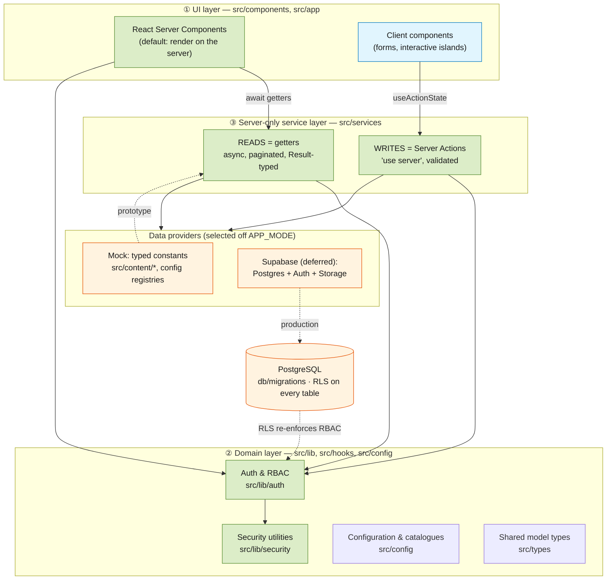
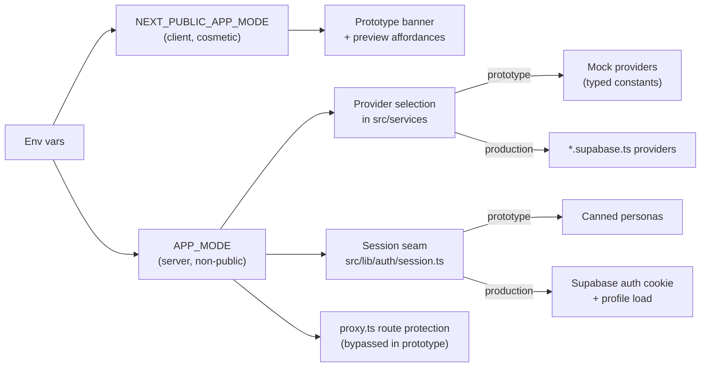

# 00 — Backend Architecture Overview

> **Ask Juice Doctor AI** — Phase 2: the enterprise backend foundation.
> Founder: Erran Warden ("The Juice Doctor"). This is a **prototype for demonstration purposes only** — production-*shaped*, not production-*wired*.

This is the entry point to the architecture set. It explains **what Phase 2 is**, the **prototype-vs-production philosophy** that governs every decision below it, the **three-layer architecture**, the **single seam** we swap to go live, the **phase boundaries** (what we deliberately did *not* build), and a **map** of where everything lives — ending with an index of every other document in this set.

---

## 1. Purpose of Phase 2

Phase 1 shipped the public marketing site, the design system, and mock services good enough to *look* real. It answered "does the brand experience work?"

Phase 2 answers a harder question: **"is the thing behind the brand built like an enterprise platform?"** — without spending a single API call, storing a single row, or writing a single line of inference code.

The deliverable is a **production-grade backend *design*, expressed as running code**:

- A complete **role & permission model** (`src/lib/auth`) with a permission catalogue, an RBAC engine, and server guards.
- A complete **security posture** (`src/lib/security`) — CSP headers, rate limiting, CSRF, typed errors, file validation.
- A **server-only service layer** (`src/services`) with a read/write split (getters vs. Server Actions) and a provider seam.
- A **full database design** — ~55 tables across 13 migrations in `db/migrations/`, RLS on every table, designed exactly as production requires.
- **Framework foundations** for the AI product to come: agents-as-data, a knowledge pipeline, a unified memory model, the consultation workflow, and platform/ops tables (audit, feature flags, notifications).

Everything runs today on **typed mock providers** and **paper SQL** (migrations that are authored, reviewed, and version-controlled but *not executed*). The point is that going live is **configuration and a provider swap**, not a rewrite. See [§4, The Seam](#4-the-prototypeproduction-seam).

### Why build it this way?

A demo that is only a façade teaches the client nothing about feasibility, cost, or risk. A demo that is *architecturally complete but inert* de-risks the real build: the data model is settled, the security model is settled, the layering is settled, and the surface area every future feature plugs into already exists. Phase 3 becomes "fill in the bodies," not "design the platform."

---

## 2. The prototype-vs-production philosophy

Three rules govern the whole codebase. Every design choice traces back to one of them.

| # | Rule | Why | Where it shows up |
|---|------|-----|-------------------|
| 1 | **Production-shaped interfaces, mock bodies.** | The *signatures* are the contract. If getters are already `async`, paginated, and return a typed `Result` error union, nothing is retrofitted when the body starts hitting Postgres. | `src/services/index.ts` getters return `Promise<Result<Page<T>>>` even though the mock always succeeds. |
| 2 | **The provider choice is server-only and centralised.** | A Supabase client tree-shaken into a client bundle would leak keys. Selecting the provider off a **non-public** env var, inside `server-only` modules, makes that structurally impossible. | `APP_MODE` (server) drives data; `NEXT_PUBLIC_APP_MODE` (client) is cosmetic only — see `src/config/app.ts`. |
| 3 | **The prototype must never *lie by omission*.** | A demo that silently pretends to send email or store health data is a liability. Writes validate, simulate latency, and return honestly. | Every Server Action in `src/services/actions.ts` returns a message like *"(Prototype: no message was actually sent.)"* |

The net effect: a reviewer can read the code and see **exactly** where production behaviour will slot in — it is always the *body* of a clearly-marked function, never a structural change.

---

## 3. The three-layer architecture

Data flows **down** through three layers; only the bottom layer knows where data physically lives.



### ① UI layer — `src/components`, `src/app`

RSC-first: components render on the server and `await` service getters directly, so data-fetching has no client waterfall and no exposed endpoints. Client components are minimal islands — chiefly forms that call Server Actions via `useActionState`. Route groups under `src/app` separate concerns: `(marketing)` public site, `(auth)` sign-in/register shells, `(dashboard)` member area, `(admin)` operator console.

### ② Domain layer — `src/lib`, `src/hooks`, `src/config`

Pure, framework-adjacent logic with **no knowledge of persistence**:

- **`src/lib/auth`** — the role hierarchy, the RBAC engine, and the guards. The engine (`permissions.ts`) is deliberately *pure and dependency-free* so the identical decision runs in a Server Component, in `proxy.ts` middleware, and in a unit test.
- **`src/lib/security`** — CSP/headers, rate limiting, CSRF, file validation, and the typed `AppError` hierarchy that keeps internal detail out of user-facing messages.
- **`src/config`** — the catalogues that both code and DB mirror: `permissions.ts`, `ai-agents.ts`, `feature-flags.ts`, `routes.ts`, `app.ts`.
- **`src/types`** — the shared model, derived from the SQL, imported by both UI and services so a shape change is a single edit.

### ③ Server-only service layer — `src/services`

The **only** layer that knows where data comes from. Every module starts with `import 'server-only'` so it can never enter a client bundle. It splits cleanly by intent:

- **Reads = getters.** Plain async functions (`programmes.list`, `admin.metrics`, `agents.list`, `featureFlags.all`). They return `Result<T>`/`Result<Page<T>>` so callers handle `not_found`/`unavailable` uniformly and pagination exists from day one.
- **Writes = Server Actions.** `'use server'` functions (`submitContact`, `signIn`, `submitBooking`, …). They validate with zod, return the standard `ActionResult` discriminated union (`idle` / `success` / `error` with `fieldErrors`), and simulate latency so loading states are real. In production the *body* becomes a Supabase insert + Resend send; the client form never changes.

**Why the read/write split matters:** reads are cacheable, side-effect-free, and safe to fan out across a page; writes are transactional, guarded, and CSRF-protected. Encoding that difference in the *type* of function (getter vs. `'use server'`) makes the safe path the default path.

---

## 4. The prototype→production seam

Going live touches **four coordinated points** — and nothing else in the app changes.



1. **`config.isPrototype`** (`src/config/app.ts`) — the single cosmetic seam. Drives the "Prototype Environment — For Demonstration Purposes Only" banner and preview affordances. Derived from `NEXT_PUBLIC_APP_MODE`, which is safe to expose because it changes *nothing* about data.

2. **`APP_MODE`** (non-public, read in `src/services/index.ts`) — the real switch. `isProductionData = APP_MODE === 'production'`. Because it is read only inside `server-only` modules, the Supabase client can never leak client-side. This is intentionally *separate* from the public banner var so cosmetic and data concerns can never be conflated.

3. **The provider swap.** Each service today reads typed constants (`src/content/*`, config registries). Production adds a `*.supabase.ts` provider per domain, selected here off `APP_MODE`. **Components never change** — they already consume the async, paginated, `Result`-typed shapes.

4. **The session seam** (`src/lib/auth/session.ts`). `loadSession()` returns canned personas in the prototype (with a `roleHint` so each shell can demo a persona) and, in production, reads the Supabase auth cookie, refreshes the token, and loads the profile (role + org + overrides). Only this one function body changes; every guard and RLS policy already depends on the returned *shape*. In parallel, `proxy.ts` route protection is present-but-bypassed under `isPrototype` and activates unchanged in production.

**Design principle:** there is exactly **one** place to change per concern. Reviewers can point to the four functions above and say "these bodies are the entire prototype-to-live delta."

---

## 5. Phase boundaries

Explicit scope is a feature. Phase 2 builds the *foundation*; several capabilities are deliberately **out of scope** so the design stays honest.

### Phase 2 **does**

- Ship the full **RBAC model** — 6-role hierarchy, permission catalogue, deny-wins engine, server guards, session seam.
- Ship the full **security layer** — strict CSP, rate-limit interface + in-memory impl, CSRF (same-origin + double-submit), typed errors, file validation with magic-number sniffing.
- Ship the **service framework** — read/write split, `Result`/`ActionResult` contracts, provider seam.
- Author the **complete database design** — ~55 tables, 13 migrations, RLS on every table, append-only logs, `app`-schema helper functions.
- Establish **multi-tenancy** — `organisations` / `clinics` / `organisation_memberships`; every tenant table carries `organisation_id`.
- Lay **framework foundations** — agents-as-data, knowledge pipeline, unified memory model, consultation workflow, platform/ops (audit, feature flags, notifications).
- Provide an **admin foundation** — the `(admin)` route group reading through the service framework (`admin.metrics`, `agents.list`, `featureFlags.all`). Architecture only.

### Phase 2 explicitly **does NOT**

| Excluded | Status in Phase 2 | Deferred to |
|----------|-------------------|-------------|
| **AI inference** | Agents, knowledge, and memory are modelled as **data**; no model is ever called. | Phase 3 |
| **Live data** | No Supabase connection; mocks + paper SQL only. Nothing is stored. | Phase 3 |
| **Real authentication** | Canned personas; `proxy.ts` protection bypassed. No accounts exist. | Phase 3 |
| **Payments** | `plans` / `subscriptions` / `payments` / `invoices` are designed (provider-agnostic) but no processor is wired. | Phase 3 |
| **Vector search** | `knowledge_chunks` + `knowledge_embeddings` model the pipeline; the `embedding vector(N)` column awaits `pgvector`. | Phase 3 |
| **Destructive admin logic** | The admin console reads; it does not mutate business data. | Phase 3 |

**Why draw the line here?** These excluded items are the ones that cost money, carry compliance weight (health data, payments), or require external services. Modelling them as inert data proves the shape is right *before* incurring their cost — and keeps this a safe, shareable demonstration.

---

## 6. Directory map

Where each concern lives. All paths are relative to the repo root.

```
src/
├── app/                     UI · route groups: (marketing) (auth) (dashboard) (admin)
├── components/              UI · layout / sections / ui primitives (Radix + Tailwind v4)
├── config/                  DOMAIN · catalogues mirrored by the DB
│   ├── app.ts               ← the cosmetic seam: config.isPrototype, APP_MODE docs
│   ├── permissions.ts       ← permission catalogue (resource.action) + role base map
│   ├── ai-agents.ts         ← 3 seed agents (juice-doctor-companion, intake-triage, practitioner-copilot)
│   ├── feature-flags.ts     ← flag registry (targeting-aware)
│   └── routes.ts            ← route constants
├── lib/
│   ├── auth/                DOMAIN · RBAC
│   │   ├── roles.ts         ← 6-role hierarchy, ROLE_RANK, hasMinRole (mirrors app_role enum)
│   │   ├── permissions.ts   ← pure RBAC engine (cumulative perms, deny-wins overrides)
│   │   ├── authorize.ts     ← guards: require* (redirect) / assert* (throw) / can (boolean)
│   │   ├── session.ts       ← THE SESSION SEAM (canned ↔ Supabase cookie)
│   │   └── index.ts         ← barrel (server-only members clearly marked)
│   └── security/            DOMAIN · security posture
│       ├── headers.ts       ← strict CSP + header baseline (dev relaxes script-src)
│       ├── rate-limit.ts    ← RateLimiter interface + in-memory impl + policies
│       ├── csrf.ts          ← same-origin + double-submit
│       ├── file-validation.ts ← size + MIME + magic-number sniff + malware-scan hook
│       └── errors.ts        ← typed AppError hierarchy (user-safe messages)
├── services/                SERVICES · server-only; the only layer that knows the source
│   ├── index.ts             ← content getters + provider seam (isProductionData)
│   ├── actions.ts           ← Server Actions (write path); returns ActionResult
│   ├── result.ts            ← Result<T> / Page<T> / ActionResult contracts
│   ├── admin.ts             ← admin reads (users, metrics)
│   ├── agents.ts            ← AI agent registry reads (no inference)
│   ├── knowledge.ts         ← knowledge pipeline + publishing state machine (canTransition)
│   ├── memory.ts            ← unified memory API (6 scopes via MemorySelector)
│   ├── consultations.ts     ← consultation workflow reads
│   ├── feature-flags.ts     ← flag evaluation (targeting-aware)
│   └── platform.ts          ← notifications / audit / settings reads
├── types/                   DOMAIN · shared model (derived from SQL)
│   ├── identity.ts ai.ts knowledge.ts memory.ts consultation.ts
│   ├── commerce.ts health.ts conversation.ts platform.ts content.ts
└── proxy.ts                 MIDDLEWARE · Next 16 (formerly middleware.ts):
                             security headers · cross-origin mutation block · route protection

db/
├── README.md                DB design overview + ERD (mermaid) + RLS notes
├── storage.md               Storage-bucket design
└── migrations/              13 migrations · ~55 tables · RLS on every table
    ├── 0001_extensions_and_helpers.sql   extensions, enums, app.* helper fns, set_updated_at
    ├── 0002_tenancy.sql                  organisations, clinics, organisation_memberships
    ├── 0003_identity_and_permissions.sql profiles, permissions, role_permissions, overrides
    ├── 0004_auth_sessions_oauth.sql      oauth_accounts, api_keys, auth_events
    ├── 0005_preferences_and_consents.sql user_preferences, user_consents (GDPR ledger)
    ├── 0006_health_profiles.sql          health / fitness / nutrition profiles, goals
    ├── 0007_consultation_workflow.sql    assessments, appointments, consultations, events, follow_ups
    ├── 0008_commerce.sql                 programmes, enrollments, plans, subscriptions, payments, invoices
    ├── 0009_ai_agents.sql                agents-as-data (agents, versions, tools, knowledge sources, models)
    ├── 0010_conversations.sql            conversations, messages, message_feedback
    ├── 0011_memory.sql                   ai_memory (six isolation scopes)
    ├── 0012_knowledge.sql                categories, tags, documents, versions, chunks, embeddings
    └── 0013_platform.sql                 notifications, audit_logs, activity_logs, settings, feature_flags
```

**Reading the map:** the arrow of dependency always points *down* — UI depends on Domain and Services; Domain depends on nothing but `src/types` and `src/config`; Services depend on Domain (for guards) and on a provider. The DB (`db/migrations`) is the ground truth the `src/types` model is derived from, and RLS re-enforces the same RBAC rules the app enforces — **defence in depth**, kept in lock-step.

---

## 7. Document index

This overview is the map; the following documents drill into each territory.

| # | Document | Covers |
|---|----------|--------|
| 00 | **`00-overview.md`** *(this doc)* | Phase 2 purpose, prototype↔production philosophy, three-layer architecture, the seam, phase boundaries, directory map |
| 01 | `01-layers-and-services.md` | The service layer in depth: read/write split, `Result`/`ActionResult` contracts, getters vs. Server Actions, the provider seam per domain |
| 02 | `02-authentication-and-sessions.md` | The session seam, canned personas, Supabase auth cookie flow, `proxy.ts` route protection |
| 03 | `03-rbac-and-permissions.md` | Role hierarchy, permission catalogue, the deny-wins engine, guards, and the DB RBAC mirror |
| 04 | `04-security.md` | CSP & headers, rate limiting, CSRF, file validation, the typed error hierarchy |
| 05 | `05-database-and-tenancy.md` | The 13 migrations, conventions, `app.*` helpers, multi-tenancy, RLS strategy |
| 06 | `06-ai-agents-framework.md` | Agents-as-data: models, agents, versions, tools, knowledge sources; the seed agents |
| 07 | `07-knowledge-base.md` | The knowledge pipeline, source types, versioning, chunks/embeddings, the publishing state machine |
| 08 | `08-memory-model.md` | The single `ai_memory` table, six isolation scopes, `MemorySelector`, RLS isolation |
| 09 | `09-consultation-workflow.md` | Intake → assessment → review → appointment → follow-up; Body MOT & Remote Selfie Scan as assessments |
| 10 | `10-platform-operations.md` | Notifications, audit/activity logs, system settings, feature flags & targeting |
| 11 | `11-consents-and-compliance.md` | The versioned GDPR consent ledger, sensitive-health-data RLS, re-prompt on policy change |

*(Numbers 01–11 index the companion documents in this `docs/architecture/` set; this file, 00, is their shared foundation.)*
