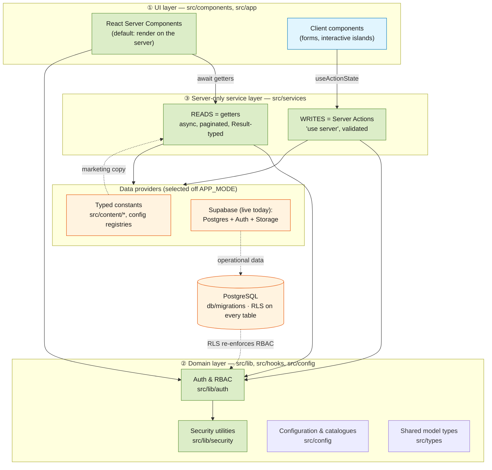
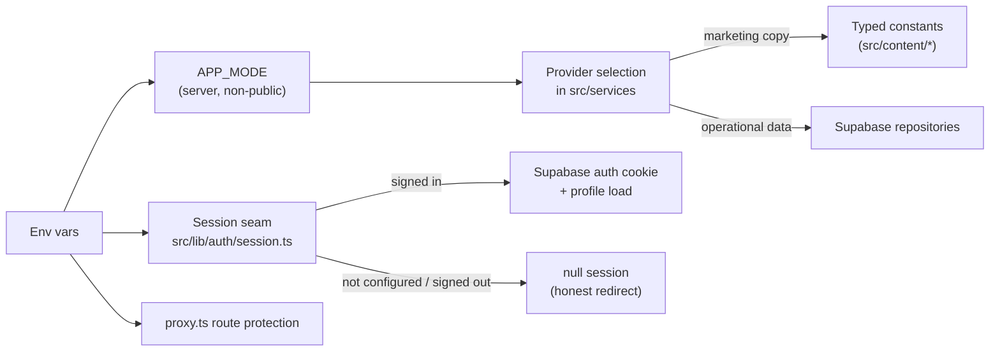

# 00 — Backend Architecture Overview

> **Ask Juice Doctor AI** — Phase 2: the enterprise backend foundation.
> **Current status (August 2026):** this document was written when Phase 2 shipped as production-*shaped* but not yet production-*wired*. The platform has since gone live: the migrations are applied to a real Supabase Postgres (the set now runs `0001`–`0030`), authentication is real Supabase Auth, `proxy.ts` route protection is active, the service layer reads and writes live data, and AI inference (Anthropic Claude) runs in production. Two providers remain unconnected by design or pending client input: payments (subscription payments are manual records) and outbound email (the only email sent is Supabase Auth's password-reset message). Phase-2 descriptions below of in-memory providers and unexecuted SQL are historical.

This is the entry point to the architecture set. It explains **what Phase 2 is**, the **pre-production-vs-production philosophy** that governs every decision below it, the **three-layer architecture**, the **single seam** we swap to go live, the **phase boundaries** (what we deliberately did *not* build), and a **map** of where everything lives — ending with an index of every other document in this set.

---

## 1. Purpose of Phase 2

Phase 1 shipped the public marketing site, the design system, and stubbed services good enough to *look* real. It answered "does the brand experience work?"

Phase 2 answers a harder question: **"is the thing behind the brand built like an enterprise platform?"** — without spending a single API call, storing a single row, or writing a single line of inference code.

The deliverable is a **production-grade backend *design*, expressed as running code**:

- A complete **role & permission model** (`src/lib/auth`) with a permission catalogue, an RBAC engine, and server guards.
- A complete **security posture** (`src/lib/security`) — CSP headers, rate limiting, CSRF, typed errors, file validation.
- A **server-only service layer** (`src/services`) with a read/write split (getters vs. Server Actions) and a provider seam.
- A **full database design** — ~55 tables across 13 migrations in `db/migrations/`, RLS on every table, designed exactly as production requires.
- **Framework foundations** for the AI product to come: agents-as-data, a knowledge pipeline, a unified memory model, the consultation workflow, and platform/ops tables (audit, feature flags, notifications).

At Phase 2 delivery, everything ran on **typed in-memory providers** and **paper SQL** (migrations that were authored, reviewed, and version-controlled but *not executed*). The point was that going live would be **configuration and a provider swap**, not a rewrite — and that is what happened: the migrations are now applied and the live providers are in place. See [§4, The Seam](#4-the-pre-productionproduction-seam).

### Why build it this way?

A build that is only a façade teaches the client nothing about feasibility, cost, or risk. A build that is *architecturally complete but inert* de-risks the real product: the data model is settled, the security model is settled, the layering is settled, and the surface area every future feature plugs into already exists. Phase 3 becomes "fill in the bodies," not "design the platform."

---

## 2. The pre-production-vs-production philosophy

Three rules govern the whole codebase. Every design choice traces back to one of them.

| # | Rule | Why | Where it shows up |
|---|------|-----|-------------------|
| 1 | **Production-shaped interfaces, stub bodies (pre-production).** | The *signatures* are the contract. If getters are already `async`, paginated, and return a typed `Result` error union, nothing is retrofitted when the body starts hitting Postgres. | `src/services/index.ts` getters return `Promise<Result<Page<T>>>` even before the bodies hit Postgres. |
| 2 | **The provider choice is server-only and centralised.** | A Supabase client tree-shaken into a client bundle would leak keys. Selecting the provider off a **non-public** env var, inside `server-only` modules, makes that structurally impossible. | `APP_MODE` (server, non-public) reserves the content-provider seam in `src/services/index.ts`. |
| 3 | **The platform must never *lie by omission*.** | A platform that silently pretends to send email or store health data is a liability. Writes validate and return honestly. | The forms that still have no live provider (contact / newsletter email, and the public booking form) return an honest "not available yet" error instead of pretending — while operational writes persist to the live database. |

The net effect: a reviewer can read the code and see **exactly** where production behaviour will slot in — it is always the *body* of a clearly-marked function, never a structural change.

---

## 3. The three-layer architecture

Data flows **down** through three layers; only the bottom layer knows where data physically lives.



### ① UI layer — `src/components`, `src/app`

RSC-first: components render on the server and `await` service getters directly, so data-fetching has no client waterfall and no exposed endpoints. Client components are minimal islands — chiefly forms that call Server Actions via `useActionState`. Route groups under `src/app` separate concerns: `(marketing)` public site, `(auth)` sign-in/register shells, `(dashboard)` member area, `(admin)` operator console.

### ② Domain layer — `src/lib`, `src/hooks`, `src/config`

Pure, framework-adjacent logic with **no knowledge of persistence**:

- **`src/lib/auth`** — the role hierarchy, the RBAC engine, and the guards. The engine (`permissions.ts`) is deliberately *pure and dependency-free* so the identical decision runs in a Server Component, in `proxy.ts` middleware, and in a unit test.
- **`src/lib/security`** — CSP/headers, rate limiting, CSRF, file validation, and the typed `AppError` hierarchy that keeps internal detail out of user-facing messages.
- **`src/config`** — the catalogues that both code and DB mirror: `permissions.ts`, `ai-agents.ts`, `feature-flags.ts`, `routes.ts`, `app.ts`.
- **`src/types`** — the shared model, derived from the SQL, imported by both UI and services so a shape change is a single edit.

### ③ Server-only service layer — `src/services`

The **only** layer that knows where data comes from. Every module starts with `import 'server-only'` so it can never enter a client bundle. It splits cleanly by intent:

- **Reads = getters.** Plain async functions (`programmes.list`, `admin.metrics`, `agents.list`, `featureFlags.all`). They return `Result<T>`/`Result<Page<T>>` so callers handle `not_found`/`unavailable` uniformly and pagination exists from day one.
- **Writes = Server Actions.** `'use server'` functions (`submitContact`, `signIn`, `submitBooking`, …). They validate with zod and return the standard `ActionResult` discriminated union (`idle` / `success` / `error` with `fieldErrors`). The operational bodies write to the live database; the marketing-form actions (contact / newsletter / the public booking form `submitBooking`) return an honest "not available yet" error — no email provider is wired and the public form reserves nothing (member booking in the dashboard IS real) — and the client forms never changed.

**Why the read/write split matters:** reads are cacheable, side-effect-free, and safe to fan out across a page; writes are transactional, guarded, and CSRF-protected. Encoding that difference in the *type* of function (getter vs. `'use server'`) makes the safe path the default path.

---

## 4. The pre-production→production seam

Going live touched **a small set of coordinated points** — and nothing else in the app changed. *(That switch has since been made: the production side of each seam is the live path today, and the pre-production fallbacks — placeholder personas, open routes, the environment banner — have been removed outright rather than left dormant.)*



1. **App identity & standing notices** (`src/config/app.ts`) — exports `APP_NAME` ("Ask Juice Doctor AI") and `STANDING_NOTICES`, the single source of truth for the safety/status statements shown on the disclaimer surface. The earlier cosmetic environment banner and its `NEXT_PUBLIC_APP_MODE` flag have been removed — there is no display mode; what renders is what the platform really does.

2. **`APP_MODE`** (non-public, read in `src/services/index.ts`) — the content-provider seam. `isProductionData = APP_MODE === 'production'`. Because it is read only inside `server-only` modules, the Supabase client can never leak client-side.

3. **The provider swap.** At Phase 2 each service read typed constants (`src/content/*`, config registries). The operational services now read and write live Supabase data through `src/services/repositories/*`; the neutral marketing-content getters still read typed constants (pending client-supplied copy, with the `APP_MODE` seam reserved in `src/services/index.ts`). **Components never changed** — they already consumed the async, paginated, `Result`-typed shapes.

4. **The session seam** (`src/lib/auth/session.ts`). `loadSession()` reads the Supabase auth cookie, refreshes the token, and loads the profile (role + org). If Supabase is not configured or no session exists, it returns `null` and guards redirect honestly — there is no persona fallback of any kind. Every guard and RLS policy depends only on the returned *shape*. In parallel, `proxy.ts` route protection is active on the deployed platform.

**Design principle:** there is exactly **one** place to change per concern. Reviewers can point to the functions above and say "these bodies are the entire pre-production-to-live delta."

---

## 5. Phase boundaries

Explicit scope is a feature. Phase 2 builds the *foundation*; several capabilities are deliberately **out of scope** so the design stays honest.

### Phase 2 **does**

- Ship the full **RBAC model** — 6-role hierarchy, permission catalogue, deny-wins engine, server guards, session seam.
- Ship the full **security layer** — strict CSP, rate-limit interface + in-memory impl, CSRF (same-origin + double-submit), typed errors, file validation with magic-number sniffing.
- Ship the **service framework** — read/write split, `Result`/`ActionResult` contracts, provider seam.
- Author the **complete database design** — ~55 tables, 13 migrations, RLS on every table, append-only logs, `app`-schema helper functions.
- Establish **multi-tenancy** — `organisations` / `clinics` / `organisation_memberships`; every tenant table carries `organisation_id`.
- Lay **framework foundations** — agents-as-data, knowledge pipeline, unified memory model, consultation workflow, platform/ops (audit, feature flags, notifications).
- Provide an **admin foundation** — the `(admin)` route group reading through the service framework (`admin.metrics`, `agents.list`, `featureFlags.all`). Architecture only.

### Phase 2 explicitly **does NOT**

| Excluded | Status in Phase 2 | Deferred to |
|----------|-------------------|-------------|
| **AI inference** | Agents, knowledge, and memory are modelled as **data**; no model is ever called. | Phase 3 |
| **Live data** | No Supabase connection; typed in-memory providers + paper SQL only. Nothing was stored. | Phase 3 |
| **Real authentication** | Placeholder development personas; `proxy.ts` protection bypassed. No accounts existed. (Both since removed — auth is real and personas no longer exist in the codebase.) | Phase 3 |
| **Payments** | `plans` / `subscriptions` / `payments` / `invoices` are designed (provider-agnostic) but no processor is wired. | Phase 3 |
| **Vector search** | `knowledge_chunks` + `knowledge_embeddings` model the pipeline; the `embedding vector(N)` column awaits `pgvector`. | Phase 3 |
| **Destructive admin logic** | The admin console reads; it does not mutate business data. | Phase 3 |

**Why draw the line here?** These excluded items are the ones that cost money, carry compliance weight (health data, payments), or require external services. Modelling them as inert data proved the shape was right *before* incurring their cost — and kept Phase 2 a safe, shareable review build.

> **Since delivered:** AI inference, live data, and real authentication are now in production (see `13-ai-platform.md` and `21-herne-live-ai.md`), and the admin console performs real mutations. Still true today: payments remain manual records by design (no processor wired), and vector search remains unimplemented — live knowledge retrieval is ranked Postgres full-text search.

---

## 6. Directory map

Where each concern lives. All paths are relative to the repo root. *(Phase-2 snapshot: the codebase has since grown — notably `src/services/repositories/` and `src/services/herne/` for live data access and the HERNE runtime, and migrations `0014`–`0030`. The layering shown here is unchanged.)*

```
src/
├── app/                     UI · route groups: (marketing) (auth) (dashboard) (admin)
├── components/              UI · layout / sections / ui primitives (Radix + Tailwind v4)
├── config/                  DOMAIN · catalogues mirrored by the DB
│   ├── app.ts               ← APP_NAME + STANDING_NOTICES (single source for /disclaimer)
│   ├── permissions.ts       ← permission catalogue (resource.action) + role base map
│   ├── ai-agents.ts         ← the agent roster as data (Receptionist AI; the 8 HERNE specialists seed via services/herne/seed.ts)
│   ├── feature-flags.ts     ← flag registry (targeting-aware)
│   └── routes.ts            ← route constants
├── lib/
│   ├── auth/                DOMAIN · RBAC
│   │   ├── roles.ts         ← 6-role hierarchy, ROLE_RANK, hasMinRole (mirrors app_role enum)
│   │   ├── permissions.ts   ← pure RBAC engine (cumulative perms, deny-wins overrides)
│   │   ├── authorize.ts     ← guards: require* (redirect) / assert* (throw) / can (boolean)
│   │   ├── session.ts       ← THE SESSION SEAM (Supabase cookie → profile; null when signed out)
│   │   └── index.ts         ← barrel (server-only members clearly marked)
│   └── security/            DOMAIN · security posture
│       ├── headers.ts       ← strict CSP + header baseline (dev relaxes script-src)
│       ├── rate-limit.ts    ← RateLimiter interface + in-memory impl + policies
│       ├── csrf.ts          ← same-origin + double-submit
│       ├── file-validation.ts ← size + MIME + magic-number sniff + malware-scan hook
│       └── errors.ts        ← typed AppError hierarchy (user-safe messages)
├── services/                SERVICES · server-only; the only layer that knows the source
│   ├── index.ts             ← content getters + provider seam (isProductionData)
│   ├── actions.ts           ← Server Actions (write path); returns ActionResult
│   ├── result.ts            ← Result<T> / Page<T> / ActionResult contracts
│   ├── admin.ts             ← admin reads (users, metrics)
│   ├── agents.ts            ← AI agent registry (agents-as-data over the live ai_agents table)
│   ├── knowledge.ts         ← knowledge pipeline + publishing state machine (canTransition)
│   ├── memory-actions.ts    ← memory controls (live ai_memory access via repositories/memory-repo.ts)
│   ├── consultations.ts     ← consultation workflow reads
│   ├── feature-flags.ts     ← flag evaluation (targeting-aware)
│   └── platform.ts          ← notifications / audit / settings reads
├── types/                   DOMAIN · shared model (derived from SQL)
│   ├── identity.ts ai.ts knowledge.ts memory.ts consultation.ts
│   ├── commerce.ts health.ts conversation.ts platform.ts content.ts
└── proxy.ts                 MIDDLEWARE · Next 16 (formerly middleware.ts):
                             security headers · cross-origin mutation block · route protection

db/
├── README.md                DB design overview + ERD (mermaid) + RLS notes
├── storage.md               Storage-bucket design
└── migrations/              foundation set 0001–0013 shown (the applied set now runs 0001–0030) · RLS on every table
    ├── 0001_extensions_and_helpers.sql   extensions, enums, app.* helper fns, set_updated_at
    ├── 0002_tenancy.sql                  organisations, clinics, organisation_memberships
    ├── 0003_identity_and_permissions.sql profiles, permissions, role_permissions, overrides
    ├── 0004_auth_sessions_oauth.sql      oauth_accounts, api_keys, auth_events
    ├── 0005_preferences_and_consents.sql user_preferences, user_consents (GDPR ledger)
    ├── 0006_health_profiles.sql          health / fitness / nutrition profiles, goals
    ├── 0007_consultation_workflow.sql    assessments, appointments, consultations, events, follow_ups
    ├── 0008_commerce.sql                 programmes, enrollments, plans, subscriptions, payments, invoices
    ├── 0009_ai_agents.sql                agents-as-data (agents, versions, tools, knowledge sources, models)
    ├── 0010_conversations.sql            conversations, messages, message_feedback
    ├── 0011_memory.sql                   ai_memory (six isolation scopes)
    ├── 0012_knowledge.sql                categories, tags, documents, versions, chunks, embeddings
    └── 0013_platform.sql                 notifications, audit_logs, activity_logs, settings, feature_flags
```

**Reading the map:** the arrow of dependency always points *down* — UI depends on Domain and Services; Domain depends on nothing but `src/types` and `src/config`; Services depend on Domain (for guards) and on a provider. The DB (`db/migrations`) is the ground truth the `src/types` model is derived from, and RLS re-enforces the same RBAC rules the app enforces — **defence in depth**, kept in lock-step.

---

## 7. Document index

This overview is the map; the following documents drill into each territory.

| # | Document | Covers |
|---|----------|--------|
| 00 | **`00-overview.md`** *(this doc)* | Phase 2 purpose, pre-production↔production philosophy, three-layer architecture, the seam, phase boundaries, directory map |
| 01 | `01-authentication.md` | The session seam, Supabase auth cookie flow, OAuth/API-key/auth-event surfaces, `proxy.ts` route protection |
| 02 | `02-authorization-rbac.md` | Role hierarchy, permission catalogue, the deny-wins engine, guards, and the DB RBAC mirror |
| 03 | `03-database.md` | The foundational migrations, conventions, `app.*` helpers, multi-tenancy, the TypeScript projection |
| 04 | `04-rls-security-model.md` | The RLS posture: `SECURITY DEFINER` helpers, standard policy patterns, append-only logs, worked examples |
| 05 | `05-ai-agent-framework.md` | Agents-as-data: models, agents, versions, tools, knowledge sources |
| 06 | `06-knowledge-architecture.md` | The knowledge pipeline, source types, versioning, chunks/embeddings, the publishing state machine |
| 07 | `07-memory-architecture.md` | The single `ai_memory` table, six isolation scopes, `MemorySelector`, RLS isolation |
| 08 | `08-consultation-workflow.md` | Intake → assessment → review → appointment → follow-up; Assessment & Selfie Scan as assessments |

*(The set continues beyond this foundation: `09-admin-foundation.md` through `12-decisions-adr.md` cover the admin console, security, scalability and ADRs, and `13-ai-platform.md` through `21-herne-live-ai.md` document the live AI platform, business lifecycle, HERNE collaboration, wearables, website, multilingual support, admin, and live inference.)*
