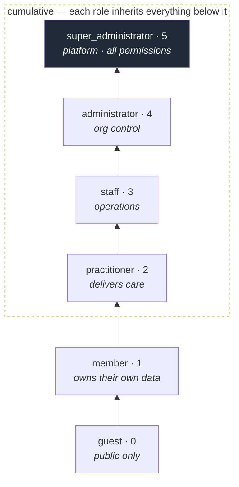
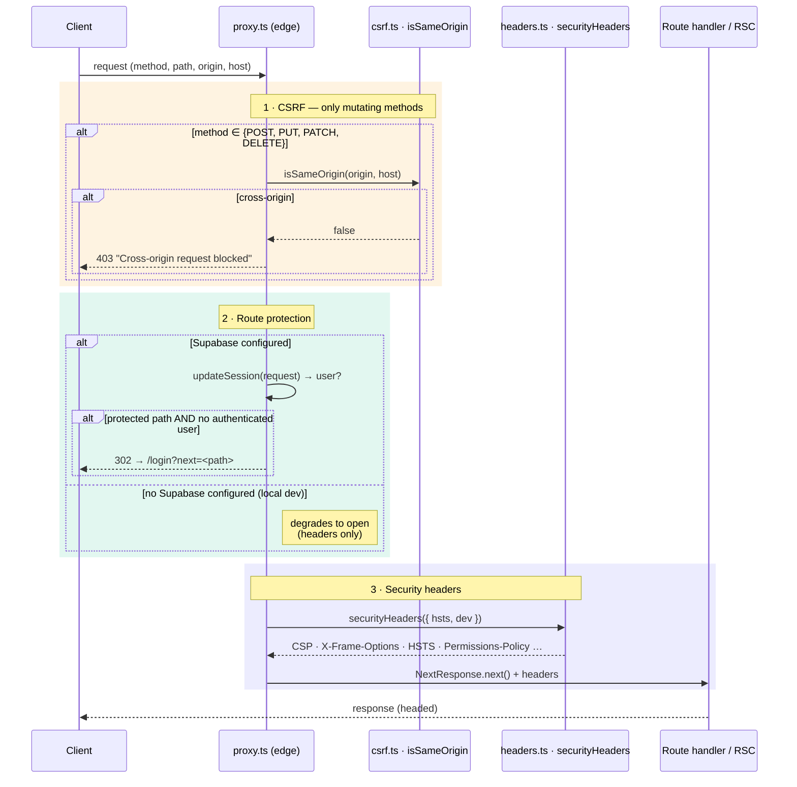
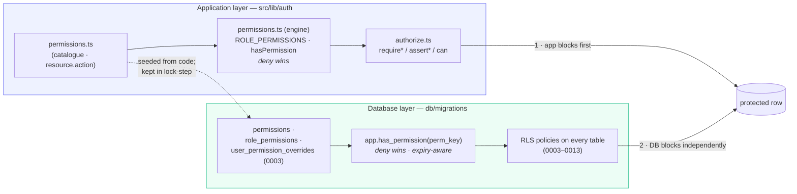

# 01 · Authentication & Authorisation Architecture

> **Ask Juice Doctor AI — Phase 2 Enterprise Backend Foundation**
> Status: **live**. Originally shipped as a production-shaped design on typed in-memory providers; the platform now runs real Supabase Auth (sign-in, registration, password reset), live data, and live AI inference.

This document describes how the platform decides **who a caller is** (authentication) and **what they may do** (authorisation). Phase 2 shipped the *shape* of a production identity system — the seams, the role model, the guards, and the database schema — before Supabase was connected. That production path is now the only one: `loadSession()` reads the Supabase auth cookie and loads the caller's profile, and returns `null` (an honest signed-out state) when Supabase is not configured or no session exists. The placeholder development personas that existed during the pre-production build have been removed from the codebase.

The guiding principle throughout is **defence in depth**: every rule is enforced twice — once in the application (RBAC engine + guards) and once in the database (Row-Level Security). The two are deliberately kept in lock-step so a mistake in one layer is caught by the other.

---

## 1. Contents

- [2. The role hierarchy](#2-the-role-hierarchy)
- [3. Why a linear, cumulative hierarchy](#3-why-a-linear-cumulative-hierarchy)
- [4. Sessions: the `getSession` seam](#4-sessions-the-getsession-seam)
- [5. OAuth, SSO & linked identities](#5-oauth-sso--linked-identities)
- [6. Machine-to-machine: `api_keys`](#6-machine-to-machine-api_keys)
- [7. The append-only `auth_events` log](#7-the-append-only-auth_events-log)
- [8. Protected routes & the `proxy.ts` middleware](#8-protected-routes--the-proxyts-middleware)
- [9. Why RBAC lives in both the app and the database](#9-why-rbac-lives-in-both-the-app-and-the-database)
- [10. File & table inventory](#10-file--table-inventory)

---

## 2. The role hierarchy

There is **one** role model, expressed identically in code and in the database:

- **Code:** `APP_ROLES` in [`src/lib/auth/roles.ts`](../../src/lib/auth/roles.ts)
- **Database:** the `app_role` enum in [`db/migrations/0001_extensions_and_helpers.sql`](../../db/migrations/0001_extensions_and_helpers.sql)

Six roles, ordered by ordinal **rank** 0 → 5. A higher rank *implicitly satisfies* any lower-rank requirement — this ordering is the backbone of both the permission matrix and every guard.

| Rank | Role | Who they are | Staff? |
|:----:|------|--------------|:------:|
| 0 | `guest` | An unauthenticated visitor. Public content only. | — |
| 1 | `member` | A registered client / patient. Manages their own profile, health data and bookings. | — |
| 2 | `practitioner` | A coach or clinician delivering care to assigned members. | ✅ |
| 3 | `staff` | Operational staff — bookings, content, day-to-day operations. | ✅ |
| 4 | `administrator` | Manages users, roles, knowledge, programmes and settings for an organisation. | ✅ |
| 5 | `super_administrator` | Platform owner with cross-organisation control. **Holds every permission.** | ✅ |

The `isStaff` flag (`ROLE_META` in `roles.ts`) is a derived convenience: **staff = rank ≥ 3**. In code that is `isStaffRole()`; in the DB it is `app.is_staff()`. Both compute the same thing.



### How rank is compared

The comparison is the *same idea* on both sides of the wire:

| Concern | Application | Database |
|---------|-------------|----------|
| Map role → rank | `ROLE_RANK` (`roles.ts`) | `app.role_rank(app_role)` (0001) |
| "At least this role" | `hasMinRole(role, min)` | `app.has_min_role(minimum)` (0001) |
| Staff / admin / super shortcuts | `isStaffRole` / `isAdminRole` / `isSuperAdminRole` | `app.is_staff()` / `app.is_admin()` / `app.is_super_admin()` |

> The enum ordering is load-bearing. New roles are **added with `ALTER TYPE … ADD VALUE`**, never reordered — reordering would silently change every `role_rank()` comparison. The code comment in `0001` and the `roles.ts` header both call this out.

---

## 3. Why a linear, cumulative hierarchy

The most consequential authorisation decision in the platform is that roles form a **single totally-ordered chain**, and permissions **accumulate upward** — each role inherits every permission of the roles beneath it and adds its own. `super_administrator` is a wildcard that holds *all* permissions, including any added in the future.

This is computed once in [`src/lib/auth/permissions.ts`](../../src/lib/auth/permissions.ts):

```ts
// ROLE_PERMISSIONS — union of a role's own base permissions and every lower role's.
for (const role of ordered) {
  for (const perm of ROLE_BASE_PERMISSIONS[role]) accumulated.add(perm);
  result[role] = new Set(accumulated);
}
result.super_administrator = new Set(ALL_PERMISSION_KEYS); // wildcard
```

### Why this shape, and not a bag of independent roles

1. **It mirrors the real organisation.** An organisation *is* a hierarchy: a practitioner delivers care, a staff member also runs operations, an admin also governs the org. Modelling authority as a chain matches how the business actually delegates trust, so the permission matrix reads like an org chart instead of a lookup puzzle.

2. **Correctness by construction.** With cumulative inheritance, "can an admin do everything a practitioner can?" is *true by definition* — it need not be maintained by hand. A flat set of unrelated roles requires re-granting every shared capability to every role, and the day someone forgets is the day an admin loses the ability to read a member record. Inheritance makes that class of bug unrepresentable.

3. **New permissions are safe by default.** Because `super_administrator` is a computed wildcard (`ALL_PERMISSION_KEYS`), adding a new `resource.action` to the catalogue **auto-grants it to the platform owner** and to nobody else. There is no migration where the owner is accidentally locked out of a new feature. Lower roles opt *in* explicitly via `ROLE_BASE_PERMISSIONS`.

4. **Members are ownership-scoped, not permission-scoped — on purpose.** `guest` and `member` hold **zero** catalogue permissions (`ROLE_BASE_PERMISSIONS.member = []`). A member's access to *their own* profile, health data and bookings is granted by **ownership** — RLS predicates like `user_id = auth.uid()` — not by a role permission. The catalogue governs *privileged, cross-user, and operational* actions only. This keeps the matrix small and keeps "can I see my own data?" out of the permission engine entirely.

### The escape hatch: per-user overrides

A pure hierarchy is rigid, so the model layers **per-user grant/deny overrides** on top — and **deny always wins**. This is the one place the chain bends:

```ts
// src/lib/auth/permissions.ts — hasPermission()
if (ctx.denies?.includes(permission)) return false;      // deny wins, always
if (roleHasPermission(ctx.role, permission)) return true; // role grant
return ctx.grants?.includes(permission) ?? false;         // explicit user grant
```

This buys us real-world flexibility without abandoning the model: a specific practitioner can be granted `payments.read` for one project (`grant`), or a compromised admin can be surgically stripped of `users.delete` (`deny`) pending review — no code change, no new role. The database mirrors this exactly in `app.has_permission()` (§9), including respect for override expiry.

> **Deny-wins is a safety property.** When two rules disagree, the platform chooses the *less* privileged interpretation. That is the correct default for a system holding sensitive health data.

---

## 4. Sessions: the `getSession` seam

Everything authentication-related funnels through a **single server-only seam**: [`src/lib/auth/session.ts`](../../src/lib/auth/session.ts). The rest of the application depends only on the *shape* it returns, never on *how* the session was obtained. This is what made the pre-production→production swap a one-function change.

### The contract

```ts
export interface SessionUser {
  id: string;
  name: string;
  email: string;
  role: AppRole;
  organisationId: string | null;
  grants?: PermissionKey[];   // per-user overrides layered on role defaults
  denies?: PermissionKey[];
}
export interface Session { user: SessionUser; }
```

Key properties of the seam:

- **`server-only`.** The file imports `'server-only'`, so any attempt to pull it into a client bundle fails the build. Sessions never cross to the browser.
- **Request-memoised.** `getSession` is wrapped in React's `cache()`, so within one request every guard, layout and component sees the same session with a single resolution.
- **One `loadSession()` body.** That function is the *only* place that knows how a session is produced. Swapping its body is the entire migration.

### How a session resolves

```mermaid
flowchart TD
    Start([getSession · cached per request]) --> Load[loadSession]
    Load --> Mode{isSupabaseConfigured?}

    Mode -->|no| Null0[return null → guest]
    Mode -->|yes| Cookie["createServerClient&#40;cookies&#40;&#41;&#41;"]

    Cookie --> User["supabase.auth.getUser&#40;&#41;<br/>await token refresh"]
    User --> HasUser{user?}
    HasUser -->|no| Null[return null → guest]
    HasUser -->|yes| Profile["loadProfile&#40;user.id&#41;<br/>role · org · overrides"]
    Profile --> Build["toSessionUser&#40;user, profile&#41;"]

    Build --> Ctx[toAuthContext → RBAC AuthContext]
    Null0 --> Ctx
    Null --> Ctx

    style Mode fill:#1f2937,color:#fff
    style Cookie fill:#10b981,color:#000
```



**Supabase not configured.** `loadSession()` returns `null` — the caller is a guest and protected surfaces redirect honestly. There is **no fictional persona fallback**: the role always comes from the authenticated profile, never from a caller-supplied hint. (A legacy role-hint argument on `getSession` is accepted and ignored for call-site compatibility.) This is critical: no convenience mechanism exists that could become a privilege-escalation vector.

**Production (live).** `loadSession()`:
1. Builds a Supabase server client bound to the request `cookies()`.
2. `await supabase.auth.getUser()` — which validates and refreshes the token.
3. Returns `null` (→ `guest`) if there is no user.
4. Loads the **profile** (`profiles` table, migration 0003) for role and organisation — preferring the RLS-scoped self-read, with a service-role fallback. (Per-user permission overrides are modelled in the schema but not yet loaded onto the live session; RLS honours them independently.)
5. Builds the `SessionUser` from the auth user + profile.

The `profiles` row is the application's identity record: it extends Supabase's `auth.users` with `role`, `organisation_id`, status, locale, and the metadata the app needs. It is also the source of truth for `app.current_role()` and `app.current_org_id()` in the database (§9).

### From session to decision

`toAuthContext(session)` reduces a `Session` to the minimal `AuthContext` (`role` + `grants` + `denies`) consumed by the pure RBAC engine. A missing session collapses to `{ role: 'guest' }`. From there, the guards in [`src/lib/auth/authorize.ts`](../../src/lib/auth/authorize.ts) provide three flavours:

| Family | Used in | On failure | Examples |
|--------|---------|-----------|----------|
| `require*` | Server Components / route segments | `redirect()` | `requireSession`, `requireRole`, `requirePermission` |
| `assert*` | Server Actions / API handlers | **throw** a typed `AppError` | `assertSession`, `assertRole`, `assertPermission` |
| `can` / `canAny` | Conditional UI | return `boolean` | show/hide an admin button |

The split matters: a **page** wants a redirect to `/login`; a **Server Action** wants a typed `AuthenticationError` / `AuthorizationError` (from [`src/lib/security/errors.ts`](../../src/lib/security/errors.ts)) it can convert into a user-safe `ActionResult` without a redirect side-effect. Both families are thin wrappers over the *same* pure engine, so the UI and the write path enforce identical rules.

---

## 5. OAuth, SSO & linked identities

Password and session storage are **owned by Supabase Auth** (`auth.users`, `auth.sessions`, refresh tokens). The application does not reinvent that. What it *does* model — in [`db/migrations/0004_auth_sessions_oauth.sql`](../../db/migrations/0004_auth_sessions_oauth.sql) — is the **application-visible surface** around it, so the admin can render "connected accounts" and so future SSO does not wait on provider internals.

### The `auth_provider` enum

```sql
create type auth_provider as enum (
  'password', 'google', 'apple', 'facebook', 'microsoft', 'saml', 'magic_link'
);
```

This is future-facing: `password` is the day-one method; `google` / `apple` / `facebook` / `microsoft` are consumer social logins; `saml` is enterprise SSO; `magic_link` is passwordless email. Declaring them now means adding a provider later is a **configuration change, not a schema migration**.

### `oauth_accounts`

One row per linked identity, keyed to a `auth.users` id:

| Column | Purpose |
|--------|---------|
| `user_id` | FK → `auth.users` (cascade on delete) |
| `provider` | the `auth_provider` |
| `provider_account_id` | the identity at the provider; `unique (provider, provider_account_id)` prevents one external account linking to two users |
| `email`, `connected_at`, `last_used_at`, `metadata` | display + audit |

**RLS:** `oauth_self` — a user may read/write only their own linked identities (`user_id = auth.uid()`). Mirroring Supabase's internal identity records here is what lets the admin surface "connected accounts" and drive SSO without reaching into provider internals.

---

## 6. Machine-to-machine: `api_keys`

For the future public API and integrations, `api_keys` (0004) models M2M credentials — **org-scoped, hashed, and scoped**:

| Column | Purpose |
|--------|---------|
| `organisation_id` | tenancy — a key belongs to one org |
| `key_prefix` | first characters, shown in the UI to identify a key; `unique` |
| `key_hash` | **sha-256 of the full key** — the plaintext is shown *once* at creation and never stored |
| `scopes` | `text[]` — least-privilege capability list |
| `created_by`, `last_used_at`, `expires_at`, `revoked_at` | lifecycle & audit |

Two security choices are worth calling out:

- **Plaintext is never persisted.** Only the hash and a display prefix are stored, so a database compromise cannot leak usable keys. This matches the same "store the hash, show the secret once" discipline in the file-validation and CSRF utilities.
- **The whole table is admin-only.** RLS policy `api_keys_admin` requires `organisation_id = app.current_org_id() AND app.is_admin()` on both `USING` and `WITH CHECK`, so a non-admin cannot even *select* `key_hash`. The active-key index is partial (`where revoked_at is null`) so lookups skip revoked keys.

---

## 7. The append-only `auth_events` log

Security-relevant authentication events are recorded in `auth_events` (0004) as an **append-only** stream, feeding audit and future anomaly detection:

```sql
create type auth_event_type as enum (
  'login_succeeded', 'login_failed', 'logout', 'password_reset_requested',
  'password_changed', 'mfa_enrolled', 'mfa_challenge', 'account_locked', 'token_refreshed'
);
```

Design properties:

- **Append-only by policy.** There is **no `INSERT` policy** exposed on the table. Rows are written by **`SECURITY DEFINER` server code**, so ordinary clients can never forge or alter events. This is the same append-only discipline the platform applies to `audit_logs`, `activity_logs`, and `consultation_events` — a log you can tamper with is not a log.
- **Read access is split.** Policy `auth_events_read` lets a user read **their own** events (`user_id = auth.uid()`) and lets **staff and above** (`app.is_staff()`) read all, for support and security investigation.
- **Built for anomaly detection.** Indexes on `(user_id, created_at desc)` and `(event_type, created_at desc)` make "recent failures for this user" and "all lockouts this hour" cheap. Captured `ip_address` (inet), `user_agent`, and `succeeded` give a rate-limiter or a future detection job everything it needs.

Together `auth_events` (what happened) + `oauth_accounts` (who is linked) + `api_keys` (what machines can call) form the complete admin-visible authentication surface, all sitting *around* Supabase Auth rather than duplicating it.

---

## 8. Protected routes & the `proxy.ts` middleware

Next.js 16 renamed the edge middleware from `middleware.ts` to **`proxy.ts`** ([Next 16 convention](../../src/proxy.ts)). It runs on every matched request and does exactly three things, in order:

1. **CSRF Origin check** — reject cross-origin *mutating* requests.
2. **Route protection** — gate the `(dashboard)` and `(admin)` route groups.
3. **Security headers** — attach the strict baseline to the response.

The `matcher` excludes Next internals and static assets, so the middleware only pays its cost on real navigations and API calls.



### 1 · CSRF Origin check

For mutating methods (`POST`/`PUT`/`PATCH`/`DELETE`), the middleware requires the `Origin` header to match the site `Host` via `isSameOrigin()` ([`src/lib/security/csrf.ts`](../../src/lib/security/csrf.ts)); a mismatch is a `403`. This is the outermost layer of a **layered CSRF strategy**:

- Next.js Server Actions are POST-only and same-origin by design;
- Supabase auth cookies use `SameSite=Lax`, blocking the classic cross-site form-POST;
- on top of that, `csrf.ts` provides a **double-submit-cookie** utility (`__Host-ajd-csrf` cookie + `x-ajd-csrf` header, compared in constant time via `safeEqual`) for any custom non-Action mutating endpoint.

The Origin check in `proxy.ts` is the cheap, universal first gate; the double-submit token is the per-route belt-and-braces.

### 2 · Route protection

`PROTECTED_PREFIXES = ['/dashboard', '/admin']`. When a request targets one of these groups, the middleware refreshes the Supabase session (`updateSession`) and requires an authenticated user, otherwise redirecting to `/login?next=<path>` so the user returns to where they were.

**Protection is live**: it is active whenever Supabase is configured — as on the deployed platform — and degrades to open only in local development without Supabase keys, so the app still renders. Note this is a *coarse* gate (is there any session?); fine-grained "which role, which permission" enforcement happens *inside* the route via the `require*` guards, and again in RLS.

### 3 · Security headers

Finally `securityHeaders()` ([`src/lib/security/headers.ts`](../../src/lib/security/headers.ts)) attaches the baseline to every response: a strict CSP (`default-src 'self'`, `frame-ancestors 'none'`, `object-src 'none'`, `upgrade-insecure-requests`), `X-Content-Type-Options: nosniff`, `X-Frame-Options: DENY`, a locked-down `Permissions-Policy` (camera allowed only on its own origin for the Selfie Scan; mic/geo/payment/usb denied), and COOP/CORP `same-origin`. HSTS is sent **only over HTTPS**. In **development** the CSP `script-src` is relaxed to allow `'unsafe-eval'` because React's dev tooling needs it — a deliberate, documented, *dev-only* loosening. Production ships the strict CSP **without a nonce** today (`headers.ts` supports a nonce + `strict-dynamic` variant, but `proxy.ts` does not currently pass one).

---

## 9. Why RBAC lives in both the app and the database

The same authorisation rules are enforced **twice, independently**: once by the application RBAC engine and once by Postgres Row-Level Security. This is not redundancy for its own sake — it is **defence in depth**, and each layer covers the other's blind spot.



### The two layers

**Application RBAC** — the pure, dependency-free engine in `src/lib/auth/permissions.ts`, driven by the catalogue in `src/config/permissions.ts` and enforced by the guards in `src/lib/auth/authorize.ts`. It gives fast, precise, *user-friendly* decisions: redirect a page, disable a button, return a typed error. Being pure, it runs in Server Components, in Server Actions, and in tests.

**Database RLS** — every table in migrations `0003`–`0013` has `ENABLE ROW LEVEL SECURITY`, and policies call the central `app.has_permission()` (0003) plus the role helpers from `0001`. RLS is enforced by Postgres itself, *underneath* the application, on **every** query regardless of the code path that issued it.

`app.has_permission()` is the DB twin of the code engine — same logic, including deny-wins and override expiry:

```sql
-- db/migrations/0003 · app.has_permission(perm_key)
select
  not exists (… override … effect = 'deny' … not expired)          -- deny wins
  and (
    exists (… role_permissions where role = app.current_role() …)  -- role grant
    or exists (… override … effect = 'grant' … not expired)        -- user grant
    or app.is_super_admin()                                          -- wildcard
  );
```

### Why both

1. **RLS is the last line that cannot be bypassed.** The app engine can be defeated by a forgotten guard, a new endpoint, a direct SQL console, or a future service that talks to the database without going through the Next.js app. RLS does not care *who* issued the query — it filters rows unconditionally. Even a bug in the application cannot exfiltrate a row a policy forbids. For a platform holding health data, that guarantee is non-negotiable.

2. **The app layer gives good UX; RLS gives the guarantee.** RLS alone would mean every unauthorised action fails as an empty result or an opaque error deep in a query. The app layer catches it early and turns it into a clean redirect or a typed, user-safe message (`AuthorizationError` → "You do not have permission to do that."). You want *both*: a helpful early "no" and an unbypassable final "no".

3. **One catalogue, two enforcers — kept in lock-step.** `src/config/permissions.ts` is the authoritative default; in production the `permissions` / `role_permissions` tables are **seeded from that file**, and per-user `user_permission_overrides` refine it. Code and schema describe the *same* matrix (identical keys, identical role grants, identical deny-wins semantics), so the two enforcers agree by construction rather than by vigilance.

4. **Sensitive data raises the bar in *both* places.** Permissions flagged `sensitive` (e.g. `health.read`, `users.delete`, `payments.refund`) are earmarked for elevated confirmation / MFA in the app; independently, RLS on health tables restricts rows to owner + treating practitioner/staff + admin. Neither layer trusts the other to be the only guard on the most sensitive data.

> **Tenancy is a third, orthogonal axis.** Every tenant table carries `organisation_id`, and RLS policies pin queries to `app.current_org_id()` (from the caller's profile). So authorisation is really *role/permission* **AND** *tenant* — an admin of Org A cannot touch Org B, no matter their rank. Only `super_administrator` crosses org boundaries. This is why multi-org / multi-clinic is *data*, not a rewrite.

---

## 10. File & table inventory

### Application (code)

| Concern | File | Role |
|---------|------|------|
| Role hierarchy | [`src/lib/auth/roles.ts`](../../src/lib/auth/roles.ts) | `APP_ROLES`, `ROLE_RANK`, `ROLE_META`, `hasMinRole`, staff/admin/super helpers |
| Permission catalogue | [`src/config/permissions.ts`](../../src/config/permissions.ts) | `PERMISSIONS` (`resource.action`), `ROLE_BASE_PERMISSIONS`, `sensitive` flags |
| RBAC engine | [`src/lib/auth/permissions.ts`](../../src/lib/auth/permissions.ts) | `ROLE_PERMISSIONS`, `hasPermission` (deny-wins), `AuthContext` |
| Session seam | [`src/lib/auth/session.ts`](../../src/lib/auth/session.ts) | `getSession` (server-only, cached), `loadSession`, `toAuthContext` |
| Guards | [`src/lib/auth/authorize.ts`](../../src/lib/auth/authorize.ts) | `require*` / `assert*` / `can` |
| Barrel | [`src/lib/auth/index.ts`](../../src/lib/auth/index.ts) | public import surface |
| Back-compat | [`src/services/auth.ts`](../../src/services/auth.ts) | re-exports the seam for legacy imports |
| Middleware | [`src/proxy.ts`](../../src/proxy.ts) | CSRF Origin check · route protection · security headers |
| CSRF utility | [`src/lib/security/csrf.ts`](../../src/lib/security/csrf.ts) | `isSameOrigin`, double-submit token, `safeEqual` |
| Security headers | [`src/lib/security/headers.ts`](../../src/lib/security/headers.ts) | strict CSP + header baseline |
| Typed errors | [`src/lib/security/errors.ts`](../../src/lib/security/errors.ts) | `AuthenticationError`, `AuthorizationError`, user-safe messages |
| App identity | [`src/config/app.ts`](../../src/config/app.ts) | `APP_NAME` + `STANDING_NOTICES` (no mode flag); auth/data gating is `isSupabaseConfigured()` |

### Database (schema)

| Table / type | Migration | Role |
|--------------|-----------|------|
| `app_role` enum | [0001](../../db/migrations/0001_extensions_and_helpers.sql) | the six roles, ordered |
| `app.role_rank` / `has_min_role` / `is_staff` / `is_admin` / `is_super_admin` / `current_role` / `current_org_id` | 0001 | `SECURITY DEFINER` RLS helpers |
| `profiles` | [0003](../../db/migrations/0003_identity_and_permissions.sql) | app identity; role + org + status; source of `current_role()` |
| `permissions` / `role_permissions` / `user_permission_overrides` | 0003 | the DB mirror of the code catalogue |
| `app.has_permission(perm_key)` | 0003 | central RLS permission check (deny-wins, expiry-aware) |
| `oauth_accounts` + `auth_provider` enum | [0004](../../db/migrations/0004_auth_sessions_oauth.sql) | linked identities / future SSO |
| `api_keys` | 0004 | hashed, org-scoped M2M credentials |
| `auth_events` + `auth_event_type` enum | 0004 | append-only security event log |

See [`db/README.md`](../../db/README.md) for the full ERD (the applied migration set now runs 0001–0030).

---

### Summary

Authentication is a **single server-only seam** (`getSession`) whose one function resolves real Supabase sessions, returning `null` — an honest guest — when none exists. Authorisation is a **linear, cumulative six-role hierarchy** — chosen because it mirrors the organisation's real chain of authority, makes inheritance correct by construction, and auto-grants new capabilities safely to the platform owner — refined by **deny-wins per-user overrides**. Every rule is enforced **twice**: by the application RBAC engine (fast, friendly) and by Postgres RLS (unbypassable), seeded from **one catalogue** and kept in lock-step. The `proxy.ts` middleware wraps it all with a CSRF Origin check, coarse route protection, and a strict security-header baseline — with the live code paths active in production.
