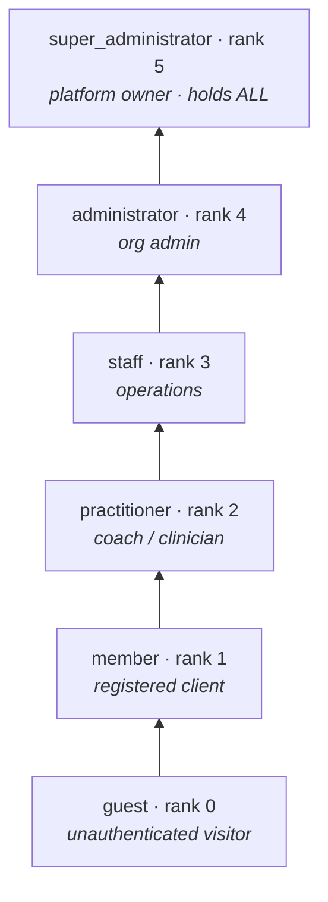
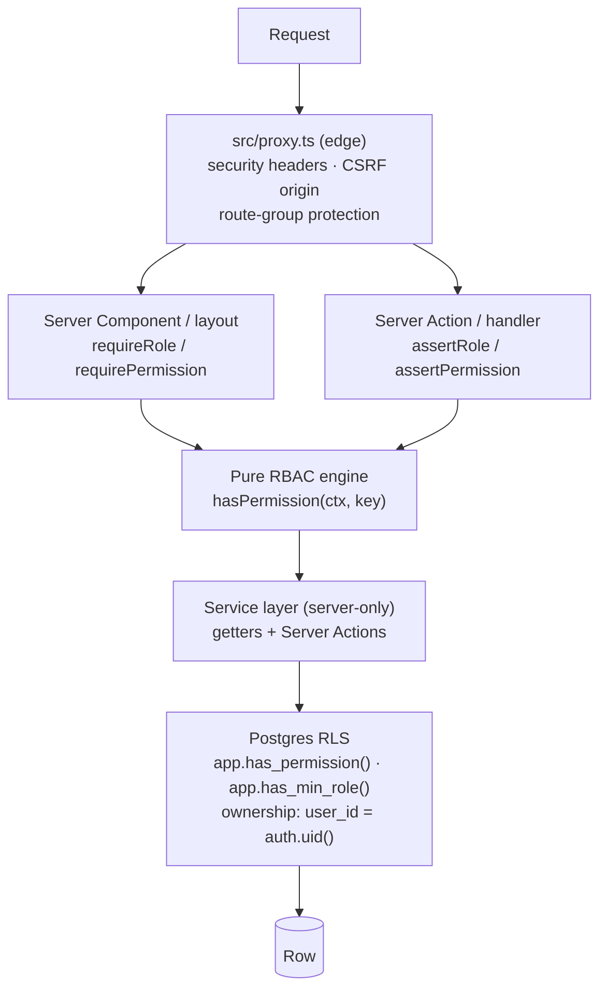

# 02 · Authorization & RBAC

> **Scope.** How *Prototype AI* decides **who may do what**. This document
> covers the role hierarchy, the fine-grained permission catalogue, the
> role→permission matrix, per-user overrides, the pure decision engine, the
> server-side guards, and — most importantly — **why** the same rules are
> enforced twice: once in the application and once in the database via
> Row-Level Security (RLS).
>
> **Status.** Everything described here is now *live*: the session seam resolves
> real Supabase Auth sessions, the SQL migrations are applied to the live
> Postgres, and RLS enforces these rules on real rows. (This document was
> originally written in Phase 2, when the app ran on typed mock providers and
> the SQL was unexecuted design; canned personas survive only as a local-dev
> fallback when Supabase is not configured.) The authorization model itself is
> unchanged — it was the real thing from day one.

---

## 1. Design goals (the "why" up front)

Authorization is the part of an enterprise platform that is most expensive to
get wrong and hardest to retrofit. Four goals shaped every decision below.

| Goal | How it's met | Why it matters |
| --- | --- | --- |
| **One source of truth for roles** | `APP_ROLES` in [`src/lib/auth/roles.ts`](../../src/lib/auth/roles.ts) mirrors the `app_role` enum in [`db/migrations/0001`](../../db/migrations/0001_extensions_and_helpers.sql). | Roles that drift between app and DB become silent security holes. One ordered list, mirrored deliberately, keeps them aligned. |
| **Fine-grained, data-driven permissions** | A `resource.action` catalogue ([`src/config/permissions.ts`](../../src/config/permissions.ts)) mirrored to DB tables (`permissions` / `role_permissions`). | The client can re-tune access *without a code deploy*; permissions read like sentences (`knowledge.publish`), so audits are legible. |
| **Defence in depth** | RBAC decided in the app **and** independently re-enforced by RLS calling `app.has_permission()`. | A bug in a Server Action, a forgotten guard, or a direct SQL client must **not** be able to leak data. The database is the last line, and it never trusts the app. |
| **A single swap point for real auth** | The [`session.ts`](../../src/lib/auth/session.ts) seam is the *only* place that knows how a session is obtained. | Turning on Supabase Auth changes one function body; nothing downstream (guards, engine, RLS) needs to move. |

---

## 2. The role hierarchy

Roles are **linear, ordered, and cumulative**. A higher rank implicitly
satisfies any lower-rank requirement, and — crucially for permissions — each
role *inherits every permission of the roles beneath it*.



The ordinal `ROLE_RANK` map is the backbone of the *role* checks
(`hasMinRole`, `isStaffRole`, `isAdminRole`), and it is duplicated in SQL as
`app.role_rank()` so RLS can ask the same "at least this role" questions:

```ts
// src/lib/auth/roles.ts
export const ROLE_RANK: Record<AppRole, number> = {
  guest: 0, member: 1, practitioner: 2, staff: 3, administrator: 4, super_administrator: 5,
};
export function hasMinRole(role: AppRole, minimum: AppRole): boolean {
  return roleRank(role) >= roleRank(minimum);
}
```

```sql
-- db/migrations/0001 · the DB mirror
create or replace function app.role_rank(role app_role) returns int language sql immutable as $$
  select case role
    when 'guest' then 0 when 'member' then 1 when 'practitioner' then 2
    when 'staff' then 3 when 'administrator' then 4 when 'super_administrator' then 5 end;
$$;
```

> **Why an ordered enum, not a bag of flags?** Most real-world hierarchies *are*
> cumulative — an administrator can do everything staff can, plus more. Encoding
> that as an ordinal makes "at least staff" a single integer comparison in both
> languages, and makes the permission matrix (below) computable rather than
> hand-maintained per role. The enum is **append-only** by convention (`ALTER
> TYPE … ADD VALUE`, never reordered) so ranks stay stable across migrations.

### Two distinct axes: *role rank* vs *permission*

There are deliberately **two** ways to authorize, and they answer different
questions:

- **Coarse, hierarchical** — `requireRole('administrator')` / `app.has_min_role()`.
  Good for gating a whole route group or a broad capability tier.
- **Fine-grained, catalogue-based** — `requirePermission('knowledge.publish')` /
  `app.has_permission()`. Good for a specific action that may be granted or
  denied independently of rank via overrides.

Prefer the *permission* check for business actions; reserve the *role* check for
shell/route-tier gating. Permissions are what per-user overrides can tune.

---

## 3. The permission catalogue (`resource.action`)

The catalogue in [`src/config/permissions.ts`](../../src/config/permissions.ts)
is the authoritative list of fine-grained, privileged capabilities. Each key is
`resource.action` (occasionally `resource.action.scope`, e.g.
`conversations.read.all`), carrying a human description and a `sensitive` flag
for actions that warrant elevated confirmation / MFA in production.

```ts
export interface PermissionMeta {
  resource: string;
  action: string;
  description: string;
  sensitive?: boolean; // e.g. users.delete, payments.refund, roles.assign
}

export const PERMISSIONS = {
  'knowledge.publish': { resource: 'knowledge', action: 'publish', description: 'Publish approved documents.' },
  'users.delete':      { resource: 'users', action: 'delete', description: 'Deactivate or delete users.', sensitive: true },
  // …40-odd more across users, care, content, AI, commerce, and platform ops
} as const satisfies Record<string, PermissionMeta>;

export type PermissionKey = keyof typeof PERMISSIONS;
```

The `as const satisfies` gives us a **compile-time-exhaustive** `PermissionKey`
union: every guard, every override, and every admin UI list is type-checked
against the real catalogue. A typo (`'knowledge.publsh'`) is a build error, not
a runtime hole.

### Catalogue groups (inventory)

| Group | Representative keys | Sensitive members |
| --- | --- | --- |
| **Users & access control** | `users.read/create/update/delete`, `users.impersonate`, `roles.read/assign`, `permissions.manage` | `users.delete`, `users.impersonate`, `roles.assign`, `permissions.manage` |
| **Care / clinical** | `members.read`, `health.read/update`, `assessments.read/review`, `consultations.read/manage`, `appointments.read/manage` | `health.read`, `health.update` |
| **Content: programmes & knowledge** | `programmes.read/manage/publish`, `knowledge.read/create/edit/approve/publish/delete` | `knowledge.delete` |
| **AI framework** | `agents.read/create/update/delete/configure`, `ai.config.manage`, `conversations.read.all`, `memory.read/manage` | `agents.delete`, `agents.configure`, `ai.config.manage`, `conversations.read.all`, `memory.manage` |
| **Commerce** | `subscriptions.read`, `payments.read/refund` | `payments.read`, `payments.refund` |
| **Platform / operations** | `clinics.manage`, `notifications.send`, `analytics.read`, `activity.read`, `settings.read/manage`, `feature_flags.read/manage`, `audit.read`, `organisations.manage` | `settings.manage`, `audit.read`, `organisations.manage` |

> **Why do members hold *no* catalogue permissions?** Because a member's access
> to *their own* profile, health data, and bookings is **ownership**, not a
> privilege. Ownership is expressed at the data layer (`user_id = auth.uid()` in
> RLS), where it belongs — the row itself decides. The catalogue governs only
> *privileged, cross-user, and operational* actions. Modelling "read my own
> health record" as a permission would be both redundant and dangerous: it would
> invite a bug where the check passes but the *scope* (whose record?) is wrong.
> Keeping ownership in RLS means the answer is always "your row, by construction."

---

## 4. The role → permission matrix

`ROLE_BASE_PERMISSIONS` lists only what each role **adds** on top of the roles
below it; the engine (§5) computes the cumulative effective set. The matrix
below shows the *effective* grants — a `✓` means the role holds that permission
group either directly or by inheritance.

Legend: `✓` granted · `—` not granted · groups collapse related keys for
readability (see §3 for the full key list).

| Permission group | guest | member | practitioner | staff | administrator | super_administrator |
| --- | :---: | :---: | :---: | :---: | :---: | :---: |
| *(ownership of own data — via RLS, not catalogue)* | — | ✓ | ✓ | ✓ | ✓ | ✓ |
| `members.read` | — | — | ✓ | ✓ | ✓ | ✓ |
| `health.read` / `health.update` | — | — | ✓ | ✓ | ✓ | ✓ |
| `assessments.read` / `assessments.review` | — | — | ✓ | ✓ | ✓ | ✓ |
| `consultations.read` / `consultations.manage` | — | — | ✓ | ✓ | ✓ | ✓ |
| `appointments.read` | — | — | ✓ | ✓ | ✓ | ✓ |
| `appointments.manage` | — | — | — | ✓ | ✓ | ✓ |
| `users.read` | — | — | — | ✓ | ✓ | ✓ |
| `users.create` / `users.update` / `users.delete` | — | — | — | — | ✓ | ✓ |
| `roles.read` / `roles.assign` | — | — | — | — | ✓ | ✓ |
| `programmes.read` / `programmes.manage` | — | — | — | ✓ | ✓ | ✓ |
| `programmes.publish` | — | — | — | — | ✓ | ✓ |
| `knowledge.read` | — | — | ✓ | ✓ | ✓ | ✓ |
| `knowledge.create` / `knowledge.edit` | — | — | — | ✓ | ✓ | ✓ |
| `knowledge.approve` / `knowledge.publish` / `knowledge.delete` | — | — | — | — | ✓ | ✓ |
| `agents.read` | — | — | ✓ | ✓ | ✓ | ✓ |
| `agents.create/update/delete/configure`, `ai.config.manage` | — | — | — | — | ✓ | ✓ |
| `conversations.read.all` | — | — | — | — | ✓ | ✓ |
| `memory.read` | — | — | — | ✓ | ✓ | ✓ |
| `memory.manage` | — | — | — | — | ✓ | ✓ |
| `subscriptions.read` | — | — | — | ✓ | ✓ | ✓ |
| `payments.read` / `payments.refund` | — | — | — | — | ✓ | ✓ |
| `clinics.manage`, `notifications.send`, `analytics.read`, `activity.read`, `settings.read`, `feature_flags.read` | — | — | — | ✓ | ✓ | ✓ |
| `settings.manage` / `feature_flags.manage` / `audit.read` | — | — | — | — | ✓ | ✓ |
| `users.impersonate`, `permissions.manage`, `organisations.manage` | — | — | — | — | — | ✓ |

Two properties fall out of this design and are worth naming:

- **Members hold none.** Their row shows `—` across the catalogue; their column
  of `✓` at the top is ownership, enforced by RLS. This is the single most
  important line in the table.
- **`super_administrator` holds all — automatically.** It is *not* enumerated in
  `ROLE_BASE_PERMISSIONS` (only its three unique top-tier keys are). Instead the
  engine assigns it the *entire catalogue* as a wildcard (§5), and RLS mirrors
  this with `or app.is_super_admin()`. **Consequence:** a permission added to the
  catalogue next quarter is granted to super-admin the instant it's declared —
  no migration, no forgotten grant. This is deliberate: the platform owner should
  never be locked out of a capability that didn't exist when their role was
  written.

---

## 5. The decision engine

The engine in [`src/lib/auth/permissions.ts`](../../src/lib/auth/permissions.ts)
is **pure and dependency-free** — no I/O, no framework, no session. That is what
lets it run identically in a Server Component, in `proxy.ts` middleware, and in a
unit test, and it is why the DB can re-implement the exact same logic in SQL with
confidence.

### 5.1 Effective permissions per role (computed once)

```ts
export const ROLE_PERMISSIONS: Record<AppRole, ReadonlySet<PermissionKey>> = (() => {
  const ordered = [...APP_ROLES].sort((a, b) => ROLE_RANK[a] - ROLE_RANK[b]);
  const result = {} as Record<AppRole, Set<PermissionKey>>;
  const accumulated = new Set<PermissionKey>();
  for (const role of ordered) {                      // walk low → high rank
    for (const perm of ROLE_BASE_PERMISSIONS[role]) accumulated.add(perm);
    result[role] = new Set(accumulated);             // snapshot the cumulative set
  }
  result.super_administrator = new Set(ALL_PERMISSION_KEYS); // wildcard: holds everything
  return result;
})();
```

The cumulative walk is what turns the *incremental* `ROLE_BASE_PERMISSIONS`
(what each role *adds*) into the *effective* matrix in §4. Because it iterates in
rank order and snapshots the accumulator, inheritance is structural — you cannot
grant `staff` something and forget to give it to `administrator`.

### 5.2 The per-request decision

```ts
export interface AuthContext {
  role: AppRole;
  grants?: PermissionKey[]; // per-user grant overrides
  denies?: PermissionKey[]; // per-user deny overrides — always win
}

export function hasPermission(ctx: AuthContext, permission: PermissionKey): boolean {
  if (ctx.denies?.includes(permission)) return false;         // 1. deny wins, unconditionally
  if (roleHasPermission(ctx.role, permission)) return true;   // 2. role grant
  return ctx.grants?.includes(permission) ?? false;           // 3. explicit user grant
}
```

Companion helpers make callsites expressive:

- `hasAllPermissions(ctx, keys)` — must hold every key.
- `hasAnyPermission(ctx, keys)` — must hold at least one.
- `effectivePermissions(ctx)` — the full list a context holds, for rendering
  admin permission editors.

> **Why deny-wins?** Overrides exist to handle exceptions — "revoke `payments.refund`
> from this one administrator pending an investigation." An exception that a role
> grant could silently override would be useless. Making *deny* strictly dominate
> both role grants and user grants means a security intervention is always
> honoured, and the precedence is trivial to reason about: **deny > (role ∨ grant)**.

---

## 6. Per-user overrides

Overrides let the client tune access for an individual **without touching code
or the role matrix**. In code they arrive on the session as `grants` / `denies`
(carried through to `AuthContext` by `toAuthContext()`); in the database they are
rows in `user_permission_overrides`
([`db/migrations/0003`](../../db/migrations/0003_identity_and_permissions.sql)).

```sql
create type permission_effect as enum ('grant', 'deny');
create table public.user_permission_overrides (
  id uuid primary key default gen_random_uuid(),
  user_id uuid not null references auth.users (id) on delete cascade,
  permission_key text not null references public.permissions (key) on delete cascade,
  effect permission_effect not null,      -- 'grant' widens, 'deny' narrows
  reason text,                            -- audit trail: WHY this exception exists
  granted_by uuid references auth.users (id) on delete set null,
  expires_at timestamptz,                 -- overrides can be time-boxed
  created_at timestamptz not null default now(),
  unique (user_id, permission_key)        -- one effect per (user, permission)
);
```

Two production affordances the DB adds beyond the in-code model: overrides
record **who** granted them and **why** (`granted_by`, `reason`) for audit, and
they may **expire** (`expires_at`) so a temporary elevation lapses on its own.
The app-side `hasPermission` treats `grants`/`denies` as already-resolved lists —
keeping the pure engine free of clocks. (Note: the live session loader does not
yet populate per-user overrides onto the session; RLS honours them, including
`expires_at`, independently in the database.)

---

## 7. The guards

The guards in [`src/lib/auth/authorize.ts`](../../src/lib/auth/authorize.ts) are
thin, `server-only` wrappers over the pure engine + the session seam. There are
three flavours, chosen by *where* the check runs:

| Flavour | Use in | On failure | Example |
| --- | --- | --- | --- |
| `require*` | Server Components, layouts, route segments | **redirect** (`/login` or `/dashboard?denied=1`) | `requireRole`, `requirePermission`, `requireSession` |
| `assert*` | Server Actions, route handlers | **throw** a typed `AppError` the caller maps to an `ActionResult` | `assertRole`, `assertPermission`, `assertSession` |
| `can` / `canAny` | Conditional rendering | returns a **boolean** (never throws) | `can('knowledge.publish')` |

> **Why split redirect vs throw?** A page that a user shouldn't see wants a
> *navigation* outcome — bounce them to login or a safe landing. A Server Action
> wants a *value* outcome — a redirect mid-mutation is a jarring side-effect and
> hard to surface as a form error. Same decision, two ergonomics. And `can()`
> exists so the UI can *hide* a button it would be forbidden to use — but note the
> UI check is a courtesy, never the enforcement (that's `assert*` + RLS).

### Worked example — publishing a knowledge document

```ts
// A Server Action: gate with assert*, let the typed error become an ActionResult.
'use server';
import { assertPermission } from '@/lib/auth';
import { AppError } from '@/lib/security/errors';

export async function publishDocument(id: string): Promise<ActionResult> {
  try {
    const session = await assertPermission('knowledge.publish'); // throws AuthorizationError if not held
    await knowledge.publish(id, session.user.id);                // the write itself is RLS-guarded too
    return { ok: true };
  } catch (e) {
    if (e instanceof AppError) return { ok: false, error: e.toClient() }; // user-safe message, no leakage
    throw e;
  }
}
```

```tsx
// A Server Component: gate the segment with require*, and hide UI you can't use.
import { requirePermission, can } from '@/lib/auth';

export default async function KnowledgeAdminPage() {
  await requirePermission('knowledge.read');           // redirects if not held
  const showPublish = await can('knowledge.publish');  // courtesy: hide the button
  return <KnowledgeTable canPublish={showPublish} />;
}
```

`AuthorizationError` and `AuthenticationError` come from
[`src/lib/security/errors.ts`](../../src/lib/security/errors.ts) and carry
**user-safe** messages by design (`"You do not have permission to do that."`) —
the guard never leaks the permission key, a user id, or SQL to the client.

### The session seam that feeds every guard

Every guard resolves the caller through `getSession()` in
[`session.ts`](../../src/lib/auth/session.ts), then `toAuthContext()` projects the
role + overrides into the engine's `AuthContext`. When Supabase is not configured
(local dev), `getSession` falls back to a **canned persona** (a `roleHint` lets
each shell present member vs admin); on the deployed platform it reads the
Supabase auth cookie, refreshes the token, and loads the profile (role, org).
**Only `loadSession()`'s body distinguishes the two** — the guards, the engine,
and RLS are untouched by that split.

```ts
// src/lib/auth/session.ts — the single swap point (live shape)
async function loadSession(roleHint: AppRole): Promise<Session | null> {
  if (!isSupabaseConfigured()) return { user: CANNED[roleHint] }; // local-dev fallback
  // live: Supabase auth cookie → getUser() → load profile (role, org) → session
  // …
}
```

---

## 8. Enforcement layers (where checks actually fire)



- **`src/proxy.ts`** (Next 16 renamed `middleware.ts` → `proxy.ts`) is the
  outermost net: it applies the strict security-header/CSP baseline, blocks
  cross-origin *mutating* requests (CSRF origin check), and protects the
  `(dashboard)` / `(admin)` route groups. Route protection is **active** whenever
  Supabase is configured (as on the deployed platform); only local development
  without Supabase keys degrades to open so the app still renders.
- **Guards** (`require*` / `assert*`) fire inside the RSC / action.
- **RLS** fires last, in the database, and trusts none of the above.

> Middleware is a **convenience and a coarse filter**, never the authorization of
> record. It can't see per-row ownership and it runs at the edge without the full
> profile. The real decisions live in the guards and, decisively, in RLS.

---

## 9. Defence in depth — app RBAC in lock-step with DB RLS

This is the heart of the design: **the same authorization rules are implemented
twice, independently, and kept in lock-step.** The application is fast and
expressive; the database is the untrusting backstop.

### The two implementations of one rule

| Concern | Application (TypeScript) | Database (Postgres RLS) |
| --- | --- | --- |
| Role source of truth | `session.user.role` | `app.current_role()` (reads `profiles.role`) |
| "at least role X" | `hasMinRole(role, 'staff')` | `app.has_min_role('staff')` |
| Fine-grained permission | `hasPermission(ctx, 'knowledge.publish')` | `app.has_permission('knowledge.publish')` |
| Deny-wins overrides | `ctx.denies` short-circuits | `not exists(… effect='deny' …)` short-circuits |
| Super-admin wildcard | `ROLE_PERMISSIONS.super_administrator = ALL` | `or app.is_super_admin()` |
| Ownership of own data | not modelled as a permission | `user_id = auth.uid()` in the policy |
| Tenant isolation | `session.user.organisationId` | `organisation_id = app.current_org_id()` |

The DB mirror is literally the same three-part decision as `hasPermission`
(§5.2) — deny-wins, then role-or-user grant, plus the super-admin wildcard —
expressed in SQL:

```sql
-- db/migrations/0003 · app.has_permission — the RLS engine
create or replace function app.has_permission(perm_key text)
returns boolean language sql stable security definer set search_path = public, app as $$
  select
    not exists (                                   -- 1. explicit deny wins
      select 1 from public.user_permission_overrides o
      where o.user_id = auth.uid() and o.permission_key = perm_key
        and o.effect = 'deny' and (o.expires_at is null or o.expires_at > now())
    )
    and (
      exists (                                     -- 2. granted by role
        select 1 from public.role_permissions rp
        where rp.role = app.current_role() and rp.permission_key = perm_key
      )
      or exists (                                  -- 3. explicitly granted to the user
        select 1 from public.user_permission_overrides o
        where o.user_id = auth.uid() and o.permission_key = perm_key
          and o.effect = 'grant' and (o.expires_at is null or o.expires_at > now())
      )
      or app.is_super_admin()                      -- wildcard: super-admin holds all
    );
$$;
```

An RLS policy then *calls* it, so policies stay short and consistent — and health
data gets the strict "owner + treating practitioner/staff + admin" shape the
sensitive-data rules demand:

```sql
-- illustrative RLS shape (see 0003 for the shipped profile policies)
create policy knowledge_publish on public.documents
  for update using (app.has_permission('knowledge.publish'));

create policy profile_self_update on public.profiles
  for update using (id = auth.uid())
  with check (id = auth.uid() and role = app.current_role());  -- users cannot escalate their own role
```

That last `with check` is a small masterpiece of defence in depth: even if an
attacker reached the `profiles` table directly and tried to set
`role = 'administrator'`, the policy rejects any update that *changes* the role,
because the row's new role must still equal the caller's *current* role.

### Why pay for two implementations?

- **The app layer can be bypassed; the DB layer cannot.** A missing guard, a new
  Server Action that forgot to `assert*`, an internal script, or a compromised
  service token all route around the TypeScript checks. RLS runs on *every* query
  regardless of who issued it, so the blast radius of an app-layer bug is bounded
  to what that user's *rows* already permit.
- **Each layer plays to its strength.** The app decides fast, shapes friendly
  errors, and hides UI the user can't use. The database enforces per-row
  ownership and tenant isolation that the app can only *assert*, not *guarantee*.
- **The helpers are `SECURITY DEFINER`.** `app.current_role()`, `has_permission`,
  and friends run with elevated rights and a pinned `search_path`, so a policy on
  `profiles` can read `profiles` without infinite RLS recursion, and tenant checks
  can never leak another org's rows.

### Keeping them in lock-step

Drift between the two implementations is the failure mode this design must
prevent. The mechanisms:

1. **The app catalogue is the authoritative default.** `permissions` /
   `role_permissions` in the DB are **seeded from** `src/config/permissions.ts` and
   `ROLE_BASE_PERMISSIONS` (per the header comment in
   [`0003`](../../db/migrations/0003_identity_and_permissions.sql)). One list,
   projected into SQL — production may then *diverge per organisation* through the
   tables, but it *starts* identical to code.
2. **Roles are mirrored, not re-invented.** `APP_ROLES` ⇔ `app_role`,
   `ROLE_RANK` ⇔ `app.role_rank()` — with comments on both sides pointing at each
   other, so a reviewer changing one is prompted to change the other.
3. **The decision logic is the same three rules** in both languages (deny-wins →
   role-or-user grant → super-admin wildcard), so a change to precedence is a
   change in two obvious, adjacent places.

---

## 10. File & symbol map

| Path | Responsibility |
| --- | --- |
| [`src/lib/auth/roles.ts`](../../src/lib/auth/roles.ts) | `APP_ROLES`, `ROLE_RANK`, `hasMinRole`, `is*Role`, role metadata |
| [`src/config/permissions.ts`](../../src/config/permissions.ts) | Permission catalogue (`PERMISSIONS`, `PermissionKey`), `ROLE_BASE_PERMISSIONS` |
| [`src/lib/auth/permissions.ts`](../../src/lib/auth/permissions.ts) | Pure engine: `ROLE_PERMISSIONS`, `hasPermission`, `hasAll/AnyPermissions`, `effectivePermissions` |
| [`src/lib/auth/authorize.ts`](../../src/lib/auth/authorize.ts) | Guards: `require*` (redirect), `assert*` (throw), `can`/`canAny` |
| [`src/lib/auth/session.ts`](../../src/lib/auth/session.ts) | The session seam: `getSession`, `toAuthContext`, canned personas / Supabase swap point |
| [`src/lib/auth/index.ts`](../../src/lib/auth/index.ts) | Public barrel (server-only pieces re-exported deliberately) |
| [`src/proxy.ts`](../../src/proxy.ts) | Edge middleware: headers, CSRF origin, route-group protection |
| [`src/lib/security/errors.ts`](../../src/lib/security/errors.ts) | `AppError` hierarchy incl. `AuthenticationError` / `AuthorizationError` with user-safe messages |
| [`db/migrations/0001_extensions_and_helpers.sql`](../../db/migrations/0001_extensions_and_helpers.sql) | `app_role` enum, `role_rank`, `current_role`, `has_min_role`, `is_*`, `current_org_id` |
| [`db/migrations/0003_identity_and_permissions.sql`](../../db/migrations/0003_identity_and_permissions.sql) | `profiles`, `permissions`, `role_permissions`, `user_permission_overrides`, `app.has_permission`, RLS |

---

## 11. Deliberate deferrals & invariants

- **Live auth landed as designed.** The Phase-2 swap to Supabase Auth touched
  exactly one function body (`loadSession()`); canned personas survive only as
  the local-dev fallback, and RLS now runs on the live database.
- **Overrides expiry is resolved outside the engine.** The pure engine takes
  already-filtered `grants`/`denies`; RLS honours `expires_at` in the database.
  (The live session loader does not yet load overrides onto the session.)
- **The catalogue is closed at compile time.** New capabilities are added to
  `PERMISSIONS` (auto-granting super-admin), then reflected into the DB seed —
  never invented ad hoc at a callsite.
- **Ownership is never a permission.** It lives in RLS (`user_id = auth.uid()`),
  which is *why* members hold an empty catalogue row and cannot be tricked into
  cross-user access by a mis-scoped grant.
