# 03 · Database Architecture

> **Status note.** Originally authored as a *paper design*: in Phase 2 the prototype
> executed **no** SQL and ran on typed mock providers. That stage is history — the
> migrations in [`db/migrations/`](../../db/migrations) (the set now runs `0001`–`0030`)
> are **applied to the live Supabase Postgres**, and every operational read/write goes
> through the server-only service layer (`src/services/*`, backed by repositories over
> the live tables). The migrations remain the source of truth from which the TypeScript
> model in `src/types/*` is derived. This document covers the foundational set
> (`0001`–`0013`). See [`db/README.md`](../../db/README.md) for the canonical inventory and ERD.

Dialect: **PostgreSQL 15+ / Supabase**.

---

## 1. Why this shape at all

The Phase-2 brief is "build the **enterprise backend foundation** as production-grade
*design*, with no AI implemented yet." A database that is *designed exactly as production
requires* — but never executed — is the highest-leverage way to hit that brief:

- It forces every downstream decision (RLS posture, tenancy, the AI-agent-as-data model,
  the memory scopes) to be **real**, because it has to compile as SQL and as TypeScript.
- It makes the eventual switch to a live database a **mechanical** step — *run the
  migrations, swap the mock provider for the Supabase client* — rather than a redesign.
- It kept the Phase-2 prototype cheap and safe: no live data, no auth, no PHI, no bills.

Everything below was therefore written to be **correct in production**, deliberately
*not run* during Phase 2 — and has since been applied unchanged to the live database.

---

## 2. Conventions

Every migration obeys the same rules, all established in
[`0001_extensions_and_helpers.sql`](../../db/migrations/0001_extensions_and_helpers.sql):

| Concern | Convention | Why |
| --- | --- | --- |
| **Primary keys** | `uuid` via `gen_random_uuid()` | Non-guessable, mergeable across tenants/shards, safe to expose in URLs. |
| **1:1 extension tables** | keyed directly by `user_id` (PK = FK to `auth.users`) | Guarantees at-most-one row per user *at the schema level* and drops a pointless surrogate key. Used by `health_profiles`, `fitness_profiles`, `nutrition_profiles`, `user_preferences`. |
| **Timestamps** | `created_at` + `updated_at`, both `timestamptz` | Always UTC-aware; `timestamptz` avoids the classic timezone-drift bug. |
| **`updated_at` trigger** | a `BEFORE UPDATE` trigger runs `app.set_updated_at()` | The DB — not the application — owns freshness, so `updated_at` cannot be forgotten or spoofed by a client. |
| **Users** | reference `auth.users(id)`; the current user in RLS is `auth.uid()` | Supabase Auth owns the credential store; app tables extend it, never duplicate it. |
| **Tenancy** | tenant-scoped tables carry a (usually `not null`) `organisation_id`; policies scope by `app.current_org_id()` | See [§7](#7-why-organisation_id-everywhere). |
| **Roles** | the ordered `app_role` enum + `app.role_rank()`; RLS uses `app.has_min_role()`, `app.is_staff/admin/super_admin()` | One hierarchy, compared by ordinal — mirrors `src/lib/auth/roles.ts` exactly. |
| **Permissions** | `app.has_permission('resource.action')`, deny-wins | Mirrors `src/config/permissions.ts` / `src/lib/auth/permissions.ts` — see [§6](#6-defence-in-depth-app-rbac--db-rls). |
| **Row Level Security** | **enabled on every table**; least-privilege policies; `using(true)` only for genuinely public reads | RLS is the *primary* access boundary, not an afterthought. |
| **Append-only logs** | no `UPDATE`/`DELETE` policy exists at all | History that cannot be rewritten. Inserts happen via `SECURITY DEFINER` server code. |
| **Enums** | domain enums declared at the top of the migration that owns them; new values via `ALTER TYPE … ADD VALUE`, never reordered | Ordinal ordering of `app_role` is load-bearing; reordering would silently break `has_min_role`. |
| **Semi-structured data** | evolving payloads as `jsonb`; flat, filterable sets as `text[]` | Extend a shape without a migration; still index/filter set membership cheaply. |
| **Money** | integer **minor units** (pence) + fixed 3-char ISO `currency` | No floating-point rounding on money (`0008_commerce`). |

### Schemas

- `auth` — provided by Supabase (`auth.users`, `auth.uid()`). App tables *reference* it.
- `public` — all application data (the ~55 tables below).
- `app` — a private schema for helper functions, deliberately **kept off the public API
  surface** so RLS logic is centralised and never callable as data.

### Helper functions (the RLS toolkit)

Defined in `0001` (and `app.has_permission` in `0003`), all in the `app` schema. The
role/tenant readers are `SECURITY DEFINER` so a policy can consult `profiles` /
memberships **without recursing into that table's own RLS** or leaking other rows:

| Function | Returns | Purpose |
| --- | --- | --- |
| `app.set_updated_at()` | trigger | Stamps `updated_at = now()` on every mutable table. |
| `app.role_rank(app_role)` | `int` (0–5) | Ordinal for hierarchy comparisons; `immutable`. |
| `app.current_role()` | `app_role` | Caller's effective role from `profiles`; `'guest'` when unauthenticated. |
| `app.has_min_role(minimum)` | `boolean` | `role_rank(current) >= role_rank(minimum)` — cumulative by construction. |
| `app.is_staff()` / `app.is_admin()` | `boolean` | Sugar for `has_min_role('staff'|'administrator')`. |
| `app.is_super_admin()` | `boolean` | `current_role() = 'super_administrator'` (the cross-org platform owner). |
| `app.current_org_id()` | `uuid` | The caller's active organisation from `profiles`. |
| `app.has_permission('resource.action')` | `boolean` | Central permission check: role grant **or** user grant, **minus any deny**. |

Because policies call these instead of inlining joins, a policy reads like intent
(`using (user_id = auth.uid() or (organisation_id = app.current_org_id() and app.is_staff()))`)
and a change to the role/permission model is made in *one* place.

---

## 3. Why migrations, not one `schema.sql`

A single monolithic schema file would be shorter to skim, but the migration set buys
properties a foundation needs:

- **Ordering encodes dependency.** `0001` defines the enums, trigger and RLS helpers that
  *every* later file leans on; `0002` must exist before anything carries `organisation_id`;
  `0003` (profiles) before any owner check. Numbering makes that dependency graph explicit
  and re-runnable in the only correct order.
- **Forward-only history is auditable.** Each file is an immutable, reviewable unit — the
  same discipline the *data* uses (append-only logs). Production evolves by adding `0014`,
  never by editing `0007` after it has run somewhere.
- **It matches how Supabase / production actually deploy.** `supabase db push` applies a
  migrations directory. Designing as a monolith and re-splitting later would be throwaway
  work.
- **Domain isolation aids review and reasoning.** Each file is a self-contained bounded
  context (health, commerce, AI, knowledge…) with its enums, tables, and RLS colocated —
  so the *why* lives next to the *what*, and a reviewer holds one domain in their head.

The trade-off — you cannot read the whole schema in one buffer — is bought back by
[`db/README.md`](../../db/README.md) (the inventory + ERD) and this document.

---

## 4. The foundational migration inventory (0001–0013)

**~55 tables across the first 13 migrations.** Run in numeric order — later migrations
depend on earlier ones. Grouped by domain concern:

> Migrations `0014`–`0030` have since extended this foundation (AI platform management,
> AI business tables, HERNE evidence/collaboration/wearables, knowledge full-text search,
> AI telemetry, production CRM/subscriptions, support tickets, correctness fixes and
> function grants). This section documents the foundational set.

### Foundation & tenancy

| # | File | Key objects | Notes |
| --- | --- | --- | --- |
| 0001 | `extensions_and_helpers` | `app_role`, `record_status`, `publish_status` enums; `app.set_updated_at`; role/permission/tenant helper fns | pgcrypto, citext, pg_trgm enabled; `vector` declared but deferred. |
| 0002 | `tenancy` | `organisations`, `clinics`, `organisation_memberships` | One org in the prototype; the column & RLS exist everywhere. |

### Identity, auth & consent

| # | File | Key objects | Notes |
| --- | --- | --- | --- |
| 0003 | `identity_and_permissions` | `profiles`, `permissions`, `role_permissions`, `user_permission_overrides` | `profiles.role` is the source of truth for `app.current_role()`. |
| 0004 | `auth_sessions_oauth` | `oauth_accounts`, `api_keys`, `auth_events` | Supabase owns sessions; these model the app-visible surface. `auth_events` append-only. |
| 0005 | `preferences_and_consents` | `user_preferences`, `user_consents` | `user_consents` = append-only, **versioned** GDPR ledger; a new policy version re-prompts. |

### Health & clinical workflow

| # | File | Key objects | Notes |
| --- | --- | --- | --- |
| 0006 | `health_profiles` | `health_profiles`, `medical_questionnaires`, `fitness_profiles`, `nutrition_profiles`, `goals` | **Strictest RLS in the codebase** (PHI-grade). 1:1 tables keyed by `user_id`. |
| 0007 | `consultation_workflow` | `assessments`, `appointments`, `consultations`, `consultation_events`, `follow_ups` | Pipeline intake → assessment → ai_review → practitioner_review → appointment → follow_up → history. Assessment + Remote Selfie Scan are `assessments`. `consultation_events` append-only. |

### Commerce

| # | File | Key objects | Notes |
| --- | --- | --- | --- |
| 0008 | `commerce` | `programmes`, `programme_enrollments`, `plans`, `subscriptions`, `payments`, `invoices` | Provider-agnostic (records `provider` + nullable `provider_*_id`); money in minor units; only *published* programmes are world-readable. |

### AI foundation (live inference now runs on these tables — see 13/21)

| # | File | Key objects | Notes |
| --- | --- | --- | --- |
| 0009 | `ai_agents` | `ai_model_providers`, `ai_models`, `ai_tools`, `ai_agents`, `ai_agent_versions`, `ai_agent_tools`, `ai_agent_knowledge_sources`, `ai_configurations` | **Agents are data.** Every save snapshots to the append-only `ai_agent_versions`. Seeded today with the live roster (Receptionist AI + the eight HERNE specialists, via `services/herne/seed.ts`); extended by `0017`. |
| 0010 | `conversations` | `conversations`, `messages`, `message_feedback` | `messages` append-only (transcript = audit record). `agent_id` is a **soft** reference (no FK). |
| 0011 | `memory` | `ai_memory` | **One table, six isolation scopes** (session, user, conversation, agent, organisation, global) — a `scope` discriminator + nullable scope keys, isolated by RLS. |
| 0012 | `knowledge` | `knowledge_categories`, `knowledge_tags`, `knowledge_documents`, `knowledge_document_tags`, `knowledge_document_versions`, `knowledge_chunks`, `knowledge_embeddings`, `knowledge_permissions`, `knowledge_workflow_events` | Publish state machine draft→in_review→approved→published (+rejected/archived). **Embeddings are placeholders — pgvector still deferred; live retrieval is ranked Postgres full-text search (`0018`).** |

### Platform / ops

| # | File | Key objects | Notes |
| --- | --- | --- | --- |
| 0013 | `platform` | `notifications`, `audit_logs`, `activity_logs`, `system_settings`, `feature_flags`, `feature_flag_overrides` | `audit_logs` + `activity_logs` append-only. Flags use `organisation_id IS NULL` = global, non-null = tenant override (`NULLS NOT DISTINCT` unique on `(organisation_id, key)`). |

---

## 5. Core relationships (ERD)

A trimmed view of the central spine — tenancy at the top, the member's health/clinical
journey through the middle, and the AI/knowledge/memory triad on the right. The full ERD
lives in [`db/README.md`](../../db/README.md).

```mermaid
erDiagram
  AUTH_USERS ||--|| PROFILES : extends
  ORGANISATIONS ||--o{ CLINICS : has
  ORGANISATIONS ||--o{ ORGANISATION_MEMBERSHIPS : has
  ORGANISATIONS ||--o{ PROFILES : scopes
  PROFILES }o--|| APP_ROLE : "has role"
  ROLE_PERMISSIONS }o--|| PERMISSIONS : grants
  PROFILES ||--o{ USER_PERMISSION_OVERRIDES : refines

  PROFILES ||--o| HEALTH_PROFILES : owns
  PROFILES ||--o| FITNESS_PROFILES : owns
  PROFILES ||--o| NUTRITION_PROFILES : owns
  PROFILES ||--o{ MEDICAL_QUESTIONNAIRES : completes
  PROFILES ||--o{ GOALS : sets

  PROFILES ||--o{ ASSESSMENTS : takes
  PROFILES ||--o{ APPOINTMENTS : books
  APPOINTMENTS ||--o| CONSULTATIONS : produces
  CONSULTATIONS ||--o{ CONSULTATION_EVENTS : logs
  CONSULTATIONS ||--o{ FOLLOW_UPS : schedules

  ORGANISATIONS ||--o{ PROGRAMMES : offers
  PROGRAMMES ||--o{ PROGRAMME_ENROLLMENTS : has
  PLANS ||--o{ SUBSCRIPTIONS : defines
  PROFILES ||--o{ SUBSCRIPTIONS : holds
  SUBSCRIPTIONS ||--o{ PAYMENTS : bills
  SUBSCRIPTIONS ||--o{ INVOICES : issues

  ORGANISATIONS ||--o{ AI_AGENTS : owns
  AI_MODEL_PROVIDERS ||--o{ AI_MODELS : offers
  AI_MODELS ||--o{ AI_AGENTS : "defaults to"
  AI_AGENTS ||--o{ AI_AGENT_VERSIONS : versions
  AI_TOOLS ||--o{ AI_AGENT_TOOLS : "granted via"
  AI_AGENTS ||--o{ AI_AGENT_TOOLS : allows
  AI_AGENTS ||--o{ AI_AGENT_KNOWLEDGE_SOURCES : reads

  PROFILES ||--o{ CONVERSATIONS : starts
  AI_AGENTS ||--o{ CONVERSATIONS : "powers (soft ref)"
  CONVERSATIONS ||--o{ MESSAGES : contains
  MESSAGES ||--o{ MESSAGE_FEEDBACK : rated
  AI_MEMORY }o--o{ CONVERSATIONS : "scope=conversation"

  KNOWLEDGE_CATEGORIES ||--o{ KNOWLEDGE_DOCUMENTS : groups
  KNOWLEDGE_DOCUMENTS ||--o{ KNOWLEDGE_DOCUMENT_VERSIONS : versions
  KNOWLEDGE_DOCUMENTS ||--o{ KNOWLEDGE_CHUNKS : "chunked into"
  KNOWLEDGE_CHUNKS ||--o{ KNOWLEDGE_EMBEDDINGS : "embedded as (placeholder)"
  KNOWLEDGE_DOCUMENTS ||--o{ KNOWLEDGE_WORKFLOW_EVENTS : "moves through"
```



A recurring pattern is the **soft reference** — a nullable plain `uuid` column with *no*
foreign key — used deliberately across domain seams (`conversations.agent_id`,
`ai_memory.agent_id`, `ai_agent_knowledge_sources.*`). It decouples lifecycles: an agent
can be versioned, swapped or archived without cascading away a user's chat history, and it
avoids hard migration-ordering coupling (knowledge tables land in `0012`, referenced from
`0009`). Integrity for these is enforced in the application tier, not the DB.

---

## 6. Defence in depth: app RBAC ⇄ DB RLS

Access control is enforced **twice**, and the two halves are kept in lock-step so neither
can silently drift:

| Layer | Where | Mechanism |
| --- | --- | --- |
| **Application RBAC** | `src/lib/auth` | Catalogue `resource.action` (`src/config/permissions.ts`); engine with **deny-wins** overrides (`src/lib/auth/permissions.ts`); guards `require*/assert*/can` (`src/lib/auth/authorize.ts`); session seam (`src/lib/auth/session.ts`). |
| **Database RLS** | every table | Policies call `app.has_permission()`, `app.has_min_role()`, `app.current_org_id()`. The permission catalogue is mirrored into `permissions` / `role_permissions` / `user_permission_overrides` (`0003`). |

`app.has_permission(perm_key)` implements the *same* deny-wins rule as the app engine:
an explicit `deny` override beats any grant, otherwise a role grant **or** a per-user
grant allows. The app layer decides first; RLS runs live underneath it as the belt that
catches anything slipping past the braces. Illustrative policy shapes:

- **Personal / PHI data** (health, goals, assessments, subscriptions): owner via
  `user_id = auth.uid()`; the treating practitioner / staff read *within care scope*;
  admins manage within org. Nothing here is ever public.
- **Tenant data**: `organisation_id = app.current_org_id()` (`or app.is_super_admin()`
  for platform reads).
- **Public reads**: only *published* programmes and *public*, *published* knowledge.
- **Append-only logs**: no `UPDATE`/`DELETE` policy exists, so history is immutable;
  even the role escalation path is closed (`profiles` self-update requires
  `role = app.current_role()`, so a user cannot promote themselves).

The middleware in `src/proxy.ts` (Next 16 renamed `middleware`→`proxy`) is the outermost
ring — security headers, cross-origin mutation blocking, and route-group protection. Its
route protection is **active whenever Supabase is configured** (local dev without keys
degrades to open); RLS + RBAC remain the load-bearing boundaries by design.

---

## 7. Why `organisation_id` everywhere

Multi-organisation / multi-clinic is a Phase-2 *hard requirement*, and the cheapest time
to satisfy it is before any data exists. So:

- **Multi-tenancy is data, not a rewrite.** Every tenant-scoped table already carries
  `organisation_id`; `organisations` + `clinics` + `organisation_memberships` (`0002`)
  already model the hierarchy. In the prototype exactly **one** organisation row exists and
  the column is effectively constant — but the column, the FK, the index, and the RLS
  policy are all already present. Going multi-tenant means *inserting rows*, not migrating
  every table and rewriting every policy.
- **`organisation_id` is denormalised onto each row on purpose.** RLS must scope reads by
  `app.current_org_id()` **cheaply and index-ably on every single row access**. Deriving
  the tenant via a join on every policy check would be slower and would make policies
  fragile; carrying the column lets `(organisation_id, …)` indexes do the work.
- **It is `NOT NULL` wherever the domain is inherently tenant-bound** (all health and
  clinical data, conversations, notifications) and *nullable* only where a row can be
  genuinely platform-global (`system_settings`, `feature_flags`, `ai_model_providers`,
  global-scope `ai_memory`) — where `NULL` is the explicit "platform, all tenants" marker.
- **It composes with ownership.** Member-owned rows carry *both* `organisation_id` (so
  staff operate within their tenant) *and* the owner's `auth.users` id (so the member reads
  their own data) — the two predicates together express "my data, in my org".

The same forward-proofing appears elsewhere for the same reason: `organisations.locales`
for future multi-language, the provider-agnostic commerce tables, and agents-as-data so
new agents are inserts, not deploys.

---

## 8. How the TypeScript model is derived from the schema

The schema is the **source of truth**; `src/types/*` is its typed projection, hand-derived
one-domain-per-migration and re-exported from a single barrel
([`src/types/index.ts`](../../src/types/index.ts)):

| Migration domain | TypeScript module |
| --- | --- |
| `0003` identity | `src/types/identity.ts` |
| `0006` health | `src/types/health.ts` |
| `0007` consultation | `src/types/consultation.ts` |
| `0008` commerce | `src/types/commerce.ts` |
| `0009` ai_agents | `src/types/ai.ts` |
| `0010` conversations | `src/types/conversation.ts` |
| `0011` memory | `src/types/memory.ts` |
| `0012` knowledge | `src/types/knowledge.ts` |
| `0013` platform | `src/types/platform.ts` |

> The Phase-1 marketing content model (`src/types/content.ts`) is intentionally **not**
> re-exported from the barrel — it defines overlapping names (`Consultation`,
> `ProgrammeFormat`) for the public site and is imported via its own path.

The derivation rules are mechanical and consistent, so the model reads back the schema
faithfully:

- **Postgres enums → string-literal unions.** `app_role` → `'guest' | 'member' | …`;
  `memory_scope` → the six-member `MemoryScope` union.
- **`snake_case` columns → `camelCase` fields.** `organisation_id` → `organisationId`,
  `updated_at` → `updatedAt`.
- **`uuid`/`text`/`citext` → `string`; `timestamptz` → `string` (ISO); `jsonb` →
  `Record<string, unknown>` (or a narrower shape); `text[]` → `string[]`; integer minor
  units stay `number`.**
- **Nullable columns → `T | null`.** e.g. `MemoryRecord.organisationId: string | null`.
- **Discriminated tables → discriminated unions.** The one `ai_memory` table with a
  `scope` discriminator + nullable keys projects to `MemoryRecord` *plus* a
  `MemorySelector` discriminated union that makes each scope's required keys type-safe at
  the call site:

  ```ts
  export type MemorySelector =
    | { scope: 'session'; sessionId: string; userId: string }
    | { scope: 'user'; userId: string }
    | { scope: 'conversation'; conversationId: string }
    | { scope: 'agent'; agentId: string; organisationId: string }
    | { scope: 'organisation'; organisationId: string }
    | { scope: 'global' };
  ```

  This is the type-system expression of the RLS scoping: you cannot *construct* an
  `agent`-scope read without supplying the org key the policy will check.

These types are what the service layer returns and the Server Actions accept — the same
contract the live database presents. With Supabase connected, generated `Database` types
can be reconciled against these hand-authored ones as a conformance check — the
migrations remain canonical either way.

---

## 9. Cross-references

- [`db/README.md`](../../db/README.md) — canonical inventory, conventions table, full ERD.
- [`db/migrations/`](../../db/migrations) — the migration files, `0001`–`0030` (the applied source of truth).
- [`db/storage.md`](../../db/storage.md) — Supabase Storage buckets (avatars, knowledge assets).
- `src/lib/auth/*` — the application RBAC that RLS mirrors.
- `src/types/*` — the TypeScript projection of this schema.
