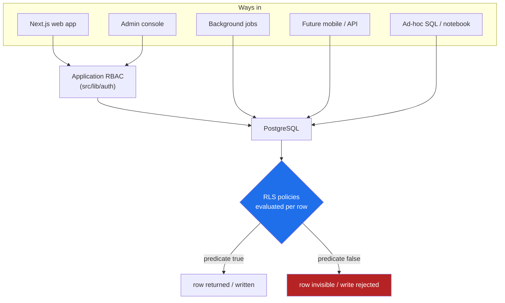
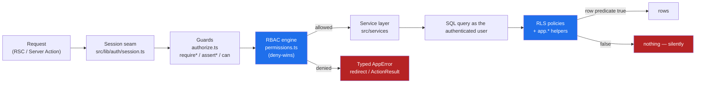

# 04 · Row-Level Security Model

> **Scope.** This document explains the **Row-Level Security (RLS)** posture of the Prototype AI platform: the governing principle, the `SECURITY DEFINER` helper functions that make policies both safe and terse, the small vocabulary of standard policy patterns, the append-only log discipline, and two fully worked examples. It closes with *why* the platform enforces access in two places at once — RBAC in the application **and** RLS in the database.
>
> **Status note.** The migrations under [`db/migrations/`](../../db/migrations/) are **applied to the live Supabase Postgres** — every policy quoted here is real, lives in the migration cited, and is enforced on live rows today. (When this document was first written, in Phase 2, the SQL was an unexecuted design and the app ran on mock providers; that stage is history.) Server-side writes that must bypass RLS run under the service-role key, which never leaves the server — see §4.

---

## 1. The governing principle: RLS is the primary data boundary

The platform's single most important security decision is this:

> **The database is the last line of defence, and it must be able to stand alone.** Every table carries Row-Level Security, and no policy is ever written to be *conveniently* permissive. A row is visible or writable only to the specific principals who have a concrete reason to touch it.

Why put the primary boundary in the database rather than in the application?

- **The application is not the only door.** A health platform accumulates access paths over time: the web app, background jobs, an admin console, a future mobile client, analytics exports, a data-science notebook, an incident-response query. Any authorisation logic that lives *only* in the Next.js app is bypassed by every one of those paths. Logic that lives in RLS is enforced no matter who opens the connection, as long as they connect as an ordinary authenticated user.
- **PHI raises the stakes.** [`0006_health_profiles.sql`](../../db/migrations/0006_health_profiles.sql) holds dates of birth, biological sex, diagnosed conditions, medications, allergies, and emergency contacts. A single over-broad `using (true)` on that table is a reportable data breach. The design treats a permissive policy as a defect, not a shortcut.
- **Least privilege is the default, not the exception.** Per the convention table in [`db/README.md`](../../db/README.md): *"RLS enabled on every table; least-privilege policies; append-only logs have no update/delete; `using(true)` only for genuinely public reads."* Across the foundational migrations, an unconditional `using (true)` appears **only** for genuinely public reads — published programmes ([`0008`](../../db/migrations/0008_commerce.sql)) and the `global` memory scope ([`0011`](../../db/migrations/0011_memory.sql)). Everywhere else the predicate names an owner, a tenant, a role, or a permission.



The application RBAC layer is a **usability and defence-in-depth** layer — it fails fast, renders the right UI, and returns clean errors. But even if an RBAC check is forgotten in one code path, RLS still evaluates every row. The two are kept in lock-step (see §7), and the database never trusts that the application already checked.

---

## 2. `SECURITY DEFINER` helper functions — the engine behind every policy

RLS policies must answer the same handful of questions over and over: *what is the caller's role? are they staff? which organisation are they in? do they hold this permission?* If each policy inlined those lookups, three problems would follow:

1. **Recursion.** A policy on `profiles` that reads `profiles` to discover the caller's role would re-trigger RLS on `profiles`, which reads `profiles`… — infinite recursion, or (worse) a policy that silently returns no rows.
2. **Leaks.** A naive sub-select against `profiles` or `organisation_memberships` inside a policy runs *under the caller's own RLS*, so it can only see rows the caller may already see — which is exactly the information the policy is trying to establish. That circularity produces subtle "why can't I see my own role" bugs.
3. **Drift.** Twenty tables each hand-rolling "am I an admin in this org" is twenty places to get it subtly wrong and later fail to update in lock-step.

The platform solves all three with a small library of helper functions in a dedicated `app` schema, defined once in [`0001_extensions_and_helpers.sql`](../../db/migrations/0001_extensions_and_helpers.sql) and reused by every policy. They are marked **`SECURITY DEFINER`**, so they execute with the privileges of the function *owner* rather than the calling user. That is precisely what breaks the recursion/leak cycle: the function can read `public.profiles` to resolve the caller's role **without** re-entering RLS, then hand back a plain boolean or scalar that the policy compares against.

The `app` schema is deliberately kept out of the public API surface (Supabase does not expose it via PostgREST), so these privileged helpers are never callable as REST endpoints.

### The helper catalogue

| Function | Returns | Used in policies for | Notes |
| --- | --- | --- | --- |
| `app.role_rank(role)` | `int` (0–5) | ordering comparisons | `immutable`; maps the `app_role` enum to its ordinal so "at least this role" is a numeric `>=` |
| `app.current_role()` | `app_role` | every role-gated policy | reads `profiles.role` for `auth.uid()`; defaults to `guest` when unauthenticated |
| `app.has_min_role(minimum)` | `boolean` | role-threshold reads/writes | `role_rank(current) >= role_rank(minimum)` — the cumulative hierarchy in one call |
| `app.is_staff()` | `boolean` | care-scope reads | sugar for `has_min_role('staff')` |
| `app.is_admin()` | `boolean` | tenant management | sugar for `has_min_role('administrator')` |
| `app.is_super_admin()` | `boolean` | platform-wide escape hatch | exact match on `super_administrator`; appears as the final `or …` in most policies |
| `app.current_org_id()` | `uuid` | every tenant-scoped policy | the caller's `organisations` id from `profiles`; nullable for platform users |
| `app.has_permission(key)` | `boolean` | fine-grained capability gates | mirrors the app-side RBAC engine (see §2.1) |

Every one of the lookup helpers carries the same defensive signature — for example:

```sql
create or replace function app.current_role()
returns app_role
language sql
stable                                 -- result is constant within a statement → planner can cache it
security definer                       -- runs as the owner: reads profiles WITHOUT re-triggering RLS
set search_path = public, app          -- pin the search_path so the body can't be hijacked
as $$
  select coalesce(
    (select p.role from public.profiles p where p.id = auth.uid()),
    'guest'::app_role
  );
$$;
```

Three properties matter and each is intentional:

- **`security definer`** — the reason recursion and leaks disappear. The function reads `profiles` with the definer's rights, so the RLS on `profiles` does not re-enter.
- **`set search_path = public, app`** — a pinned `search_path` is the standard `SECURITY DEFINER` hardening. Without it, a caller who prepended a malicious schema to their `search_path` could shadow `profiles` with a table of their own and trick the definer function into trusting forged data.
- **`stable`** — signals to the planner that the value does not change within a single statement, so a policy that calls `app.is_staff()` across a thousand rows evaluates it once, not a thousand times.

### 2.1 `app.has_permission()` — the DB mirror of the RBAC engine

The role helpers answer coarse "how senior are you" questions. Fine-grained capabilities (`knowledge.publish`, `agents.manage`, …) are answered by `app.has_permission()`, defined in [`0003_identity_and_permissions.sql`](../../db/migrations/0003_identity_and_permissions.sql). It computes exactly the same decision as the application-side engine in [`src/lib/auth/permissions.ts`](../../src/lib/auth/permissions.ts) — **deny always wins** — but against the DB tables `permissions` / `role_permissions` / `user_permission_overrides`:

```sql
create or replace function app.has_permission(perm_key text)
returns boolean language sql stable security definer
set search_path = public, app
as $$
  select
    -- explicit deny wins, and respects expiry
    not exists (
      select 1 from public.user_permission_overrides o
      where o.user_id = auth.uid() and o.permission_key = perm_key
        and o.effect = 'deny' and (o.expires_at is null or o.expires_at > now())
    )
    and (
      exists (  -- granted by the caller's role
        select 1 from public.role_permissions rp
        where rp.role = app.current_role() and rp.permission_key = perm_key
      )
      or exists (  -- or explicitly granted to the user
        select 1 from public.user_permission_overrides o
        where o.user_id = auth.uid() and o.permission_key = perm_key
          and o.effect = 'grant' and (o.expires_at is null or o.expires_at > now())
      )
      or app.is_super_admin()  -- super-admins hold every permission implicitly
    );
$$;
```

This is the DB half of the *lock-step* invariant: the app-side `hasPermission()` (deny-wins, role grant ∪ user grant, super-admin wildcard) and this SQL function implement the same three-line truth table, so a decision made in the UI is re-derived identically at the data boundary.

---

## 3. The standard policy patterns

Almost every policy in the codebase is one of six recognisable shapes. Keeping the vocabulary this small is deliberate: reviewers can read a new migration and immediately classify each policy, and the helper functions guarantee each shape behaves identically wherever it appears.

| # | Pattern | Predicate shape | Meaning | Representative use |
| --- | --- | --- | --- | --- |
| 1 | **Owner** | `user_id = auth.uid()` | the row's subject | `health_profiles`, `goals`, `notifications`, personal memory |
| 2 | **Tenant** | `organisation_id = app.current_org_id()` | same-org isolation | `clinics`, `knowledge_categories`, tenant memory |
| 3 | **Care-scope read** | `app.is_staff() and organisation_id = app.current_org_id()` | treating staff read within the org | `health_profiles` (read), `medical_questionnaires` (read) |
| 4 | **Admin manage** | `app.is_admin() and organisation_id = app.current_org_id()` (`for all`) | org admins own their tenant | `profiles` writes, `feature_flags`, `system_settings` |
| 5 | **Public read** | `using (publish_status = 'published' …)` / `using (true)` for global | world-readable, published content only | published `programmes`, public `knowledge_documents`, `global` memory |
| 6 | **Platform escape hatch** | `or app.is_super_admin()` | cross-tenant platform ownership | trailing clause on most policies |

A few points that make the patterns robust rather than merely tidy:

- **`WITH CHECK` re-asserts the keys on writes.** A `USING` clause governs which existing rows a statement may touch; a `WITH CHECK` clause governs the *post-image* of an insert/update. The platform always supplies both for mutations, so a caller cannot, say, pass RLS by matching an owned row and then rewrite `organisation_id` to smuggle it into another tenant. See the `profiles` self-update policy, which even blocks self-escalation:

  ```sql
  create policy profile_self_update on public.profiles
    for update using (id = auth.uid())
    with check (id = auth.uid() and role = app.current_role());  -- users cannot escalate their own role
  ```

- **Child rows inherit their parent's readability.** Rather than re-implement a document's complex visibility rules on every child table, the child policy simply asks whether the caller can see the parent, via an `EXISTS` against the already-secured parent table ([`0012_knowledge.sql`](../../db/migrations/0012_knowledge.sql)):

  ```sql
  create policy knowledge_document_tags_read on public.knowledge_document_tags
    for select using (
      exists (select 1 from public.knowledge_documents d where d.id = document_id)
    );
  ```

  The `EXISTS` sub-select itself runs under the child caller's RLS, so it returns a row only if `knowledge_documents_read` would have admitted the parent. Readability composes automatically.

- **Public reads are audited by their rarity.** Because `using (true)` is reserved for genuinely public data, a reviewer grepping for it across the migrations gets a complete inventory of everything the anonymous internet can read — a short, deliberate list.

---

## 4. Append-only logs: history you cannot rewrite

Several tables are **forensic or compliance records** that must never be edited or deleted after the fact:

| Table | Migration | Why append-only |
| --- | --- | --- |
| `audit_logs` | [`0013`](../../db/migrations/0013_platform.sql) | tamper-evident "who changed what, before→after, from where" trail |
| `activity_logs` | [`0013`](../../db/migrations/0013_platform.sql) | product/analytics stream; data-subject transparency |
| `consultation_events` | [`0007`](../../db/migrations/0007_consultation_workflow.sql) | immutable clinical event log per consultation |
| `auth_events` | [`0004`](../../db/migrations/0004_auth_sessions_oauth.sql) | security/audit trail of auth activity |
| `user_consents` | [`0005`](../../db/migrations/0005_preferences_and_consents.sql) | versioned GDPR consent ledger — a re-consent is a new row, never an edit |
| `knowledge_workflow_events` | [`0012`](../../db/migrations/0012_knowledge.sql) | publish-workflow state-transition history |

The enforcement mechanism is elegantly simple: **the immutability is expressed by the policies that are absent.** In PostgreSQL, with RLS enabled and no `UPDATE` or `DELETE` policy present, those commands match no rows and are effectively denied for every non-superuser. So these tables define only the policies they *do* permit:

- a **`SELECT`** policy, scoped to whoever is entitled to read the trail, and
- (sometimes) a tightly scoped **`INSERT`** policy.

`audit_logs` is the strictest — it defines *only* a read policy:

```sql
-- audit_logs: APPEND-ONLY. Read-only for everyone; NO update/delete policies exist.
create policy audit_logs_admin_read on public.audit_logs
  for select using (
    app.is_super_admin()
    or (app.is_admin() and organisation_id = app.current_org_id())
  );
-- No INSERT policy: writes happen server-side under the service role only, so the
-- trail cannot be forged from a user session. No UPDATE/DELETE by design.
```

Two design consequences follow:

1. **Even a compromised admin session cannot rewrite history.** An attacker who steals an administrator's session can *read* their tenant's audit trail, but there is no policy that would let them `UPDATE` or `DELETE` a single row. The record stands.
2. **Inserts are privileged and server-mediated.** Where a table has no `INSERT` policy at all (`audit_logs`, `activity_logs`, `auth_events`), rows are appended by trusted server code running under the Supabase **service role**, which bypasses RLS. Where user-originated events are legitimate (`consultation_events`, `user_consents`), a narrow `INSERT` policy admits them and additionally pins the recorded actor to the caller:

   ```sql
   -- consultation_events: staff/practitioner of the consultation's org may append,
   -- and the recorded actor MUST be the caller (no forging someone else's action).
   create policy consultation_events_insert_staff
     on public.consultation_events for insert
     with check (
       (actor_id is null or actor_id = auth.uid())
       and exists (
         select 1 from public.consultations c
         where c.id = consultation_events.consultation_id
           and c.organisation_id = app.current_org_id()
           and app.is_staff()
       )
     );
   ```

> **The service role is the one legitimate RLS bypass.** Supabase's service-role key connects as a privileged role that is exempt from RLS. It lives only in server-side code (never `NEXT_PUBLIC_*`), and is how Server Actions write audit rows and system notifications that no end user could insert. It is a *trusted deputy*, not a hole — the rest of the platform still runs as the authenticated user with RLS fully in force.

---

## 5. Worked example A — `health_profiles` (the strictest RLS in the codebase)

`health_profiles` ([`0006`](../../db/migrations/0006_health_profiles.sql)) holds PHI-grade data and carries the strictest posture in the platform. It is a 1:1 extension of a user, so — per convention — it is keyed **directly by `user_id`** (PK = FK to `auth.users`) rather than a surrogate uuid, and it denormalises `organisation_id NOT NULL` onto every row so tenant scoping is cheap and index-able on every access.

The access model, in one sentence: **the owner controls their record; treating staff/practitioners in the same organisation may read it for care; org admins may manage it; and it is *never* public.** Three policies express exactly that.

```sql
alter table public.health_profiles enable row level security;

-- (1) OWNER — full control over one's own clinical profile.
create policy health_profiles_owner_all
  on public.health_profiles
  for all
  using (user_id = auth.uid())
  with check (user_id = auth.uid());

-- (2) CARE-SCOPE READ — treating staff/practitioner in the SAME org, READ ONLY.
create policy health_profiles_careteam_read
  on public.health_profiles
  for select
  using (app.is_staff() and organisation_id = app.current_org_id());

-- (3) ADMIN MANAGE — org admins manage all profiles within their organisation.
create policy health_profiles_admin_all
  on public.health_profiles
  for all
  using (
    (app.is_admin() and organisation_id = app.current_org_id())
    or app.is_super_admin()
  )
  with check (
    (app.is_admin() and organisation_id = app.current_org_id())
    or app.is_super_admin()
  );
```

Reading this against the six patterns of §3:

- Policy **(1)** is the **owner** pattern applied to *all* commands — the subject of a health record is its author and editor.
- Policy **(2)** is the **care-scope read** pattern, and it is deliberately `for select` only. A treating clinician can *see* a patient's allergies and medications to deliver care, but cannot silently edit the clinical record. Note the *combination* `app.is_staff() and organisation_id = app.current_org_id()`: staff-ness alone is not enough — a staff member of a *different* tenant fails the org check and sees nothing. This is where multi-tenancy and role gating multiply together.
- Policy **(3)** is the **admin manage** pattern with the trailing **platform escape hatch** (`or app.is_super_admin()`).

Because RLS combines multiple policies for the same command with `OR`, the effective read rule for `health_profiles` is: *"you may `SELECT` a row if you own it **or** you are same-org staff **or** you are a same-org admin **or** you are the platform super-admin."* There is no fourth way in, and — crucially — **no policy mentions `visibility='public'` or `using (true)`**, so no anonymous or cross-tenant read is possible by construction. The sibling health tables (`fitness_profiles`, `nutrition_profiles`, `goals`, `medical_questionnaires`) reuse the identical shape; `medical_questionnaires` adds one extra `for update` policy so a same-org reviewer can write back review fields, reflecting its genuine `draft → submitted → reviewed` lifecycle.

---

## 6. Worked example B — `ai_memory` scope isolation (one table, six boundaries)

The AI memory store ([`0011_memory.sql`](../../db/migrations/0011_memory.sql)) is the most instructive RLS example in the platform because it isolates **six distinct security boundaries inside a single table**. Rather than six near-identical tables, memory is modelled as one `ai_memory` table with a `scope` discriminator and a set of *nullable* scope-key columns (`user_id`, `session_id`, `conversation_id`, `agent_id`, `organisation_id`). Only the key(s) relevant to a scope are populated; RLS then isolates each scope using the appropriate key.

| Scope | Identifying key(s) | Who reads | Who writes |
| --- | --- | --- | --- |
| `session` | `session_id` (+ `user_id`) | the owner | the owner |
| `user` | `user_id` | owner; same-org staff | the owner |
| `conversation` | `conversation_id` | owner of the parent conversation | the conversation owner |
| `agent` | `agent_id` (+ `organisation_id`) | same-org staff | same-org admins |
| `organisation` | `organisation_id` | same-org staff | same-org admins |
| `global` | *(none)* | everyone | super-admin only |

A `CHECK` constraint guarantees each row carries the mandatory key for its scope — defence in depth, because RLS *relies* on those keys to isolate rows:

```sql
constraint ai_memory_scope_key_present check (
  case scope
    when 'session'      then session_id is not null and user_id is not null
    when 'user'         then user_id is not null
    when 'conversation' then conversation_id is not null
    when 'agent'        then agent_id is not null and organisation_id is not null
    when 'organisation' then organisation_id is not null
    when 'global'       then true
  end
)
```

The RLS is a single policy per command whose predicate is an **`OR` across the scopes** — so a row is visible or writable *iff* its own scope's specific rule is satisfied. Here is the `SELECT` policy in full:

```sql
create policy ai_memory_read on public.ai_memory
  for select using (
    (scope = 'user'
       and (user_id = auth.uid()
            or (organisation_id = app.current_org_id() and app.is_staff())))
    or (scope = 'session'
       and user_id = auth.uid())
    or (scope = 'conversation'
       and exists (
         select 1 from public.conversations c
         where c.id = ai_memory.conversation_id
           and c.user_id = auth.uid()))
    or (scope = 'agent'
       and organisation_id = app.current_org_id() and app.is_staff())
    or (scope = 'organisation'
       and organisation_id = app.current_org_id() and app.is_staff())
    or (scope = 'global')                    -- the ONLY public read here
    or app.is_super_admin()
  );
```

What this buys, and why the shape is correct:

- **A session note never leaks to another user.** The `session` branch demands `user_id = auth.uid()`; another user matching the same opaque `session_id` still fails the ownership check.
- **An org fact never crosses tenants.** The `organisation` and `agent` branches both require `organisation_id = app.current_org_id()`, so tenant A's staff cannot read tenant B's shared memory even though the rows share a table.
- **Conversation memory follows conversation ownership.** The `conversation` branch delegates to an `EXISTS` against `conversations`, so "can I read this memory" reduces to "do I own the parent conversation" — one rule, defined once.
- **`global` is the single deliberate public read.** It is written by super-admins only; the corresponding `INSERT`/`UPDATE`/`DELETE` policies each end in `scope = 'global' and app.is_super_admin()`.
- **Writes re-validate the post-image.** The `UPDATE` policy repeats the same scope predicate in *both* `USING` and `WITH CHECK`, so a row cannot be *re-scoped* out from under RLS — you can't take a `user`-scoped row you own and flip it to `global`.

This is the payoff of pairing a discriminated table with helper-driven RLS: the application gets one uniform retrieval API (`MemorySelector` in [`src/types/memory.ts`](../../src/types/memory.ts), implemented live by [`src/services/repositories/memory-repo.ts`](../../src/services/repositories/memory-repo.ts)), while the database still enforces six independent least-privilege boundaries.

---

## 7. Why RLS *and* RBAC — defence in depth, kept in lock-step

The platform enforces authorisation **twice**: once in the application (RBAC) and once in the database (RLS). This is intentional, not redundant. Each layer does a job the other cannot.



**What RBAC gives that RLS cannot.** The application layer ([`src/lib/auth`](../../src/lib/auth)) runs *before* the query and shapes the whole user experience. It fails fast with a typed `AppError` and a user-safe message ([`src/lib/security/errors.ts`](../../src/lib/security/errors.ts)); it drives conditional rendering via non-throwing `can()` checks so users never see buttons they cannot use; it produces clean redirects (`requireRole` → `/dashboard?denied=1`) instead of empty result sets; and it runs in RSCs and middleware where there is no SQL query to gate. RLS, by contrast, would just return zero rows — correct, but a poor experience and no explanation.

**What RLS gives that RBAC cannot.** RLS runs *inside* the database, on every connection, per row, unconditionally. It is the backstop for the code path where an engineer forgets an `assertPermission()`, for the background job that never touches `src/lib/auth`, for the future mobile client, and for the analyst with a psql prompt. If application authorisation is the lock on the front door, RLS is the vault: it doesn't care how you got into the building.

**Lock-step is the design invariant.** The two layers are not merely both present — they compute the *same decisions* from mirrored definitions:

| Concept | Application (TypeScript) | Database (SQL) |
| --- | --- | --- |
| Role hierarchy | `ROLE_RANK`, `hasMinRole` — [`src/lib/auth/roles.ts`](../../src/lib/auth/roles.ts) | `app_role` enum + `app.role_rank` / `app.has_min_role` — [`0001`](../../db/migrations/0001_extensions_and_helpers.sql) |
| Permission catalogue | [`src/config/permissions.ts`](../../src/config/permissions.ts) (`resource.action`) | `permissions` / `role_permissions` — [`0003`](../../db/migrations/0003_identity_and_permissions.sql) |
| Effective decision (deny-wins) | `hasPermission()` — [`src/lib/auth/permissions.ts`](../../src/lib/auth/permissions.ts) | `app.has_permission()` — [`0003`](../../db/migrations/0003_identity_and_permissions.sql) |
| Per-user overrides | `AuthContext.grants` / `denies` | `user_permission_overrides` (grant/deny + expiry) |
| Tenant scope | `session.user.organisationId` | `app.current_org_id()` |

Because the catalogue and the truth table are duplicated *by design*, a permission checked in the UI is re-derived identically at the data boundary. The application decides quickly and explains itself; the database decides finally and cannot be talked out of it. Neither is trusted to be the only guard — and for a platform holding health data, that is the whole point.

---

## 8. At a glance

- **RLS is the primary boundary.** Enabled on every table; permissive policies are treated as defects; `using (true)` is reserved for genuinely public data (published programmes, public knowledge, `global` memory) and nothing else.
- **`SECURITY DEFINER` helpers** in the `app` schema (`current_role`, `has_min_role`, `is_staff/is_admin/is_super_admin`, `current_org_id`, `has_permission`) let policies stay short and consistent while avoiding recursion, cross-policy leaks, and `search_path` hijacking.
- **Six standard patterns** — owner, tenant, care-scope read, admin manage, public read, super-admin escape hatch — cover almost every policy, with `WITH CHECK` re-asserting keys on writes.
- **Append-only logs** enforce immutability by *omitting* `UPDATE`/`DELETE` policies; inserts are server-mediated (service role) or narrowly scoped with the actor pinned to the caller.
- **RBAC + RLS together**: the app layer fails fast, explains, and renders the right UI; the DB layer enforces the same decisions unconditionally on every connection — kept in lock-step through mirrored role, permission, and tenancy definitions.
