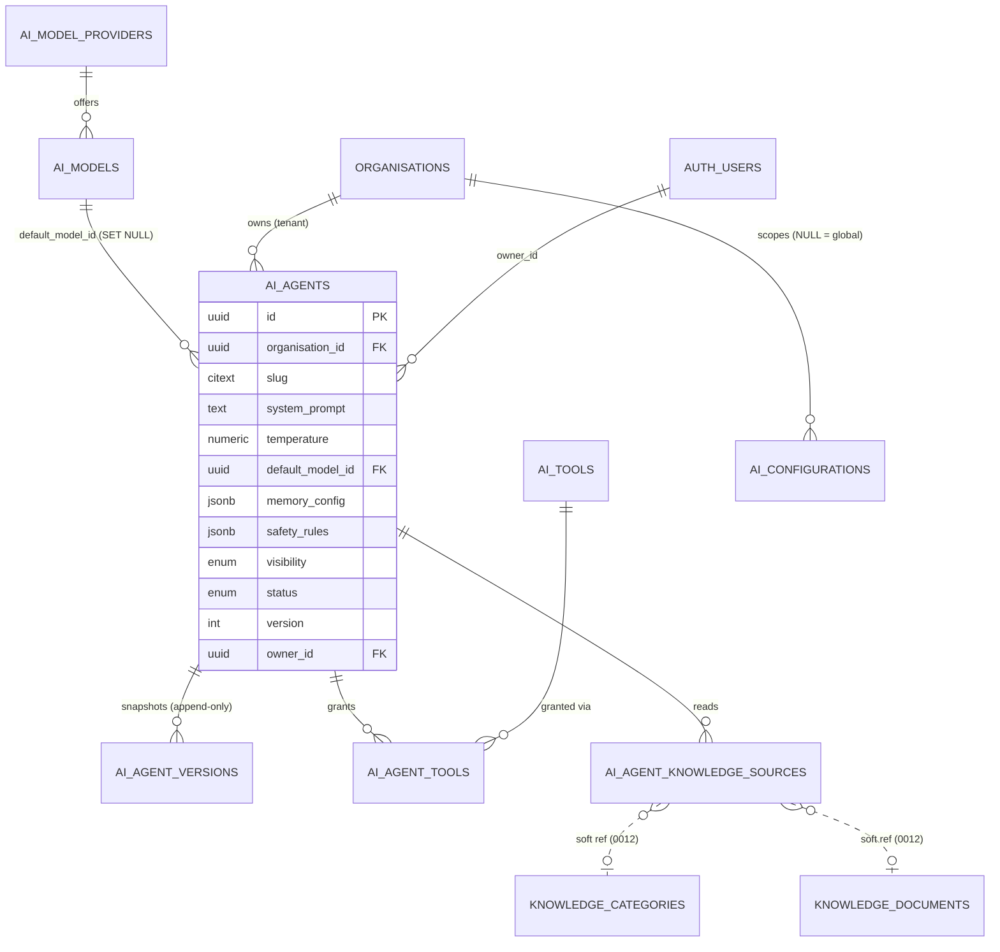
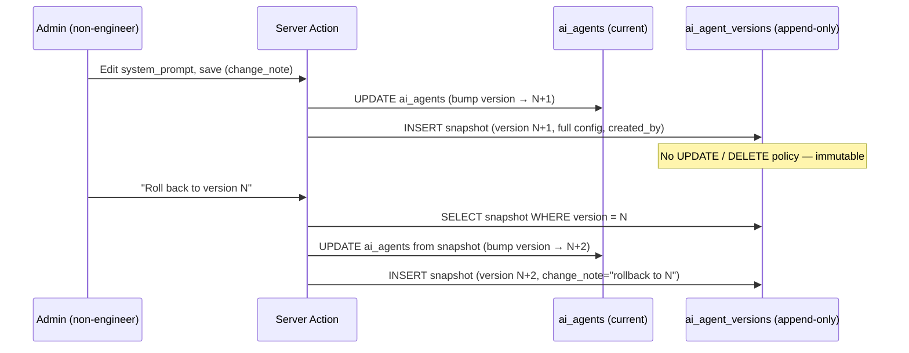
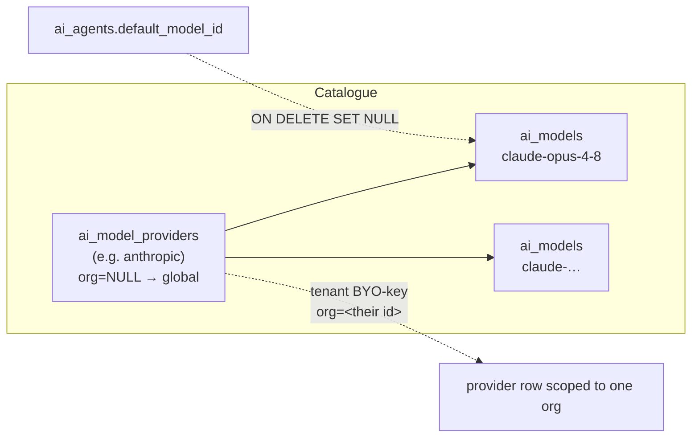

# 05 · AI Agent Framework

> **Status:** Architecture only. **No inference runs in Phase 2.** This document describes the *data model and service seam* that lets the client stand up unlimited AI agents through configuration — never a code deploy. Phase 3 plugs a runtime into this shape without redesigning it.

**Canonical sources referenced by this document**

| Concern | File |
| --- | --- |
| Schema (source of truth) | [`db/migrations/0009_ai_agents.sql`](../../db/migrations/0009_ai_agents.sql) |
| TypeScript model | [`src/types/ai.ts`](../../src/types/ai.ts) |
| Seed registry (agents as data) | [`src/config/ai-agents.ts`](../../src/config/ai-agents.ts) |
| Read / registry service | [`src/services/agents.ts`](../../src/services/agents.ts) |
| Prototype seam | [`src/config/app.ts`](../../src/config/app.ts) (`config.isPrototype`) |
| Cross-domain: transcripts | [`db/migrations/0010_conversations.sql`](../../db/migrations/0010_conversations.sql) |
| Cross-domain: memory | [`db/migrations/0011_memory.sql`](../../db/migrations/0011_memory.sql), [`src/services/memory.ts`](../../src/services/memory.ts) |
| Cross-domain: knowledge | [`db/migrations/0012_knowledge.sql`](../../db/migrations/0012_knowledge.sql), [`src/services/knowledge.ts`](../../src/services/knowledge.ts) |

---

## 1. The core idea: an agent is *data*, not code

The single most important decision in this framework is that **an AI agent is a row, not a class**. Everything an agent needs to run — which model it talks to, its system prompt and personality, the tools it may call, the knowledge it may read, its memory strategy, and the safety rules that fence it in — is stored as configuration, not compiled into the application.

**Why this matters for Ask Juice Doctor.** The brand is not a single chatbot; it is a wellness platform whose staff (non-engineers) will want to spin up a "Nutrition Coach", a "Booking Assistant", a "Sleep Companion", or a seasonal campaign agent on their own schedule. If each agent were code, every new agent — and every prompt tweak — would be an engineering ticket, a pull request, a deploy, and a release-approval cycle. In a health-adjacent product that is both slow and risky.

By modelling agents as data we get three properties that a code-per-agent design cannot:

1. **Unlimited agents, zero deploys.** Creating an agent is an `INSERT`; editing one is an `UPDATE` + an immutable snapshot. The admin UI is a CRUD surface over `ai_agents` and its satellites.
2. **Governance for free.** Because a prompt change is a database write, it is *auditable, versioned, diffable, and reversible* (see §5). A non-engineer editing the operative system prompt of a health companion is exactly the case where you want one-click rollback.
3. **A stable seam for the runtime.** The Phase-3 inference engine loads an agent by reading its row and satellites. Adding, editing, or retiring agents never touches the runtime — the runtime only ever *interprets* configuration.

> **Prototype reality.** In Phase 2 the "database" is a typed mock. `src/config/ai-agents.ts` holds the seed agents as `AiAgentDefinition[]`; `src/services/agents.ts` maps them to `AiAgent` records and exposes `list()` / `bySlug()` / `definitions()`. The service interface is **identical** to the one production will implement against `ai_agents` — swapping the provider (mock → Supabase) is a wiring change behind the server-only seam, not a rewrite. See §9.

---

## 2. The model

The framework spans eight tables in migration `0009`, in three tiers:

- **Catalogue** — `ai_model_providers` → `ai_models` (what an agent *can* talk to), and `ai_tools` (what it *can* call).
- **The agent** — `ai_agents` (the live/current config) + `ai_agent_versions` (its immutable history).
- **Bindings** — `ai_agent_tools` and `ai_agent_knowledge_sources` (join tables that wire an agent to specific tools and knowledge).
- **Config** — `ai_configurations` (org-scoped or platform-global key/value defaults).



### Table inventory

| Table | Role | Scope key | Notable columns |
| --- | --- | --- | --- |
| `ai_model_providers` | Catalogue of LLM providers (Anthropic, …) | `organisation_id` (**NULL = platform-global**) | `key`, `display_name`, `config` (non-secret conn opts), `enabled` |
| `ai_models` | Concrete models per provider | inherited from provider | `model_key`, `display_name`, `capabilities`, `context_window`, `max_output_tokens`, `enabled` |
| `ai_tools` | Registry of callable tools/functions | `organisation_id` (NOT NULL) | `key`, `input_schema` (JSON Schema), `handler_ref` (string pointer to code), `is_sensitive`, `enabled` |
| `ai_agents` | **Live/current** agent config | `organisation_id` (NOT NULL) | the full anatomy — see §3 |
| `ai_agent_versions` | **Immutable** version history | via parent agent | `version`, `snapshot` (full config jsonb), `change_note`, `created_by` |
| `ai_agent_tools` | Agent ↔ tool binding | via parent agent | PK `(agent_id, tool_id)`, per-attachment `config` |
| `ai_agent_knowledge_sources` | Agent ↔ knowledge binding | via parent agent | `category_id` / `document_id` (**soft** refs), `mode` (`include`/`exclude`) |
| `ai_configurations` | Key/value AI defaults | `organisation_id` (**NULL = global**) | `key`, `value`, `description` |

Three modelling choices in this table warrant their "why":

- **Two-level catalogue (providers → models).** Separating providers from models is what makes "future model selection" a *data* change. Adding Anthropic's next model is one row in `ai_models`; letting an agent use it is picking it in a dropdown. A `unique (provider_id, model_key)` guards duplicates. See §7.
- **`ai_configurations` is deliberately generic.** Rate limits, the platform default agent, and global guardrail defaults are all just keys. Two partial unique indexes (one global row per key, one per-org per key) enforce "exactly one value per scope" while still allowing a tenant to override a global default.
- **Soft knowledge references.** `ai_agent_knowledge_sources.category_id` / `document_id` are plain nullable `uuid`s with **no foreign key**, because the `knowledge_*` tables only arrive in migration `0012`. A hard FK here would create a migration-ordering hard-coupling; integrity is enforced at the app layer instead. A `CHECK` requires at least one of the two to be set.

### Scope conventions: platform-global vs tenant

`ai_model_providers`, `ai_models` (via provider), and `ai_configurations` support a **`NULL` `organisation_id` = platform-global** row that every tenant can read, plus tenant-scoped rows a single org owns. This is what lets the platform ship sensible global defaults (a shared Anthropic provider, a default rate limit) while allowing a tenant to bring its own key or override a value — without a schema change. Management of global rows is restricted to **super_administrators**; tenant rows are managed by that org's **administrators** (see §8).

---

## 3. Anatomy of an agent

Every field on `ai_agents` (and its `AiAgent` TypeScript mirror) exists to be read by the Phase-3 runtime when it assembles a request. Here is the complete anatomy.

| Field | Type | Purpose / why it exists |
| --- | --- | --- |
| `id` | `uuid` | Primary key. |
| `organisation_id` | `uuid` (FK) | Tenancy. Every agent belongs to exactly one organisation; RLS scopes on it. |
| `slug` | `citext` | Case-insensitive URL/lookup handle. `unique (organisation_id, slug)` — one `juice-doctor-companion` per org. |
| `name` | `text` | Human display name. |
| `description` | `text` | What the agent is for (admin UI + directory). |
| `role` | `text` | Short role label, e.g. *"Member wellbeing companion"* — orients the model and the operator. |
| `personality` | `text` | Tone/voice guidance ("warm, encouraging, plain-spoken"). Separated from `system_prompt` so voice can be tuned independently of instructions. |
| `system_prompt` | `text` | The operative instruction block. This is the highest-governance field — the one that most benefits from versioning/rollback. |
| `temperature` | `numeric` | Sampling temperature. DB `CHECK (temperature >= 0 and temperature <= 2)`. |
| `max_output_tokens` | `integer` (nullable) | Per-agent output cap. `null` = fall back to the model/global default. |
| `default_model_id` | `uuid` (FK → `ai_models`, **`ON DELETE SET NULL`**) | Which model the agent talks to. Nullable so an agent can be **drafted before a model is chosen**; deleting a model nulls the pointer rather than cascading the agent away. |
| `memory_config` | `jsonb` | Memory strategy — see §3.1. |
| `safety_rules` | `jsonb` | Guardrails/refusal policy — see §3.2 and §6. |
| `visibility` | `agent_visibility` enum | `private` / `organisation` / `public` — drives who can *see/use* the agent. Default `private`. |
| `status` | `agent_status` enum | `draft` / `active` / `disabled` / `archived` — lifecycle. Default `draft`. |
| `version` | `integer` | Pointer to the current version in `ai_agent_versions`. Default `1`. |
| `owner_id` | `uuid` (FK → `auth.users`) | The person accountable for the agent. Owners can always read their own agents. |
| `created_at` / `updated_at` | `timestamptz` | Standard timestamps; `app.set_updated_at` trigger stamps `updated_at`. |

> **Enums are values, not strings.** `visibility` and `status` are Postgres enums (`agent_visibility`, `agent_status`) *and* TypeScript union types (`AgentVisibility`, `AgentStatus`), so the app and DB share one closed vocabulary. The seed registry (`AiAgentDefinition`) omits `id`/`createdAt`/`updatedAt`/`version` because those are assigned on persist — see the `Omit<…>` in `src/types/ai.ts`.

### 3.1 `memory_config` — how much an agent remembers

`memory_config` is a `jsonb` blob mirrored by `AgentMemoryConfig`. It does **not** store memories; it declares *which of the six memory scopes* (from migration `0011`, one `ai_memory` table with six isolation scopes) the runtime may inject into this agent's context, and how much:

```ts
interface AgentMemoryConfig {
  useUserMemory: boolean;          // long-term facts about the member
  useConversationMemory: boolean;  // within-thread continuity
  useOrganisationMemory: boolean;  // shared org knowledge/settings
  useGlobalMemory: boolean;        // platform-wide facts
  maxItems?: number;               // cap on injected items (context budget)
}
```

The `session`, `user`, `conversation`, `agent`, `organisation`, and `global` scopes are isolated by RLS in `ai_memory`; `memory_config` is the agent's *opt-in* to each. This is why the three seed agents differ: the member companion opts into user + conversation + organisation + global memory (rich personalisation), whereas the intake assistant deliberately uses only user + conversation memory (a focused, low-leakage intake), and the practitioner copilot skips user memory entirely (it works on behalf of staff, not a member). See [`src/services/memory.ts`](../../src/services/memory.ts) for the uniform selector API the runtime will call.

### 3.2 `safety_rules` — the fence around the agent

`safety_rules` is a `jsonb` blob mirrored by `AgentSafetyRules`:

```ts
interface AgentSafetyRules {
  blockedTopics: string[];   // topics the agent must refuse
  requireDisclaimer: boolean;// force a "not medical advice" disclaimer
  escalateOn: string[];      // intents that route to a human practitioner
  maxTurns?: number;         // hard conversation-length cap
}
```

Because Ask Juice Doctor is health-adjacent, these are first-class configuration, not code buried in a prompt. Storing them as data means the client can tighten a guardrail (e.g. add `medication_change` to `escalateOn`) without a deploy, and every such change is versioned. §6 covers how the Phase-3 runtime is expected to enforce them.

---

## 4. Bindings: tools and knowledge

An agent's *capabilities* and *knowledge* are wired via join tables, not embedded in the agent row. This keeps the agent lean and lets the same tool/knowledge be reused across many agents.

### 4.1 Tool binding (`ai_agent_tools`)

Tools live once in the `ai_tools` registry and are attached to agents via `ai_agent_tools` (PK `(agent_id, tool_id)` — a tool is attached at most once per agent, with per-attachment `config` for overrides).

- **`handler_ref` is a string pointer, not logic.** The DB stores *which* server-side function implements a tool (`handler_ref`), never the function itself. The app resolves the pointer at call time. This keeps the schema logic-free and lets the client toggle tool access with a row change.
- **`input_schema` is JSON Schema.** It is the contract the model uses to produce a valid tool call — the same shape a Phase-3 runtime will hand to the model's tool-use API.
- **`is_sensitive` gates dangerous tools.** Tools that mutate data or touch PHI are flagged so admins can require elevated approval before an agent is granted them. Indexed for fast auditing (`ai_tools_sensitive_idx`).

In the prototype, an agent's tools are the string `keys` on `AiAgentDefinition.tools` (e.g. `['search_knowledge', 'book_consultation']`), which map to `ai_tools.key` and, on persist, become `ai_agent_tools` rows.

### 4.2 Knowledge binding (`ai_agent_knowledge_sources`)

Each row scopes what an agent may retrieve from the knowledge base (`0012`):

- **`mode = 'include' | 'exclude'`** — includes widen the agent's readable scope; **excludes deny and take precedence** over broader includes. This lets an operator say "all of the HERNE Protocol category *except* this one draft document."
- **Soft references** (`category_id` / `document_id`) — as noted in §2, no hard FK, integrity enforced by the app, `CHECK` ensures at least one target is present.

In the prototype these are the `knowledgeCategories` slugs on `AiAgentDefinition` (e.g. `['herne-protocol', 'nutrition', 'hydration']`). The actual retrieval — chunking + embeddings — is a **Phase-3** concern; `knowledge_embeddings` is a placeholder until `pgvector` is enabled (§9).

---

## 5. Versioning and rollback

`ai_agents` holds only the **current** configuration. Every meaningful save is expected to write an immutable **snapshot** to `ai_agent_versions`:



Design points and their "why":

- **`snapshot` is a full config blob**, not a diff. Reconstructing an agent at any version is a single read — no replaying a change log. Diffing for the UI is done *between* two snapshots.
- **`unique (agent_id, version)`** guarantees one row per version; the index `(agent_id, version desc)` makes newest-first history reads cheap.
- **Append-only by RLS.** `ai_agent_versions` has a read policy and an insert policy but **no update or delete policy** — history cannot be rewritten. This is the same append-only discipline used platform-wide for audit logs (`audit_logs`, `consultation_events`, `user_consents`, `knowledge_workflow_events`).
- **Rollback is a forward write.** Rolling back doesn't erase history; it copies an old snapshot into the live row and records a *new* version. The timeline is always complete.

This is exactly the governance a health-adjacent product needs: when a non-engineer edits the operative prompt of a member-facing wellbeing companion, there is a permanent record of *what changed, who changed it, and why*, and any bad change is one write away from being undone.

---

## 6. Safety rules and guardrails

Safety is layered. The `safety_rules` blob (§3.2) is *configuration*; the enforcement is *architecture* that the Phase-3 runtime will implement. The intended layers:

| Layer | Where | What it does |
| --- | --- | --- |
| **Blocked topics** | `safety_rules.blockedTopics` | The agent must refuse these (e.g. `diagnosis`, `prescription`, `emergency_medical`). |
| **Mandatory disclaimer** | `safety_rules.requireDisclaimer` | Forces a "not medical advice, see a professional" disclaimer on responses. |
| **Human escalation** | `safety_rules.escalateOn` | Detected intents (e.g. `self_harm`, `acute_symptoms`, `safeguarding`) route the conversation to a human practitioner — the intake/consultation pipeline (`0007`) is the destination. |
| **Turn cap** | `safety_rules.maxTurns` | Hard limit on conversation length (defence against runaway loops / cost). |
| **Sensitive-tool gating** | `ai_tools.is_sensitive` + `ai_agent_tools` | Tools that mutate data or touch PHI are only granted deliberately and are auditable. |
| **Model-selection guardrails** | `ai_configurations` (global/org) | Platform- or org-wide defaults (rate limits, default guardrails) sit outside any one agent. |
| **RLS + RBAC** | DB + `src/lib/auth` | Even a mis-prompted agent cannot read rows the caller isn't entitled to — the data boundary is enforced below the agent, not by it. |

The key principle: **guardrails are data and RLS, not just prose in a prompt.** A prompt can be jailbroken; an RLS policy and a tenant boundary cannot. The `safety_rules` blob makes intent explicit and versioned, while the DB enforces the hard boundary regardless of what the model outputs.

---

## 7. Model selection (providers → models)

Model selection is a *data* feature, delivered by the two-level catalogue:



- **Providers carry connection config, never secrets.** `ai_model_providers.config` holds endpoints and non-secret options; API keys live in the app vault, referenced by key. This keeps credentials out of the database entirely.
- **Global defaults + BYO-key.** A `NULL`-org provider row is a platform-wide default any tenant can select; a tenant may additionally register its own provider row (its own key/endpoint) scoped to its `organisation_id`. Partial unique indexes enforce one global `anthropic` and one `anthropic` per org.
- **Models are just rows.** Offering a new model is `INSERT INTO ai_models`; an agent adopts it by setting `default_model_id`. No deploy. `capabilities` (vision/tools/streaming), `context_window`, and `max_output_tokens` inform the future selection UI and validation.
- **Agents can exist without a model.** `default_model_id` is nullable and set-null-on-delete, so drafts and model retirement never orphan or destroy an agent (§3).

---

## 8. Security and access control

Access follows the platform's **defence-in-depth** doctrine: RBAC in the app (`src/lib/auth`) *and* RLS in the DB, kept in lock-step. Every table in `0009` has RLS enabled. The recurring pattern:

- **Platform-global rows** (`organisation_id IS NULL`): managed by **super_administrators** only.
- **Tenant rows**: managed by that org's **administrators** (`organisation_id = app.current_org_id()`).
- **Reads**: staff and above see internal config within their org; global defaults are visible to all authenticated users so pickers render.

Per-table read/write matrix (from the policies in `0009`):

| Table | Read | Write |
| --- | --- | --- |
| `ai_model_providers` | any authenticated: global rows, own-org rows; super_admin: all | super_admin (global) / admin (own org) |
| `ai_models` | visible when parent provider is visible | mirrors provider rights |
| `ai_tools` | staff+ within org; super_admin | admin within org; super_admin |
| `ai_agents` | **public+active → anyone**; owner → own; staff → all org; practitioner → **active only**; org member → org-visible active; super_admin → all | admin within org; super_admin |
| `ai_agent_versions` | staff+ within agent's org; super_admin | **insert-only** by admins; **no update/delete** (immutable) |
| `ai_agent_tools` | whoever can read the agent (staff+/super) | admin within agent's org; super_admin |
| `ai_agent_knowledge_sources` | whoever can read the agent (staff+/super) | admin within agent's org; super_admin |
| `ai_configurations` | staff+ own-org rows + all global; super_admin | admin (own org) / super_admin (global) |

Two subtleties worth calling out:

- **The `ai_agents` read policy is layered.** `visibility='public' AND status='active'` is genuinely public content (an unauthenticated chatbot can be exposed); internal reads then add owner, staff (all org agents), practitioner (**active** agents only), and org-member (**org-visible, active**) tiers. The role vocabulary (`app.current_role()`, `app.is_staff()`, `app.is_admin()`, `app.is_super_admin()`) is the same one mirrored in `src/lib/auth/roles.ts`.
- **Satellite permissions derive from the parent agent.** `ai_agent_tools`, `ai_agent_knowledge_sources`, and `ai_agent_versions` policies all use an `EXISTS` against `ai_agents`, so authorisation lives in exactly one place and cannot drift between an agent and its bindings.

---

## 9. Phase 2 vs Phase 3: where the runtime plugs in

**Phase 2 (now) — definitions only.**

- Agents are the seed registry in `src/config/ai-agents.ts`; `src/services/agents.ts` is the read/registry seam. There is **no inference, no provider call, no token spend**.
- The schema (`0009`), the types (`src/types/ai.ts`), and the RLS policies are all production-shaped, so Phase 3 is *additive*, not a redesign.
- The prototype/production choice is made **server-side** off the non-public `APP_MODE` env, behind the single `config.isPrototype` seam (`src/config/app.ts`); `NEXT_PUBLIC_APP_MODE` is cosmetic only (the banner). A Supabase client can never be tree-shaken into a client bundle.

**Phase 3 (later) — the runtime interprets the data.** To go live, the following plug into the *existing* shape without changing it:

1. **Provider selection**: `agents.list()` / `bySlug()` read `ai_agents` (mock → Supabase swap behind the server-only service). CRUD Server Actions write `ai_agents` + snapshot to `ai_agent_versions`.
2. **An inference engine** loads an agent row, resolves its `default_model_id` → `ai_models` → `ai_model_providers` (+ vault secret), assembles the prompt from `system_prompt` + `personality`, injects memory per `memory_config` (from `ai_memory`, `0011`), retrieves knowledge per `ai_agent_knowledge_sources` (once `pgvector` fills `knowledge_embeddings` in `0012`), exposes tools per `ai_agent_tools` (`input_schema` + `handler_ref`), and enforces `safety_rules`.
3. **Transcripts persist** to `conversations` / `messages` (`0010`) — which already **soft-reference** `ai_agents` by design, so agents can be versioned or swapped without cascading away a member's chat history.
4. **Vector search** turns on when `pgvector` is enabled and the `embedding vector(N)` column is added to `knowledge_embeddings`.

The framework's promise holds end-to-end: **nothing about adding, editing, versioning, or retiring an agent ever requires a code change** — the runtime only ever interprets configuration.

---

## 10. The three seed agents

The seed registry proves the framework's claim: three genuinely different agents, expressed entirely as data, differing only in configuration. All three are seeded `status: 'draft'` (nothing is live in Phase 2) and owned by the system super-admin in the prototype org.

| Property | Juice Doctor Companion | Intake & Triage Assistant | Practitioner Copilot |
| --- | --- | --- | --- |
| `slug` | `juice-doctor-companion` | `intake-triage` | `practitioner-copilot` |
| Audience | Members (public-facing wellbeing) | New members (structured intake) | Staff/practitioners only |
| `role` | Member wellbeing companion | Clinical intake assistant | Practitioner productivity copilot |
| `temperature` | `0.6` (warm, varied) | `0.3` (methodical) | `0.2` (precise, evidence-oriented) |
| `maxOutputTokens` | `1024` | `1500` | `2048` |
| `visibility` | `organisation` | `organisation` | `private` |
| Memory | user + conversation + org + global, `maxItems: 20` | user + conversation only | conversation + org + global (no user memory) |
| Safety | blocks `diagnosis`/`prescription`/`emergency_medical`; disclaimer required; escalates on `self_harm`, `acute_symptoms`, `medication_change`; `maxTurns: 40` | blocks `diagnosis`/`prescription`; disclaimer required; escalates on `red_flag_symptom`, `safeguarding` | no blocks, no disclaimer, no escalation (staff-only, low-risk) |
| Tools | `search_knowledge`, `book_consultation` | `create_assessment`, `flag_for_review` | `search_knowledge`, `summarise_consultation` |
| Knowledge | `herne-protocol`, `nutrition`, `hydration` | `intake`, `safeguarding` | `herne-protocol`, `clinical-guidance` |

Reading the differences top-down tells the story of the framework:

- **Juice Doctor Companion** is the brand's member-facing voice, grounded in the **HERNE Protocol** (Hydration, Elimination, Rest, Nutrition, Exercise). Warm and personalised (rich memory), but tightly fenced: it explicitly must not diagnose or prescribe, always carries a disclaimer, and escalates safety-critical intents to a human.
- **Intake & Triage Assistant** trades warmth for rigour (low temperature, methodical personality), collects what a practitioner needs, and routes red flags to human review — it gathers and routes, it does **not** conclude. Its narrower memory scope keeps intake focused and reduces cross-context leakage.
- **Practitioner Copilot** is a staff-only productivity tool (`private` visibility). It is precise, cites sources, and drafts consultation summaries — with no member memory and minimal guardrails, because its user is a clinician, not a patient.

Every one of these differences is a value in a row. Adding a fourth agent — a "Sleep Coach", say — is the same operation the client will perform in the admin UI: pick a model, write a prompt and personality, choose tools and knowledge, set memory and safety, choose visibility, save. **No code. No deploy.** That is the framework.
