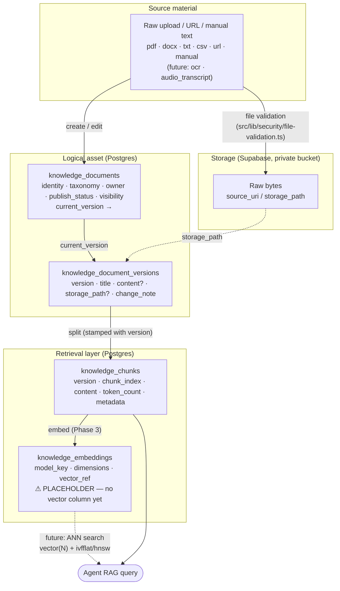
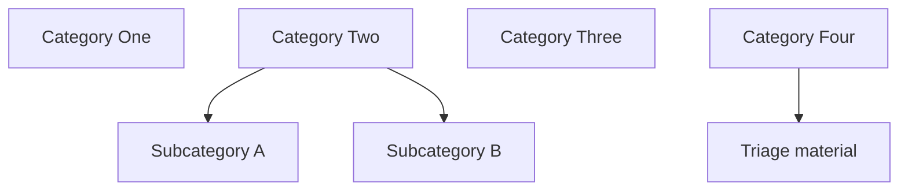
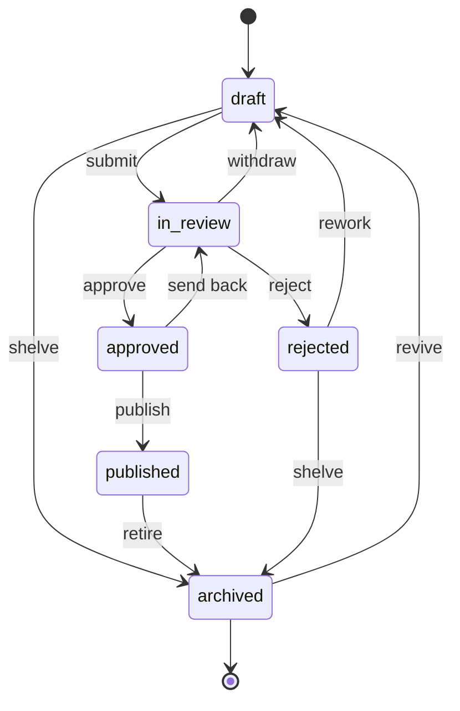
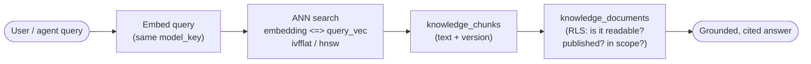

# 06 · Knowledge Management Architecture

> **Scope.** This document describes the **knowledge management** subsystem of *Ask Juice Doctor AI* — the curated, organisation-authored source material that the AI reasons over. It covers the ingestion-to-retrieval pipeline (document → version → chunk → embedding), the taxonomy (categories + tags), the publishing/approval **state machine**, source tracking + storage, layered access control (visibility + fine-grained grants), and the deferred vector-search layer.
>
> **Status.** The pipeline is **live**: pasted-text ingestion → chunking → **ranked Postgres full-text retrieval** (`ts_rank` via a SQL function; migrations `0012` + `0018`), with only published + available documents grounding live AI answers, and the publishing/approval workflow running on real rows (`src/services/knowledge.ts` over `repositories/knowledge-repo.ts`). Still deferred: **embeddings / vector search** (`pgvector` is not enabled — `knowledge_embeddings` remains a metadata placeholder) and **file uploads** (raw file bytes are not stored; content arrives as pasted text, and metadata-only documents advance index states manually). This document was written in Phase 2 before any of the pipeline ran; the schema it describes is unchanged.

**Canonical sources for this document:**

| Concern | File |
| --- | --- |
| Schema, enums, RLS | [`db/migrations/0012_knowledge.sql`](../../db/migrations/0012_knowledge.sql) |
| Shared workflow / status enums | [`db/migrations/0001_extensions_and_helpers.sql`](../../db/migrations/0001_extensions_and_helpers.sql) |
| Domain types | [`src/types/knowledge.ts`](../../src/types/knowledge.ts) |
| Service + workflow state machine | [`src/services/knowledge.ts`](../../src/services/knowledge.ts) |
| Permission catalogue | [`src/config/permissions.ts`](../../src/config/permissions.ts) |
| ERD / schema conventions | [`db/README.md`](../../db/README.md) |

---

## 1. What "knowledge" is, and why it is its own subsystem

The knowledge base is the **grounding corpus**: the set of documents the AI agents (see [`db/migrations/0009_ai_agents.sql`](../../db/migrations/0009_ai_agents.sql)) are given as retrieval-augmented context — the framework documentation, domain guidance, intake/triage material, public FAQ, and so on. An agent without a knowledge base is a general chatbot; an agent *with* one is a domain expert whose answers are traceable to approved, versioned, organisation-owned source material.

That framing drives the single most important architectural decision in this subsystem:

> **Ingestion is decoupled from retrieval.**

A `knowledge_documents` row is the **logical asset** — its identity, taxonomy, ownership, and publishing state. The **raw bytes** live in Supabase Storage (a private bucket) referenced by `source_uri` / `storage_path`, or inline on a version row for hand-authored `manual` documents. The **retrieval-facing derivatives** — chunks and embeddings — are *separate tables*.

Why this separation matters:

- **Re-chunking or re-embedding never rewrites the asset.** Changing chunk size, switching embedding models, or upgrading the vector store are operations on derivative tables only. The source of truth is untouched.
- **The same document can feed multiple retrieval strategies.** One document, one version, potentially several chunking passes — each stamped with the version it came from.
- **Storage cost and lifecycle differ.** Raw PDFs belong in object storage; chunk text belongs in Postgres; vectors belong (eventually) in a `vector(N)` column or an external ANN store. Modelling them apart lets each live where it belongs.

Every table in this subsystem carries `organisation_id` (multi-tenancy — see [`db/migrations/0002_tenancy.sql`](../../db/migrations/0002_tenancy.sql)) and has **RLS enabled**, consistent with the platform-wide convention that *every* table is row-level secured. Knowledge is defence-in-depth: RBAC in the app (`knowledge.*` permissions) **and** RLS in the database, kept in lock-step.

---

## 2. The ingestion → retrieval pipeline

The pipeline is a four-stage refinement: a **document** owns one or more **versions**; a version is split into **chunks**; each chunk gets an **embedding** (metadata now, vectors in Phase 3). Retrieval reads chunks + embeddings; ingestion writes them.



### Stage-by-stage

| Stage | Table | Role | Written by |
| --- | --- | --- | --- |
| **Document** | `knowledge_documents` | Logical asset: identity (`title`, `slug`), taxonomy (`category_id`), ownership (`owner_id`), publishing state (`publish_status`, `visibility`), and a `current_version` pointer. | Author create / edit (Server Action, gated by `knowledge.create` / `knowledge.edit`). |
| **Version** | `knowledge_document_versions` | Full history — a new row per edit. `content` holds the inline body for `manual` docs; `storage_path` points at the versioned file for uploads. `change_note` explains the edit. | Same author flow; append a version, bump `current_version`. |
| **Chunk** | `knowledge_chunks` | Retrieval-ready text segments derived from a **specific version**. Carries `chunk_index`, `token_count`, and a free-form `metadata` jsonb (page / section / heading) so new hints need no schema change. | Server-side ingestion pipeline (`knowledge.edit` gated). |
| **Embedding** | `knowledge_embeddings` | Per-chunk embedding **metadata** — `model_key`, `dimensions`, `vector_ref`. **Placeholder**: no vector column until Phase 3. | Server-side ingestion pipeline (`knowledge.edit` gated). |

**Cascade discipline.** `knowledge_chunks` and `knowledge_embeddings` are `on delete cascade` off their parents (document → chunk, chunk → embedding). Deleting or re-ingesting a document tears down its derivatives cleanly — there are no dangling vectors pointing at content that no longer exists.

---

## 3. Supported source types

`knowledge_source_type` is an enum declared with the **future** ingestion formats already present, precisely so those pipelines require *no schema migration* when they land:

```sql
create type knowledge_source_type as enum (
  'pdf', 'docx', 'txt', 'csv', 'url', 'manual', 'ocr', 'audio_transcript'
);
```

| `source_type` | Meaning | Bytes live in | Phase |
| --- | --- | --- | --- |
| `pdf` | Uploaded PDF | Storage (`source_uri` / version `storage_path`) | Now (modelled) |
| `docx` | Uploaded Word document | Storage | Now (modelled) |
| `txt` | Plain-text upload | Storage or inline | Now (modelled) |
| `csv` | Tabular source | Storage | Now (modelled) |
| `url` | External web source | Referenced by `source_uri` | Now (modelled) |
| `manual` | Hand-authored in the admin UI | **Inline** on the version row (`content`) | Now (modelled) |
| `ocr` | Scanned image → text | Storage (image) + extracted text | **Future** |
| `audio_transcript` | Audio → transcript | Storage (audio) + transcript | **Future** |

**Why declare `ocr` and `audio_transcript` now?** Enum changes are cheap on paper but disruptive in a live system (they touch every consumer, every check constraint, every seeded row). By naming the two anticipated ingestion modes up front, a future OCR or transcription pipeline is *new code writing existing table shapes* — it produces `knowledge_documents` + versions + chunks exactly like a PDF does. The abstraction "everything becomes chunks of text" holds across all eight source types, which is exactly why chunking is modelled independently of source (see §7).

**File safety.** When file-upload ingestion lands, uploads will flow through the platform's file-validation utility ([`src/lib/security/file-validation.ts`](../../src/lib/security/file-validation.ts)) — size limits, MIME allow-listing, magic-number sniffing, and a malware-scan hook — *before* a `knowledge_documents` row or its bytes are committed. Today no raw file bytes are stored: content is ingested as pasted text (`knowledgeRepo.ingestText`), and file-typed documents are metadata-only records.

---

## 4. Taxonomy: categories and tags

Two complementary axes organise the corpus, both scoped per organisation:

### Categories — a hierarchical tree

`knowledge_categories` is a **self-referencing tree** (`parent_id → knowledge_categories.id`). A document belongs to at most one category (`knowledge_documents.category_id`).



- **`on delete set null` on `parent_id`** — deleting a parent *re-parents its children to `NULL`* rather than cascading. A taxonomy reshuffle never orphans (deletes) documents. Reorganising the tree is a safe, reversible metadata operation.
- **`on delete set null` on `knowledge_documents.category_id`** — deleting a category detaches its documents; it never destroys them.
- `sort_order` gives deterministic ordering; `slug` is unique per `(organisation_id, slug)`; `status` reuses the generic `record_status` lifecycle (`draft`/`active`/`archived`/`deleted`).

Four root categories (`Guides`, `Reference`, `Onboarding`, `Internal`) are idempotently seeded as real `knowledge_categories` rows (via `repositories/knowledge-repo.ts`), so the admin UI always has a tree to render. (The `Category One…Four` names in the diagram above are the historical Phase-2 placeholder set.)

### Tags — flat, cross-cutting labels

`knowledge_tags` is a **flat** per-org vocabulary, joined many-to-many to documents through `knowledge_document_tags`.

| | Categories | Tags |
| --- | --- | --- |
| Shape | Hierarchical tree | Flat set |
| Cardinality per document | One (`category_id`) | Many (`knowledge_document_tags`) |
| Purpose | *Where* a document lives | *What it's about*, cross-cutting |
| Deletion | `set null` (re-parent / detach) | `cascade` off the join row only |

The two axes are orthogonal on purpose: categories model the primary organisational structure a reviewer navigates; tags model retrieval-time and cross-cutting labels ("beginner", "clinical", "public-safe") that cut across the tree.

---

## 5. The publishing / approval workflow (state machine)

Knowledge is not published by fiat — it moves through an **explicit, audited approval workflow**. The states are the shared `publish_status` enum (reused by knowledge *and* programmes), and every transition is recorded in an **append-only** ledger.

### 5.1 States

```sql
create type publish_status as enum (
  'draft', 'in_review', 'approved', 'published', 'rejected', 'archived'
);
```

| State | Meaning |
| --- | --- |
| `draft` | Being authored; not visible to consumers. |
| `in_review` | Submitted; awaiting an approver. |
| `approved` | Passed review; cleared to publish but not yet live. |
| `published` | Live and retrievable (and, if `visibility='public'`, world-readable). |
| `rejected` | Reviewer sent it back; needs rework. |
| `archived` | Retired from active use; retained for history. |

### 5.2 Transition graph

The **single source of truth** for allowed transitions is `PUBLISH_TRANSITIONS` in [`src/services/knowledge.ts`](../../src/services/knowledge.ts), consumed by `canTransition(from, to)`. The admin UI and any API share this one definition — there is no second, drifting copy.

```ts
export const PUBLISH_TRANSITIONS: Record<PublishStatus, PublishStatus[]> = {
  draft:     ['in_review', 'archived'],
  in_review: ['approved', 'rejected', 'draft'],
  approved:  ['published', 'in_review'],
  published: ['archived'],
  rejected:  ['draft', 'archived'],
  archived:  ['draft'],
};
```



The **happy path** is the linear spine `draft → in_review → approved → published`. Everything else is a deliberate escape hatch: `rejected` and `draft` returns for rework, `archived` for retirement (and `archived → draft` for revival). The graph is intentionally *not* fully connected — you cannot leap `draft → published`, skipping review; you cannot un-archive straight back to `published`. Those illegal edges are absent from the map, so `canTransition` rejects them without any special-casing.

### 5.3 Who may drive it — separation of duties

Transitions map onto distinct `knowledge.*` permissions ([`src/config/permissions.ts`](../../src/config/permissions.ts)), enforcing separation of duties between authors and approvers:

| Transition | Gate | Held by (cumulative) |
| --- | --- | --- |
| create → `draft` | `knowledge.create` | staff, administrator, super_administrator |
| edit within `draft` / add versions | `knowledge.edit` | staff+ |
| `in_review → approved` / `rejected` | `knowledge.approve` | administrator+ |
| `approved → published` | `knowledge.publish` | administrator+ |
| delete | `knowledge.delete` *(sensitive)* | administrator+ |
| read (incl. drafts) | `knowledge.read` | practitioner+ |

Because roles are **linear and cumulative** (guest → member → practitioner → staff → administrator → super_administrator), an author with only `knowledge.create` / `knowledge.edit` (staff) **cannot approve their own work** — approval requires `knowledge.approve`, which begins at administrator. That is the whole point of splitting the permissions.

### 5.4 The audit ledger

`knowledge_workflow_events` is **append-only**: one row per transition (`from_status`, `to_status`, `actor_id`, optional `note`, `created_at`), and — critically — **no `UPDATE` or `DELETE` RLS policy exists**. There is only a `SELECT` policy (staff+, org-scoped) and an `INSERT` policy (`knowledge.approve` or admin). History therefore **cannot be rewritten**: the approval chain is tamper-evident by construction, consistent with the platform-wide append-only convention for logs (audit_logs / activity_logs in [`0013_platform.sql`](../../db/migrations/0013_platform.sql)).

When a document reaches `published`, `knowledge_documents.approved_by` / `approved_at` record who signed it off — a denormalised convenience pointer, with the *full* transition history in the ledger.

---

## 6. Source tracking, storage, and versioning

### 6.1 Where the bytes live

| Content kind | Location | Column |
| --- | --- | --- |
| Uploaded file (`pdf`/`docx`/`txt`/`csv`, future `ocr`/`audio_transcript`) | Supabase Storage — **private** knowledge bucket | `knowledge_documents.source_uri` and/or `knowledge_document_versions.storage_path` |
| External web source (`url`) | Remote URL, referenced not stored | `knowledge_documents.source_uri` |
| Hand-authored (`manual`) | **Inline** in Postgres | `knowledge_document_versions.content` (`source_uri` is `NULL`) |

Storage is a **private** bucket by design. `visibility='public'` on a document governs whether the *knowledge* is world-readable once published — it does **not** make the raw bytes publicly downloadable. Public reach is served through the application (published, public-visibility documents), keeping object-store access on the server side.

### 6.2 Why versioning is first-class — even before embeddings exist

`knowledge_document_versions` keeps the **full edit history**; `knowledge_documents.current_version` points at the live one. This was modelled from the start — before any inference or vectors ran — and that was deliberate:

1. **Chunks and embeddings are stamped with their source `version`.** `knowledge_chunks.version` records exactly which version each chunk was derived from. The moment a document is edited (new version), every chunk carrying an older `version` is **provably stale** — identifiable and prunable with a single `WHERE version <> current_version`. Without versioning, staleness would be a guess. *This is the load-bearing reason versioning cannot wait for Phase 3:* the retrieval layer's correctness depends on it, and the retrieval-layer tables already reference it.
2. **RAG answers must be traceable.** When an agent grounds a response on a chunk, the chunk's `version` ties the citation to the exact document revision that was live at answer time. Editing the document later does not silently rewrite the provenance of past answers.
3. **Approval operates on a specific revision.** The workflow (§5) approves a version of the truth, not a moving target. A `change_note` per version explains *what changed and why* for the reviewer.
4. **Rollback and diff are free.** Because versions are append-only rows, reverting is repointing `current_version`; comparing revisions is a row diff. No content is ever lost to an edit.

In short: **versioning is the backbone the deferred embedding layer will hang off.** Building it later would mean retrofitting a `version` stamp onto already-embedded chunks — a migration and a re-embed. Building it now costs one table and makes the Phase 3 pipeline a straight-line addition.

---

## 7. Why chunking is modelled now, with embeddings deferred

This is the subsystem's most counter-intuitive decision, so it warrants its own section: **`knowledge_chunks` is a real, populated-capable table today, while `knowledge_embeddings` is an explicit placeholder.**

### Chunks are not embeddings

A *chunk* is a unit of source text — a paragraph, a page, a section — with an ordering (`chunk_index`), a size hint (`token_count`), and free-form `metadata`. Producing chunks requires **no model and no vector extension**: it is deterministic text processing (split, count, stamp with `version`). An *embedding* is the numeric vector a model produces *from* a chunk; that needs `pgvector` and an embedding model, both of which are Phase 3.

Modelling chunks now buys three things:

1. **The pipeline is complete and testable end-to-end** without inference. A document can be ingested, versioned, and chunked; the admin UI can show "N chunks across version V"; RLS can be proven on the retrieval tables — all with zero AI in the loop.
2. **Chunking strategy is decoupled from embedding strategy.** `metadata` (jsonb) absorbs per-chunk hints (page, heading, section) with no schema change, so a smarter chunker in Phase 3 is a code change, not a migration.
3. **Chunks are the join point.** Embeddings reference `chunk_id`; retrieval reads `knowledge_chunks` for the actual text to return alongside the vector match. The chunk table has to exist for the embedding table to have something to point at.

### The embeddings placeholder, precisely

`knowledge_embeddings` stores **metadata only** — no vector column — with a prominent in-migration note:

```sql
create table public.knowledge_embeddings (
  id         uuid primary key default gen_random_uuid(),
  chunk_id   uuid not null references public.knowledge_chunks (id) on delete cascade,
  model_key  text not null,          -- e.g. 'text-embedding-3-small'
  dimensions int not null,           -- N for the future vector(N) column
  vector_ref text,                   -- external store id / URI; NULL until Phase 3
  created_at timestamptz not null default now()
);
```

`dimensions` pre-declares the `N` for the future `vector(N)` column, and `model_key` records which embedding model produced (or will produce) the vector — so re-embedding after a model change is a scoped, filterable operation. `vector_ref` optionally points at an external vector store in the interim, or stays `NULL`.

**Why defer `pgvector` at all?** It is an extension with real operational weight — index build/maintenance cost (IVFFlat/HNSW), dimension lock-in, and query-planner implications. Enabling it before there is anything to embed adds surface area with no payoff. Deferring it while modelling everything *around* it means the deferral costs nothing downstream: no consumer of the knowledge schema is written against a shape that will change.

### Turning it on in Phase 3

The migration documents the exact go-live steps — a pure **additive** migration, no rewrite:

```sql
-- Phase 3: enable pgvector, then add the real payload + ANN index
alter table public.knowledge_embeddings
  add column embedding vector(1536);          -- N = dimensions

create index on public.knowledge_embeddings
  using ivfflat (embedding vector_cosine_ops); -- or hnsw
```

Nothing above touches documents, versions, chunks, taxonomy, permissions, or the workflow. That containment is the entire point of the placeholder.

---

## 8. Access control: coarse visibility + fine-grained grants

Knowledge access is **layered**, mirroring the platform's defence-in-depth posture (RBAC in app + RLS in DB, kept in lock-step).

### 8.1 Coarse: document `visibility`

```sql
create type knowledge_visibility as enum ('private', 'organisation', 'public');
```

| `visibility` | Default reach |
| --- | --- |
| `private` | Owner + explicit grants + staff+ only. |
| `organisation` | Any authenticated member of the owning organisation. |
| `public` | World-readable **once `published`** (public FAQ, marketing). |

`public` is gated on *both* `visibility='public'` **and** `publish_status='published'` — an unpublished public-intent draft is never world-readable.

### 8.2 Fine-grained: `knowledge_permissions` grants

The coarse model handles the common case; `knowledge_permissions` handles the exceptions. A grant confers a `knowledge_access` level (`read` / `edit` / `approve`) and is constrained by two `CHECK`s to be well-formed:

- **Subject** — exactly one of `role` **xor** `user_id` (`knowledge_permissions_subject_ck`). A grant targets a *role* or a *specific user*, never both, never neither.
- **Object** — at least one of `document_id` or `category_id` (`knowledge_permissions_object_ck`). A grant applies to a single document *or* a whole category (category-wide grants cascade to every document in it).

```
grant = (subject: role XOR user) → (object: document AND/OR category) → access ∈ {read, edit, approve}
```

This gives four practical grant shapes: *user-on-document*, *user-on-category*, *role-on-document*, *role-on-category* — enough to express "give this practitioner edit on Category One" or "let the member role read this one document" without loosening the document's coarse visibility for everyone.

### 8.3 How the two layers combine — the read policy

The `knowledge_documents` `SELECT` policy is the canonical statement of readability. A document is readable when **any** clause holds:

```sql
(publish_status = 'published' and visibility = 'public')                 -- world-readable
or (visibility = 'organisation' and organisation_id = app.current_org_id())
or owner_id = auth.uid()                                                 -- owner
or (organisation_id = app.current_org_id() and app.is_staff())          -- staff+
or app.is_super_admin()
or exists (                                                             -- fine-grained grant
  select 1 from public.knowledge_permissions kp
  where kp.access = 'read'
    and (kp.document_id = knowledge_documents.id
         or kp.category_id = knowledge_documents.category_id)
    and (kp.user_id = auth.uid() or kp.role = app.current_role())
)
```

The grant clause matches **either** the reader's `user_id` **or** their `current_role`, on **either** the document **or** its category — the full cross-product of the grant model, evaluated in the database.

### 8.4 Inheritance for child tables

Chunks, embeddings, versions, and document-tags do **not** re-derive access. Their RLS policies delegate to the parent document via `EXISTS (select 1 from knowledge_documents d where d.id = document_id)` — i.e. *"is the parent document readable to this caller?"* One authorization decision (on the document) governs the whole subtree. Writes to the retrieval derivatives (chunks/embeddings) additionally require `knowledge.edit` (or admin), so an ordinary reader can never mutate the vector store's source of truth even if they can read it.

### 8.5 Access-control matrix

| Table | Read | Write |
| --- | --- | --- |
| `knowledge_categories` / `knowledge_tags` | Org members + super-admin | `knowledge.edit` or org admin, org-scoped |
| `knowledge_documents` | Coarse visibility ∪ owner ∪ staff+ ∪ grants (§8.3) | Owner, or `knowledge.edit`/admin, org-scoped |
| `knowledge_document_versions` | Inherit parent doc | Editors of parent doc |
| `knowledge_document_tags` | Inherit parent doc | Editors of parent doc |
| `knowledge_chunks` | Inherit parent doc | `knowledge.edit`/admin (server-side ingestion) |
| `knowledge_embeddings` | Inherit parent doc (via chunk) | `knowledge.edit`/admin (server-side ingestion) |
| `knowledge_permissions` | Own grants, or `knowledge.approve`/admin | `knowledge.approve`/admin |
| `knowledge_workflow_events` | Staff+, org-scoped (or super-admin) | **INSERT-only**: `knowledge.approve`/admin |

All predicates resolve through the `app`-schema `SECURITY DEFINER` helpers (`current_org_id`, `current_role`, `is_staff`, `is_admin`, `is_super_admin`, `has_permission`) so the same authorization vocabulary is used in RLS and in the app's RBAC engine — the "kept in lock-step" guarantee.

---

## 9. Future vector search

Until `pgvector` is enabled, **live retrieval is ranked full-text search** over `knowledge_chunks` (the `search_knowledge_chunks` SQL function, `ts_rank`-ordered, restricted to published + available documents and locked to the service role). Once `pgvector` is enabled, retrieval becomes an approximate-nearest-neighbour query over `knowledge_embeddings.embedding`, joined back to `knowledge_chunks` for the returned text and to `knowledge_documents` for provenance and access checks:



The retrieval query is already fully constrained by the schema modelled today:

- **Model consistency** — the query is embedded with the same `model_key` recorded on the stored embeddings; mismatched-model vectors are excluded by filtering on `model_key` / `dimensions`.
- **Freshness** — chunks are filtered to the document's `current_version`, so stale-version chunks (from a superseded revision) are never retrieved.
- **Access** — because embeddings and chunks inherit the parent document's RLS (§8.4), an ANN search **cannot surface a chunk the caller may not read**. Authorization is enforced at the row level, not bolted on in application code — a private or unpublished document is invisible to retrieval for an unauthorised caller.

None of that requires new tables in Phase 3. The vector column and ANN index are *added*; the surrounding contract — provenance, versioning, permissions — already holds. That is the return on modelling chunking, versioning, and access now while embeddings wait.

---

## 10. Summary — what is real vs. deferred

| Concern | Live today | Deferred |
| --- | --- | --- |
| Documents · versions · taxonomy | ✅ Live rows, typed, RLS-secured | — |
| Chunking table + version stamping | ✅ Live — pasted-text ingestion populates chunks | File-upload ingestion (raw bytes are not yet stored) |
| Embeddings | ⚠️ Placeholder (metadata only, no vector column) | `pgvector` enabled; `vector(N)` + ANN index added |
| Publishing/approval state machine | ✅ `PUBLISH_TRANSITIONS` + append-only ledger, live | — |
| Access control | ✅ Visibility + grants + RLS inheritance | — |
| Source types | ✅ All 8 declared (incl. future `ocr`/`audio_transcript`) | OCR + audio ingestion pipelines |
| Full-text retrieval | ✅ Ranked `ts_rank` search over published + available chunks (`0018`) | — |
| Vector retrieval | ❌ Not implemented | ANN search over embeddings |

Every deferred item is an **additive** change against a shape that already exists. Nothing in the knowledge subsystem is designed to be re-architected — only turned on.

---

*Related: [`db/README.md`](../../db/README.md) (ERD + schema conventions) · [`0009_ai_agents.sql`](../../db/migrations/0009_ai_agents.sql) (agents that consume this knowledge) · [`0011_memory.sql`](../../db/migrations/0011_memory.sql) (agent memory) · [`0013_platform.sql`](../../db/migrations/0013_platform.sql) (audit/activity logs, feature flags).*
