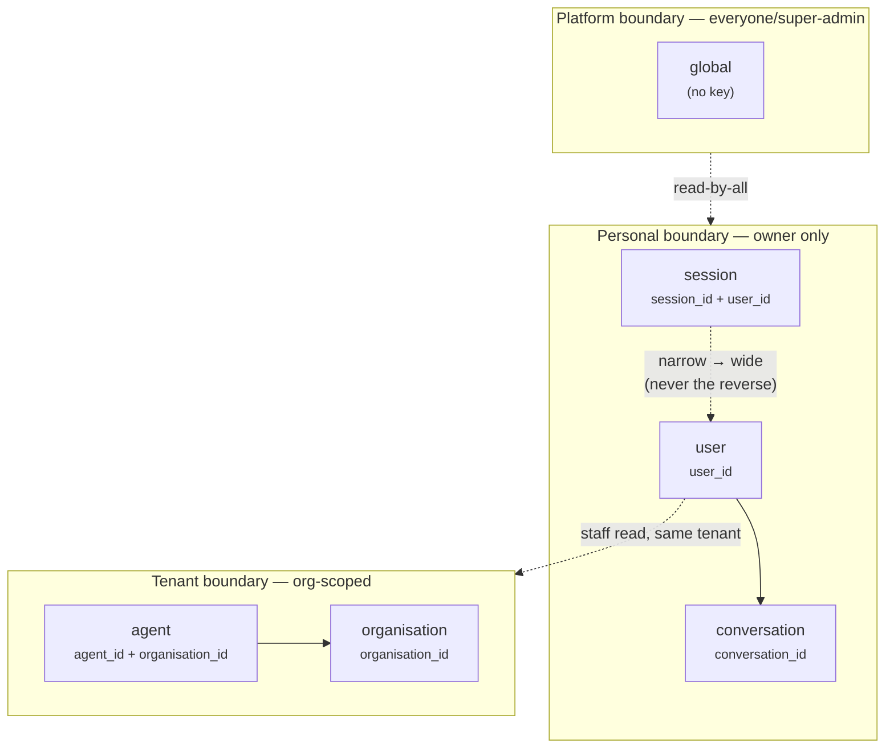

# 07 · Memory Architecture

> **Status:** Phase 2 — production-shaped design, no inference wired.
> **Scope of this document:** the persistent memory substrate for *Ask Juice Doctor AI*.
> **Primary sources:** [`db/migrations/0011_memory.sql`](../../db/migrations/0011_memory.sql), [`src/types/memory.ts`](../../src/types/memory.ts), [`src/services/memory.ts`](../../src/services/memory.ts).
> **Related:** [09 · AI Agents](./09-ai-agents.md), [10 · Conversations](./10-conversations.md), [03 · RBAC](./03-rbac.md), [02 · Multi-tenancy](./02-multi-tenancy.md).

---

## 1. The problem memory solves

An assistant is only as good as what it can remember, and *what it may remember* is not one thing — it is six things with six different lifetimes and six different blast radii. A throwaway scratchpad for a single browser session is not the same object as a durable clinical fact about a patient, and neither is the same as an organisation-wide policy that every practitioner in a clinic should share. Collapsing them into "one memory bag" is how health platforms leak data.

So the modelling question is not *"where do we store memory?"* but *"what are the security boundaries, and how do we keep them from bleeding into each other while still presenting one clean API to the retrieval layer?"*

This document answers that. The short version:

- **One table, `ai_memory`, with a `scope` discriminator and nullable scope-key columns** — not six tables.
- **A `CHECK` constraint** guarantees each row carries the key(s) its scope needs to be isolated.
- **Partial unique indexes per scope** give free, race-safe upsert semantics keyed the way each scope is actually addressed.
- **A discriminated `MemorySelector`** makes it *type-impossible* for a caller to address a scope with the wrong key.
- **One combined RLS policy set** whose predicate is an **OR across the six scopes**, so a row is visible/writable *iff* its own scope's rule is satisfied.

Everything below explains *why* each of those choices is the right one for a wellness platform holding sensitive health data.

---

## 2. The six scopes

Memory in this system is partitioned by **isolation scope** — the answer to "who is this memory *for*, and how long does it live?" Each scope is a distinct security boundary.

| Scope | Identifying key column(s) | Lifetime / intent | Who **reads** | Who **writes** |
|---|---|---|---|---|
| `session` | `session_id` (+ `user_id`) | Ephemeral scratchpad for one signed-in browser session | the owning user | the owning user |
| `user` | `user_id` | Durable per-user memory (preferences, standing facts) | the user; **org staff** (clinically/operationally justified, same tenant) | the user |
| `conversation` | `conversation_id` | Bound to a single chat thread (e.g. a running summary) | the owner of the parent conversation | the conversation owner |
| `agent` | `agent_id` (+ `organisation_id`) | An agent's own operating instructions / learned notes, per tenant | org **staff** (same tenant) | org **admins** (same tenant) |
| `organisation` | `organisation_id` | Tenant-wide shared knowledge | org **staff** (same tenant) | org **admins** (same tenant) |
| `global` | *(none — platform-wide)* | Truly platform-wide facts | **everyone** | **super-administrator** only |

A few deliberate asymmetries are worth calling out, because they encode the trust model:

- **`session` is keyed by `session_id` *and* `user_id`.** The session id alone is an opaque client token; pinning it to `user_id` means a session note can only ever be read back by *that* signed-in user, never by whoever happens to guess or replay a session identifier.
- **`user` memory has a read-widening for staff but not for writes.** A treating practitioner or support staffer in the *same tenant* may read a member's durable memory (they need context to help); they may **not** silently write into it. Writes stay with the owner. This mirrors the health-data posture used throughout the platform: staff can *see* to care, but the record's authorship belongs to the subject.
- **`agent` and `organisation` split read (staff) from write (admin).** Operating instructions and tenant knowledge are configuration; line staff consume them, admins curate them. This is the same read-vs-configure boundary the RBAC layer draws elsewhere.
- **`global` is read-by-all, written-by-super-admin.** It is the only scope where a plain `SELECT` predicate is unconditionally true — and it is intentionally the *only* place `using(true)` appears in the whole policy set.



The arrows are the *only* legitimate widening directions. Nothing narrows: an org fact never becomes readable by an arbitrary user, and a session note never widens to another session. RLS enforces that these arrows are one-way (see §7).

---

## 3. Why one table, not six

The instinct is to make six tables — `session_memory`, `user_memory`, and so on — one per scope. We deliberately did not. The single `ai_memory` table with a `scope` discriminator (mirrored in [`src/types/memory.ts`](../../src/types/memory.ts) as the `MemoryScope` union) wins on every axis that matters here.

**1. The retrieval layer stays uniform.** An assistant assembling context does not want six code paths, six ranking rules, six embedding-reference conventions, and six "is this expired?" checks. With one table there is **one query shape**, one `importance` model, one `expires_at` sweeper, one `kind='embedding_ref'` convention. The `memory` service ([`src/services/memory.ts`](../../src/services/memory.ts)) exposes exactly three methods — `list`, `read`, `write` — that work identically across all six scopes.

**2. Cross-scope retrieval is a single scan, not a six-way UNION.** When the agent needs "everything relevant to this turn" — a bit of session, a bit of user, the conversation summary, the agent's instructions, an org fact — that is one indexed pass over one table, ranked by `(scope, importance desc, created_at desc)`. Six tables would force a `UNION ALL` of six differently-shaped queries and hand-merged ranking.

**3. Adding a scope is an enum value, not a migration of table #7.** Scopes are *data*, consistent with how the rest of the platform treats agents, feature flags, and permissions as data rather than code. A seventh scope is a new `memory_scope` enum member, one `CHECK` branch, one partial index, and one RLS `OR` clause — no new table, no new service.

**4. Isolation does *not* require physical separation.** The usual argument *for* six tables is "keep tenants/users apart." But separation here is enforced by **RLS predicates keyed on scope-key columns**, not by table boundaries. Postgres RLS gives per-row least privilege inside one table just as strictly as a table boundary would — and it does so without fragmenting the schema. (This is the same defence-in-depth stance the platform takes everywhere: RBAC in the app *and* RLS in the DB, kept in lock-step.)

The cost we accept: rows carry nullable key columns that are irrelevant to their scope (a `global` row has five NULL keys). That is cheap — NULLs are one bit — and the `CHECK` constraint (§4) turns those nullable columns from a liability into an *enforced* invariant.

> **Rule of thumb.** Prefer one table + discriminator when the rows share a *retrieval contract* and differ only in *access rules*. Prefer separate tables when the rows have genuinely different shapes or lifecycles. Memory is the former.

---

## 4. The `CHECK` constraint — every scope carries its key

Nullable key columns are only safe if we *guarantee* that the right keys are present for each scope. A `session` row with a NULL `session_id` would be a row RLS literally cannot isolate. So the schema forbids it at write time:

```sql
constraint ai_memory_scope_key_present check (
  case scope
    when 'session'      then session_id is not null and user_id is not null
    when 'user'         then user_id is not null
    when 'conversation' then conversation_id is not null
    when 'agent'        then agent_id is not null and organisation_id is not null
    when 'organisation' then organisation_id is not null
    when 'global'       then true
  end
)
```

Two things make this constraint load-bearing rather than decorative:

- **It is the precondition RLS depends on.** Every RLS predicate isolates a row by comparing a scope key (e.g. `user_id = auth.uid()`). If that key could be NULL, the predicate would silently be `unknown`/false and the row would become *invisible* rather than *isolated* — or worse, in a poorly written policy, universally matched. The `CHECK` removes that whole class of failure by making "a row that RLS cannot correctly isolate" **unrepresentable**.
- **It documents the model in the schema itself.** The `CASE` reads exactly like the scope table in §2. A future engineer adding a scope cannot forget to declare its mandatory key — the constraint won't compile a row without it.

Note what the constraint does *not* do: it does not forbid *extra* keys being set (e.g. a `session` row also carrying `organisation_id`). That laxity is intentional and harmless — RLS isolates on the *required* keys, and the partial indexes (§5) address rows by exactly those keys. Over-constraining here would buy nothing and complicate legitimate denormalisation.

---

## 5. Partial unique indexes — upserts for free, per scope

Each scope is *addressed* differently, so each gets its own index, scoped with a `WHERE` clause so it only covers that scope's rows. Where a key naturally identifies a single logical memory, the index is `UNIQUE`, which hands us **race-safe upsert semantics** (`insert … on conflict … do update`) without any application-level locking.

```sql
-- unique per scope owner → free upsert
create unique index ai_memory_user_key_uq    on public.ai_memory (user_id, memory_key)        where scope = 'user';
create unique index ai_memory_session_key_uq on public.ai_memory (session_id, memory_key)     where scope = 'session';
create unique index ai_memory_agent_key_uq   on public.ai_memory (agent_id, memory_key)       where scope = 'agent';
create unique index ai_memory_org_key_uq      on public.ai_memory (organisation_id, memory_key) where scope = 'organisation';
create unique index ai_memory_global_key_uq  on public.ai_memory (memory_key)                 where scope = 'global';

-- conversation memory is a stream, not a keyed slot → non-unique, time-ordered
create index ai_memory_conversation_idx on public.ai_memory (conversation_id, created_at desc) where scope = 'conversation';

-- retrieval ranking + retention sweeper (all scopes)
create index ai_memory_importance_idx on public.ai_memory (scope, importance desc, created_at desc);
create index ai_memory_expiry_idx     on public.ai_memory (expires_at) where expires_at is not null;
```

Why these choices:

- **Partial indexes keep each scope's working set small.** A lookup for a user's memory never has to page past organisation or global rows; the index for `scope = 'user'` physically excludes them. This matters as the table grows into the long tail of ephemeral session rows.
- **`memory_key` is a namespaced retrieval key, unique *per scope owner*, not globally.** Two different users can both have `pref.units`; two agents can both have `instruction.tone`. Uniqueness is `(owner, memory_key)`, which is exactly what the composite partial unique indexes express. This is what lets the service treat a write as an upsert on `(selector, memoryKey)` — see the `write()` implementation in [`src/services/memory.ts`](../../src/services/memory.ts), which replaces an existing match rather than duplicating it.
- **`conversation` is a stream, so its index is non-unique and time-ordered** `(conversation_id, created_at desc)`. A conversation may accumulate many memories (rolling summaries, extracted facts); there is no single "slot" to upsert into, so we index for "give me this conversation's memory, newest first."
- **`global` is keyed by `memory_key` alone** — there is no owner, so the key *is* the identity.

---

## 6. The uniform `MemorySelector` API

The service surface is where "one table, six scopes" has to feel like *one clean thing* to callers — and where we get the compiler to prevent the entire class of "read the wrong scope with the wrong key" bugs.

### 6.1 A discriminated union makes wrong keys unrepresentable

```ts
// src/types/memory.ts
export type MemorySelector =
  | { scope: 'session'; sessionId: string; userId: string }
  | { scope: 'user'; userId: string }
  | { scope: 'conversation'; conversationId: string }
  | { scope: 'agent'; agentId: string; organisationId: string }
  | { scope: 'organisation'; organisationId: string }
  | { scope: 'global' };
```

Each arm carries **exactly the keys that scope requires** — the TypeScript mirror of the SQL `CHECK` constraint. Because it is discriminated on `scope`, a caller *cannot* write `{ scope: 'session', userId }` and omit `sessionId`, nor pass an `organisationId` to a `user` selector. The set of malformed selectors is not "validated and rejected" — it *does not typecheck*. The DB `CHECK` is the second line of the same defence; the type is the first.

This is the key ergonomic and safety win of the whole design: **the only way to address memory is through a selector that already knows which keys its scope needs.** Scope confusion — the root cause of most memory-leak bugs — is closed off at the boundary.

### 6.2 One API, three methods, every scope

```ts
// src/services/memory.ts  (server-only)
export const memory = {
  list(selector: MemorySelector): Promise<Result<MemoryRecord[]>>,
  read(selector: MemorySelector, memoryKey: string): Promise<Result<MemoryRecord | null>>,
  write(selector: MemorySelector, write: MemoryWrite): Promise<Result<MemoryRecord>>,
};
```

The service is `import 'server-only'` — memory never crosses to the client bundle. Internally, `keysFromSelector()` projects the discriminated selector down to the flat scope-key columns (`organisationId`, `userId`, `agentId`, `conversationId`, `sessionId`), filling exactly the ones the arm carries and leaving the rest `null`. Every method then operates through that projection, so the three methods are genuinely scope-agnostic — the scope only ever enters as data, never as a branch in the caller's code.

`write()` is an upsert: it locates an existing row matching the selector's keys **and** `memoryKey` and replaces it, otherwise inserts. That matches the partial unique indexes (§5) one-to-one, so the prototype's in-memory behaviour is identical to what `on conflict` will do against Postgres.

### 6.3 Prototype vs. production — the seam

Consistent with the platform's single data seam (`config.isPrototype`, off the non-public `APP_MODE`), the prototype `memory` service backs onto a **non-persistent in-memory array** purely to exercise the interface end-to-end. Production swaps the implementation to read/write the `ai_memory` table where **RLS does the isolation** — the selector-to-keys projection and the method contracts are unchanged. No caller of `memory.list/read/write` needs to know which mode it is in; that is the point of the seam.

> **Phase-2 boundary.** There is **no inference** here. `kind='embedding_ref'` rows are *pointers* to vectors, not vectors — the embeddings store and pgvector are deferred to Phase 3 ([12 · Knowledge](./12-knowledge.md)). Memory in Phase 2 is the *substrate and its access rules*, fully shaped and fully guarded, waiting for a model to be wired in.

---

## 7. How RLS isolates each scope

This is where clean scope separation is actually *enforced*. `ai_memory` has RLS enabled, and there is **one combined policy per command** (`SELECT`, `INSERT`, `UPDATE`, `DELETE`). Each policy's predicate is an **OR across the six scopes**: a row is visible/writable *iff* its own scope's specific rule holds. Sharing one table does not weaken isolation — every scope still answers to its own key.

### 7.1 The OR-per-scope shape (read policy)

```sql
create policy ai_memory_read on public.ai_memory
  for select using (
    (scope = 'user'
       and (user_id = auth.uid()
            or (organisation_id = app.current_org_id() and app.is_staff())))
    or (scope = 'session'
       and user_id = auth.uid())
    or (scope = 'conversation'
       and exists (
         select 1 from public.conversations c
         where c.id = ai_memory.conversation_id
           and c.user_id = auth.uid()))
    or (scope = 'agent'
       and organisation_id = app.current_org_id() and app.is_staff())
    or (scope = 'organisation'
       and organisation_id = app.current_org_id() and app.is_staff())
    or (scope = 'global')
    or app.is_super_admin()
  );
```

Read the shape carefully, because it is the crux of the whole design:

- **Each `OR` arm is gated by `scope = '…'`.** A `session` row can *only* be matched by the session arm; the other five arms are dead for it because their `scope = …` guard is false. So even though all rows live in one table, a row is judged by precisely one rule — its own. This is what makes "one table" as tight as "six tables."
- **The predicate keys on the scope's own column.** `session`/`user` on `user_id = auth.uid()`; `conversation` on an `EXISTS` against the parent thread's owner; `agent`/`organisation` on `organisation_id = app.current_org_id()`. These reuse the platform's `SECURITY DEFINER` helpers (`app.current_org_id()`, `app.is_staff()`, `app.is_admin()`, `app.is_super_admin()` — defined in [`0001_extensions_and_helpers.sql`](../../db/migrations/0001_extensions_and_helpers.sql)), so tenant and role logic is defined once and can't drift between tables.
- **`conversation` reaches through to the thread, not the memory row.** There is no `user_id` on a conversation-scoped memory row; ownership lives on `public.conversations`. The `EXISTS` subquery ties the memory to a conversation *the caller owns* — the same ownership rule 0010 puts on the conversation itself, so the two stay in lock-step.
- **`global` is the one unconditional read** (`scope = 'global'` with no further predicate). Deliberately the *only* place a blanket read appears.
- **`app.is_super_admin()` is a trailing escape hatch** on every command — a break-glass path for platform operators, isolated to a single named role at the top of the hierarchy.

### 7.2 Read vs. write authority differ by scope

Isolation is not just "who can see a row" but "who can create/modify it." The `INSERT`/`UPDATE`/`DELETE` policies keep the same OR-per-scope shape but tighten authority:

| Scope | Read | Insert / Update / Delete |
|---|---|---|
| `session` | owner | owner |
| `user` | owner **+ same-tenant staff** | **owner only** |
| `conversation` | conversation owner | conversation owner |
| `agent` | same-tenant **staff** | same-tenant **admin** |
| `organisation` | same-tenant **staff** | same-tenant **admin** |
| `global` | everyone | **super-admin only** |

The asymmetries are the trust model made executable: staff *read* a member's `user` memory to provide care but cannot author it; staff *consume* agent/org configuration but admins *curate* it.

### 7.3 Guarding the post-image on `UPDATE`

The `UPDATE` policy carries **both** a `USING` clause (gates the row as it exists) **and** a `WITH CHECK` clause (re-validates the row *after* the change), with identical per-scope predicates:

```sql
for update using ( … per-scope predicates … )
        with check ( … the same per-scope predicates … );
```

Without the `WITH CHECK`, a caller with write authority over, say, their own `user` row could **re-scope it** — flip `scope` to `organisation` and set an `organisation_id` — and thereby smuggle a row into a scope they don't control. The post-image check forbids the mutated row from landing in a scope the caller isn't authorised for. Re-scoping out from under RLS is exactly the kind of privilege-escalation a health platform cannot afford, so it is closed off explicitly. (`INSERT` uses `WITH CHECK` for the same reason — the new row's scope+keys must satisfy the caller's authority before it can exist.)

### 7.4 Append-vs-mutable note

Unlike the platform's append-only logs (`audit_logs`, `activity_logs`, `consultation_events`), `ai_memory` is intentionally **mutable** — memory is *state*, not an event stream, and upserts (§5) are the whole point. Provenance is instead captured on the row: `source` records where a memory came from (`'user'`, `'agent:<id>'`, `'ingest'`, …), and the `set_updated_at` trigger stamps every change. Where an audit trail of *how memory evolved* is needed, that belongs in the append-only log tables, not in overloading this one.

---

## 8. Why clean scope separation matters here specifically

This is a wellness platform. The failure modes are not abstract:

- **A session note must never leak.** Session memory is a throwaway scratchpad — half-formed intake answers, transient reasoning. Pinning it to `session_id + user_id` and gating reads on `user_id = auth.uid()` means it dies with the session and is never visible to anyone else, ever. No amount of guessing a `session_id` reaches it.
- **An org fact must never cross tenants.** `agent` and `organisation` memory is keyed on `organisation_id` and every read/write predicate is `organisation_id = app.current_org_id()`. Clinic A's operating notes are structurally invisible to Clinic B — the tenant boundary is the *same one* the whole multi-tenant schema uses ([02 · Multi-tenancy](./02-multi-tenancy.md)), not a bespoke rule that could rot.
- **Health data reads are care-justified, not open.** A member's durable `user` memory can be read by same-tenant staff (a practitioner needs context) but authored only by the member. That is the exact posture the platform's sensitive-health-data RLS takes elsewhere — owner + treating practitioner/staff + admin — applied to memory.
- **The two guarantees are enforced twice.** The `MemorySelector` type stops scope confusion at the application boundary; the RLS OR-per-scope predicates stop it at the database boundary. Neither alone is trusted. This is the platform's standing defence-in-depth rule — **RBAC in the app and RLS in the DB, kept in lock-step** — applied to the memory substrate.

Clean scope separation is therefore not a tidiness preference. It is the mechanism by which a single shared table can hold session scratchpads, patient facts, per-clinic knowledge, and platform-wide facts side by side and *still* prove that none of them leaks into the others.

---

## 9. File map

| Concern | File |
|---|---|
| Schema, `CHECK`, indexes, RLS | [`db/migrations/0011_memory.sql`](../../db/migrations/0011_memory.sql) |
| Row shape, `MemoryScope`, `MemoryKind`, `MemorySelector`, `MemoryWrite` | [`src/types/memory.ts`](../../src/types/memory.ts) |
| `memory.list / read / write`, selector→keys projection, prototype store | [`src/services/memory.ts`](../../src/services/memory.ts) |
| `Result<T>` / `ok()` service contract | [`src/services/result.ts`](../../src/services/result.ts) |
| RLS helper functions (`current_org_id`, `is_staff`, `is_admin`, `is_super_admin`) | [`db/migrations/0001_extensions_and_helpers.sql`](../../db/migrations/0001_extensions_and_helpers.sql) |
| Parent-thread ownership (`conversation` scope reaches through here) | [`db/migrations/0010_conversations.sql`](../../db/migrations/0010_conversations.sql) |
