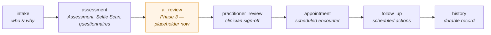
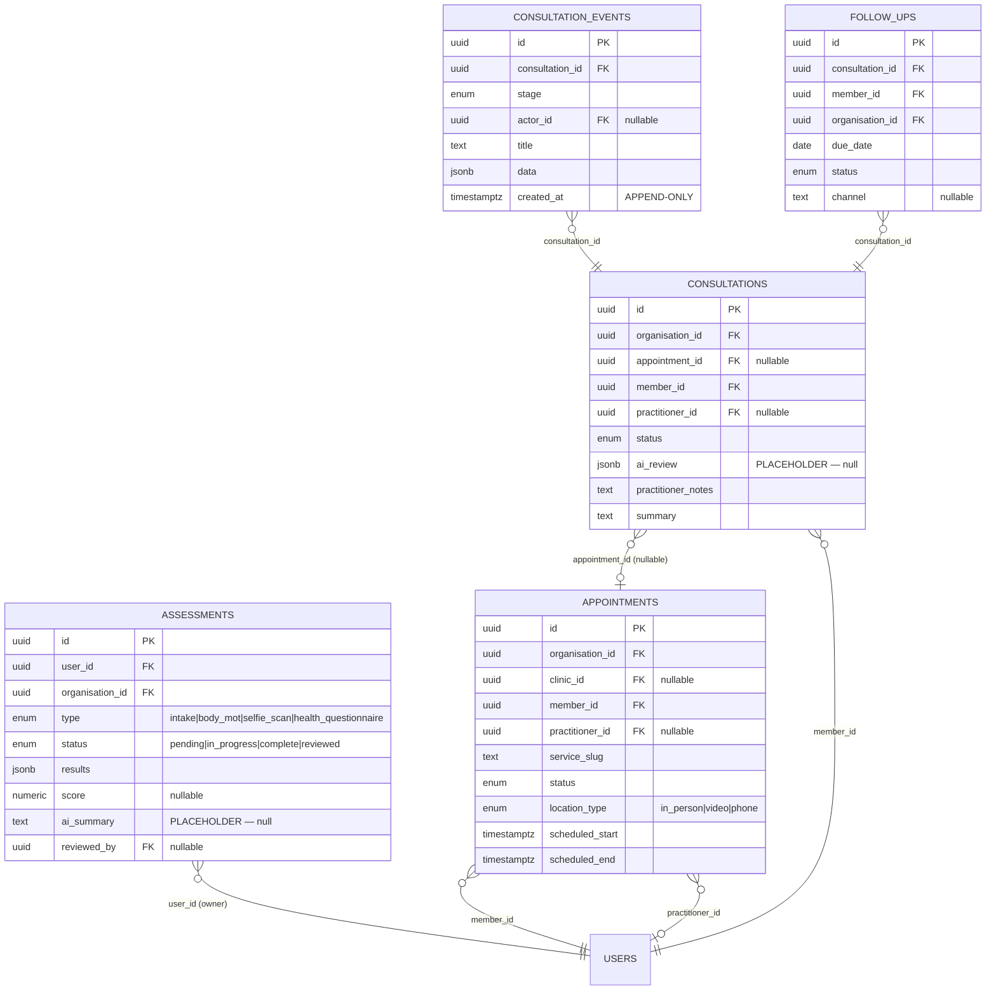

# 08 — Consultation workflow

> **Status: live.** Originally a Phase-2 design running on in-memory providers
> and unexecuted SQL, this workflow now runs on real rows: members book
> appointments, staff confirm/complete/cancel them from an admin queue, and
> consultations carry a real append-only event timeline plus practitioner notes
> and approve/request-changes actions — all on the applied `0007` schema. The
> AI-review fields (`ai_summary`, `ai_review`) are not yet produced by a live AI
> pass and remain empty on real records.

The consultation workflow is the clinical spine of the Ask Juice Doctor AI
platform — the journey a member takes from first data capture to a durable
health history. It is deliberately modelled as a **linear pipeline of stages**
plus an **append-only event timeline**, so that every surface (member dashboard,
practitioner console, future AI reviewer, admin reporting) advances and reads the
same journey the same way.

**Canonical sources:**

| Concern | File |
| --- | --- |
| Schema (tables, enums, RLS) | [`db/migrations/0007_consultation_workflow.sql`](../../db/migrations/0007_consultation_workflow.sql) |
| Domain types (records + stages) | [`src/types/consultation.ts`](../../src/types/consultation.ts) |
| Read layer + stage machine | [`src/services/consultations.ts`](../../src/services/consultations.ts) |
| Health/PHI inputs | [`db/migrations/0006_health_profiles.sql`](../../db/migrations/0006_health_profiles.sql) |
| Result / pagination shapes | [`src/services/result.ts`](../../src/services/result.ts) |

---

## 1. The pipeline

A consultation moves through seven ordered stages. The order is authoritative and
is declared exactly once, in `CONSULTATION_STAGES`
([`src/types/consultation.ts`](../../src/types/consultation.ts)) and mirrored by
the `public.consultation_stage` enum in migration 0007.



| Stage | What happens | Primary record(s) written |
| --- | --- | --- |
| `intake` | Member identifies themselves and states the reason for engaging | `assessments` (`type = intake`); a `consultations` row may be opened |
| `assessment` | Structured data capture — **Assessment**, **Remote Selfie Scan**, health questionnaires | `assessments` (`type = body_mot` / `selfie_scan` / `health_questionnaire`) |
| `ai_review` | *(Phase 3)* AI summarises + triages the captured assessments | `consultations.ai_review`, `assessments.ai_summary` — **placeholders, null now** |
| `practitioner_review` | A clinician reviews assessments + AI output and signs off | `consultations.practitioner_notes`; `assessments.reviewed_by`/`reviewed_at`; `status → reviewed` |
| `appointment` | A scheduled encounter (in person / video / phone) if one is warranted | `appointments` |
| `follow_up` | One or more scheduled follow-up actions across channels/dates | `follow_ups` |
| `history` | The completed, immutable record — read via the event timeline | `consultation_events` (the timeline itself is the history) |

Two things are worth stating up front, because they explain most of the modelling
decisions below:

- **The stages are a *timeline vocabulary*, not a status column.** They are the
  values recorded on `consultation_events.stage`, describing *what part of the
  journey an event belongs to*. The mutable lifecycle of the encounter itself is
  a **separate** enum, `consultation_status` (`scheduled → in_progress →
  awaiting_review → completed / cancelled`). Keeping "where are we in the
  journey" (stage, on the immutable log) distinct from "what state is this
  encounter in" (status, on the mutable row) is what lets the history stay
  append-only while the encounter record still updates in place.
- **Not every consultation touches every stage.** The pipeline is the *maximal*
  path. An async, AI-only review may skip `appointment` entirely (which is why
  `consultations.appointment_id` is nullable — see §4). The stage machine
  (§3) defines the canonical *forward order*; it does not force every journey to
  visit every stage.

---

## 2. The tables and their roles

Migration 0007 introduces five tables. The central design tension it resolves is:
**one generic capture container vs. many bespoke ones**, and **scheduling vs. the
clinical record**.



### `assessments` — the generic capture container

Every structured data-capture surface lands here, discriminated by `type`
(`intake`, `body_mot`, `selfie_scan`, `health_questionnaire`), with the
type-specific payload in `results jsonb`.

**Why one table, not one per capture type.** The platform will ship new scan and
assessment *products* over time (the Assessment and Remote Selfie Scan are only the
first two). A table-per-product schema would force a migration and a code change
for every new capture surface, and would force the AI layer and reporting to know
about each one individually. A single discriminated container means:

- new assessment types are **data** (`assessment_type` enum value + a shape in
  `results`), not a schema rewrite;
- the AI layer, the practitioner console and reporting can iterate **all**
  assessments for a member uniformly;
- `score` and `ai_summary` are promoted to **first-class nullable columns**
  because they are queried and filtered on frequently and *every* type produces
  them, while everything type-specific stays inside `results`.

`status` runs `pending → in_progress → complete → reviewed`: the member fills it
in (`pending`/`in_progress`), it becomes `complete`, then a practitioner signs it
off (`reviewed`, stamping `reviewed_by`/`reviewed_at`).

### `appointments` — the scheduling artefact

An appointment is a **slot in time**: a service (`service_slug`), a location kind
(`in_person` / `video` / `phone`), a `scheduled_start`/`scheduled_end` (with a
`check (scheduled_end > scheduled_start)` guard), an optional `clinic_id`, and an
optional assigned `practitioner_id`.

### `consultations` — the clinical encounter

A consultation is the **clinical encounter and its record**: `reason`,
`practitioner_notes`, `summary`, `started_at`/`ended_at`, and the future
`ai_review` payload. Its lifecycle is `consultation_status`.

**Why appointments and consultations are separate tables.** They answer different
questions and have different lifecycles:

- an **appointment** is a *scheduling* fact — it can be requested, confirmed,
  rescheduled, cancelled, or no-showed, all before any clinical content exists;
- a **consultation** is the *clinical* fact — the encounter, its notes, its
  outcome.

One appointment yields **at most one** consultation, but a consultation can exist
**without** an appointment (async reviews, AI-only passes). That asymmetry is why
the foreign key lives on the consultation as a **nullable** `appointment_id`
(`on delete set null`) rather than the other way around: the clinical record is
the durable thing and must survive its scheduling artefact being cancelled or
deleted.

### `consultation_events` — the append-only timeline

One immutable row per stage transition or notable action:
`consultation_id`, `stage`, `actor_id`, a human `title`, and a `data jsonb`
detail blob. This is the workflow's **source of truth for history** — see §6 for
why it is append-only.

### `follow_ups` — scheduled follow-up actions

A follow-up is its **own scheduled record** (a `due_date`, a `status`, a
`channel`, `notes`) rather than a flag on the consultation.

**Why a table, not a boolean.** A single consultation legitimately spawns
*several* follow-ups — "call in two weeks", "re-take the Selfie Scan in a month",
"email the summary document tomorrow" — each on its own channel and date, each
tracked independently to `completed`. A `needs_follow_up` flag could never
represent that fan-out.

---

## 3. The stage state machine

The forward order of the pipeline is encoded **once**, in `nextStage`
([`src/services/consultations.ts`](../../src/services/consultations.ts)):

```ts
/** The next stage in the linear pipeline, or null at the end. */
export function nextStage(stage: ConsultationStage): ConsultationStage | null {
  const idx = CONSULTATION_STAGES.indexOf(stage);
  if (idx < 0 || idx >= CONSULTATION_STAGES.length - 1) return null;
  return CONSULTATION_STAGES[idx + 1] ?? null;
}
```

**Why derive the transition from an ordered array instead of hard-coding a graph.**
The pipeline is strictly linear, so the "next stage" relation is fully determined
by position in `CONSULTATION_STAGES`. Deriving it means:

- there is **one** ordering to change if the pipeline evolves — reorder or extend
  the array and both the type union and the transition logic follow;
- `intake` and `history` need no special-casing: an unknown stage or the terminal
  stage both return `null`, which is exactly "no further forward step";
- the TypeScript union `ConsultationStage`, the SQL enum `consultation_stage`,
  and this array stay in lock-step by construction.

```mermaid
stateDiagram-v2
    direction LR
    [*] --> intake
    intake --> assessment : nextStage
    assessment --> ai_review : nextStage
    ai_review --> practitioner_review : nextStage
    practitioner_review --> appointment : nextStage
    appointment --> follow_up : nextStage
    follow_up --> history : nextStage
    history --> [*] : nextStage → null
```



The service object exposes the vocabulary and the transition together
(`consultations.stages`, `consultations.nextStage`) alongside the read getters, so
any surface advancing a consultation calls the *same* function rather than
re-implementing "what comes next". Advancing a stage is a **write**, and in the
production shape writes are Server Actions using the service role; `nextStage` is
the pure decision those actions consult.

> **Implementation note.** Live consultation reads and writes go through
> `src/services/repositories/consultations-repo.ts` (the applied `0007` tables),
> with booking and admin-queue mutations in `booking-actions.ts`,
> `appointment-admin-actions.ts` and `consultation-admin-actions.ts`. Nothing in
> the live app imports `src/services/consultations.ts` today: its `listForUser`
> getters are unused legacy stubs, and `nextStage` remains the documented
> canonical ordering while the repository carries its own equivalent
> `STAGE_ORDER` internally.

---

## 4. Assessment and Remote Selfie Scan as assessments

The Assessment and the Remote Selfie Scan are two of the platform's signature
experiences. Architecturally, **they are not special** — they are assessments.

- An Assessment run is an `assessments` row with `type = 'body_mot'`.
- A Remote Selfie Scan run is an `assessments` row with `type = 'selfie_scan'`.
- The scan/assessment output (metrics, readings, derived indicators) is written to
  `results jsonb`; any headline number lands in `score`; a future AI narrative
  lands in `ai_summary`.

**Why route them through the generic container.** Treating both as `assessments`
means they inherit — for free — everything the container already provides:

- **uniform ingestion into the AI layer** — the future `ai_review` stage iterates
  a member's assessments without needing an Assessment-specific or Selfie-Scan-specific
  code path;
- **the same review lifecycle** — a practitioner reviews a Selfie Scan exactly as
  they review a questionnaire (`status → reviewed`, `reviewed_by`/`reviewed_at`);
- **the same RLS posture** — the member owns the row, staff/practitioners
  in the organisation can read it, admins manage it (§5);
- **the same reporting** — dashboards count and trend across all assessment types
  at once.

When an Assessment or Selfie Scan is captured during a consultation, a
`consultation_events` row is appended at `stage = 'assessment'` referencing that
assessment in its `data` blob, so the encounter's timeline records *that a scan
happened* without duplicating the scan payload.

> **Relationship to the health domain (0006).** Highly sensitive standing
> PHI — conditions, medications, allergies, medical questionnaires — lives in the
> dedicated health tables of migration 0006 under the strictest RLS in the
> codebase. `assessments` holds the *point-in-time capture events* of the
> consultation journey (this MOT, this scan, this intake). The two are
> complementary: 0006 is the member's standing health profile; 0007's
> `assessments` are the journey's snapshots that feed a specific consultation.

---

## 5. Where the AI review slots in (placeholders)

The `ai_review` stage sits deliberately **between** `assessment` and
`practitioner_review`: the AI reads what was captured, produces a first-pass
summary/triage, and hands a clinician a head-start rather than a blank page.
This automated review pass is **not yet implemented** — live AI runs elsewhere
on the platform (receptionist assessment, specialist replies), but no model
populates these fields yet; on real records they remain empty:

| Placeholder | Location | Phase-2 value | Phase-3 role |
| --- | --- | --- | --- |
| `assessments.ai_summary` (`text`) | `assessments` table / `Assessment.aiSummary` | `null` | AI-generated summary of a single assessment |
| `consultations.ai_review` (`jsonb`) | `consultations` table / `Consultation.aiReview` | `null` | Structured AI review payload for the encounter (triage, flags, suggested next steps) |
| `awaiting_review` | `consultation_status` enum | reachable state | The encounter status *after* an AI pass, *before* a clinician signs off |
| `ai_review` | `consultation_stage` enum | timeline vocabulary | The stage a future AI-review event is recorded under |

**Why the placeholders are first-class columns now rather than added later.** They
are declared in the schema, the enums, and the TypeScript types today so that
Phase 3 is a *fill-in*, not a *migration + refactor*. The stage, the encounter
status, the storage columns, and the RLS that governs who can write them all
already exist; turning on AI means writing to fields that are already there and
already governed. Nothing downstream — a member's history view, a practitioner's
queue, the admin metrics — needs to change shape when `ai_summary` stops being
`null`.

The clinician always remains in the loop: `ai_review` **precedes**
`practitioner_review`, and only `practitioner_review` marks an assessment
`reviewed` / signs off the consultation. The AI advises; the practitioner decides.

---

## 6. Why the event timeline is append-only

`consultation_events` has **no `UPDATE` and no `DELETE` policy** — by design, and
by the same convention used for `audit_logs`, `activity_logs`, `auth_events`,
`user_consents`, and `knowledge_workflow_events` across the platform (see
[`db/README.md`](../../db/README.md) and
[`04-rls-security-model.md`](04-rls-security-model.md)). Every stage transition
and notable action **inserts one immutable row**; nothing is ever mutated or
removed.

This is not incidental — for a health workflow it is load-bearing:

1. **Clinical/legal integrity.** The record of *what happened, when, and who did
   it* (`stage`, `created_at`, `actor_id`) must be tamper-evident. If history could
   be edited, the record of care could be silently rewritten. Immutability makes
   the timeline **auditable and defensible**.
2. **The mutable record stays clean.** Because the journey is captured in the log,
   the `consultations` row does not need to accumulate a state-change history — it
   holds only the *current* clinical content (notes, summary, status). Journey
   history and current state are separated: the log grows, the record stays
   coherent.
3. **Replayable, reconstructable history.** The `history` stage is not a separate
   store — it is simply *reading the append-only events back*. The full journey can
   be reconstructed and replayed at any time by ordering events on `created_at`.
   This is what powers a member's history view and a practitioner's audit trail
   from the same rows.
4. **Concurrency without contention.** Independent actors (member, practitioner,
   future AI reviewer) each *append* their own events. Nobody edits a shared
   mutable log row, so there is no lost-update or write-contention hazard on the
   timeline.

**How immutability is enforced (defence in depth).** It is not a convention you
have to remember to honour — the database refuses to break it, and the app agrees:

- **In the DB:** RLS grants `SELECT` (to the owning member, the assigned
  practitioner, org staff, or a super administrator) and a tightly-scoped
  `INSERT` (staff/practitioner within the consultation's organisation, and the
  recorded `actor_id` must be the caller). There is **deliberately no `UPDATE` or
  `DELETE` policy**, so with RLS enabled those operations are denied to everyone
  short of the service role — the log is physically immutable to ordinary
  callers.
- **In the app:** appends happen through server-side writes (Server Actions on the
  service role), mirroring the RBAC rules — the same defence-in-depth posture the
  rest of the platform uses (RBAC in the app *and* RLS in the DB, kept in
  lock-step).

---

## 7. Tenancy and access, at a glance

Every table in 0007 carries `organisation_id`, so the whole workflow is
multi-tenant *as data*, not as a future rewrite (see
[`02-authorization-rbac.md`](02-authorization-rbac.md) and the tenancy model in
migration 0002). Member-owned rows also carry the member's `auth.users` id
(`user_id` / `member_id` / `created_by`) so members read their own data via RLS.
The `app.*` `SECURITY DEFINER` helpers do the heavy lifting in policies
(`app.current_org_id()`, `app.is_staff()`, `app.is_admin()`,
`app.is_super_admin()`).

| Table | Member | Assigned practitioner | Org staff | Org admin | Super admin |
| --- | --- | --- | --- | --- | --- |
| `assessments` | read own; create/update own | read (org) | read + create + update (org) | + delete (org) | read all |
| `appointments` | read own; request own; update while `requested` | read own assigned | read + create + update (org) | + delete (org) | read all |
| `consultations` | read own | read + update own assigned | read + create + update (org) | + delete (org) | read all |
| `consultation_events` | read (own consultation) | read (own consultation) | read + **insert only** (org) | — | read all |
| `follow_ups` | read own; update own | — (via staff) | read + create + update (org) | + delete (org) | read all |

The pattern is consistent across the domain: **members own their journey, treating
clinicians and org staff operate within their organisation, admins manage,
super-administrators observe across the platform — and the timeline is append-only
for everyone.**

---

## 8. Pre-production → production seam (exercised)

Phase 2 authored the design without hooking anything up: the **schema** (0007)
in full with RLS, the **types** (`src/types/consultation.ts`), the **stage
machine** (`nextStage`), and a read layer returning typed, paginated empty
results.

That seam has since been exercised: the schema is applied to the live database,
and the live data path goes through the repository layer —
`repositories/consultations-repo.ts` for reads, with `booking-actions.ts`,
`appointment-admin-actions.ts` and `consultation-admin-actions.ts` writing real
rows and appending real `consultation_events`. **Callers did not change** —
exactly as designed. The `ai_review` / `ai_summary` placeholders await the
automated AI-review pass (§5).

---

### See also

- [`03-database.md`](03-database.md) — schema conventions and the ERD
- [`04-rls-security-model.md`](04-rls-security-model.md) — the RLS model and the append-only log pattern
- [`05-ai-agent-framework.md`](05-ai-agent-framework.md) — the agents that will drive `ai_review`
- [`07-memory-architecture.md`](07-memory-architecture.md) — the memory scopes an AI reviewer reads/writes
