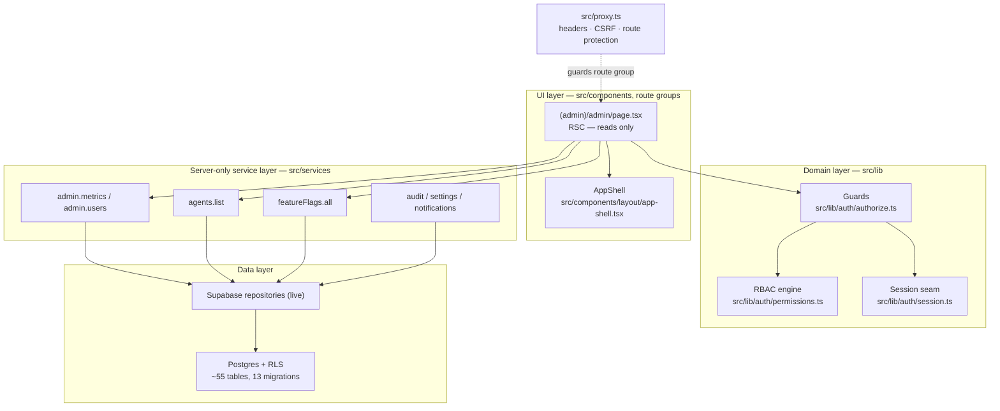
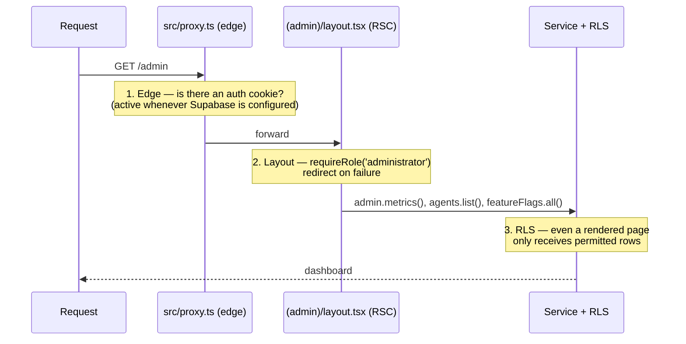
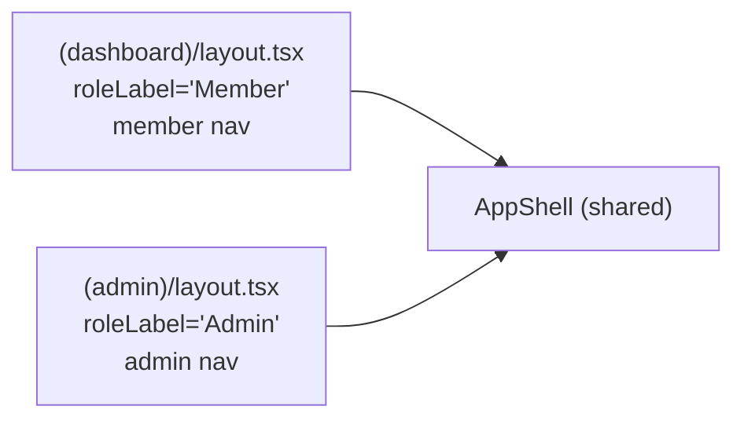

# 09 — Admin foundation

> **Phase 2, architecture only (historical).** The administration layer was built as a *production-shaped foundation*: the route group, the shell, the RBAC gates, and the read paths through the service framework all existed and ran — but the surfaces were **read-oriented and non-destructive by design**. At that point there was no live data, no auth cookie, and no business logic that mutated records. The point of the phase was to prove that the *shape* is correct, so that later phases could fill in behaviour without moving any walls.

> **Update (2026-08-10) — current status.** The platform has since gone live on this foundation. Today the `(admin)` group is gated by **real Supabase Auth** (`requireRole('administrator')` in `(admin)/layout.tsx`; edge protection in `src/proxy.ts` is active whenever Supabase is configured, redirecting unauthenticated requests to `/login`), the services read and **write real Supabase Postgres data** (users, AI agents/prompts, knowledge, feature flags, bookings/consultations, CRM, subscriptions, support), and privileged admin mutations record to an append-only `audit_logs` trail via `src/services/repositories/audit-repo.ts`. Present-tense statements below about mocks, canned personas, bypassed gates and absent write paths describe the **Phase-2 state**, not today's system; the canned admin persona survives only as a local-dev fallback when Supabase is not configured.

This document explains **how the admin area is assembled**, **why it is structured the way it is**, and **what each management surface will be gated on** when it becomes interactive. It is the operator-facing counterpart to the member-facing dashboard: same shell, same service framework, higher-privilege reads.

---

## 1. Where the admin area sits in the architecture

The admin area is the highest-privilege consumer of the same three-layer stack every other surface uses. Nothing about it is a special case — it is *the same seams, reached with a higher role*.



Three properties fall out of this placement, and they are the whole thesis of the admin foundation:

1. **The admin area cannot see anything the service layer will not hand it.** Admin pages are React Server Components that `await` service getters. They never touch a database client directly, never hold a connection string. The Phase-2 swap from typed mocks to Supabase happened entirely below them, in the server-only service/repository layer — the pages did not change.
2. **Privilege is enforced in two independent places.** The app-level guard (`src/lib/auth`) decides whether the page renders; RLS decides whether the row is returned. Even a bug that renders the wrong page cannot leak a row the database refuses to release. See [`04-rls-security-model.md`](04-rls-security-model.md).
3. **Every management surface is a *view over a service over a table*.** There is no admin-only data model. "User management" is `admin.users` → `profiles`; "audit logs" is `audit.list` → `audit_logs`. This keeps the admin area honest — it is a lens, not a back door.

---

## 2. The `(admin)` route group

The admin area is an App Router **route group** — `src/app/(admin)/` — so it gets its own layout and URL protection without leaking the `(admin)` segment into the URL (`/admin`, not `/(admin)/admin`).

| File | Role |
| --- | --- |
| `src/app/(admin)/layout.tsx` | Establishes the session, wraps children in `AppShell` with the admin navigation, and is where the production role gate lives. |
| `src/app/(admin)/admin/page.tsx` | The admin dashboard — an RSC that reads through `admin.metrics`, `agents.list`, and `featureFlags.all`. |

### 2.1 The layout is the gate

The layout is the single choke point for the whole group. In Phase 2 it resolved a canned administrator persona; today it is a **hard role gate** on the deployed platform. The code enforces the real guard whenever Supabase is configured, falling back to the canned persona only for keyless local development:

```ts
// src/app/(admin)/layout.tsx (current)
export default async function AdminLayout({ children }: { children: React.ReactNode }) {
  // Real RBAC on the deployed platform; canned persona only without Supabase keys.
  const session = isSupabaseConfigured()
    ? await requireRole('administrator', '/admin')
    : await getSession('administrator');
  const userName = session?.user.name ?? 'Admin';
  return <AppShell roleLabel="Admin" userName={userName} navVariant="admin">{children}</AppShell>;
}
```

**Why a layout gate and not a per-page check?** A route-group layout wraps *every* page in the group and runs on the server before any child renders. Gating here means a new admin page added tomorrow is protected the moment it exists — you cannot forget to add the guard, because the guard is structural, not per-file. `requireRole('administrator')` (from `src/lib/auth/authorize.ts`) redirects on failure, so an under-privileged user never sees admin chrome at all.

### 2.2 Defence in depth: three layers protect `/admin`

The route group is protected at three ranks, each of which is sufficient on its own — this is deliberate redundancy, not belt-and-braces waste:



- **Edge (`src/proxy.ts`)** — the `PROTECTED_PREFIXES = ['/dashboard', '/admin']` block redirects unauthenticated requests to `/login` *before the page runs*, reading the Supabase auth cookie. This protection is **active on the deployed platform** (whenever Supabase is configured); it degrades to open only in local development without Supabase keys.
- **Layout (`requireRole`)** — the app-level RBAC decision.
- **Data (RLS)** — the database's own decision, independent of the app.

**Why degrade to open without Supabase?** With no Supabase keys there is no auth cookie to read; forcing a login redirect would make keyless local development unusable. On the deployed platform the guard is live — this is exactly the production code path Phase 2 put in place.

---

## 3. The `AppShell` — one shell, two personas

Both the member `(dashboard)` group and the `(admin)` group render through the **same** `AppShell` (`src/components/layout/app-shell.tsx`). The shell takes a `roleLabel`, a `userName`, and a `nav: ShellNavItem[]`, and renders a sidebar + top bar around `children`.



**Why share the shell rather than build a bespoke admin frame?** Three reasons, each a maintenance win:

- **Visual and behavioural consistency** — operators and members get the same interaction model, spacing, and focus/keyboard behaviour, for free, from one component.
- **The navigation is *data*, not markup.** Each layout passes its own `ShellNavItem[]`. Adding an admin surface is adding a row to an array — the same pattern the whole codebase uses for routes (`src/config/routes.ts`), permissions (`src/config/permissions.ts`), and flags (`src/config/feature-flags.ts`). This is the "everything privileged is a registry" principle applied to navigation.
- **The shell holds no data logic.** It receives already-resolved props (`userName`, `nav`) from a server layout. It never fetches, never checks permissions itself — it is a pure presentational frame. Authorisation stays in the layer that owns it.

In Phase 2 the admin `nav` listed the operator surfaces (Overview, Customers, Bookings, Content, Media, Messages) with every entry pointing at `/admin`, because the sub-pages were not yet built — the navigation demonstrated the information architecture. Those destinations have since become real pages (agents, prompts, knowledge, CRM, receptionist, specialists, bookings, config, audit, …), each gated as designed; the nav config now lives in `src/components/layout/sidebar-nav.tsx`.

---

## 4. How the dashboard reads through the service framework

The admin dashboard (`src/app/(admin)/admin/page.tsx`) is the reference implementation of "an operator surface reads through the service layer." It is worth reading closely because every future admin page is a variation of it.

```ts
// src/app/(admin)/admin/page.tsx — the read path
const [metricsResult, agentsResult, flags] = await Promise.all([
  admin.metrics(),        // src/services/admin.ts
  agents.list(),          // src/services/agents.ts
  featureFlags.all(),     // src/services/feature-flags.ts
]);
const metrics = metricsResult.ok ? metricsResult.data : { activeClients: 0, /* … */ };
const agentList = agentsResult.ok ? agentsResult.data : [];
```

Several deliberate architectural choices are on display here:

- **Parallel reads.** The three services are independent, so they are awaited together with `Promise.all`. The page pays one round-trip's latency, not three.
- **`Result<T>` at every boundary.** `admin.metrics()` and `agents.list()` return the discriminated `Result<T>` union (`src/services/result.ts`), so the page must *destructure success from failure* and supply a safe fallback (`{ activeClients: 0, … }`, `[]`). In Phase 2 the mock always succeeded; today the same call sites absorb real query failures — nothing was retrofitted. `featureFlags.all()` returns a plain array because flag resolution has no failure mode (it always resolves to a default).
- **RSC, so `server-only` services are importable directly.** Every service module starts with `import 'server-only'`. Because the page is a Server Component, it can import them and the Supabase client (in production) can never be tree-shaken into a browser bundle.
- **The page renders *whatever the services return*.** It has no knowledge of whether the numbers came from a seed constant (Phase 2) or a live `count(*)` (today). That ignorance is the seam working.

### 4.1 The three framework reads, and why each is on the dashboard

| Read | Service (file) | Backing table (prod) | What it proves |
| --- | --- | --- | --- |
| `admin.metrics()` | `src/services/admin.ts` | aggregates over `profiles`, `appointments`, `notifications`, knowledge/content | The metrics tiles are *service-driven*, so real aggregates drop in with no UI change. |
| `agents.list()` | `src/services/agents.ts` → `src/config/ai-agents.ts` | `ai_agents` (migration 0009) | **Agents are data.** The dashboard lists agents (name, role, `visibility`, `status`) read from a registry; in production the identical call reads the table, so the client creates/edits agents from the admin UI with no code change. See [`05-ai-agent-framework.md`](05-ai-agent-framework.md). |
| `featureFlags.all()` | `src/services/feature-flags.ts` → `src/config/feature-flags.ts` | `feature_flags` + `feature_flag_overrides` (migration 0013) | The flag registry is real and targeting-aware; the admin surface is the operator's control panel for staged rollout of Phase-3 capabilities. |

In Phase 2 the dashboard's "Recent bookings" table was intentionally hard-coded sample data, marking *where* a service read would slot in. That placeholder is gone: the admin dashboard (now the AI Business Dashboard) reads live data through `business`, `receptionist`, `specialists` and `crm` services, and the booking/consultation queue reads real `appointments`/`consultations` rows ([`08-consultation-workflow.md`](08-consultation-workflow.md)).

### 4.2 Reads are getters; writes will be Server Actions

The whole admin foundation obeys the codebase's read/write split:

- **Reads** are plain async getters on service objects (`admin.metrics`, `agents.list`, `knowledge.documents.list`, `audit.list`). They are the only thing this phase exercises.
- **Writes** are **Server Actions** (`'use server'`, the pattern in `src/services/actions.ts`), each fronted by a role/permission assertion. In Phase 2 the admin write path was deliberately absent and the legacy `audit.record` shim in `src/services/platform.ts` was a no-op; today admin write actions are real (agents, prompts, knowledge, CRM, bookings, receptionist settings, …) and privileged mutations record append-only `audit_logs` rows through `auditRepo.log` (`src/services/repositories/audit-repo.ts`) under the service role.

This was the **"architecture only, no destructive business logic yet"** principle of Phase 2 in concrete terms: the shape of every mutation (guard → validate → mutate → audit) was designed first, then filled in with real behaviour in later phases without moving the seams.

---

## 5. RBAC gating — how each surface is authorised

The admin area does not invent its own access rules. It consumes the platform RBAC described in [`02-authorization-rbac.md`](02-authorization-rbac.md):

- **Roles** (`src/lib/auth/roles.ts`): a linear, cumulative hierarchy — `guest(0) < member(1) < practitioner(2) < staff(3) < administrator(4) < super_administrator(5)`. A higher rank satisfies any lower-rank requirement.
- **Permission catalogue** (`src/config/permissions.ts`): fine-grained `resource.action` keys, mapped to the roles that hold them via `ROLE_BASE_PERMISSIONS`. `super_administrator` holds every permission implicitly (a wildcard), so a newly-added permission is auto-granted to it.
- **Engine** (`src/lib/auth/permissions.ts`): computes the effective, cumulative permission set per role; `hasPermission(ctx, key)` applies **deny-wins** user overrides.
- **Guards** (`src/lib/auth/authorize.ts`): `requirePermission` (redirect, for pages) / `assertPermission` (throw, for actions) / `can` (boolean, for conditional UI).
- **DB mirror**: `permissions` / `role_permissions` / `user_permission_overrides` (migration 0003); RLS calls `app.has_permission()`. The app catalogue is the source the DB tables are seeded from, keeping the two **in lock-step**.

### 5.1 The gating pattern each admin surface follows

Every admin surface, once interactive, is gated the same way — the layout enforces the coarse role, and each page/section enforces its *specific* permission:

```ts
// A future admin surface, e.g. src/app/(admin)/admin/users/page.tsx
export default async function AdminUsersPage() {
  await requirePermission('users.read');           // page-level gate → redirect on deny
  const { ok, data } = await admin.users.list();    // service read (behind RLS in prod)
  // …render read-only table…
  // A "Deactivate" control renders only if `await can('users.delete')`
  // and its Server Action calls `await assertPermission('users.delete')` first.
}
```

Two levels of granularity, each doing a distinct job:

- **Role at the layout** (`requireRole('administrator')`) — coarse: *should this person be in the admin area at all?*
- **Permission at the surface** (`requirePermission('users.read')`, `requirePermission('audit.read')`, …) — fine: *may this admin see/do this specific thing?* This matters because the catalogue is not a flat "admin can do everything." A `staff` user (rank 3) can reach some operator surfaces (they hold `analytics.read`, `activity.read`, `settings.read`, `feature_flags.read`, `programmes.manage`, …) but **not** `users.delete`, `audit.read`, or `roles.assign`, which are `administrator`-and-above. Gating per surface encodes exactly that.

### 5.2 Sensitive actions are marked in the catalogue

Permissions flagged `sensitive: true` (`users.delete`, `users.impersonate`, `roles.assign`, `permissions.manage`, `audit.read`, `settings.manage`, `payments.refund`, `agents.configure`, `ai.config.manage`, `health.*`, …) are the ones that warrant elevated confirmation / MFA and always leave an audit trail. The catalogue records the *intent* (the flag on the permission); step-up confirmation / MFA enforcement is not yet wired — shape now, behaviour later.

---

## 6. Admin surfaces → permission → backing table/service

The management surfaces the admin foundation was designed to host. **Backing** names the service getter and the production table it reads. **State** is a **Phase-2 snapshot** (*live* = wired on the dashboard then; *scaffold* = getter existed, page to come; *planned* = designed at the data/permission layer only). Most "scaffold"/"planned" rows have since shipped as real pages reading and writing live Supabase data — payments remain manual subscription records (no payment provider), and organisations/roles surfaces are still not built.

| Surface | URL (target) | Required permission | Backing service (`src/services`) | Backing table(s) / migration | State |
| --- | --- | --- | --- | --- | --- |
| **Dashboard / metrics** | `/admin` | `analytics.read` (page); layout `requireRole('administrator')` | `admin.metrics()` | aggregates over `profiles`, `appointments`, `notifications` | **live** |
| **User management** | `/admin/users` | `users.read` (view) · `users.create` · `users.update` · `users.delete` 🔒 | `admin.users.list()` / `admin.users.count()` | `profiles` (0003) | scaffold |
| **Staff / team** | `/admin/staff` | `users.read` (filtered to staff roles) | `admin.users.list()` (role filter) | `profiles` + `organisation_memberships` (0002/0003) | scaffold |
| **Roles & permissions** | `/admin/roles` | `roles.read` (view) · `roles.assign` 🔒 · `permissions.manage` 🔒 | RBAC config (read); assignment via Server Action | `role_permissions`, `user_permission_overrides` (0003) | planned |
| **AI agents** | `/admin/agents` | `agents.read` (view) · `agents.create` · `agents.update` · `agents.configure` 🔒 | `agents.list()` / `agents.bySlug()` | `ai_agents` + versions/tools/sources (0009) | **live** (list on dashboard) |
| **Knowledge base** | `/admin/knowledge` | `knowledge.read` (view) · `knowledge.create` · `knowledge.edit` · `knowledge.approve` · `knowledge.publish` · `knowledge.delete` 🔒 | `knowledge.documents.list()` / `knowledge.categories.list()` | `knowledge_documents`, `_versions`, `_workflow_events` (0012) | scaffold |
| **Programmes / content** | `/admin/programmes` | `programmes.read` · `programmes.manage` · `programmes.publish` | `programmes.list()` (`src/services/index.ts`) | `programmes` (0008) | scaffold |
| **Consultations / bookings** | `/admin/bookings` | `appointments.read` · `appointments.manage` · `consultations.read` | `consultations.appointments.listForUser()` / `.records` | `appointments`, `consultations`, `consultation_events` (0007) | planned |
| **System settings** | `/admin/settings` | `settings.read` (view) · `settings.manage` 🔒 | `settings.all()` / `settings.get()` | `system_settings` (0013) | scaffold |
| **Feature flags** | `/admin/feature-flags` | `feature_flags.read` (view) · `feature_flags.manage` (toggle) | `featureFlags.all()` / `featureFlags.isEnabled()` | `feature_flags` + `feature_flag_overrides` (0013) | **live** (list on dashboard) |
| **Audit logs** | `/admin/audit` | `audit.read` 🔒 | `audit.list()` | `audit_logs` — append-only (0013) | scaffold |
| **Activity logs** | `/admin/activity` | `activity.read` | *(activity getter — 0013)* | `activity_logs` — append-only (0013) | planned |
| **Analytics** | `/admin/analytics` | `analytics.read` | `admin.metrics()` (extended) | aggregate views (placeholder) | planned |
| **Notifications** | `/admin/notifications` | `notifications.send` | `notifications.listForUser()` / `.unreadCount()` | `notifications` (0013) | planned |
| **Memory (agent/org)** | `/admin/memory` | `memory.read` (view) · `memory.manage` 🔒 | `memory.list()` | `ai_memory` (0011) | planned |
| **Conversations (moderation)** | `/admin/conversations` | `conversations.read.all` 🔒 | *(conversations getter — 0010)* | `conversations`, `messages` (0010) | planned |
| **Commerce (payments)** | `/admin/payments` | `payments.read` 🔒 · `payments.refund` 🔒 | *(commerce getter — 0008)* | `payments`, `subscriptions`, `invoices` (0008) | planned |
| **Organisations (platform)** | `/admin/organisations` | `organisations.manage` 🔒 (super_administrator) | *(tenancy getter — 0002)* | `organisations`, `clinics` (0002) | planned |

🔒 = `sensitive: true` in the catalogue (elevated confirmation / MFA + mandatory audit in production).

> **Read the table as a contract, not a checklist.** Each row fixes three things now — the *permission* that authorises the surface, the *service getter* that feeds it, and the *table* it maps to — so building the surface in Phase 3 is filling in a UI against a settled shape, never negotiating access rules or inventing storage.

---

## 7. The governing principle: architecture only, no destructive business logic

*Historical — this section records the Phase-2 constraint. The write paths, real auth and live data described as absent below have since been built (see the status note at the top).*

This is the constraint that defined Phase 2 for the admin area, stated plainly and then justified.

**What existed:**

- The `(admin)` route group, its layout, and the shared `AppShell` — the complete operator frame.
- The dashboard reading live through `admin.metrics`, `agents.list`, and `featureFlags.all`.
- The full RBAC catalogue and guards that *will* gate every surface, plus the DB mirror + RLS that enforces them independently.
- The service getters and backing tables for every surface in §6.
- The audit recorder (`audit.record`) as a wired no-op, and the Server Action pattern (`src/services/actions.ts`) ready to host writes.

**What deliberately did not exist in Phase 2:**

- No admin action creates, updates, or deletes a real record. There is no "delete user," no "assign role," no "publish document" that persists anything.
- No live data — every read returns typed seed/mock data (`admin.users` → four seed profiles, `knowledge.documents` → empty, `audit.list` → empty).
- No real auth — the layout resolves a canned administrator; the edge gate is bypassed while `isPrototype`.

**Why hold the line here?** Three reasons:

1. **Safety of a demonstration artifact.** This is a prototype shown to stakeholders. A destructive admin action against real infrastructure is a category of risk a demo should not carry. By making the write path *structurally absent* (not merely disabled by a flag), there is nothing to accidentally trigger.
2. **The expensive decisions are the shapes, not the handlers.** Getting the role hierarchy, the permission catalogue, the RLS mirror, the service seams, and the surface→permission→table mapping right is the hard, load-bearing work. A Server Action body that inserts a row is comparatively trivial *once the guard, the validation schema, the audit call, and the RLS policy it must satisfy are all already designed.* Phase 2 front-loads exactly the parts that are expensive to change later.
3. **Going live is additive, not a rewrite.** Every "planned"/"scaffold" surface becomes real by (a) writing the page against the existing getter, (b) adding write Server Actions behind `assertPermission`, and (c) switching `APP_MODE` to route the services at Supabase. No layout moves, no permission is renamed, no table is redesigned. That is the whole payoff of building the foundation first.

---

## 8. Related documents

- [`00-overview.md`](00-overview.md) — the layering and the prototype→production seam.
- [`01-authentication.md`](01-authentication.md) — sessions, the edge proxy, protected route groups.
- [`02-authorization-rbac.md`](02-authorization-rbac.md) — the permission catalogue and guards the admin surfaces consume.
- [`04-rls-security-model.md`](04-rls-security-model.md) — the second, independent enforcement layer behind every admin read.
- [`05-ai-agent-framework.md`](05-ai-agent-framework.md) — why `agents.list` on the dashboard means agents are data.
- [`06-knowledge-architecture.md`](06-knowledge-architecture.md) — the publishing workflow behind the knowledge surface.
- [`db/README.md`](../../db/README.md) — the ~55-table schema and full ERD that the admin surfaces map onto.
