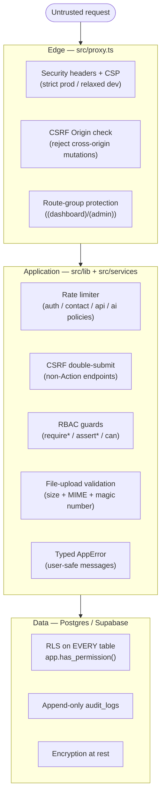
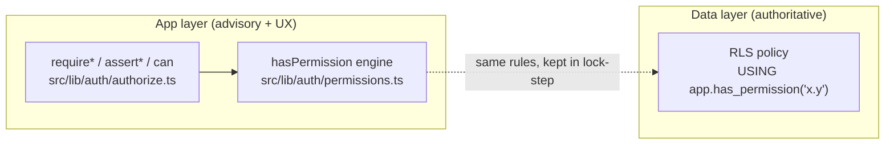
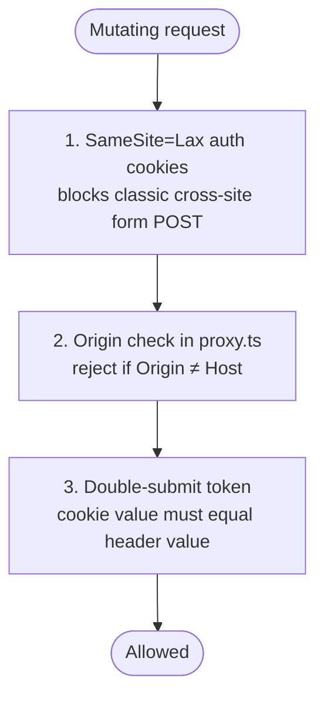
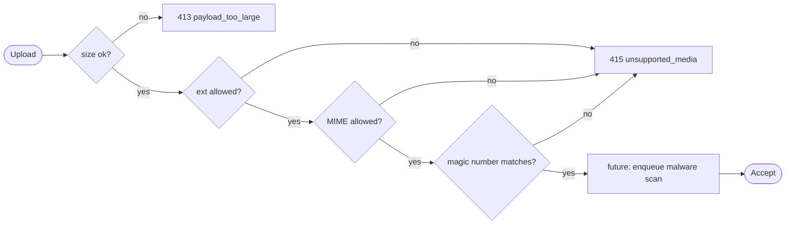

# 10 — Security

> **Originally a Phase-2 design document; updated status 2026-08-10.** When first
> written, everything here was production-shaped but ran on typed in-memory providers
> and paper SQL. That is no longer the case: the platform now runs **live** —
> real Supabase Auth sessions, a connected Supabase Postgres with the migrations
> applied and RLS enforced, HTTPS on the Vercel production deployment, real
> Anthropic inference, and append-only `audit_logs` written under the service
> role. Controls that remain design-only are called out individually below
> (field-level encryption, malware scanning, API-key auth, CSP script nonce,
> MFA step-up). See §13 for the current live/not-live table.

Security for Ask Juice Doctor AI is not a single module — it is a **posture**
that runs through every layer. A member's profile is protected four
different ways at four different distances from the attacker: by the CSP that
governs what runs in their browser, by the middleware that rejects a forged
cross-origin write, by the RBAC guard on the Server Action, and — last and most
important — by the Row-Level Security policy in Postgres that would refuse the
row even if every layer above it were bypassed. This is **defence in depth**:
no control is trusted to be the only one.

This document explains *why* each control exists, *where* it lives, and which
controls are live today versus still design-only.

**Canonical sources:**

| Concern | File |
| --- | --- |
| Security headers + CSP | [`src/lib/security/headers.ts`](../../src/lib/security/headers.ts) |
| Rate limiting | [`src/lib/security/rate-limit.ts`](../../src/lib/security/rate-limit.ts) |
| CSRF utilities | [`src/lib/security/csrf.ts`](../../src/lib/security/csrf.ts) |
| File-upload validation | [`src/lib/security/file-validation.ts`](../../src/lib/security/file-validation.ts) |
| Typed errors | [`src/lib/security/errors.ts`](../../src/lib/security/errors.ts) |
| Edge middleware (headers, CSRF, route protection) | [`src/proxy.ts`](../../src/proxy.ts) |
| RBAC engine + guards | [`src/lib/auth/`](../../src/lib/auth) |
| Audit recorder | [`src/services/platform.ts`](../../src/services/platform.ts) |
| Audit / activity / API-key schema | [`db/migrations/0013_platform.sql`](../../db/migrations/0013_platform.sql), [`db/migrations/0004_auth_sessions_oauth.sql`](../../db/migrations/0004_auth_sessions_oauth.sql) |
| Consent ledger | [`db/migrations/0005_preferences_and_consents.sql`](../../db/migrations/0005_preferences_and_consents.sql) |
| Environment surface | [`.env.example`](../../.env.example), [`src/config/app.ts`](../../src/config/app.ts) |

---

## 1. The threat model in one picture

Every control maps to a layer, and every layer re-checks what the layer above it
already checked. The map below is the mental model for the rest of the document.



Nothing here is novel; the discipline is in applying *all* of it, *everywhere*,
and keeping the app-layer rules and the database-layer rules in **lock-step** so
neither can drift into being the weaker link.

---

## 2. Permissions — the first line inside the app

Authorization is the largest single security surface, and it has its own
document: **[`02-authorization-rbac.md`](02-authorization-rbac.md)**. It is
summarised here only where it intersects the wider posture.

The model is a **six-role linear hierarchy** — `guest → member → practitioner →
staff → administrator → super_administrator` (ranks 0..5, defined in
[`src/lib/auth/roles.ts`](../../src/lib/auth/roles.ts) and mirrored by the
`app_role` enum in [`db/migrations/0001_extensions_and_helpers.sql`](../../db/migrations/0001_extensions_and_helpers.sql)).
Permissions are **cumulative**: each role inherits every capability of the roles
below it; `super_administrator` holds all of them implicitly, so a new
permission is auto-granted to the top role and to nobody else by accident.

Three facts about the permission model matter for security specifically:

1. **Members hold no catalogue permissions.** Access to their own data is granted
   by *ownership* (`user_id = auth.uid()` in RLS), never by a permission key. The
   catalogue in [`src/config/permissions.ts`](../../src/config/permissions.ts)
   governs only privileged, cross-user, and operational actions — so the blast
   radius of a mis-granted permission is bounded to staff-and-above surfaces.

2. **Deny always wins.** The engine in
   [`src/lib/auth/permissions.ts`](../../src/lib/auth/permissions.ts) evaluates an
   explicit user-level `deny` override *before* any role grant, and the database
   function `app.has_permission()` does the same (`not exists (… deny …) and (…
   grant …)`). A revocation cannot be defeated by also holding a grant.

3. **Sensitive actions are flagged in data.** The `sensitive: true` marker on
   entries like `users.delete`, `users.impersonate`, `roles.assign`,
   `health.read`, `payments.refund`, and `audit.read` is a machine-readable hook
   for the production requirement that these actions demand step-up confirmation
   or MFA. In Phase 2 it is a flag on the catalogue; the enforcement point is
   reserved, not yet wired.

The app-layer decision (`hasPermission`) and the database-layer decision
(`app.has_permission`) are two independent implementations of the *same* rules —
that redundancy is the point.



The app-layer guard gives a fast, friendly failure (a redirect or a typed error,
good UX). The RLS policy is the **authoritative** control that holds even if a
future bug skips the guard. See
[`04-rls-security-model.md`](04-rls-security-model.md) for the full RLS design.

---

## 3. Encryption strategy

Encryption is layered by *where the data is* and *how sensitive it is*.

| Data state | Control | Status today |
| --- | --- | --- |
| **At rest** | Postgres/Supabase-managed disk + backup encryption (AES-256); Storage buckets encrypted at rest | **Live** — provisioned by Supabase, which the platform runs on |
| **In transit** | TLS 1.2+ everywhere; **HSTS** (`max-age=63072000; includeSubDomains; preload`) sent on HTTPS | **Live** — HSTS emitted on every HTTPS response — see below |
| **Secrets** | Never in `NEXT_PUBLIC_*`; server-only env; server-only Supabase/Anthropic clients | Enforced structurally today (§7) |
| **Field-level (sensitive)** | Application-level encryption of the most sensitive fields | **Future** — the RLS-hardened tables are the seam it plugs into |

**At rest.** We do not roll our own storage encryption. Postgres data files,
WAL, and automated backups are encrypted by the managed platform; Storage
objects (knowledge documents, avatars, CVs) inherit bucket-level encryption. Our
job is to make sure the *right rows* are readable, which is RLS's problem, not
the cipher's.

**In transit.** All traffic is HTTPS; the platform (Vercel) terminates TLS. We
reinforce it with HSTS so a browser that has once seen the site over HTTPS
refuses to downgrade. HSTS is gated on the request actually being HTTPS in
[`src/proxy.ts`](../../src/proxy.ts):

```ts
const headersToSet = securityHeaders({ hsts: isHttps, dev: isDev });
```

so plain-HTTP local development never receives the header. The header itself
(including `preload`, a one-way commitment) is assembled in
[`headers.ts`](../../src/lib/security/headers.ts).

**Field-level, for the most sensitive data (future).** The most sensitive tables
(`health_profiles`, `medical_questionnaires`, `fitness_profiles`,
`nutrition_profiles` in [`0006_health_profiles.sql`](../../db/migrations/0006_health_profiles.sql))
already carry the *strictest* RLS: a row is visible only to its owner, a treating
same-org practitioner/staff member (read-only), and org admins. Application-level
field encryption — encrypting the most sensitive columns so that even a database
operator with row access cannot read raw values — is a future hardening step.
It is called out here rather than implemented because it changes read/write
plumbing; documenting it honestly is better than pretending it exists.

---

## 4. Audit logging

The platform must be able to answer *"who changed this record, when, from
where, and what did it look like before?"* — for security investigation, for
regulatory inquiry, and for member data-subject requests. That answer lives in
an **append-only, immutable forensic trail**.

**Schema** ([`db/migrations/0013_platform.sql`](../../db/migrations/0013_platform.sql)).
`audit_logs` captures the who / what / before / after / where:

```sql
create table public.audit_logs (
  id              uuid primary key default gen_random_uuid(),
  organisation_id uuid references public.organisations (id) on delete set null, -- NULL = platform-level
  actor_id        uuid references auth.users (id) on delete set null,           -- NULL = system/cron/anon
  action          text not null,   -- e.g. 'profile.updated'
  entity_type     text not null,   -- e.g. 'profiles'
  entity_id       text,
  before          jsonb,           -- snapshot pre-change
  after           jsonb,           -- snapshot post-change
  ip_address      inet,
  user_agent      text,
  created_at      timestamptz not null default now()
);
```

**Immutability is enforced by the *absence* of policies, not by convention.**
The only RLS policy on `audit_logs` is a `SELECT` policy (`audit_logs_admin_read`,
gated on `audit.read`-holding admins for their org, super-admins platform-wide).
There is **no `INSERT`, `UPDATE`, or `DELETE` policy** — so no user session can
forge, alter, or erase the trail. Writes happen server-side under the service
role only. `activity_logs` (a lighter product-analytics stream) follows the same
append-only pattern with a broader read scope (a user reads their own activity).

**The recorder.** Call sites do not `INSERT` directly — privileged admin
mutations record through `auditRepo.log` in
[`src/services/repositories/audit-repo.ts`](../../src/services/repositories/audit-repo.ts),
which inserts one append-only `audit_logs` row **under the service role** (RLS
exposes no user-session insert path). The write is best-effort by design: an
audit failure never blocks the underlying action, but every success path
attempts one. The entry carries `actorId`, `action`, `entityType`, `entityId`,
`before`/`after` snapshots and the organisation — the full shape designed in
Phase 2. (The older `audit.record` shim in
[`src/services/platform.ts`](../../src/services/platform.ts) remains a no-op
left over from Phase 2; the live trail is written by the repository.) The
`sensitive`-flagged permissions in §2 are the natural set of actions the
recorder must never miss.

---

## 5. Rate limiting

Rate limiting protects against credential-stuffing, contact-form spam, scraping,
and AI cost-abuse. The shipped limiter is an **in-memory fixed-window store,
per server instance** — real and enforced today on sign-in/registration and the
public receptionist actions, but best-effort across instances (each serverless
instance counts independently). The design goal is that the *call sites never
change* when a distributed store (Redis/Upstash or Postgres) replaces it.
Durable AI usage enforcement is separate and stronger: per-user daily/monthly
caps are counted from `ai_run_logs` rows, and per-user concurrency is capped at
three in-flight requests (`src/services/ai-usage.ts`).

**The seam** ([`src/lib/security/rate-limit.ts`](../../src/lib/security/rate-limit.ts)).
Everything hangs off one interface:

```ts
export interface RateLimiter {
  check(key: string): Promise<RateLimitResult>; // { allowed, limit, remaining, resetAt }
}
```

It is `async`, keyed by an arbitrary string (identity or IP), and returns
`remaining` / `resetAt` so the caller can emit `Retry-After` and
`X-RateLimit-*` headers — the production shape, even though the shipped
implementation is a single-process fixed-window `Map`. Production swaps in a
Redis/Upstash or Postgres-backed limiter implementing the *same* interface;
no call site moves.

**Enforcement** is centralised in `enforceRateLimit`, which throws the typed
`RateLimitError` (carrying `retryAfterSeconds`) so it flows through the same
error pipeline as everything else (§10):

```ts
export async function enforceRateLimit(limiter: RateLimiter, key: string): Promise<void> {
  const result = await limiter.check(key);
  if (!result.allowed) {
    throw new RateLimitError(Math.max(1, Math.ceil((result.resetAt - Date.now()) / 1000)));
  }
}
```

**Policies** are named, not scattered as magic numbers, so limits are reviewed in
one place:

| Policy | Limit | Window | Protects |
| --- | --- | --- | --- |
| `auth` | 5 | 60 s | Login / credential endpoints (anti brute-force) |
| `contact` | 3 | 60 s | Public contact form (anti-spam) |
| `api` | 100 | 60 s | General authenticated API surface |
| `ai` | 20 | 60 s | Reserved preset — live AI cost/abuse control is enforced by the durable per-user usage caps and the concurrency gate described above, not this preset |

The `auth` and `contact` policies are enforced today (sign-in/registration and
the public receptionist actions respectively); the `api`/`ai` presets are named
here so future endpoints adopt reviewed limits rather than magic numbers.

---

## 6. CSRF strategy

Cross-Site Request Forgery is defended in **three overlapping ways**, so no
single assumption carries the whole load.



1. **Same-origin by construction.** Next.js Server Actions are POST-only and
   same-origin by design, and Supabase auth cookies use `SameSite=Lax`, which
   blocks the classic cross-site form-POST vector before any of our code runs.

2. **Origin check at the edge.** [`src/proxy.ts`](../../src/proxy.ts) rejects any
   mutating method (`POST/PUT/PATCH/DELETE`) whose `Origin` does not match the
   `Host`:

   ```ts
   if (MUTATING_METHODS.has(method)) {
     const origin = headers.get('origin');
     if (origin && !isSameOrigin(origin, host)) {
       return new NextResponse('Cross-origin request blocked', { status: 403 });
     }
   }
   ```

   `isSameOrigin` lives in [`csrf.ts`](../../src/lib/security/csrf.ts) and
   compares parsed hosts (a bad `Origin` URL fails closed).

3. **Double-submit token for custom endpoints.** Any mutating endpoint that is
   *not* a Server Action (a future route handler, a webhook receiver) uses the
   double-submit-cookie pattern: a cryptographically strong token
   (`generateCsrfToken`, Web-Crypto, edge-compatible) is set as the
   `__Host-ajd-csrf` cookie *and* echoed in the `x-ajd-csrf` header; the server
   requires them to match via `verifyDoubleSubmit`, which uses a **constant-time**
   comparison (`safeEqual`) to avoid timing side-channels. The `__Host-` prefix
   forces the cookie to be secure, host-scoped, and path-`/`.

Layers 1 and 2 cover the common case — including today's custom mutating
endpoint (the streaming conversation route under `/api/conversations`), which is
session-authenticated and protected by the edge Origin check. Layer 3's
utilities stand ready for endpoints those layers cannot cover (e.g. webhook
receivers).

---

## 7. Secrets management

The governing rule: **a secret must be structurally incapable of reaching the
browser.** We do not rely on remembering to keep keys server-side — the
architecture makes leaking them the hard path.

**The public/non-public split** ([`src/config/app.ts`](../../src/config/app.ts),
[`.env.example`](../../.env.example)). There are two mode variables, and the
distinction is load-bearing:

| Variable | Visibility | Purpose |
| --- | --- | --- |
| `APP_MODE` | **Server-only, non-public** | Reserved server-only mode switch (`src/services/index.ts`) |

All data access happens inside `server-only` service/repository modules, so a
Supabase client — and the keys it needs — **can never be tree-shaken into a
client bundle**. (The earlier public `NEXT_PUBLIC_APP_MODE` flag, which drove a
cosmetic environment banner, has been removed; no secret was ever gated on it.)
This is Rule 2 of the project philosophy expressed as a security control.

**The secret surface** is enumerated in [`.env.example`](../../.env.example) and
set on the deployed platform:

- `NEXT_PUBLIC_SUPABASE_URL`, `NEXT_PUBLIC_SUPABASE_ANON_KEY` — public by
  design (the anon key is safe only *because* RLS is on every table).
- `SUPABASE_SERVICE_ROLE_KEY` — **never** `NEXT_PUBLIC_`; used only by
  server-side, RLS-bypassing operations such as the audit repository.
- `ANTHROPIC_API_KEY` — server-only; powers live inference.

The app still **degrades gracefully with no secrets** (keyless local dev renders
in a preview mode), which keeps the leakable surface of a casual clone at zero.
On the deployed platform the secrets live in Vercel's encrypted environment
store, never in the repo.

---

## 8. API security

The public/machine-to-machine API is designed but not yet exposed. The few
`/api` routes that exist serve the app itself: `/api/conversations/*` is
session-and-ownership-guarded and `/api/admin/*` requires the administrator
role; `/api/health` is a deliberately public, unauthenticated readiness
endpoint (commit SHA, configuration booleans and a DB round-trip — no secrets).

**Keys are hashed, never stored in plaintext**
([`db/migrations/0004_auth_sessions_oauth.sql`](../../db/migrations/0004_auth_sessions_oauth.sql)):

```sql
create table public.api_keys (
  id              uuid primary key default gen_random_uuid(),
  organisation_id uuid not null references public.organisations (id) on delete cascade,
  name            text not null,
  key_prefix      text not null,   -- first chars, shown in the UI for identification
  key_hash        text not null,   -- sha-256 of the full key
  scopes          text[] not null default '{}',
  created_by      uuid references auth.users (id) on delete set null,
  last_used_at    timestamptz,
  expires_at      timestamptz,
  revoked_at      timestamptz,
  created_at      timestamptz not null default now(),
  unique (key_prefix)
);
```

Design decisions and *why*:

- **Only the hash is persisted.** The plaintext key is shown **once** at
  creation and never recoverable — a database breach yields hashes, not
  usable keys. `key_prefix` exists solely so a human can identify a key in the
  UI without the platform ever holding the secret.
- **Scopes are least-privilege.** `scopes text[]` lets a key be minted with
  exactly the capabilities it needs, so a leaked integration key is bounded.
- **Expiry and revocation are first-class.** `expires_at` and `revoked_at`
  (with a partial index on non-revoked keys) make rotation and instant kill a
  data operation, not a code change.
- **The table is admin-only, hash unreadable.** The `api_keys_admin` RLS policy
  restricts all access to same-org admins (`organisation_id = app.current_org_id()
  and app.is_admin()`); `key_hash` is never selectable by a non-admin because the
  whole table is.
- **Auth events are audited.** `auth_events` (same migration) is an append-only
  record of logins, failures, resets, and MFA challenges, inserted via
  `SECURITY DEFINER` server code (no `INSERT` policy exposed), and rate-limited
  by the `auth` policy in §5.

Every API request would be authenticated by hashing the presented key and
matching it, then authorized by intersecting its scopes with the RBAC catalogue —
the same permission model as human sessions, so there is one authorization system,
not two.

---

## 9. File-upload validation & malware scanning

Uploads (knowledge documents, avatars, CV attachments) are a classic ingress
vector, so [`file-validation.ts`](../../src/lib/security/file-validation.ts)
**never trusts the client-supplied filename or MIME type alone** — it validates
size *and* true content, and fails closed with a typed error. (Note: today no
upload path actually stores files — knowledge ingestion accepts pasted text
only — so this validator guards a surface that is designed but not yet live.)

`validateUpload` runs four checks in order:

1. **Size** against a per-constraint `maxBytes` (25 MB for knowledge documents,
   4 MB for avatars) → `payload_too_large`.
2. **Extension** against an allow-list → `unsupported_media`.
3. **Declared MIME** against an allow-list → `unsupported_media`.
4. **Magic-number sniffing** of the file's first bytes against known signatures
   (`%PDF`, the `PK\x03\x04` ZIP header for `.docx`, PNG/JPG/WEBP) → a renamed
   executable masquerading as a PDF is rejected because *"that file's contents do
   not match its type."*



Text formats (`txt`/`csv`) have no reliable magic number and skip the signature
check by design — the size, extension, and MIME gates still apply.

**Future malware scanning.** The final step is an explicit reserved hook:

```ts
// future: enqueue for malware scanning (ClamAV / cloud scanner) before accept.
```

The contract is deliberate: a file passing the four static checks is *validated*,
not yet *accepted*. In production the scan (ClamAV or a cloud scanning service)
runs before the object is durably stored and served, so infected content never
reaches another user. Placing the hook here — rather than bolting scanning on
later — means the accept/quarantine state machine has a home from day one.

---

## 10. Security headers & CSP

Every response carries a strict, documented header baseline, applied centrally in
[`src/proxy.ts`](../../src/proxy.ts) from
[`headers.ts`](../../src/lib/security/headers.ts) — so no route can forget them.

| Header | Value / intent |
| --- | --- |
| `Content-Security-Policy` | Strict allow-list (see below) |
| `X-Content-Type-Options` | `nosniff` |
| `X-Frame-Options` | `DENY` (plus CSP `frame-ancestors 'none'`) |
| `Referrer-Policy` | `strict-origin-when-cross-origin` |
| `Permissions-Policy` | Deny all powerful features except `camera=(self)` for the Remote Selfie Scan |
| `Cross-Origin-Opener-Policy` | `same-origin` |
| `Cross-Origin-Resource-Policy` | `same-origin` |
| `Strict-Transport-Security` | Sent on HTTPS responses (§3) |

**The CSP is conservative by default and loosened *per source, with a comment* —
never globally.** `default-src 'self'`; `object-src 'none'`; `base-uri 'self'`;
`form-action 'self'`; `frame-ancestors 'none'`; `upgrade-insecure-requests`.
`connect-src` allows `'self'` plus the Supabase origin (the browser-side
anon-key auth client needs it for the password-reset flow); further endpoints
(e.g. an email provider) get added *when they are wired*, not pre-opened.

**The one place strictness is intentionally relaxed is scripts in development.**
React's dev tooling uses `eval`, which a strict CSP forbids, so the builder
branches on mode:

```ts
const scriptSrc = dev
  ? `'self' 'unsafe-inline' 'unsafe-eval'`          // DEV ONLY: React dev mode needs eval
  : nonce
    ? `'self' 'nonce-${nonce}' 'strict-dynamic'`    // PROD: per-request nonce
    : `'self' 'unsafe-inline'`;
```

- **Development** allows `'unsafe-inline' 'unsafe-eval'` so the dev server and
  fast-refresh work — this path is gated on `dev` and can never ship.
- **Production** — the builder supports a **per-request nonce** with
  `'strict-dynamic'` (the modern strong-CSP posture), but the middleware does
  **not currently mint one**, so production ships the fallback
  `script-src 'self' 'unsafe-inline'`. Wiring the nonce through `proxy.ts` is a
  known future hardening step; the code path already exists in `headers.ts`.

`style-src` keeps `'unsafe-inline'` in both modes — a documented, deliberate
trade-off for the inline/critical-CSS approach, and a far weaker vector than
inline script. The `dev` flag comes from `process.env.NODE_ENV`, not from any
app-level setting, so a production build is strict unconditionally.

---

## 11. Error handling — safe by construction

An error message is an information-disclosure surface: a leaked stack trace, SQL
fragment, or internal ID hands an attacker a map. [`errors.ts`](../../src/lib/security/errors.ts)
makes leakage *structurally hard* by splitting every error into an internal half
and a user-safe half.

Every `AppError` carries:

- a stable **`code`** (`unauthenticated`, `forbidden`, `not_found`,
  `validation`, `conflict`, `rate_limited`, `payload_too_large`,
  `unsupported_media`, `internal`),
- the correct HTTP **`status`** (mapped from the code — 401/403/404/422/409/429/413/415/500),
- a **`safeMessage`** *"guaranteed to contain no internal detail"*,
- and, separately, an internal `message`/`cause` that **stay server-side for
  logging only**.

`toClient()` serialises **only** the `code`, `safeMessage`, and any explicitly
whitelisted `details` — the internal message and cause are never in the payload.
The typed subclasses give call sites a vocabulary: `AuthenticationError`,
`AuthorizationError`, `NotFoundError`, `ValidationError`, `RateLimitError`.

The **critical funnel is `toAppError`**: any unexpected thrown value (a raw
Postgres error, a `TypeError`, anything) is normalised into a generic
`internal` `AppError` whose client-facing message is the deliberately bland
*"Something went wrong. Please try again."* — while the original is preserved as
`cause` for server logs:

```ts
export function toAppError(err: unknown): AppError {
  if (err instanceof AppError) return err;
  return new AppError('internal', 'Something went wrong. Please try again.', {
    message: err instanceof Error ? err.message : String(err),
    cause: err,
  });
}
```

This is why the whole app can afford to be liberal about *throwing* — the guards
(§2) throw `AuthorizationError`, the limiter (§5) throws `RateLimitError`, the
validator (§9) throws `AppError` — because there is exactly one place errors turn
into user-facing text, and that place cannot leak. Server Actions surface these
as a typed `ActionResult` rather than an unhandled exception (see
[`src/services/actions.ts`](../../src/services/actions.ts) and
[`src/services/result.ts`](../../src/services/result.ts)).

---

## 12. Consents & GDPR

For this platform, *lawful basis* is a security concern, not just a legal
one. [`0005_preferences_and_consents.sql`](../../db/migrations/0005_preferences_and_consents.sql)
records consent as an **append-only, versioned ledger** (`user_consents`): a new
row is written each time consent is given or withdrawn, keyed by
`(user, consent_type)` with a `policy_version`. Because it is **versioned**, a
policy change re-prompts rather than silently assuming stale consent; because it
is **append-only** (no update/delete policy exists, mirroring `audit_logs`), the
record of *what was agreed and when* cannot be rewritten. A user manages their
own consents; staff may read them to honour data-subject requests. This ledger,
plus the audit trail (§4) and the strict sensitive-data RLS (§3), is what lets the platform
answer a regulator honestly.

---

## 13. What is live today vs. still design-only

An honest security document says what is *not* yet real. As of 2026-08-10:

| Control | Designed | Live today | Notes |
| --- | --- | --- | --- |
| RBAC engine + guards | ✅ | ✅ | Enforced against **real Supabase Auth sessions**; `assertRole`/`assertSession` on every privileged Server Action |
| RLS on every table | ✅ | ✅ | Migrations applied to the live Supabase Postgres; service-role writes are separated from user-session reads |
| Security headers + CSP | ✅ | ✅ | Applied on every response; production `script-src` is `'self' 'unsafe-inline'` (nonce path built but not wired — §10) |
| CSRF Origin check | ✅ | ✅ | `proxy.ts` rejects cross-origin mutations |
| CSRF double-submit | ✅ | reserved | Current custom endpoints are session + Origin-check protected; utilities ready for webhooks |
| Rate limiting | ✅ | ✅ (per-instance) | In-memory fixed-window on auth + public receptionist actions; durable per-user AI caps + concurrency from `ai_run_logs` |
| Audit logging | ✅ | ✅ | Append-only `audit_logs` written via `auditRepo.log` under the service role |
| Encryption at rest | ✅ (managed) | ✅ | Supabase-managed |
| HSTS / TLS | ✅ | ✅ | Vercel HTTPS; HSTS on every HTTPS response |
| Route protection at the edge | ✅ | ✅ | `/dashboard` + `/admin` redirect unauthenticated users to `/login` whenever Supabase is configured |
| MFA / step-up on sensitive actions | flagged in catalogue | ❌ | Enforcement not yet wired |
| Field-level encryption | described | ❌ | Future hardening |
| Malware scanning | hook reserved | ❌ | Only pasted text is ingested today; no file uploads are stored |
| API-key auth | ✅ (schema) | ❌ | M2M API not exposed |
| Monitoring (Sentry/PostHog) | — | ❌ | Not integrated |

---

## Related documents

- [`00-overview.md`](00-overview.md) — the pre-production-vs-production philosophy and the seam
- [`02-authorization-rbac.md`](02-authorization-rbac.md) — the full role & permission model summarised in §2
- [`03-database.md`](03-database.md) — schema conventions, the `app` helper functions, and the ERD
- [`04-rls-security-model.md`](04-rls-security-model.md) — Row-Level Security, the authoritative data-layer control
- [`db/README.md`](../../db/README.md) — migration inventory and table map
