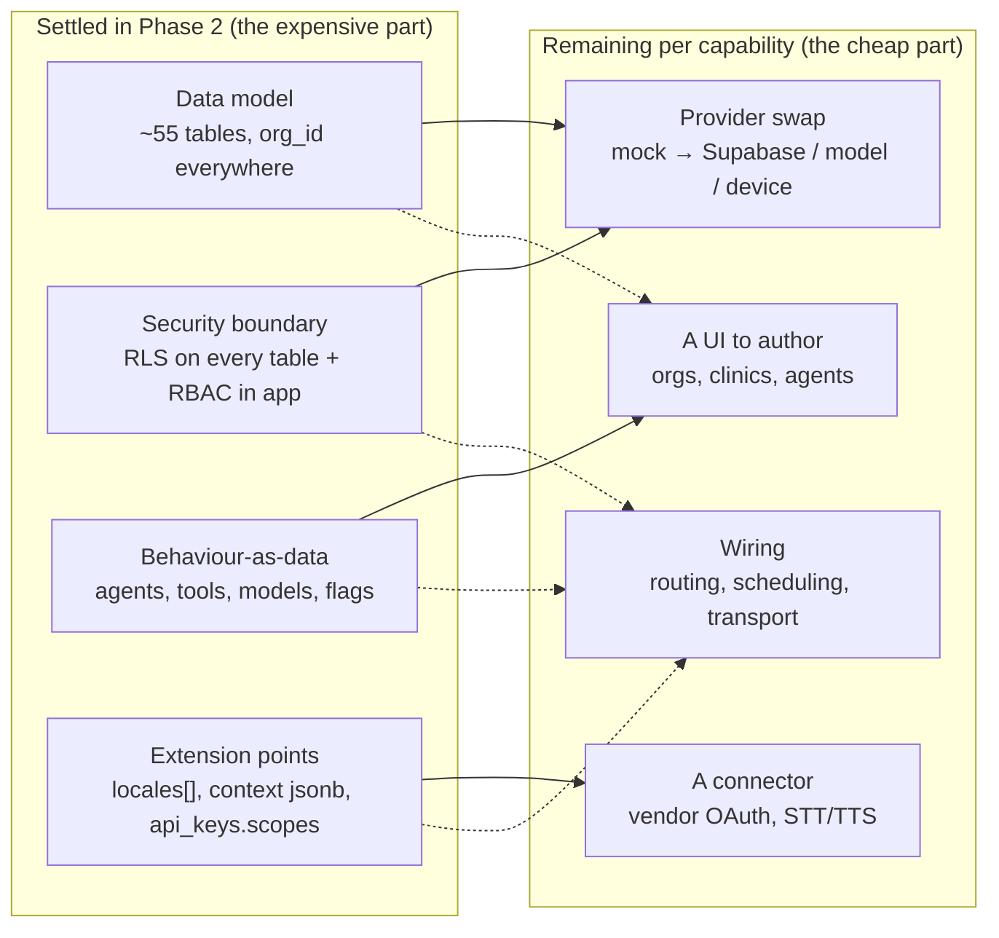

# 11 · Future Scalability

> **Status:** Phase 2 — production-shaped design, no live data, no inference wired.
> **Scope of this document:** the *growth surfaces* of the platform — every axis along which _Prototype AI_ is expected to expand, and the proof that each axis is already **modelled**, so growth is **data and configuration, not a re-architecture**.
> **Primary sources:** [`db/migrations/0002_tenancy.sql`](../../db/migrations/0002_tenancy.sql), [`db/migrations/0004_auth_sessions_oauth.sql`](../../db/migrations/0004_auth_sessions_oauth.sql), [`db/migrations/0009_ai_agents.sql`](../../db/migrations/0009_ai_agents.sql), [`db/migrations/0010_conversations.sql`](../../db/migrations/0010_conversations.sql), [`src/config/ai-agents.ts`](../../src/config/ai-agents.ts), [`src/types/ai.ts`](../../src/types/ai.ts), [`src/types/conversation.ts`](../../src/types/conversation.ts), [`db/README.md`](../../db/README.md).
> **Related:** [00 · Overview](./00-overview.md), [03 · Database](./03-database.md), [07 · Memory](./07-memory-architecture.md), [08 · Consultation Workflow](./08-consultation-workflow.md).

---

## 1. What "scalable" means here — and what it does not

When a client asks "will it scale?" they usually mean two different things and only say one of them:

1. **Load scalability** — more requests, more rows, more concurrent users. This is a runtime concern (indexes, connection pooling, caching, read replicas, edge compute) and Vercel + Supabase + Postgres cover it in the usual ways. It is **not** the subject of this document.
2. **Capability scalability** — the platform is asked to do *things it was not doing yesterday*: serve a second organisation, open a second clinic, add a fourth AI agent, speak French, accept voice, ingest a wearable, expose an API, ship a mobile app. This is a **modelling** concern, and it is the one that kills platforms. It is the entire subject of this document.

The distinction matters because capability growth is where naïve architectures demand a **rewrite**. A single-tenant app that hard-codes "the one organisation" has to touch every table, every query, and every policy to host a second one. An app whose agent behaviour lives in `if` statements has to ship code to add an agent. An English-only app that stored no locale has to migrate every user row to go multilingual.

The thesis of Phase 2 — stated in [00 · Overview](./00-overview.md) and proven table by table in [03 · Database](./03-database.md) — is that **we paid the modelling cost up front, while it was cheap**, so that every capability below is reached by *inserting rows and flipping configuration*, never by re-architecting. This document walks each growth axis and defends that claim.

> **Why pay up front for tenancy we don't use yet?** Because the cost curve is brutally asymmetric. Adding `organisation_id` to an empty table in migration `0002` is one line. Retrofitting it into 55 populated, RLS-protected, foreign-keyed tables in production is a multi-week migration with a data-integrity risk on every row. The prototype has exactly one organisation and the column is effectively constant — but it is *there*, indexed, and enforced by RLS, so going multi-tenant is a `INSERT INTO organisations` away.

---

## 2. The three mechanisms that make everything else cheap

Almost every row in the matrix below is cheap for one of three structural reasons. It is worth naming them once, because they are the *why* behind the *what*.

### 2.1 Tenancy is a column, not a codebase

Every tenant-scoped table carries `organisation_id` and every RLS policy is scoped by `app.current_org_id()` (see [`db/migrations/0002_tenancy.sql`](../../db/migrations/0002_tenancy.sql) and the conventions table in [`db/README.md`](../../db/README.md)). The isolation boundary is enforced **once, in the database**, by helper functions in the `app` schema. Nothing in the application layer decides "which org can see this row" — the row's own policy does. So a second organisation inherits *complete* isolation for free: it is data flowing through machinery that already exists.

### 2.2 Behaviour is data, not code

The AI framework ([`db/migrations/0009_ai_agents.sql`](../../db/migrations/0009_ai_agents.sql), [`src/types/ai.ts`](../../src/types/ai.ts)) treats agents, tools, models, and providers as **rows**, not classes. An agent is a `system_prompt`, a `temperature`, a `memory_config`, a set of `safety_rules`, a visibility, a status, and a version — all columns. The three seed agents in [`src/config/ai-agents.ts`](../../src/config/ai-agents.ts) are the *proof*: they are declarative definitions, not code paths. The fourth, tenth, or hundredth agent is another row. The same pattern governs model **providers** and **models** — the platform is provider-agnostic by construction.

### 2.3 Extension points are pre-drilled holes

Several columns exist purely so that a future capability has a place to land without a migration:

- `organisations.locales` (a `text[]`) and `organisations.default_locale` — multi-language is a per-tenant array, already there.
- `conversations.context` (a `jsonb`) — the documented home for locale, **entry point / channel**, feature flags, and retrieval context. A voice channel or a mobile session is a value in this bag, not a new column.
- `messages.model_key` — every message already records *which model produced it*, so mixed-model and mixed-provider histories are coherent from day one.
- `api_keys.scopes` (a `text[]`) and the `oauth_accounts` table — machine-to-machine and third-party access are modelled, not bolted on later.

Keep these three mechanisms in mind; the matrix that follows is mostly them, applied nine times.

---

## 3. The scalability matrix

For each growth axis: what the current architecture **already** provides, and what **remains** for a later phase. The remaining column is deliberately honest — but note that in every row it is *filling in bodies and wiring a provider*, never *changing the shape of the data*.

| Capability | Already in place | Remaining work (later phase) |
|---|---|---|
| **Multiple organisations** | `organisations` table (`0002`); `organisation_id` on every tenant table; `organisation_memberships` join (a user may belong to many orgs); RLS scoped by `app.current_org_id()`; super-admin platform reads via `app.is_super_admin()`. The prototype runs with exactly one org row. | Org-provisioning/onboarding flow; an org-switcher in the UI; billing per org; resolving `current_org_id` from the active membership at request time. **No schema change** — isolation already exists. |
| **Multiple clinics** | `clinics` table (`0002`) with `organisation_id`, `timezone`, `address`; `organisation_memberships.clinic_id` assigns practitioners to a clinic; appointments/consultations reference clinic scope; `unique (organisation_id, slug)`. | Clinic management UI; per-clinic scheduling/calendars; clinic-level roll-up reporting. **No schema change** — clinics are already a first-class child of the org. |
| **Multiple practitioners** | The `practitioner` role in the `app_role` enum (`0001`) and `src/lib/auth/roles.ts`; cumulative RBAC; care-scoped RLS on sensitive data (owner + treating practitioner/staff + admin); practitioner ↔ clinic via membership; consultation events are append-only per practitioner. | Practitioner directory, availability/rota, assignment/routing of members to practitioners, caseload views. **No schema change** — the role, the scoping, and the audit trail already exist. |
| **Multiple AI agents** | Agents-as-data: `ai_agents` + `ai_agent_versions` + `ai_agent_tools` + `ai_agent_knowledge_sources` (`0009`); `AiAgentDefinition` in [`src/types/ai.ts`](../../src/types/ai.ts); three seed agents in [`src/config/ai-agents.ts`](../../src/config/ai-agents.ts); per-agent visibility (`private`/`organisation`/`public`), `status`, `version`, `owner`, `memory_config`, `safety_rules`. | The admin authoring UI to create/edit agents; the inference runtime that reads a definition and calls a model (Phase 3). **Adding an agent is an `INSERT`**, not a code change — this is the framework's headline claim. |
| **Multiple languages** | `organisations.locales` (`text[]`) + `organisations.default_locale` (`0002`); `user_preferences.locale` (`0005`); `conversations.context` carries the thread locale; agent behaviour is per-agent text (a localised agent is another agent row or a localised prompt). | Message catalogues / translation of static UI copy; localised knowledge documents; locale-aware formatting. **No schema change** — the locale fields already thread from org → user → conversation. |
| **Voice AI** | `conversations` + `messages` are channel-neutral (`0010`); `messages.role` already includes `tool`; `conversations.context` (jsonb) is the documented home for the entry point/channel; `messages.model_key` records the producing model, so a speech model is just another `model_key`; `ai_tools` model callable capabilities. | Speech-to-text / text-to-speech providers behind the model-provider abstraction; an audio storage bucket; a voice channel value in `context`. **No new message model** — a voice turn is a `message` with an audio-aware model key. |
| **Wearables** | Assessment & Selfie Scan results are already `assessments` (`0007`) — the same table absorbs device readings; append-only `consultation_events`; `knowledge_documents.source_type` includes `audio_transcript` and OCR for ingested device output; `api_keys`/`oauth_accounts` model device/vendor access. | Device-vendor connectors (OAuth to third-party device APIs); a normalisation layer mapping vendor payloads to `assessments`; ingestion scheduling. **No new table for readings** — they land as assessments. |
| **Mobile apps** | The service layer is the API: reads are getters, writes are Server Actions, all server-only and provider-selected off `APP_MODE` (see [00 · Overview](./00-overview.md) §4); `api_keys` + `oauth_accounts` (`0004`) model authenticated non-browser clients; RLS enforces access **regardless of client**, so a mobile client is bound by the same policies as the web app. | A public/mobile API surface (REST or RPC) over the same services; mobile OAuth/session handling; push-notification transport (the `notifications` table already exists in `0013`). **No new authorisation model** — RLS is the boundary for every client. |
| **API integrations** | `api_keys` with hashed storage and a `scopes` `text[]` (`0004`, plaintext never stored); `oauth_accounts` for third-party identity; `ai_tools.input_schema` + `handler_ref` model callable, schema-validated capabilities; provider-agnostic `ai_model_providers`/`ai_models` (`0009`); `feature_flags` (`0013`) can gate a rollout. | Public API gateway/versioning; per-key rate-limit policies (the `RateLimiter` interface + policies already exist in `src/lib/security/rate-limit.ts`); webhook delivery; developer docs. **No new access-control primitive** — scoped keys + RLS already govern M2M access. |

---

## 4. Why none of this is a re-architecture

Read the "remaining work" column again with one lens: **does any row change the *shape* of the data or the *location* of the security boundary?** None does. Every remaining item is one of four kinds of work, and none of them is a redesign:

The load-bearing claim is that the four **Settled** boxes are the ones that are ruinous to change late, and they are done. The four **Remaining** boxes are additive: you extend the system by *plugging into surfaces that already exist*, exactly as [00 · Overview §1](./00-overview.md) promises — Phase 3 is "fill in the bodies," not "design the platform."

Three concrete tells that the shape is already right:

- **A second organisation needs zero DDL.** Because `organisation_id` and its RLS policy exist on every tenant table, the *only* migration a multi-org launch requires is none. Contrast with a single-tenant app, where it is the largest migration you will ever write.
- **A fourth agent needs zero deploy.** The three agents in [`src/config/ai-agents.ts`](../../src/config/ai-agents.ts) are data that seeds `ai_agents`. The admin UI writing a fourth row is the same operation. No branch, no build, no release.
- **A new client (mobile, voice, integration) inherits the *same* authorisation.** Because access control lives in RLS — the database, not the transport — a phone app, a voice endpoint, and a partner's API key are all governed by the identical policies the web app obeys. There is no second, weaker access path to keep in sync, which is precisely how multi-client platforms usually leak.

---

## 5. What is deliberately deferred (and why that is safe)

Honesty is a design rule here (see [00 · Overview §2](./00-overview.md)), so the deferrals are explicit — and in each case the *shape* is present, only the *body* is deferred:

- **Vector search** — `knowledge_chunks` and `knowledge_embeddings` (`0012`) model the full pipeline; the `embedding vector(N)` column is added when `pgvector` is enabled in Phase 3. The chunking/embedding *records* exist now, so enabling the extension is additive, not structural. See [`db/README.md`](../../db/README.md).
- **Inference** — every agent is fully described but nothing runs a model. `messages.model_key` and the `ai_model_providers`/`ai_models` tables mean the runtime, when built, reads configuration rather than hard-coding a vendor.
- **Live providers** — the whole system runs on typed mock providers behind the single seam (`config.isPrototype` in [`src/config/app.ts`](../../src/config/app.ts)). Going live is a provider swap off the non-public `APP_MODE`, not a rewrite.

Deferring these is safe precisely because each sits behind an interface or a modelled table that already has the right shape. The risk of a deferral is that it forces a redesign when you finally do it; here, none of them does.

---

## 6. Summary

The platform scales along nine capability axes — organisations, clinics, practitioners, agents, languages, voice, wearables, mobile, integrations — and every one of them reduces to **inserting rows and configuring providers** on top of structures that already exist: `organisation_id` tenancy, first-class clinics, cumulative role-based access, agents-and-models-as-data, locale fields threaded from org to conversation, a channel-neutral conversation model, and `api_keys`/`oauth_accounts` for non-browser clients. The expensive, redesign-prone decisions — the data model and the security boundary — were made once, up front. Growth is therefore a matter of building **bodies and connectors** against a settled shape, which is the definition of an architecture that scales *without* being re-architected.
