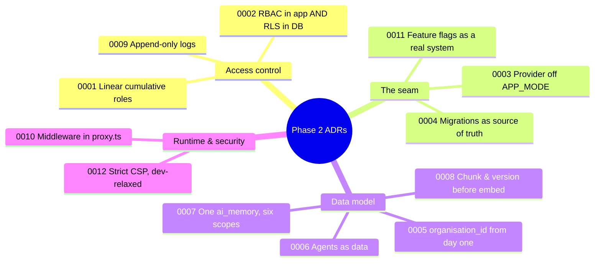

# 12 — Architecture Decision Records

> **Ask Juice Doctor AI** — Phase 2: the enterprise backend foundation.
> Founder: Erran Warden ("The Juice Doctor"). This is a **prototype for demonstration purposes only** — production-*shaped*, not production-*wired*.

This document records the load-bearing decisions taken in Phase 2. Each is a compact **Architecture Decision Record (ADR)**: the **context** that forced a choice, the **decision** we took, the **rationale** (the *why*), and the **alternative we rejected** and why it lost.

An ADR is not documentation of a feature — it is a record of a *fork in the road*. Read together, these fifteen records explain why the codebase is shaped the way it is, so that a future engineer changing course does so *knowingly* rather than by accident.

## How to read these records

| Field | Meaning |
| --- | --- |
| **Status** | All records here are **Accepted** and implemented in Phase 2 unless noted. |
| **Context** | The forces in play — constraints, requirements, prior state. |
| **Decision** | The choice, stated in one line. |
| **Rationale** | *Why* this beats the alternatives, given the context. |
| **Rejected** | The strongest alternative and the specific reason it lost. |
| **Realised in** | The real files/paths where the decision lives. |

A cross-cutting theme runs through almost every record: **the prototype must be production-*shaped*.** Where a decision would be cheaper to fudge for a demo, we paid the cost to model it correctly, because the entire point of Phase 2 is to prove the *shape* is right (see [ADR-0003](#adr-0003--data-provider-selection-off-the-non-public-app_mode)).

---

## Index

| ADR | Decision | Domain |
| --- | --- | --- |
| [0001](#adr-0001--a-linear-cumulative-role-hierarchy) | A linear, cumulative role hierarchy | Access control |
| [0002](#adr-0002--rbac-in-the-app-and-rls-in-the-database-defence-in-depth) | RBAC in the app **and** RLS in the DB (defence in depth) | Access control |
| [0003](#adr-0003--data-provider-selection-off-the-non-public-app_mode) | Data-provider selection off the non-public `APP_MODE` | The seam |
| [0004](#adr-0004--sql-migrations-are-the-source-of-truth-typescript-is-derived) | SQL migrations are the source of truth; TypeScript is derived | Data model |
| [0005](#adr-0005--organisation_id-on-every-tenant-table-from-day-one) | `organisation_id` on every tenant table from day one | Multi-tenancy |
| [0006](#adr-0006--ai-agents-are-data-not-code) | AI agents are **data**, not code | AI framework |
| [0007](#adr-0007--one-ai_memory-table-with-six-scopes-not-six-tables) | One `ai_memory` table with six scopes (not six tables) | AI framework |
| [0008](#adr-0008--knowledge-chunking-and-versioning-modelled-before-embeddings) | Knowledge chunking & versioning modelled *before* embeddings | Knowledge |
| [0009](#adr-0009--audit-and-history-logs-are-append-only) | Audit & history logs are append-only | Platform / ops |
| [0010](#adr-0010--middleware-lives-in-proxyts-next-16-convention) | Middleware lives in `proxy.ts` (Next 16 convention) | Runtime |
| [0011](#adr-0011--feature-flags-promoted-to-a-real-targeting-aware-system) | Feature flags promoted to a real, targeting-aware system | Platform / ops |
| [0012](#adr-0012--a-strict-csp-relaxed-only-in-development) | A strict CSP, relaxed only in development | Security |
| [0013](#adr-0013--reads-are-getters-writes-are-server-actions) | Reads are getters; writes are Server Actions | Service layer |
| [0014](#adr-0014--publishing-and-consultation-lifecycles-are-explicit-state-machines) | Publishing & consultation lifecycles are explicit state machines | Workflow |
| [0015](#adr-0015--a-versioned-append-only-consent-ledger) | A versioned, append-only consent ledger | Compliance |

---

## ADR-0001 — A linear, cumulative role hierarchy

**Status:** Accepted · **Domain:** Access control

**Context.** The platform serves six distinct actors — an unauthenticated visitor, a registered client, a clinician, operational staff, an org administrator, and the platform owner. Real wellness/clinical products tend to sprawl into a matrix of overlapping custom roles that nobody can reason about. We needed a role model a non-technical operator (Erran) could hold in their head, that still expressed genuine privilege boundaries.

**Decision.** Model roles as a **single ordered ladder** with cumulative permissions: `guest(0) < member(1) < practitioner(2) < staff(3) < administrator(4) < super_administrator(5)`. A higher rank implicitly satisfies any lower-rank requirement, each role *inherits every permission of the roles beneath it and adds its own*, and `super_administrator` holds every permission by construction. Defined once in `src/lib/auth/roles.ts` (`APP_ROLES`, `ROLE_RANK`, `hasMinRole`) and mirrored by the `app_role` enum + `app.role_rank()` in migration `0001`.

**Rationale.** A linear ladder makes `hasMinRole(role, minimum)` a single integer comparison, and the cumulative model means the effective permission set is computed *once* by folding each role's base grants over the accumulator (`ROLE_PERMISSIONS` in `src/lib/auth/permissions.ts`). Adding a permission to a low role automatically flows it up the ladder; adding it to the catalogue auto-grants it to `super_administrator` — so the matrix can never drift into a state where the platform owner is *missing* a capability. The model reads like an org chart, which is exactly the mental model the client already has.

**Rejected.** *A free-form many-to-many role/permission matrix (e.g. arbitrary custom roles, roles-as-tags).* It is more flexible, but flexibility here is a liability: it invites privilege-escalation gaps, makes "who can do X?" un-answerable at a glance, and cannot be seeded from a single reviewed file. The linear model loses the ability to express *non-nested* roles (e.g. a clinician who is *not* also above a member) — but no such actor exists in this domain, so we do not pay for capability we do not need. Per-user **grants/denies overrides** ([ADR-0002](#adr-0002--rbac-in-the-app-and-rls-in-the-database-defence-in-depth)) provide the escape hatch for the rare exception without abandoning the ladder.

**Realised in:** `src/lib/auth/roles.ts`, `src/config/permissions.ts` (`ROLE_BASE_PERMISSIONS`), `db/migrations/0001_extensions_and_helpers.sql`.

---

## ADR-0002 — RBAC in the app AND RLS in the database (defence in depth)

**Status:** Accepted · **Domain:** Access control

**Context.** The application handles sensitive health data. Access control implemented in *only* the application tier fails open the moment a query bypasses it — a stray Server Action, a future admin script, a mis-scoped join, a direct database connection. Access control implemented in *only* the database is safe but invisible to the UI, which cannot render or hide affordances without duplicating the rules.

**Decision.** Enforce authorisation **twice, independently, from one shared definition.** The application tier owns a fine-grained permission catalogue (`resource.action` keys in `src/config/permissions.ts`), a pure RBAC engine (`src/lib/auth/permissions.ts`, **deny-wins** overrides), and server guards (`src/lib/auth/authorize.ts`: `require*`/`assert*`/`can`). The database tier mirrors it: **RLS is enabled on every table**, and policies call the `SECURITY DEFINER` helper `app.has_permission(key)` — which reads the same `permissions` / `role_permissions` / `user_permission_overrides` tables (migration `0003`) that are *seeded from* `src/config/permissions.ts`. The two are kept in lock-step by construction.

**Rationale.** This is **defence in depth**: a bug in one tier is caught by the other. The app tier gives fast, rich, presentation-aware decisions (hide the button, `require` in the action); RLS gives an *unbypassable* backstop at the data boundary — even a raw SQL client obeys it. Crucially, both tiers derive from the *same catalogue*, so they cannot silently disagree: the permission keys, the deny-wins precedence, and the role→permission mapping are authored once. The `deny` override winning over any grant means a targeted revocation is always honoured, which is the safe default for a security control.

**Rejected.** *Application-tier RBAC only, treating the database as a trusted store.* Cheaper, and tempting because RLS policies are verbose. Rejected because it makes the *application code* the sole security boundary for health records — one forgotten `require()` becomes a data breach. The cost of RLS (policy duplication, `SECURITY DEFINER` helpers to avoid recursion) is real but bounded, and buys a property nothing else can: safety that survives application bugs.

**Realised in:** `src/config/permissions.ts`, `src/lib/auth/permissions.ts`, `src/lib/auth/authorize.ts`, `db/migrations/0003_identity_and_permissions.sql`, `db/README.md` (§ Row Level Security).

---

## ADR-0003 — Data-provider selection off the non-public `APP_MODE`

**Status:** Accepted · **Domain:** The seam

**Context.** The prototype must *look and behave* like production while touching no live data, and the eventual switch to Supabase must be a swap, not a rewrite. Two independent concerns hide inside "are we in prototype mode?": (a) a **cosmetic** one — showing the "Prototype Environment" banner and demo affordances in the browser; and (b) a **security-sensitive** one — choosing the *data provider* (typed mocks vs. a real Supabase client). Conflating them risks the worst outcome: a Supabase client, and its service credentials, tree-shaken into a client bundle because a public flag decided the provider.

**Decision.** Split the flag in two. `NEXT_PUBLIC_APP_MODE` is **cosmetic only** and safe to expose — it drives the banner via `src/config/app.ts` (`config.isPrototype`, `PROTOTYPE_BANNER_TEXT`). The **data-provider selection** is made separately in the **server-only** service layer, off the **non-public** `APP_MODE` env, so a Supabase client can never reach the browser. The whole prototype↔production switch is funnelled through a **single seam**: `config.isPrototype` for behaviour, and the provider branch inside `server-only` services (`src/services/*`, `src/lib/auth/session.ts`).

**Rationale.** Keeping the provider decision on a *non-public* variable inside `server-only` modules makes it *physically impossible* for the client bundle to import a database driver — the boundary is enforced by the `import 'server-only'` guard, not by discipline. Keeping the cosmetic flag public means the banner renders without a round-trip. Funnelling both through *one named seam* means going live is auditable: you can point at exactly the code that changes.

**Rejected.** *A single public `NEXT_PUBLIC_*` flag driving both banner and provider.* Simpler to wire, but it is a security foot-gun: a public env var deciding which database client to instantiate invites credential leakage into the client bundle, and blurs the line between "cosmetic demo state" and "which backend is live." The minor duplication of two variables is a deliberate price for an un-leakable boundary.

**Realised in:** `src/config/app.ts`, `src/lib/auth/session.ts` (`loadSession` provider branch), `src/services/actions.ts`, `src/services/*` (`import 'server-only'`).

---

## ADR-0004 — SQL migrations are the source of truth; TypeScript is derived

**Status:** Accepted · **Domain:** Data model

**Context.** There are two candidate homes for the canonical data model: TypeScript types (ergonomic, close to the app) or SQL migrations (close to the database that ultimately enforces everything). If TypeScript leads, the migrations are a lossy afterthought and RLS/constraints get under-modelled. The prototype does **not run** the database — but the model it declares must be *exactly* production's.

**Decision.** The **~55 tables across 13 migrations in `db/migrations/`** are the **source of truth**; the TypeScript model (`src/types/db.ts` and the domain `src/types/*`) is **derived from them**. The migrations are authored, reviewed, and version-controlled as "paper SQL" — real, correct DDL that simply is not executed in the prototype. Conventions are fixed in `0001` and applied uniformly: `uuid` PKs, `created_at`/`updated_at` + the `app.set_updated_at` trigger, `organisation_id` tenancy, **RLS on every table**, append-only logs, and `app`-schema helper functions.

**Rationale.** The database is where correctness is *ultimately* enforced (constraints, `CHECK`s, RLS, triggers). Letting it lead means those enforcement mechanisms are designed *first*, not retrofitted — e.g. the `ai_memory_scope_key_present` CHECK ([ADR-0007](#adr-0007--one-ai_memory-table-with-six-scopes-not-six-tables)) exists because the SQL was designed as the authority. Because the migrations are already the real DDL, going live is **"run the migrations + swap the provider,"** not a redesign. Deriving TS from SQL keeps the two aligned in the direction that matters: the app can never assume a shape the database will not enforce.

**Rejected.** *TypeScript-first with generated/ad-hoc SQL (or an ORM's schema-in-code).* More ergonomic day-to-day, but it subordinates the tier that actually guarantees integrity to the tier that merely *consumes* it — RLS and constraints become an export target rather than a design surface, and tend to be thinned out. We accept slightly more manual type authoring in exchange for a database design that is complete and reviewable on its own terms (`db/README.md` documents the full ERD).

**Realised in:** `db/migrations/` (0001–0013), `db/README.md`, `src/types/*`.

---

## ADR-0005 — `organisation_id` on every tenant table from day one

**Status:** Accepted · **Domain:** Multi-tenancy

**Context.** Today there is one organisation (Ask Juice Doctor). But the brand may run multiple clinics, and the platform is plausibly sold to other operators. Retrofitting multi-tenancy onto a single-tenant schema is one of the most expensive migrations in software — it touches *every* table, *every* query, and *every* RLS policy at once, on live data.

**Decision.** Model tenancy **from the first migration**: `organisations`, `clinics`, and `organisation_memberships` land in `0002`, and **every tenant-scoped table carries `organisation_id`**. RLS policies scope by `app.current_org_id()` (with `or app.is_super_admin()` for platform-wide reads). Multi-org / multi-clinic is therefore a matter of *data*, not a schema rewrite.

**Rationale.** The marginal cost of carrying `organisation_id` on a table that currently holds one org's data is nearly zero — one column, one index, one clause in each policy. The cost of *not* having it, discovered later, is a platform-wide data migration under load. Adding the column up front also forces every RLS policy to be written tenant-aware from the start, which is exactly the discipline that prevents cross-tenant leakage. The prototype seeds a single canonical org (`00000000-0000-0000-0000-000000000001`) so the shape is exercised end to end.

**Rejected.** *Single-tenant now, add tenancy "when we need it."* Cheaper this week, catastrophic later: the retrofit is a big-bang migration touching everything, precisely when the system is most valuable and least safe to disrupt. Carrying an unused-but-correct tenancy key is the textbook example of a cheap option bought early to avoid an expensive forced move later.

**Realised in:** `db/migrations/0002_tenancy.sql`, `app.current_org_id()` (0001), every tenant table's `organisation_id` column + policy, `src/lib/auth/session.ts` (`organisationId`).

---

## ADR-0006 — AI agents are **data**, not code

**Status:** Accepted · **Domain:** AI framework

**Context.** The product needs multiple assistants (a member-facing companion, an intake triage bot, a practitioner co-pilot) and the client will want more over time — with different prompts, personalities, tools, models, and safety rules — *without* an engineer editing and redeploying code for each. No inference is built in Phase 2; but the *shape* that later carries inference must not hard-code the agents.

**Decision.** Represent each agent as **rows, not functions.** The schema (migration `0009`) models `ai_agents` + `ai_agent_versions` + `ai_agent_tools` + `ai_agent_knowledge_sources`, alongside `ai_model_providers` / `ai_models` (future model selection), `ai_tools`, and `ai_configurations`. Each agent carries its `id`, `name`, `description`, `role`, `personality`, `system_prompt`, `temperature`, token limits, `default model`, `memory_config`, `safety_rules`, `visibility` (private/organisation/public), `status` (draft/active/disabled/archived), `version`, and `owner`. The typed shape lives in `src/types/ai.ts`, three seed agents (`juice-doctor-companion`, `intake-triage`, `practitioner-copilot`) live in `src/config/ai-agents.ts`, and `src/services/agents.ts` reads them. **No inference runs in Phase 2.**

**Rationale.** Agents-as-data means the client creates, versions, and configures assistants through an admin surface — *no code change, no deploy*. Versioning (`ai_agent_versions`) makes a prompt change auditable and reversible. Separating providers/models as their own tables means swapping the underlying LLM is a foreign-key update, not a refactor. Modelling `safety_rules`, `visibility`, and `status` as first-class columns forces the governance questions (who can see this agent? is it live?) to be answered in the *data model*, before any inference exists to misbehave.

**Rejected.** *Hard-coded agent definitions in TypeScript (one module per agent).* Fine for three fixed agents, but it makes every new agent — and every prompt tweak — an engineering task and a deploy, and it has no natural home for versioning, per-tenant visibility, or an admin UI. Encoding agents as data costs a richer schema now; it buys an unbounded, client-operable agent catalogue later.

**Realised in:** `db/migrations/0009_ai_agents.sql`, `src/types/ai.ts`, `src/config/ai-agents.ts`, `src/services/agents.ts`.

---

## ADR-0007 — One `ai_memory` table with six scopes (not six tables)

**Status:** Accepted · **Domain:** AI framework

**Context.** Agents must remember things at very different **lifetimes and blast radii**: a throwaway scratchpad for one browser session, durable facts about a user, a running summary of one conversation, an agent's own operating notes, organisation-wide knowledge, and truly global platform facts. Each is a distinct **security boundary** — a session note must never leak into another user's context; an org fact must never cross tenants. The naive design is six near-identical tables.

**Decision.** Model a **single `ai_memory` table** (migration `0011`) with a `scope` discriminator (`session | user | conversation | agent | organisation | global`) and a set of **nullable scope-key columns** (`session_id`, `user_id`, `conversation_id`, `agent_id`, `organisation_id`). Only the key(s) relevant to a scope are populated; a `CHECK` (`ai_memory_scope_key_present`) enforces that each scope's mandatory key is present, and **RLS isolates each scope by its own key**. The application exposes one uniform API over a discriminated `MemorySelector`, so callers cannot mix scopes by accident (`src/types/memory.ts`, `src/services/memory.ts`).

**Rationale.** One table keeps the retrieval layer **uniform**: one query shape, one importance/expiry model, one `embedding_ref` convention for pointing at vectors ([ADR-0008](#adr-0008--knowledge-chunking-and-versioning-modelled-before-embeddings)). A discriminated selector in TypeScript makes it a *type error* to supply the wrong keys for a scope. Yet each scope keeps **its own least-privilege rules** — the RLS `SELECT`/`INSERT`/`UPDATE`/`DELETE` policies are an `OR` across per-scope predicates, and partial (often unique) indexes per scope keep each working set small and give free upsert semantics. We get the ergonomics of one API *and* the isolation of six boundaries.

**Rejected.** *Six separate tables (`session_memory`, `user_memory`, …).* Superficially "cleaner" per-scope, but it fractures the retrieval layer into six code paths, six index strategies, and six places to keep the importance/expiry/embedding conventions in sync — and every new consumer must special-case all six. The single-table model's cost is a more careful CHECK constraint and a compound RLS policy; that cost is paid once, in one file, and reviewed as a unit.

**Realised in:** `db/migrations/0011_memory.sql` (scope enum, CHECK, per-scope RLS + partial indexes), `src/types/memory.ts` (`MemorySelector`), `src/services/memory.ts`.

---

## ADR-0008 — Knowledge chunking and versioning modelled *before* embeddings

**Status:** Accepted · **Domain:** Knowledge

**Context.** The knowledge base will eventually power retrieval-augmented generation, which needs vector embeddings — and Supabase's `pgvector` is **deferred to Phase 3**. The temptation is to defer the *entire* knowledge model until embeddings exist. But embeddings are the *last* link in a chain (ingest → version → chunk → embed → retrieve), and every earlier link — provenance, versioning, chunking, permissions, publishing workflow — is independent of the vector store and must be right first.

**Decision.** Model the **full pipeline now, with embeddings as an explicit placeholder.** Migration `0012` defines `knowledge_categories`, `knowledge_tags`, `knowledge_documents` (with a `source_type` covering pdf/docx/txt/csv/url/manual/ocr/audio_transcript), `knowledge_document_versions`, `knowledge_chunks`, `knowledge_permissions`, and `knowledge_workflow_events`. `knowledge_embeddings` exists as the **placeholder**; the `embedding vector(N)` column is added when `pgvector` is enabled in Phase 3. The publishing/approval **state machine** (`draft → in_review → approved → published`, plus `rejected`/`archived`) is encoded in `src/services/knowledge.ts` (`PUBLISH_TRANSITIONS`, `canTransition`).

**Rationale.** Chunking and versioning are *upstream* of embeddings — you cannot embed a document you have not versioned and chunked, and re-embedding on a model change requires stable chunk identities to point at. Getting the document/version/chunk relationships and the permission + workflow model right *now* means Phase 3 is genuinely just "add the vector column and populate it," with the entire ingestion, governance, and retrieval-target structure already in place and exercised. Deferring only the *vector* (behind the `knowledge.vector_search` feature flag, [ADR-0011](#adr-0011--feature-flags-promoted-to-a-real-targeting-aware-system)) isolates the one piece that truly needs `pgvector`.

**Rejected.** *Defer the whole knowledge model until we build RAG.* It conflates "we don't have embeddings yet" with "we don't know the knowledge model yet" — but we *do* know the latter, and it is the larger, more consequential design. Deferring it would mean designing document governance under Phase-3 time pressure, and likely retrofitting chunk/version identity after embeddings already depend on it.

**Realised in:** `db/migrations/0012_knowledge.sql`, `src/types/knowledge.ts`, `src/services/knowledge.ts` (`PUBLISH_TRANSITIONS`/`canTransition`), `src/config/feature-flags.ts` (`knowledge.vector_search`).

---

## ADR-0009 — Audit and history logs are append-only

**Status:** Accepted · **Domain:** Platform / ops

**Context.** Several tables exist specifically to answer "what happened, and when?" — audit trails, activity feeds, consultation events, auth events, consent records, knowledge workflow events. The value of such a record is destroyed the moment it can be *edited*: a mutable audit log is not evidence, it is a suggestion.

**Decision.** Make history tables **append-only**. `audit_logs`, `activity_logs` (migration `0013`), `consultation_events` (0007), `auth_events` (0004), `user_consents` (0005), and `knowledge_workflow_events` (0012) have **no `UPDATE` and no `DELETE` RLS policy** — so, under RLS, history cannot be rewritten. Inserts happen through `SECURITY DEFINER` server code. This is a stated, uniform convention in `db/README.md`.

**Rationale.** Append-only is enforced by the *absence* of policies rather than by trusting application code to never issue an update — the safest kind of control is one that cannot be exercised at all. For a health platform this matters for compliance and for trust: the consultation timeline, the consent ledger, and the audit trail are meaningful only if they are immutable. Modelling logs as event streams (append rows, never mutate) also composes naturally with the consultation event log ([ADR-0014](#adr-0014--publishing-and-consultation-lifecycles-are-explicit-state-machines)) and the consent ledger ([ADR-0015](#adr-0015--a-versioned-append-only-consent-ledger)).

**Rejected.** *Mutable rows with a `status`/`is_deleted` flag, or "soft delete."* Easier to tidy up and to correct mistakes — but a correctable audit log is not an audit log, and a soft-delete flag is one buggy query away from hiding evidence. Corrections are modelled as *new* compensating events, preserving the original — history grows, it is never edited.

**Realised in:** `db/migrations/0013_platform.sql`, `db/migrations/0007_consultation_workflow.sql`, `db/migrations/0004_auth_sessions_oauth.sql`, `db/migrations/0005_preferences_and_consents.sql`, `db/README.md` (§ Row Level Security).

---

## ADR-0010 — Middleware lives in `proxy.ts` (Next 16 convention)

**Status:** Accepted · **Domain:** Runtime

**Context.** Next.js 16 **renamed the edge-middleware entrypoint from `middleware.ts` to `proxy.ts`**. The single edge chokepoint has three jobs on this platform: apply the security-header baseline, reject cross-origin mutating requests (CSRF), and protect the `(dashboard)`/`(admin)` route groups. Using the wrong filename means the middleware silently does not run — a severe, invisible security regression.

**Decision.** Place the edge middleware in **`src/proxy.ts`**, exporting the default `proxy` handler and the `config.matcher`. It (1) attaches `securityHeaders(...)` to every matched response, (2) blocks cross-origin `POST/PUT/PATCH/DELETE` via `isSameOrigin` (the CSRF Origin check), and (3) guards protected route prefixes. Route protection is **production-shaped but bypassed in the prototype**: the block reads the Supabase auth cookie and redirects unauthenticated users to `/login`, gated on `!appConfig.isPrototype`, so the production code path is *present and commented, not deleted*.

**Rationale.** Adopting the framework's new convention is not optional — `proxy.ts` is the name Next 16 actually loads, and a stale `middleware.ts` would run *nothing*. Keeping all three edge concerns in one file makes the request-entry security posture reviewable at a glance. Gating protection on `config.isPrototype` (the same seam as [ADR-0003](#adr-0003--data-provider-selection-off-the-non-public-app_mode)) means the demo dashboards stay open shells while the real redirect logic ships in place, ready to activate.

**Rejected.** *Keeping `middleware.ts`, or scattering headers/CSRF/route-guards across route handlers and a `<meta>` tag.* The former simply would not execute under Next 16. The latter loses the single chokepoint: security headers set per-route drift, and CSRF/route-protection checks get forgotten on new endpoints. One edge file is the smallest trusted surface.

**Realised in:** `src/proxy.ts`, `src/lib/security/headers.ts`, `src/lib/security/csrf.ts`, `src/config/app.ts` (`isPrototype`).

---

## ADR-0011 — Feature flags promoted to a real, targeting-aware system

**Status:** Accepted · **Domain:** Platform / ops

**Context.** In Phase 1, "coming soon" was a hard-coded `false` constant — adequate when the only question was "show this section or not." Phase 2 introduces capabilities that must ship *dark* and be enabled progressively per environment, per organisation, per role, and per user (live payments, real inference, vector search, live booking, notifications). A boolean constant cannot express targeting, and cannot be toggled without a deploy.

**Decision.** Promote feature flags to a **real system**. A typed registry (`src/config/feature-flags.ts`: `FEATURE_FLAGS`, each with `key`, `description`, `defaultEnabled`, `category`) defines the flags; the database backs **per-organisation, per-role, and per-user overrides** (`feature_flags` + `feature_flag_overrides`, migration `0013`); and a **targeting-aware** service (`src/services/feature-flags.ts`) resolves the effective value. The admin dashboard reads them through the service (`featureFlags.all`).

**Rationale.** Real launches are *progressive* — enable `commerce.checkout` for one org, `ai.chat` for staff only, `knowledge.vector_search` in staging first. That requires overrides layered over a default, resolved server-side, and editable without a deploy. Modelling flags as data with an override table (rather than code constants) is what makes "turn it on for this tenant" an operational action, not an engineering one — and it is the mechanism by which every deferred Phase-3 capability ([ADR-0008](#adr-0008--knowledge-chunking-and-versioning-modelled-before-embeddings)) stays safely off until deliberately switched on.

**Rejected.** *Keep boolean constants (or env vars) per feature.* Zero infrastructure, but it cannot target a subset of users/orgs/roles, and every toggle is a code change and a redeploy — unusable for a controlled rollout. The registry-plus-overrides model costs a table and a resolver; it buys progressive delivery and an admin surface.

**Realised in:** `src/config/feature-flags.ts`, `src/services/feature-flags.ts`, `db/migrations/0013_platform.sql` (`feature_flags`, `feature_flag_overrides`), `src/services/admin.ts` (`featureFlags.all`).

---

## ADR-0012 — A strict CSP, relaxed only in development

**Status:** Accepted · **Domain:** Security

**Context.** A Content-Security-Policy is one of the strongest defences against XSS and data-exfiltration, but it is notoriously easy to *neuter*: teams add `'unsafe-inline'`/`'unsafe-eval'` globally to make a dev tool work, and never remove them, leaving production wide open. React's development mode legitimately needs `eval`; production does not.

**Decision.** Ship a **strict, conservative CSP baseline** (`src/lib/security/headers.ts`) and relax it **only in development, only for `script-src`.** `buildContentSecurityPolicy({ dev })` emits `'self' 'unsafe-inline' 'unsafe-eval'` for scripts *in dev only*; production uses `'self' 'nonce-…' 'strict-dynamic'` (nonce wired in `proxy.ts`), falling back to `'self' 'unsafe-inline'` only where no nonce is available. The rest of the policy stays locked in every environment: `default-src 'self'`, `frame-ancestors 'none'`, `object-src 'none'`, `base-uri 'self'`, `upgrade-insecure-requests`, plus a restrictive `Permissions-Policy` (only `camera=(self)` for the Remote Selfie Scan). New sources (Supabase, Resend) are added **explicitly, with a comment, never by loosening globally.**

**Rationale.** The `dev` relaxation is *scoped to one directive and one environment*, and it is a parameter of a pure function — so it is impossible for the dev relaxation to silently reach production: production simply passes `dev: false` (via `NODE_ENV`) in `proxy.ts`. Keeping the strict directives identical across environments means what you test is what you ship. Requiring every new source to be added deliberately (with a comment) is what prevents the slow erosion that kills most CSPs. The `camera=(self)` grant is the minimal exception the product actually needs, and it is documented as such.

**Rejected.** *One relaxed CSP everywhere (or no CSP), for developer convenience.* It removes friction — and removes the protection. A blanket `'unsafe-eval'`/`'unsafe-inline'` in production defeats the point of having a CSP at all. Scoping the single unavoidable relaxation to development, behind a function parameter, keeps the convenience without exporting the risk.

**Realised in:** `src/lib/security/headers.ts` (`buildContentSecurityPolicy`, `securityHeaders`), `src/proxy.ts` (nonce + `dev` wiring), `src/lib/security/csrf.ts`.

---

## ADR-0013 — Reads are getters; writes are Server Actions

**Status:** Accepted · **Domain:** Service layer

**Context.** In an RSC-first Next 16 app, data access can be scattered across components ad hoc, or funnelled through a deliberate boundary. Reads and writes have different security and caching characteristics: reads should be cheap, cacheable server functions; writes must be validated, mutating, CSRF-safe entry points. Blurring them makes the provider swap ([ADR-0003](#adr-0003--data-provider-selection-off-the-non-public-app_mode)) harder and the security surface fuzzier.

**Decision.** Split the **server-only service layer** by verb. **Reads are getters** — plain `server-only` functions returning typed `Result`/`Page` values (`src/services/*.ts`, e.g. `knowledge`, `memory`, `agents`, `admin.metrics`). **Writes are Server Actions** behind the `'use server'` boundary (`src/services/actions.ts`), invoked from client forms via `useActionState`, validated with `zod`. UI (`src/components`) → domain (`src/lib`, `src/hooks`) → services; components never reach a provider directly.

**Rationale.** The verb split aligns the code with the two distinct concerns: getters are the natural home for the read provider and caching (`react` `cache`), while Server Actions are the single validated mutation entry point where CSRF (same-origin, [ADR-0010](#adr-0010--middleware-lives-in-proxyts-next-16-convention)) and permission guards ([ADR-0002](#adr-0002--rbac-in-the-app-and-rls-in-the-database-defence-in-depth)) belong. Because the mock lives *behind* the `'use server'` / `server-only` boundary, moving to Supabase + Resend is a **body swap**, not a component rewrite — client forms already have real pending/error/success wiring. It also enforces the layering: a component cannot accidentally import a database client.

**Rejected.** *Ad-hoc data access in components / mixed read-write "repository" methods.* Convenient, but it dissolves the read/write distinction, spreads the provider seam across the codebase, and leaves no single place to attach validation and authorisation to mutations. One getter layer plus one actions layer keeps the seam and the security surface small and named.

**Realised in:** `src/services/actions.ts` (`'use server'`), `src/services/*.ts` (`import 'server-only'`), `src/services/result.ts` (`Result`/`Page`), `src/services/index.ts`.

---

## ADR-0014 — Publishing and consultation lifecycles are explicit state machines

**Status:** Accepted · **Domain:** Workflow

**Context.** Two core domains are *lifecycles*, not CRUD: a knowledge document moves through review and publication, and a member moves through a consultation pipeline. Encoding "what can happen next" as scattered `if` checks in the UI and the API guarantees they drift apart, and lets illegal transitions slip through (e.g. publishing a rejected document).

**Decision.** Encode both as **explicit, single-definition state machines.** Knowledge publishing is `PUBLISH_TRANSITIONS` + `canTransition()` in `src/services/knowledge.ts` (`draft → in_review → approved → published`, plus `rejected`/`archived`, each with a fixed allowed set). The consultation pipeline (`intake → assessment → ai_review → practitioner_review → appointment → follow_up → history`, migration `0007`, `src/types/consultation.ts`, `src/services/consultations.ts`) is backed by append-only `consultation_events` ([ADR-0009](#adr-0009--audit-and-history-logs-are-append-only)), with `assessments`, `appointments`, `consultations`, and `follow_ups` as the participating tables. Body MOT and Remote Selfie Scan results are `assessments`.

**Rationale.** A single transition table means the admin UI and the API share **one definition** of legality and of who may make each move — impossible states become unreachable rather than merely discouraged. Pairing the consultation machine with an append-only event log gives a truthful, ordered clinical timeline for free. Making the transitions data (a map) rather than control flow means adding a state or a rule is one edit in one place, and is trivially unit-testable.

**Rejected.** *Ad-hoc status fields updated by whichever code path happens to touch them.* Minimal upfront structure, but every consumer re-implements the rules, they diverge, and illegal transitions become live bugs on clinical data. A centralised transition function is a small, well-worn pattern that eliminates a whole class of workflow errors.

**Realised in:** `src/services/knowledge.ts` (`PUBLISH_TRANSITIONS`/`canTransition`), `db/migrations/0007_consultation_workflow.sql`, `src/types/consultation.ts`, `src/services/consultations.ts`.

---

## ADR-0015 — A versioned, append-only consent ledger

**Status:** Accepted · **Domain:** Compliance

**Context.** The platform processes personal and health data under GDPR, which requires demonstrable, *point-in-time* consent: not just "did the user consent?" but "to *which version* of the policy, and *when*?" A single mutable `consent = true` boolean cannot answer that, and cannot re-prompt when a policy changes.

**Decision.** Model consent as a **versioned, append-only ledger** (`user_consents`, migration `0005`). Each grant/withdrawal is a *new row* recording the policy version and timestamp; the table has no `UPDATE`/`DELETE` policy ([ADR-0009](#adr-0009--audit-and-history-logs-are-append-only)). Because consent is captured *per version*, a policy change re-prompts automatically — the user has not consented to the new version until a new row says so. Sensitive health data carries strict RLS: readable by the **owner**, the **treating practitioner/staff within care scope**, and **admins** — nobody else.

**Rationale.** An append-only, versioned ledger is what makes consent *auditable* — you can reconstruct exactly what each user agreed to and when, which is the actual GDPR requirement. Tying re-prompting to the version field means compliance is a *data* property (bump the version, everyone re-consents) rather than a manual campaign. Combining this with tight owner/practitioner/admin RLS on health tables enforces least privilege on the most sensitive data in the system, at the boundary that cannot be bypassed.

**Rejected.** *A single mutable consent boolean per user.* Trivial, but it destroys the audit trail, cannot express *which* policy version was agreed, and silently keeps stale consent valid after a policy change. The ledger costs a row per consent event; it buys a defensible compliance position.

**Realised in:** `db/migrations/0005_preferences_and_consents.sql` (`user_consents`), `db/migrations/0006_health_profiles.sql` (health RLS), `db/README.md` (§ Row Level Security).

---

## Cross-cutting themes

These records are not independent — they reinforce one another around a few spines.

| Theme | Records | The through-line |
| --- | --- | --- |
| **Defence in depth** | 0002, 0009, 0012, 0015 | Every security control is enforced at *two* boundaries, or by the *absence* of a capability, never by discipline alone. |
| **One named seam** | 0003, 0004, 0010, 0011, 0013 | Prototype↔production is a *swap*, funnelled through `config.isPrototype` and `server-only` provider branches — auditable, not scattered. |
| **Model it now, wire it later** | 0005, 0006, 0007, 0008, 0011 | The expensive-to-retrofit *shape* (tenancy, agents, memory, knowledge, flags) is designed correctly today; only the *inference/vectors/live data* are deferred. |
| **Single definition** | 0001, 0002, 0006, 0014 | Roles, permissions, agents, and workflows each have exactly one source of truth, from which every consumer derives. |

## Related documents

- [`00-overview.md`](./00-overview.md) — the three-layer architecture, the seam, and the phase boundaries.
- [`03-database.md`](./03-database.md) — the full schema, conventions, and RLS strategy behind [ADR-0002](#adr-0002--rbac-in-the-app-and-rls-in-the-database-defence-in-depth)/[0004](#adr-0004--sql-migrations-are-the-source-of-truth-typescript-is-derived)/[0005](#adr-0005--organisation_id-on-every-tenant-table-from-day-one)/[0009](#adr-0009--audit-and-history-logs-are-append-only).
- [`07-memory-architecture.md`](./07-memory-architecture.md) — the six-scope memory model of [ADR-0007](#adr-0007--one-ai_memory-table-with-six-scopes-not-six-tables).
- [`08-consultation-workflow.md`](./08-consultation-workflow.md) — the consultation state machine of [ADR-0014](#adr-0014--publishing-and-consultation-lifecycles-are-explicit-state-machines).
- [`db/README.md`](../../db/README.md) — migration order, conventions, and the ERD.
