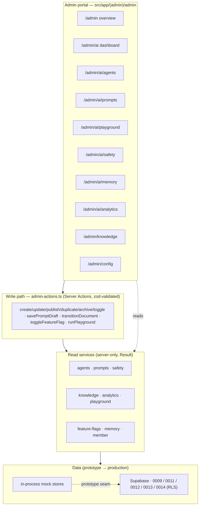
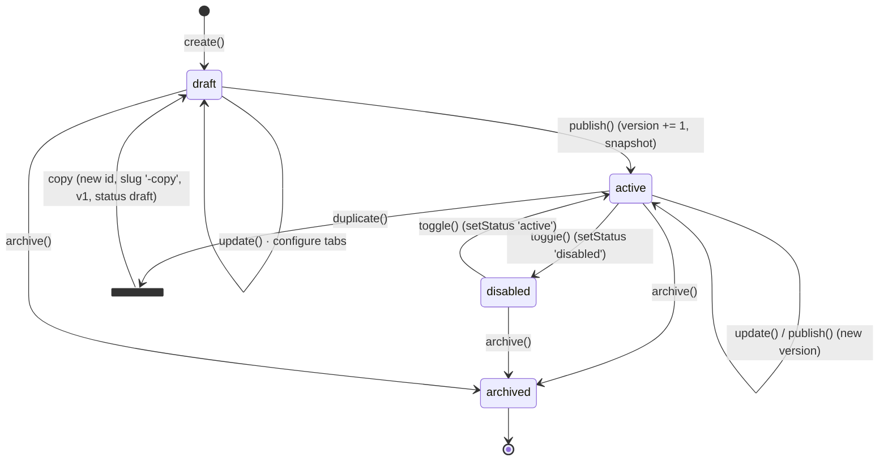
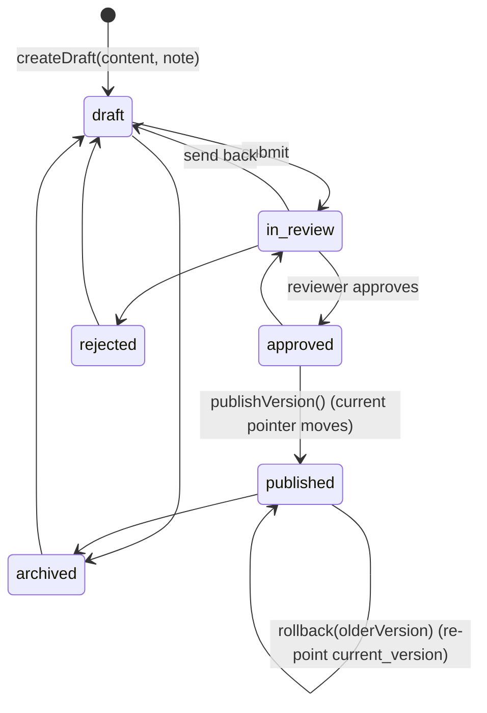
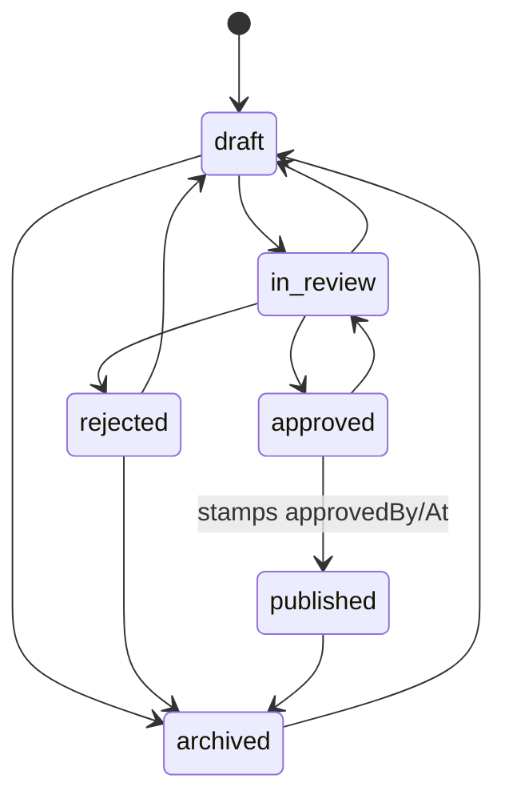
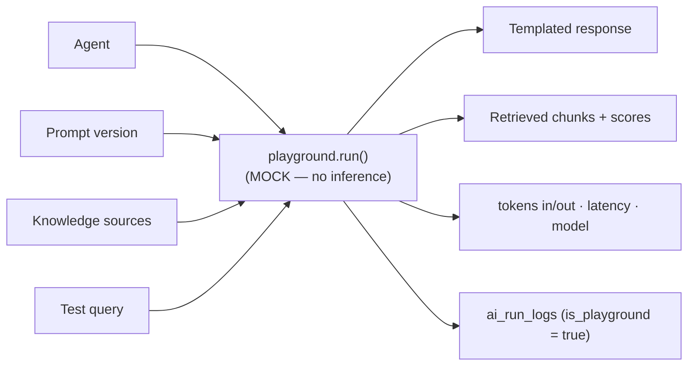
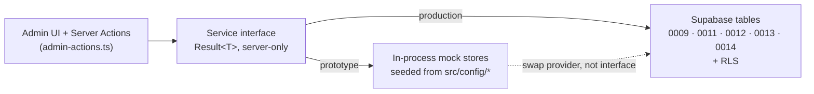

# 13 · AI Management Platform

> **Status:** Prototype (demonstration only). **No real AI or inference runs.** This document describes the Phase‑3 *AI management platform* — the admin surface and service layer through which every aspect of AI behaviour is **configured, not coded**. Prompts, personalities, temperatures, models, tools, knowledge and safety are all **data** managed from the dashboard. The prototype backs this with server‑only mock stores; production repoints the identical services at Supabase (migrations 0009 / 0012 / 0014) with no interface change.

**Canonical sources referenced by this document**

| Concern | File |
| --- | --- |
| Phase‑3 schema (source of truth) | [`db/migrations/0014_ai_platform_management.sql`](../../db/migrations/0014_ai_platform_management.sql) |
| Agent schema (Phase 2) | [`db/migrations/0009_ai_agents.sql`](../../db/migrations/0009_ai_agents.sql) |
| Knowledge schema | [`db/migrations/0012_knowledge.sql`](../../db/migrations/0012_knowledge.sql) |
| Memory schema | [`db/migrations/0011_memory.sql`](../../db/migrations/0011_memory.sql) |
| Platform / feature flags schema | [`db/migrations/0013_platform.sql`](../../db/migrations/0013_platform.sql) |
| Agent registry (agents as data) | [`src/config/ai-agents.ts`](../../src/config/ai-agents.ts) |
| Model registry | [`src/config/ai-models.ts`](../../src/config/ai-models.ts) |
| Feature‑flag registry | [`src/config/feature-flags.ts`](../../src/config/feature-flags.ts) |
| Platform TypeScript model | [`src/types/ai-platform.ts`](../../src/types/ai-platform.ts), [`src/types/ai.ts`](../../src/types/ai.ts), [`src/types/knowledge.ts`](../../src/types/knowledge.ts) |
| Read services | [`agents`](../../src/services/agents.ts), [`prompts`](../../src/services/prompts.ts), [`safety`](../../src/services/safety.ts), [`analytics`](../../src/services/analytics.ts), [`playground`](../../src/services/playground.ts), [`knowledge`](../../src/services/knowledge.ts), [`feature-flags`](../../src/services/feature-flags.ts), [`member`](../../src/services/member.ts) |
| Write path (Server Actions) | [`src/services/admin-actions.ts`](../../src/services/admin-actions.ts) |
| Admin routes | [`src/app/(admin)/admin/`](../../src/app/(admin)/admin) |
| User dashboard routes | [`src/app/(dashboard)/dashboard/`](../../src/app/(dashboard)/dashboard) |
| Admin UI kit | [`src/components/admin/`](../../src/components/admin) |
| Sidebar navigation | [`src/components/layout/sidebar-nav.tsx`](../../src/components/layout/sidebar-nav.tsx) |

Related reading: [05 · AI Agent Framework](./05-ai-agent-framework.md), [06 · Knowledge Architecture](./06-knowledge-architecture.md), [07 · Memory Architecture](./07-memory-architecture.md), [02 · Authorization / RBAC](./02-authorization-rbac.md), [04 · RLS Security Model](./04-rls-security-model.md), [09 · Admin Foundation](./09-admin-foundation.md).

---

## 1. Principle: build once, configure forever

The single governing decision of Phase 3 is that **nothing about AI behaviour is hardcoded**. There is no `if (agent === 'assistant')` anywhere in the application, no prompt string baked into a component, no temperature literal in the runtime. Every knob an AI product exposes — which model answers, what it may say, what it may read, how it remembers, where it must stop — is a *row* the client edits from the dashboard.

**Why this matters for the client.** The client is a service business run by non‑engineers. They will want to reword a system prompt, tighten a policy boundary, spin up a seasonal assistant, or swap a larger model for a smaller one to control cost — on their own schedule, without a pull request or a deploy. In a governed product, a hardcoded prompt is not just slow to change; it is *ungoverned* — no version history, no review step, no rollback. Modelling everything as data turns every one of those changes into an auditable, versioned, reversible database write.

This is the platform's contract: **build the management surface once; the client configures the product forever.**

### What is configurable, where it lives, and who edits it

| Configurable thing | Where it lives (prototype → production) | Managed at | Editable by (permission) |
| --- | --- | --- | --- |
| Agents (name, role, visibility, status) | [`ai-agents.ts`](../../src/config/ai-agents.ts) → `ai_agents` (0009) | `/admin/ai/agents/[id]` | admin · `agents.create` / `agents.configure` |
| Personality / system prompt / temperature | agent row → `ai_agents` | `/admin/ai/agents/[id]` · Behaviour / Model | admin · `agents.configure` |
| Prompts (8 kinds, versioned) | [`prompts.ts`](../../src/services/prompts.ts) → `ai_prompts` + `ai_prompt_versions` (0014) | `/admin/ai/prompts/[id]` | admin · `agents.configure` |
| Model choice | [`ai-models.ts`](../../src/config/ai-models.ts) → `ai_models` (0009) | agent editor · Model | admin · `agents.configure` |
| Tools an agent may call | `AiAgentDefinition.tools` → `ai_tools` + `ai_agent_tools` (0009) | agent editor | admin · `agents.configure` |
| Knowledge (docs, categories, collections) | [`knowledge.ts`](../../src/services/knowledge.ts) → `knowledge_*` (0012 / 0014) | `/admin/knowledge` | admin · `knowledge.edit` / `knowledge.publish` |
| Safety policies | [`safety.ts`](../../src/services/safety.ts) → `ai_safety_policies` (0014) | `/admin/ai/safety` | admin only |
| Memory strategy (per agent) | `memory_config` jsonb → `ai_agents` (0009) / `ai_memory` (0011) | agent editor · Memory · `/admin/ai/memory` | admin · `agents.configure` |
| Feature flags | [`feature-flags.ts`](../../src/config/feature-flags.ts) → `feature_flags` (0013) | `/admin/config` | admin |
| Analytics / observability | [`analytics.ts`](../../src/services/analytics.ts) / [`playground.ts`](../../src/services/playground.ts) → `analytics_*` + `ai_run_logs` (0014) | `/admin/ai/analytics` · `/admin/ai/playground` | staff · `analytics.read` |

Everything on the left is **data**. The code on the right is written once — the *values* change forever after through the admin UI.

### The platform at a glance

The admin routes are `force-dynamic` and navigate via a grouped, path‑aware sidebar defined in [`sidebar-nav.tsx`](../../src/components/layout/sidebar-nav.tsx). Read pages call services directly; every mutation goes through a Server Action in [`admin-actions.ts`](../../src/services/admin-actions.ts).

> **RSC constraint we hit and how it is resolved.** The sidebar's nav config carries `lucide` icon *components* (functions), which are not serialisable and must not cross the server→client boundary. The fix: the entire `NAV` config lives **inside** the client `SidebarNav` module; the server layout passes only a serialisable `variant: 'admin' | 'dashboard'` string. See the comment block in [`sidebar-nav.tsx`](../../src/components/layout/sidebar-nav.tsx#L45).

---

## 2. Agent management

An agent is a **row, not a class** (see [05](./05-ai-agent-framework.md)). The platform manages its whole lifecycle as data transitions, each backed by a method on the [`agents`](../../src/services/agents.ts) service and a Server Action.

### Lifecycle

| Transition | Service method | Server Action | Effect |
| --- | --- | --- | --- |
| Create | `agents.create` | `createAgentAction` | New draft; unique‑slug guard; redirect to editor |
| Configure | `agents.update` | `updateAgentAction` | Patch fields; `updatedAt` bumped |
| Publish | `agents.publish` | `publishAgentAction` | `status = active`, `version += 1`, append version snapshot |
| Enable / disable | `agents.setStatus` | `toggleAgentAction` | Flip `active` ⇄ `disabled` |
| Duplicate | `agents.duplicate` | `duplicateAgentAction` | Clone as a fresh `draft` (`-copy` slug, v1) |
| Archive | `agents.archive` | `archiveAgentAction` | `status = archived` (retired, not deleted) |
| History | `agents.versions` | — | Newest‑first list of `AiAgentVersion` snapshots |

Publishing is the safety valve: it both flips status **and** writes an immutable snapshot into the version history, so an admin who breaks a prompt can always see and restore what changed.

### Agent anatomy

Every agent is one `AiAgent` ([`src/types/ai.ts`](../../src/types/ai.ts)) — the complete description the future runtime will interpret:

| Group | Fields | Notes |
| --- | --- | --- |
| Identity | `slug`, `name`, `description`, `role`, `organisationId`, `ownerId` | `slug` unique per org |
| Behaviour | `personality`, `systemPrompt` | Prompt history is managed separately (§3) |
| Model | `defaultModelId`, `temperature`, `maxOutputTokens` | Model picked from [`AVAILABLE_MODELS`](../../src/config/ai-models.ts) |
| Memory | `memoryConfig` (`useUser/Conversation/Organisation/GlobalMemory`, `maxItems`) | Mirrors `ai_agents.memory_config` jsonb (§7) |
| Safety | `safetyRules` (`blockedTopics`, `requireDisclaimer`, `escalateOn`, `maxTurns`) | Inline per‑agent guardrails; org policies live in the Safety Centre (§6) |
| Bindings | `tools`, `knowledgeCategories` | Wired via `ai_agent_tools` / `ai_agent_knowledge_sources` in production |
| Governance | `visibility` (`private`/`organisation`/`public`), `status`, `version` | |

The three seed agents in [`ai-agents.ts`](../../src/config/ai-agents.ts) demonstrate the range: the member‑facing **Assistant AI** (warm, `temperature 0.6`, all four memory scopes, blocks restricted topics), the **Intake & Triage Assistant** (methodical, `temperature 0.3`, escalates on red‑flag cases and safeguarding), and the staff‑only **Practitioner Copilot** (`private` visibility, `temperature 0.2`, cites sources, minimal guardrails).

### Editor tabs → config

The editor at `/admin/ai/agents/[id]` ([`agent-edit-form.tsx`](../../src/components/admin/agent-edit-form.tsx)) is nothing but a form over the agent row. Each panel/tab maps directly to a slice of the record:

| Tab / panel | Fields edited | Backing config |
| --- | --- | --- |
| General | `name`, `role`, `description`, `visibility` | identity + governance |
| Behaviour | `personality`, `systemPrompt` | behaviour (versioned in Prompt Management) |
| Model | `defaultModelId`, `temperature`, `maxOutputTokens` | model config |
| Memory | four `memoryConfig` toggles | memory strategy |
| Safety | `blockedTopics`, `escalateOn`, `requireDisclaimer` | inline `safetyRules` |
| Versions | read‑only snapshot list (`agents.versions`) | history |

`updateAgentAction` validates the whole form with zod (e.g. `temperature` 0–2, `maxOutputTokens` 1–200000) before it touches the store — the same guard production keeps in front of Supabase.

---

## 3. Prompt management

A system prompt is the operative instruction of an assistant — exactly the artefact that demands review and rollback. Phase 3 promotes prompts out of the agent row into their own **versioned, workflowed** store: [`ai_prompts`](../../db/migrations/0014_ai_platform_management.sql#L29) (the named prompt + pointer to its current version) and [`ai_prompt_versions`](../../db/migrations/0014_ai_platform_management.sql#L47) (immutable history), served by [`prompts.ts`](../../src/services/prompts.ts).

### The eight prompt kinds

The `prompt_kind` enum composes an agent's behaviour from distinct, individually versioned blocks ([`src/types/ai-platform.ts`](../../src/types/ai-platform.ts#L10)):

| Kind | Purpose |
| --- | --- |
| `system` | The core system prompt |
| `developer` | Developer / operator instructions |
| `instruction` | A reusable instruction block |
| `behaviour` | A behaviour rule set |
| `restriction` | Explicit restrictions |
| `safety` | Safety directives |
| `style` | Conversation style / tone |
| `welcome` | The welcome / greeting message |

Prompts are **agent‑scoped when `agent_id` is set, org‑global when it is null** — so a shared safety directive can be authored once and reused. The prototype seeds each agent with a `system`, `welcome` and `style` prompt.

### Versioned draft → review → approved → published workflow

Prompt versions move through the shared `publish_status` state machine (defined once in [`knowledge.ts`](../../src/services/knowledge.ts#L21) as `PUBLISH_TRANSITIONS` and reused here):

| Operation | Method | Server Action | What it does |
| --- | --- | --- | --- |
| New draft | `promptService.createDraft` | `savePromptDraftAction` | Appends `maxVersion + 1` as a `draft`; sets prompt status `draft` |
| Publish | `promptService.publishVersion` | `publishPromptVersionAction` | Marks version `published`, stamps `approvedBy/At`, moves `current_version` |
| Roll back | `promptService.rollback` | `rollbackPromptAction` | Re‑points `current_version` at an older version (a publish of the past) |
| Compare | `promptService.compare` | — | Returns two versions for side‑by‑side diff in the editor |
| Read current | `promptService.currentContent` | — | Resolves the published content the runtime would use |

The current prompt content is **never edited in place** — editing always mints a new draft. Rollback is therefore trivially safe: `current_version` is a pointer, and every version it can point to is immutable. This is the governance payoff of modelling prompts as data.

### How prompts relate to agents

The agent's `systemPrompt` field and the `system`‑kind prompt in Prompt Management describe the *same* behaviour at two altitudes: the agent editor's Behaviour tab is the quick‑edit convenience, while `/admin/ai/prompts/[id]` is the governed, versioned source of truth (its hint text says as much). In production the runtime resolves an agent's live prompt by reading the current published version of its `system` prompt, not a frozen string.

---

## 4. Knowledge portal

The knowledge portal ([06 · Knowledge Architecture](./06-knowledge-architecture.md)) manages the corpus an agent may cite. Phase 3 adds **collections** on top of the Phase‑2 document/category model. Served by [`knowledge.ts`](../../src/services/knowledge.ts) over `knowledge_*` (migrations 0012 + 0014).

### The model

| Concept | Table | Role |
| --- | --- | --- |
| Document | `knowledge_documents` (0012) | A titled source with a `source_type`, `publish_status`, visibility and tags |
| Version | `knowledge_document_versions` (0012) | Immutable content/storage history |
| Category | `knowledge_categories` (0012) | The hierarchical taxonomy (`parent_id`) |
| Collection | [`knowledge_collections`](../../db/migrations/0014_ai_platform_management.sql#L95) (0014) | A *curated set* — e.g. an agent's reading list — independent of categories |
| Membership | [`knowledge_collection_documents`](../../db/migrations/0014_ai_platform_management.sql#L109) (0014) | Ordered docs within a collection |

Categories are the *taxonomy* (where a document belongs); collections are *curation* (which documents an agent is allowed to read). The prototype seeds an "Assistant Reading List" and a practitioner‑only "Practitioner Guidance" collection.

### Source types

`KnowledgeSourceType` ([`src/types/knowledge.ts`](../../src/types/knowledge.ts#L16)) covers today's formats and reserves tomorrow's, so ingestion can grow without a schema change:

| Available now | Reserved for later |
| --- | --- |
| `pdf`, `docx`, `txt`, `csv`, `markdown`, `url`, `manual` | `ocr` (scanned documents), `audio_transcript` (podcast/session audio) |

### Publishing workflow state machine

Documents move through the **same** `publish_status` machine as prompts, enforced by `canTransition()`; illegal moves are rejected by `knowledge.documents.transition` before any write:

Transitions are driven from the admin by `transitionDocumentAction`. Sharing one state machine across prompts *and* knowledge means one mental model, one set of transition rules, and one audit story for all governed content.

### Future vector search (deferred)

Embeddings are **intentionally not built yet**. `KnowledgeEmbedding` is a placeholder until `pgvector` is enabled, gated behind the `knowledge.vector_search` feature flag (default off — "needs pgvector") in [`feature-flags.ts`](../../src/config/feature-flags.ts#L33). Until then the playground's "retrieved chunks" are mocked; the seam is ready so retrieval can be switched on without reshaping the portal.

---

## 5. AI Playground

The playground at `/admin/ai/playground` ([`playground-console.tsx`](../../src/components/admin/playground-console.tsx), service [`playground.ts`](../../src/services/playground.ts)) lets an admin test an **agent + prompt version + knowledge** and see exactly what a member would get — *without* touching production.

`playground.run()` returns a `PlaygroundResult`: a templated answer, simulated `RetrievedChunk[]`, estimated `tokensInput`/`tokensOutput` and a synthetic `latencyMs`. It explicitly announces itself as a simulation. `runPlaygroundAction` is the one Server Action that **returns a value** to the client rather than redirecting, because the console renders the result inline.

### Why `is_playground` isolation matters

Every run — playground now, production later — is written to [`ai_run_logs`](../../db/migrations/0014_ai_platform_management.sql#L162) for observability. Playground runs carry `is_playground = true`. This flag is load‑bearing:

- **Analytics stay honest.** Test traffic must never inflate conversation counts, token spend, satisfaction or escalation rates. The analytics rollups read only production events; playground logs are excluded.
- **One code path, one log table.** Production doesn't need a parallel logging system — the same table and shape serve both, distinguished by one boolean.
- **RLS still applies.** The `run_logs_read` policy lets staff read org runs *and* lets an actor read their own playground runs (`actor_id = auth.uid()`), so testers see their experiments without broad grants.

When real inference lands, only `run()` changes — from a templated mock to an isolated model call still stamped `is_playground = true`. The isolation contract does not move.

---

## 6. Safety management

Guardrails are configurable data, not conditionals in code. Two tables model this: [`ai_safety_policies`](../../db/migrations/0014_ai_platform_management.sql#L64) (the reusable policy) and [`ai_agent_safety_policies`](../../db/migrations/0014_ai_platform_management.sql#L88) (a many‑to‑many binding of policies to agents). Served by [`safety.ts`](../../src/services/safety.ts); managed at `/admin/ai/safety` (admin‑only in RLS).

| Configurable control | Field | Prototype example |
| --- | --- | --- |
| Allowed topics | `allowedTopics` | `topic one`, `topic two`, `topic three`, `topic four`, `the Framework` |
| Restricted topics | `restrictedTopics` | `restricted one`, `restricted two`, `restricted three`, `restricted four` |
| Medical boundaries | `medicalBoundaries` | "Never overstep scope", "Never give binding advice", "Advise seeing a professional" |
| Emergency responses | `emergencyResponses` (jsonb) | `self_harm` → crisis resources + escalate; `acute_case` → urgent care |
| Content filters | `contentFilters` (jsonb) | `profanity: block`, `pii: redact` |
| Escalation rules | `escalationRules` (jsonb) | `onLowConfidence: handoff`, `onRestrictedTopic: decline_and_redirect` |
| Confidence threshold | `confidenceThreshold` | `0.7` — below this, defer/handoff |
| Human escalation | `humanEscalation` (bool) | `true` for member‑facing, `false` for staff copilot |
| Role restrictions | `roleRestrictions` (`app_role[]`) | practitioner policy limited to `practitioner`/`staff`/`administrator` |

Two seed policies show the split: a strict **Default policy** (safe by default, escalates on self‑harm/acute cases) and a looser, staff‑only **Practitioner‑copilot policy**. Because policies are separate rows bound to agents, one boundary change (e.g. adding a restricted topic) applies to every agent sharing that policy — no per‑agent editing, no redeploy. `safety.save()` handles both create (id `null`) and update, mirroring the future Supabase upsert.

---

## 7. Memory centre

The memory model ([07 · Memory Architecture](./07-memory-architecture.md), [`memory.ts`](../../src/services/memory.ts)) exposes one uniform read/write API across **six scopes**, discriminated by a `MemorySelector` so callers cannot mix scopes by accident:

| Scope | Keyed by | Holds |
| --- | --- | --- |
| `session` | `sessionId` + `userId` | Ephemeral working state |
| `user` | `userId` | Durable facts/preferences about a member |
| `conversation` | `conversationId` | Running summary of one thread |
| `agent` | `agentId` + `organisationId` | What an agent has learned org‑wide |
| `organisation` | `organisationId` | Tenant‑shared knowledge |
| `global` | — | Platform‑wide defaults |

Per‑agent memory configuration is stored on the agent itself as `memoryConfig` (mirrors `ai_agents.memory_config` jsonb): four booleans — `useUserMemory`, `useConversationMemory`, `useOrganisationMemory`, `useGlobalMemory` — plus `maxItems` capping how much is injected into context. This is edited on the agent editor's Memory tab and surfaced across agents at `/admin/ai/memory`. The Assistant opts into all four scopes; the Copilot skips user memory (it serves practitioners, not members). RLS on `ai_memory` (0011) enforces the same isolation the selector expresses in code.

---

## 8. Analytics foundation

Observability is built on an **append‑only event stream plus a pre‑aggregated daily rollup**, so dashboards are fast and history is immutable ([`analytics.ts`](../../src/services/analytics.ts)):

- [`analytics_events`](../../db/migrations/0014_ai_platform_management.sql#L123) — every `conversation_started`, `message_sent`, `knowledge_retrieved`, `feedback_given`, `escalated`, `agent_run`, `token_usage`, with `tokens_input/output`, `cost_micros` (millionths of the org currency) and `latency_ms`.
- [`analytics_daily_rollup`](../../db/migrations/0014_ai_platform_management.sql#L140) — one pre‑aggregated row per org/day/agent for the dashboard widgets (conversations, messages, active users, escalations, tokens, cost, avg latency, satisfaction).

The AI Analytics page (`/admin/ai/analytics`) renders these via the admin kit's `StatCard`/`StatGrid` and the SVG `MiniBarChart`:

| Widget | Service method | Source |
| --- | --- | --- |
| Headline KPIs (conversations, active users/agents, escalation rate, avg response, satisfaction, tokens & cost this month) | `analytics.summary` | rollup aggregate |
| Daily trend series | `analytics.daily(days)` | 30‑day rollup |
| Popular questions | `analytics.popularQuestions` | event stream |
| Knowledge usage (retrievals per document) | `analytics.knowledgeUsage` | `knowledge_retrieved` events |

**Cost and token tracking are first‑class.** `cost_micros` and token counts live on both the event and the rollup, and flow through the playground's per‑run metrics — so the client can watch spend per agent and make model‑swap decisions (Opus → Sonnet → Haiku) as a configuration choice. Prototype figures are deterministic mocks (a seeded generator, no `Math.random`) so the dashboards are always fully populated and reproducible.

---

## 9. The prototype → production seam

The whole platform is written **production‑shaped and mock‑backed**. Every read service is `server-only`, returns a `Result<T>` ([`result.ts`](../../src/services/result.ts)), and hides its store behind an interface that does not change when the data source does. CRUD is interactive within a session (in‑process mutable stores) and resets on restart — the visible "prototype" tell.

| Domain | Prototype store | Production table(s) | Interface changes? |
| --- | --- | --- | --- |
| Agents | `agents.ts` array seeded from [`ai-agents.ts`](../../src/config/ai-agents.ts) | `ai_agents`, `ai_agent_versions` (0009) | none |
| Prompts | `prompts.ts` array seeded per agent | `ai_prompts`, `ai_prompt_versions` (0014) | none |
| Safety | `safety.ts` array | `ai_safety_policies`, `ai_agent_safety_policies` (0014) | none |
| Knowledge | `knowledge.ts` seed docs/categories/collections | `knowledge_*` (0012 / 0014) | none |
| Analytics | `analytics.ts` seeded generator | `analytics_events`, `analytics_daily_rollup` (0014) | none |
| Run logs | `playground.ts` array | `ai_run_logs` (0014) | `run()` swaps mock → inference |
| Feature flags | `feature-flags.ts` `Map` override | `feature_flags`, `feature_flag_overrides` (0013) | none |
| Memory | `memory.ts` array | `ai_memory` (0011) | none |

**What production adds, and where it already fits.** RLS on all 0014 tables scopes reads/writes to the org and re‑enforces the RBAC gates the UI already respects — `prompts_write`/`safety_write` require admin or `agents.configure`; `analytics_*_read` require staff; `run_logs_read` allows an actor their own playground runs (see [04 · RLS](./04-rls-security-model.md), [02 · RBAC](./02-authorization-rbac.md)). The Server Actions in [`admin-actions.ts`](../../src/services/admin-actions.ts) already carry the zod validation and the `assertPermission('agents.*')` seam their production selves need. Turning the prototype into product is therefore a **wiring change behind the service seam** — repoint the stores at Supabase, swap `playground.run()` for real inference, enable `knowledge.vector_search` — not a rewrite. The management surface was built once; the client configures it forever.

---

### Appendix · Admin & dashboard route map

| Admin (`src/app/(admin)/admin`) | User dashboard (`src/app/(dashboard)/dashboard`) |
| --- | --- |
| `/admin` overview · `/admin/ai` AI dashboard | `/dashboard` overview · `/dashboard/onboarding` (wizard) |
| `/admin/ai/agents` (`/new`, `/[id]` editor + versions) | `/dashboard/goals` · `/dashboard/profile` (health/fitness/nutrition) |
| `/admin/ai/prompts` (`/[id]` versioned editor) | `/dashboard/assessments` · `/dashboard/journey` (timeline) |
| `/admin/ai/playground` · `/admin/ai/safety` · `/admin/ai/memory` | `/dashboard/bookings` · `/dashboard/conversations` (saved chats) |
| `/admin/ai/analytics` | `/dashboard/notifications` · `/dashboard/settings` |
| `/admin/knowledge` (`/[id]`) · `/admin/users` | User dashboard is served by [`member.ts`](../../src/services/member.ts); AI chat is Phase‑next (`ai.chat` flag off). |
| `/admin/consultations` (`/[id]`) · `/admin/config` · `/admin/audit` | |
