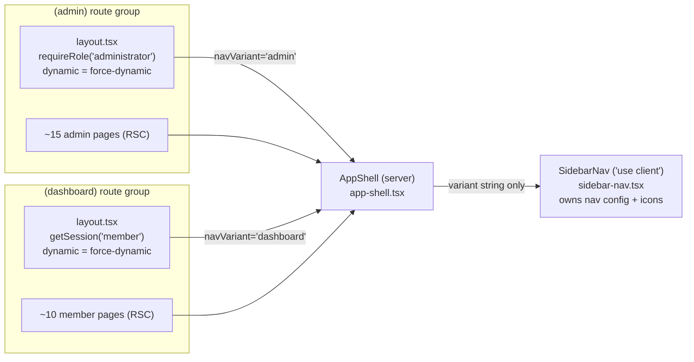
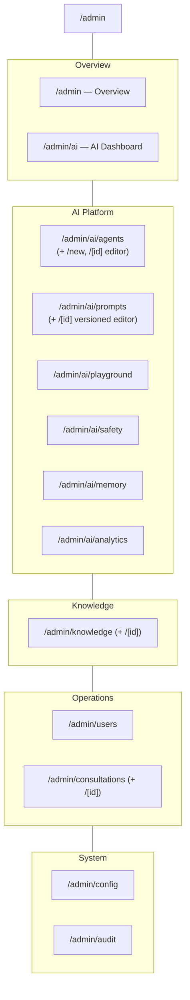
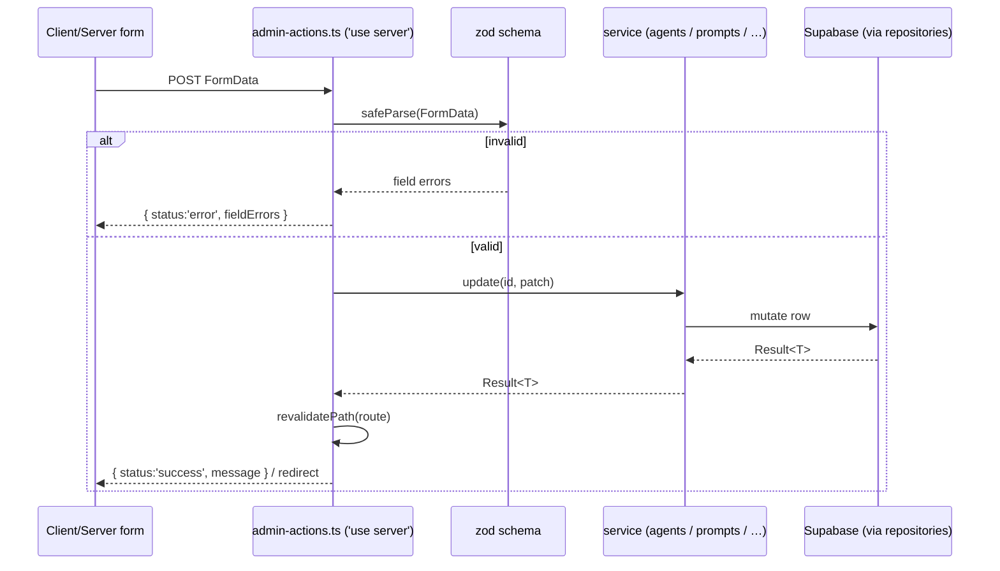

# 14 · Admin Portal & User Dashboard

> **Written in Phase 3; status updated 2026-08-10.** This document explains the two authenticated shells the platform ships — the operator-facing **admin portal** (`(admin)`) and the member-facing **user dashboard** (`(dashboard)`) — and *why* they are built the way they are. When first written, no AI ran and the services mutated in-process mock stores. Today both shells are **live**: real Supabase Auth gates them, the services read and write real Supabase Postgres rows, live Anthropic Claude inference powers member conversations and the admin playground, and member surfaces show each user's own data. Payments remain manual records (no payment provider), and AI replies are AI-generated and not clinically reviewed. Every surface is still a **React Server Component that `await`s a server-only service** — the pages did not change when the data went live.

The governing principle of Phase 3 is **"build once, configure forever"**: nothing about AI behaviour is hardcoded. Prompts, personalities, temperatures, models, safety rules, knowledge and feature flags are all *data* managed through the admin portal documented here. The two shells are the human interface onto that data.

- The admin portal builds on the Phase 2 foundation described in [`09-admin-foundation.md`](09-admin-foundation.md).
- RBAC gating is defined in [`02-authorization-rbac.md`](02-authorization-rbac.md); RLS re-enforcement in [`04-rls-security-model.md`](04-rls-security-model.md).
- The AI data model these surfaces edit lives in [`05-ai-agent-framework.md`](05-ai-agent-framework.md) and migration `db/migrations/0014_ai_platform_management.sql`.

---

## 1. The two authenticated shells

Both authenticated areas are App Router **route groups** — `src/app/(admin)/` and `src/app/(dashboard)/` — so each gets its own layout and URL protection without leaking the group segment into the URL (`/admin`, `/dashboard`, not `/(admin)/admin`). Crucially, **both mount the same `AppShell`**. There is one shell, one sidebar component, one visual language; the difference between "operator" and "member" is a single serialisable string.

| File | Role |
| --- | --- |
| `src/components/layout/app-shell.tsx` | The shared shell: sticky sidebar (logo + nav + "back to site"), sticky top bar (name + role label + avatar), and the `<main>` content region. Server component. |
| `src/components/layout/sidebar-nav.tsx` | The **client** nav: owns the nav configuration (with its lucide icons) and computes the active route by path. |
| `src/app/(admin)/layout.tsx` | Establishes the admin session, renders `<AppShell navVariant="admin" roleLabel="Admin">`, and enforces the role gate (`requireRole('administrator')`, active whenever Supabase is configured). `export const dynamic = 'force-dynamic'`. |
| `src/app/(dashboard)/layout.tsx` | The member equivalent: `<AppShell navVariant="dashboard" roleLabel="Member area">`. Also `force-dynamic`. |



### Why `force-dynamic`

The service layer is **mutable at runtime**: creating an agent, saving a prompt draft or toggling a feature flag writes real database rows. If any admin page were statically prerendered or cached, it would show stale data after a mutation. `export const dynamic = 'force-dynamic'` on both layouts forces every render on demand, so the page always reflects the current state of the data. Combined with `revalidatePath(...)` in the write path (§4), a mutation is immediately visible on the next render.

### The RSC icon-passing lesson

The nav config maps each item to a **lucide icon component** — and icon components are *functions*. A React Server Component may not pass a function across the server→client boundary; doing so throws *"Functions cannot be passed directly to Client Components"*. We hit this early: the natural instinct is to define the nav (with icons) in the server layout and pass it down.

The fix is a deliberate seam. The `AppShell` (server) passes only a **serialisable `variant` string** (`'admin' | 'dashboard'`). The nav configuration — including every `LucideIcon` — lives *inside* `sidebar-nav.tsx`, which is a `'use client'` module. The client component looks up its own config by variant:

```ts
// sidebar-nav.tsx — client module, so icons never cross the boundary
const NAV: Record<NavVariant, ShellNavSection[]> = {
  admin: [ { title: 'Overview', items: [{ label: 'Dashboard', href: '/admin', icon: LayoutDashboard }, … ] }, … ],
  dashboard: [ { items: [{ label: 'Overview', href: '/dashboard', icon: LayoutDashboard }, … ] } ],
};
```

Active state is a **longest-prefix match** on `usePathname()` (so `/admin/ai/agents/new` highlights *Agents*, not *AI Dashboard*), which is why the nav must run on the client: it needs the live pathname.

---

## 2. The admin portal

The admin portal is the **AI management platform**: the place an operator turns the "configure forever" promise into action. It is organised into five nav groups. Every surface follows the same discipline established in Phase 2 — **a view over a service over a table** — with, in Phase 3, an added *write path* (§4).



### Surface → route → permission → service/table

Every surface is gated by an RBAC **permission** (from `src/config/permissions.ts`) and backed by exactly one service, which in production maps to a table (mostly from migrations `0009`, `0012`, `0014`).

| Surface | Route | Required permission | Backing service | Prod table(s) |
| --- | --- | --- | --- | --- |
| Overview | `/admin` | `analytics.read` | `admin.ts` | (aggregate) |
| AI Dashboard | `/admin/ai` | `agents.read` | `agents.ts`, `analytics.ts` | `ai_agents`, `analytics_*` |
| Agents (list) | `/admin/ai/agents` | `agents.read` | `agents.ts` | `ai_agents` |
| Agent — new | `/admin/ai/agents/new` | `agents.create` | `agents.ts` → `admin-actions.ts` | `ai_agents` |
| Agent — editor | `/admin/ai/agents/[id]` | `agents.update` / `agents.configure` | `agents.ts` → `admin-actions.ts` | `ai_agents`, `ai_agent_versions` |
| Prompts (list) | `/admin/ai/prompts` | `agents.read` | `prompts.ts` | `ai_prompts` |
| Prompt — editor | `/admin/ai/prompts/[id]` | `agents.update` | `prompts.ts` → `admin-actions.ts` | `ai_prompts`, `ai_prompt_versions` |
| Playground | `/admin/ai/playground` | `agents.read` | `playground.ts` → `admin-actions.ts` | `ai_run_logs` (`is_playground=true`) |
| Safety Centre | `/admin/ai/safety` | `agents.configure` | `safety.ts` | `ai_safety_policies`, `ai_agent_safety_policies` |
| Memory Centre | `/admin/ai/memory` | `memory.read` / `memory.manage` | (page is illustrative — coming soon; `ai_memory` rows are real) | memory scopes (`0011`) |
| Analytics | `/admin/ai/analytics` | `analytics.read` | `analytics.ts` | `analytics_events`, `analytics_daily_rollup` |
| Knowledge base | `/admin/knowledge` | `knowledge.read` | `knowledge.ts` | `knowledge_collections`, `knowledge_collection_documents` |
| Knowledge — doc | `/admin/knowledge/[id]` | `knowledge.approve` / `knowledge.publish` | `knowledge.ts` → `admin-actions.ts` | knowledge docs (`0012`) |
| Users | `/admin/users` | `users.read` | `admin.ts` | `profiles` (`0003`) |
| Consultations | `/admin/consultations` (+ `/[id]`) | `consultations.read` | `consultations.ts` | consultation workflow (`0007`) |
| Configuration | `/admin/config` | `feature_flags.manage` | `feature-flags.ts` → `admin-actions.ts` | feature flags (`0013`) |
| Audit logs | `/admin/audit` | `audit.read` | `admin.ts` | `audit_logs` (`0013`) |

### How gating works — twice

Access control is enforced in **two independent places**, and this redundancy is intentional:

1. **RBAC gates the surface (app layer).** The permission catalogue in `src/config/permissions.ts` defines fine-grained `resource.action` capabilities and which roles hold them cumulatively. In production a guard (`assertPermission('agents.configure')`) runs before a page renders or an action mutates; a member — who holds *no* catalogue permissions — never sees `/admin` at all. The mutation-heavy AI surfaces sit behind the `agents.*`, `knowledge.*`, `feature_flags.manage` and `audit.read` permissions the `administrator` role adds.
2. **RLS re-enforces at the data layer (DB).** Every table from `0014` (and `0009`/`0012`) has row-level security on. Even if an app-level bug rendered the wrong page, the database refuses to return a row the caller's role/tenant may not see. The admin portal is *a lens, not a back door* — it can only display what the service, and beneath it RLS, hands it.

The gate is **live**: on the deployed platform the `(admin)` layout enforces `requireRole('administrator')` against real Supabase Auth sessions, and every privileged Server Action asserts the role/session at its top. Only keyless local development (no Supabase configured) falls back to a permissive canned admin so the portal still renders.

---

## 3. The reusable admin UI kit

The portal is ~25 pages. Consistency across that many surfaces is not achievable by copy-paste; it is achieved by a small, shared **admin UI kit** in `src/components/admin/`. Each page is assembled from the same primitives, so a change to (say) table styling or the status-pill palette lands everywhere at once, and a new page inherits the house style for free.

| Component | File | Purpose / why shared |
| --- | --- | --- |
| `AdminHeader` | `admin-header.tsx` | Page header: breadcrumbs + title + description + an `actions` slot. One header shape → every page's top region is instantly recognisable. Server component. |
| `Panel` | `panel.tsx` | A titled content card (optional header with title/description/actions, optional padding). The default container for everything below the header. |
| `StatCard` / `StatGrid` | `stat-card.tsx` | A single metric (label, value, optional icon + trend pill) and a responsive 4-up grid. Dashboards are built by dropping cards into the grid. |
| `DataTable<T>` | `data-table.tsx` | A generic, accessible table. Columns declare `header` + a `cell(row)` render fn, so agents, prompts, documents, users and consultations all render through **one** component with per-list columns. |
| `StatusBadge` | `status-badge.tsx` | Maps lifecycle strings (`published`, `draft`, `in_review`, `active`, `archived`, `private`/`organisation`/`public`, …) to a consistent coloured pill. One vocabulary of status colours across the portal. |
| `EmptyState` | `empty-state.tsx` | Icon + title + description + optional action, for zero-row lists. Empty is a designed state, not a blank div. |
| `Tabs` | `tabs.tsx` | A Radix-backed, keyboard-accessible tab set. `'use client'`. Powers the agent editor's *general / behaviour / model / memory / safety / versions* tabs and the profile tabs. |
| `MiniBarChart` | `mini-chart.tsx` | A dependency-free, **server-safe** SVG bar chart with an accessible label and `<title>` tooltips. Used for analytics widgets without shipping a charting library. |

Because these are the vocabulary, an admin page is mostly *composition*: `AgentsPage` (`src/app/(admin)/admin/ai/agents/page.tsx`) is an `AdminHeader` + a `Panel` wrapping a `DataTable<AiAgent>` with an `EmptyState` fallback — no bespoke layout, no bespoke styling. The list's row actions (publish / duplicate / archive / toggle) are tiny `<form action={…}>` icon buttons that post to the Server Actions in §4.

---

## 4. The write path — Server Actions

Reads flow *page → service → store*. Writes flow through a single dedicated module, `src/services/admin-actions.ts` (`'use server'`), which is the **only** place the admin portal mutates state. Keeping every mutation in one file makes the write surface auditable: it is the exhaustive list of things an operator can change.

Each action follows the same production-shaped contract:

1. **Validate with zod.** Every action parses `FormData` (or a typed input) against a schema — `createSchema`, `updateSchema`, `promptDraftSchema`, … — and returns a typed field-error result on failure. Nothing reaches the service unvalidated.
2. **(Production) permission-check + audit.** The comment seam at the top of the file marks where `assertPermission('agents.*')` and an audit write land in production, before the mutation runs.
3. **Call the service.** The action delegates to `agents` / `promptService` / `knowledge` / `featureFlags` / `playground`, all of which return a `Result<T>` (`{ ok: true, data } | { ok: false, error }`) — the same shape production uses.
4. **`revalidatePath(...)`** the affected route(s) so the `force-dynamic` page re-renders with fresh data, then optionally `redirect(...)` (e.g. to a newly created agent).



### Two form shapes, deliberately

The portal uses **both** kinds of form, matched to the interaction:

- **Server-component forms for single, no-input operations.** A publish/duplicate/archive/toggle button is a plain `<form action={publishAgentAction}>` with a hidden `id` — no client JS, no state. These actions return `Promise<void>`; they just mutate and `revalidatePath`. See the `IconAction` helper in `agents/page.tsx`.
- **Client forms with `useActionState` for validated, multi-field edits.** Where the operator types (create agent, edit agent, save a prompt draft), the form is a `'use client'` component that binds the action via `const [state, formAction] = useActionState(action, idleAction)`, renders `state.fieldErrors` inline, and shows pending UI via `useFormStatus()`. See `create-agent-form.tsx`, `agent-edit-form.tsx`, `prompt-editor.tsx`.

The **playground** is the one exception to the FormData pattern: `runPlaygroundAction` takes a typed input object and *returns* a `PlaygroundResult` straight to the client console (`playground-console.tsx`), because the "run" is an interactive request/response, not a navigation. It performs **real inference** (knowledge retrieval + a live model call) and writes an `ai_run_logs` row flagged `is_playground=true` so test runs never pollute real observability. See [`05-ai-agent-framework.md`](05-ai-agent-framework.md).

---

## 5. The user dashboard

The `(dashboard)` shell is the member's home. It shares the shell and the entire UI kit with the admin portal (the dashboard overview is built from `AdminHeader` + `StatGrid`/`StatCard` + `Panel` + `EmptyState`), but its nav is a single flat group and its data comes from one read-only service: `src/services/member.ts`.

| Surface | Route | Backed by (`member.ts`) |
| --- | --- | --- |
| Overview | `/dashboard` | `progress()`, `upcoming()`, `recommendations()`, `goals()` |
| Onboarding | `/dashboard/onboarding` | multi-step wizard (client), no service read |
| My goals | `/dashboard/goals` | `goals()` |
| Health profile | `/dashboard/profile` | `healthProfile()`, `fitnessProfile()`, `nutritionProfile()` (tabbed via `Tabs`) |
| Assessments | `/dashboard/assessments` | `assessments()` |
| Journey | `/dashboard/journey` | `journey()` (timeline) |
| Bookings | `/dashboard/bookings` | `upcoming()` |
| Conversations | `/dashboard/conversations` | `savedConversations()` — **live AI conversations** |
| Notifications | `/dashboard/notifications` | `notifications()` |
| Settings | `/dashboard/settings` | preferences |

`member.ts` is `import 'server-only'` and returns the **member's real records** wrapped in the same `Result<T>` shape as every other service: it reads the signed-in user's *own* rows (`health_profiles`, `goals`, appointments, journey, conversations, …) with per-user ownership checks and RLS behind it — no permission catalogue entry needed, because a member's access to their own data is granted by **ownership** (`user_id = auth.uid()`), not by an RBAC permission (see `src/config/permissions.ts`, and [`02-authorization-rbac.md`](02-authorization-rbac.md)).

### The onboarding wizard

`src/components/dashboard/onboarding-wizard.tsx` is a `'use client'` multi-step flow — *Welcome → Your goals → Health basics → Preferences → Done* — with a progress rail, per-step validation (you cannot continue past "goals" with none selected), and back/next controls. Its answers are **still not stored** (the UI says so honestly); a real submit would write `health_profiles` / `goals` / preferences. It remains interface-only — the exception among member surfaces, which otherwise read and write real data.

### Conversations are live

The **Conversations** surface lists the member's real AI chats from `member.savedConversations()`, and the chat experience itself is **built and live**: streaming replies from the HERNE specialists via real Anthropic Claude inference, consuming the agents, published prompts and safety machinery configured in the admin portal, with citations, usage limits and run logging on every turn. (Conversations can be archived; a delete UI is not built.)

---

## 6. Runtime behaviour today

The Phase-3 prototype seam (in-process mock stores, mutations lost on restart, canned data) has been **crossed** — understanding today's behaviour prevents surprise:

- **Real persistence.** The admin services (`agents`, `prompts`, `knowledge`, `featureFlags`, `playground`) read and write Supabase Postgres rows (`0009` / `0012` / `0014` tables) through server-only repositories, idempotently seeded from the config registries and the HERNE pack. CRUD survives restarts and applies across instances.
- **Real AI.** The playground and member conversations run live Anthropic Claude inference; every call is logged to `ai_run_logs` with tokens, cost and latency.
- **Real member data.** `member.ts` reads the signed-in member's own rows behind ownership checks and RLS.
- **No payment provider.** Subscription payments are manual records by design; pricing is "price on request". AI replies are AI-generated and **not clinically reviewed** — not for emergencies.
- **The swap happened below the pages.** Agents, prompts and policies became **rows**; the pages, the UI kit and the Server Actions did not change — they already consumed async, `Result`-typed, RLS-shaped interfaces. That was the whole point of the seam.

---

## How to add a new admin page

The portal is designed so a new management surface is four small, mechanical steps — no new patterns:

1. **Add a service method.** Extend the relevant service in `src/services/` (or add one) with an async getter returning `Result<T>`. If the page mutates, add a zod-validated Server Action to `src/services/admin-actions.ts` that calls the service and `revalidatePath`s.
2. **Add a nav item.** In `src/components/layout/sidebar-nav.tsx`, add `{ label, href, icon }` to the appropriate group in the `admin` variant. (Icon lives here, in the client module — never pass it from a server component.)
3. **Create the page.** Add `src/app/(admin)/admin/<path>/page.tsx` as a Server Component that `await`s the service getter and composes the UI kit (`AdminHeader` + `Panel` + `DataTable`/`StatGrid`/`Tabs` + `EmptyState`). The `force-dynamic` from the layout applies automatically.
4. **Gate it with a permission.** Pick or add a `resource.action` key in `src/config/permissions.ts`, grant it to the right role(s), and (in production) `assertPermission(...)` at the top of the page and any action. RLS on the backing table re-enforces the same rule at the data layer.

---

### Related documents

- [`09-admin-foundation.md`](09-admin-foundation.md) — the Phase 2 foundation this portal fills in
- [`02-authorization-rbac.md`](02-authorization-rbac.md) — the permission catalogue and role model
- [`04-rls-security-model.md`](04-rls-security-model.md) — DB-layer re-enforcement
- [`05-ai-agent-framework.md`](05-ai-agent-framework.md) — the agent/prompt/safety/playground data model the portal edits
- [`06-knowledge-architecture.md`](06-knowledge-architecture.md) — the knowledge workflow behind `/admin/knowledge`
