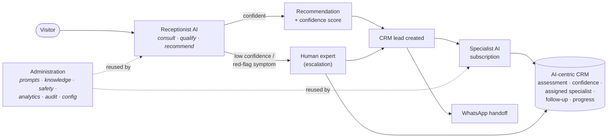

# 15 · The AI Business Lifecycle

> **⚠️ Correction (2026‑07‑11) — read first.** An earlier draft of this document introduced **unauthorised assumptions** that have since been corrected in code. The authoritative model is:
> - **Four** specialist AIs, not five — currently **configurable placeholders** (`Specialist AI 1–4`). Their names, codes, purposes, behaviour, pricing and knowledge are client‑supplied, admin‑configurable data. Any specific specialist names/descriptions/prices below were invented and are **void**.
> - Escalation goes to a **configurable escalation target** (the client or an authorised team member), **not** a generic "human expert".
> - The confidence threshold, consultation questions and routing are a **replaceable mock in configuration** (`config/receptionist.ts`), **not** approved rules.
> - No public receptionist/specialist pages exist — the accepted frontend is unchanged; the receptionist operates via **backend hooks** pending an approved integration point.
> - This is an **AI agent system representing the client**, not a generic wellness marketplace.

> **Scope.** How the platform was refocused from an *AI builder* into an *AI business*. The product we demonstrate is not "how to build AI models" — it is **how a client operates an AI business** with a Receptionist AI front door, Specialist AI subscription products, and an AI‑centric CRM. All the reusable infrastructure from Phases 2–3 (versioning, prompts, knowledge, safety, analytics, audit, configuration, publishing workflows, admin framework) is **preserved and reused**; only the *experience* is reorganised.

> **Prototype status.** Everything below runs on mock services (in‑process stores) with **no live AI, payments or patient data**. The receptionist's recommendation is rule‑based; production swaps that one function for a model call and the stores for the `0015` tables.

---

## 1. The lifecycle

The whole platform is organised around one journey:

Four stages, each a section of the admin portal: **Receptionist AI → Specialist AIs → CRM → Administration.**

---

## 2. The Receptionist AI — the front door

Every visitor starts with the receptionist (`/start`). It is a single agent (`kind='receptionist'`) that:

1. **Consults** — a short, data‑driven script (`receptionist.questions`, editable in admin).
2. **Qualifies & recommends** — maps the answers to the best specialist with a **confidence score** (`receptionist.consult()`).
3. **Creates a CRM lead** — capturing the assessment and recommendation.
4. **Hands off** — to a specialist subscription, to **WhatsApp**, or…
5. **Escalates to a human expert** — automatically when confidence is below `CONFIDENCE_THRESHOLD` (0.6) or a red‑flag symptom is mentioned.

| Concern | Where |
| --- | --- |
| Consultation script | `receptionist.questions` (data) |
| Recommendation logic | `services/receptionist.ts` → `consult()` (rule‑based; prod = model call) |
| Confidence threshold | `CONFIDENCE_THRESHOLD` |
| Public flow | `components/receptionist/receptionist-console.tsx` + `/start` |
| Server actions | `services/receptionist-actions.ts` (`consult`, `createLead`) |
| Admin | `/admin/receptionist` (identity, script, routing, escalation queue) |

The receptionist is still a normal agent, so its prompt, model, memory and safety are managed by the **same** agent editor and modules as any specialist — nothing bespoke.

---

## 3. Specialist AIs — subscription products

A specialist is an agent with `kind='specialist'` and a **commercial identity** (`product`): tagline, expertise, price, accent. This reuse means a specialist already has its own prompts, knowledge, memory, safety, versioning and analytics — we simply present it as a **product**.

Each specialist has its own:

| Facet | Backed by |
| --- | --- |
| Identity, prompt, behaviour | `ai_agents` + prompt management (reused) |
| Knowledge base | knowledge portal (reused) |
| Memory | the six memory scopes (reused) |
| Safety | safety policies (reused) |
| **Subscriptions & customers** | `specialist_subscriptions` (new, 0015) |
| **Business analytics** | `specialists.analytics()` (subscribers, MRR, churn, satisfaction) |
| **Conversation history** | `conversations`/`messages` scoped by `agent_id` (Phase‑next AI) |

- Public: `/specialists` (catalogue) + `/specialists/[slug]` (product page, subscribe CTA).
- Admin: `/admin/specialists` (products) + `/admin/specialists/[id]` (Overview · Subscribers · Analytics · Conversations, linking to the shared capability modules).

The seed roster (`config/ai-agents.ts`): one Receptionist + five specialists (Hydration, Nutrition, Sleep & Recovery, Movement, Wellbeing Companion) + one internal copilot. The client adds more from the admin dashboard — **no code change**.

---

## 4. The AI‑centric CRM

The CRM is the operational core. Every lead is **created by the receptionist** and is AI‑centric by design — it stores exactly what the brief requires:

- the **receptionist assessment** (summary + structured answers),
- the **recommendation confidence**,
- the **assigned specialist AI**,
- the **follow‑up status**, and
- the **customer progress**,

plus an **append‑only activity timeline** (`crm_lead_events`).

| Concern | Where |
| --- | --- |
| Model | `types/crm.ts` (`CrmLead`, `CrmLeadEvent`) · migration `0015` |
| Service | `services/crm.ts` (list, byId, events, pipeline, escalationQueue, create, updateStatus) |
| Admin | `/admin/crm` (pipeline + escalation queue + all leads) · `/admin/crm/[id]` (assessment, recommendation, follow‑up, timeline, escalation) |
| Roll‑up | `services/business.ts` → the AI Business Dashboard (`/admin`) |

---

## 5. What was reused vs. added

**Reused unchanged** — the agent editor, prompt management (versioned + workflow), knowledge portal, safety centre, memory centre, analytics, audit logs, configuration centre, the admin UI kit, RBAC + RLS, and the whole Phase 1–3 frontend framework.

**Added (additive only)** — a business identity on agents (`kind` + `product`), the receptionist consultation + routing, the specialist‑as‑product surface, the AI‑centric CRM, specialist subscriptions, and the business roll‑up. New tables live in migration **`0015`**; the model extends `ai_agents` rather than replacing it.

**Reorganised** — the admin sidebar now reads **Business · Receptionist AI · Specialist AIs · CRM · Administration**, and the public site leads with *"Meet your AI wellness team"* (receptionist → specialists → human), rather than an AI‑builder framing.

---

## 6. The prototype → production seam

Unchanged in spirit from earlier phases: services are server‑only and return the production shapes; the mock stores swap for the `0015` tables, and `receptionist.consult()` swaps for a real model call behind the same signature. The confidence threshold, consultation script, routing rules, specialist products and safety policies are all **data**, so the client tunes the business without a deploy — *build once, configure forever.*
