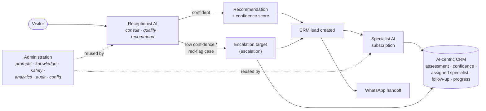

# 15 · The AI Business Lifecycle

> **⚠️ Update (2026‑07‑13) — read first.** The specialist roster is now the **eight client‑approved HERNE specialists** — Makela, Serena, Atlas, Aqua, Sage, Luca, Felix, Optimus — seeded from the HERNE developer pack by `services/herne/seed.ts`. The earlier generic placeholders (`Specialist AI 1–4`) have been **retired and removed** from the platform, seed data and database. Any specific placeholder names/descriptions/prices below are **void**. The authoritative model is:
> - **Eight** user‑facing specialists (all HERNE) plus **one** Receptionist AI (routing/escalation infrastructure — not a user‑facing specialist).
> - Escalation goes to a **configurable escalation target** (the client or an authorised team member), **not** a generic "human expert".
> - The confidence threshold, consultation questions and routing are **replaceable placeholder configuration** (`config/receptionist.ts`), **not** approved rules.
> - No public receptionist/specialist pages exist — the accepted frontend is unchanged; the receptionist operates via **backend hooks** pending an approved integration point.
> - This is an **AI agent system representing the client**, not a generic marketplace.

> **Scope.** How the platform was refocused from an *AI builder* into an *AI business*. The product is not "how to build AI models" — it is **how a client operates an AI business** with a Receptionist AI front door, Specialist AI subscription products, and an AI‑centric CRM. All the reusable infrastructure from Phases 2–3 (versioning, prompts, knowledge, safety, analytics, audit, configuration, publishing workflows, admin framework) is **preserved and reused**; only the *experience* is reorganised.

> **⚠️ Update (2026‑08‑10) — current status.** The seam described in §6 has been crossed. Today: the stores are **real Supabase Postgres tables**; the receptionist performs a **live AI structured assessment** (Anthropic Claude via `receptionist.assess()` — roster-constrained, confidence-thresholded, escalating honestly when it cannot recommend), rate-limited per visitor; specialist conversations stream live Claude replies; CRM leads/events, subscriptions and escalations are real rows. Public pages now exist for the specialists (`/specialists`, `/specialists/[slug]`) and the assistant entry (`/assistant`) — the 2026-07-13 bullets saying no such pages exist and that routing is replaceable placeholder configuration are superseded (routing is live AI; the *question script and threshold values* remain unapproved placeholders). Still true: **no payment provider** (subscription payments are manual records; pricing is "price on request"), the consultation questions/threshold are placeholder configuration pending client approval, and AI replies are AI-generated, not clinically reviewed, and not for emergencies. The earlier fictional seeded CRM leads and consultation cases have since been deleted from the live database; CRM rows now come only from real visitor activity.

---

## 1. The lifecycle

The whole platform is organised around one journey:

Four stages, each a section of the admin portal: **Receptionist AI → Specialist AIs → CRM → Administration.**

---

## 2. The Receptionist AI — the front door

Every visitor starts with the receptionist (`/assistant`). It is a single agent (`kind='receptionist'`) that:

1. **Consults** — a short, data‑driven script (`receptionist.questions`, editable in admin; the questions are placeholder configuration pending client approval).
2. **Qualifies & recommends** — a **live AI structured assessment** maps the answers to the best specialist with a **confidence score** (`receptionist.assess()`, constrained to the real roster).
3. **Creates a CRM lead** — capturing the assessment and recommendation as real rows.
4. **Hands off** — to a specialist subscription, to **WhatsApp**, or…
5. **Escalates to the escalation target** — automatically when confidence is below the threshold, a red‑flag case is mentioned, or the AI honestly cannot complete the assessment.

| Concern | Where |
| --- | --- |
| Consultation script | `receptionist.questions` (data; defaults in `config/receptionist.ts`, stored settings editable in admin) |
| Recommendation logic | `services/receptionist.ts` → `assess()` (live model call through the AI adapter) |
| Confidence threshold | `confidenceThreshold` in receptionist settings (`CONFIDENCE_THRESHOLD` default) |
| Public flow | `components/sections/receptionist-console.tsx` + `/assistant` |
| Server actions | `services/receptionist-actions.ts` (`receptionistAssessAction`, `receptionistLeadAction`, `receptionistWhatsappAction`) — rate-limited per visitor |
| Admin | `/admin/receptionist` (identity, script, routing, escalation queue) |

The receptionist is still a normal agent, so its prompt, model, memory and safety are managed by the **same** agent editor and modules as any specialist — nothing bespoke.

---

## 3. Specialist AIs — subscription products

A specialist is an agent with `kind='specialist'` and a **commercial identity** (`product`): tagline, expertise, price, accent. This reuse means a specialist already has its own prompts, knowledge, memory, safety, versioning and analytics — we simply present it as a **product**.

Each specialist has its own:

| Facet | Backed by |
| --- | --- |
| Identity, prompt, behaviour | `ai_agents` + prompt management (reused) |
| Knowledge base | knowledge portal (reused) |
| Memory | the six memory scopes (reused) |
| Safety | safety policies (reused) |
| **Subscriptions & customers** | `specialist_subscriptions` (new, 0015) |
| **Business analytics** | `specialists.analytics()` (subscribers, MRR, churn, satisfaction) |
| **Conversation history** | `conversations`/`messages` scoped by `agent_id` (live — real member conversations with streaming AI replies) |

- Public: `/specialists` (catalogue) + `/specialists/[slug]` (product page, subscribe CTA).
- Admin: `/admin/specialists` (products) + `/admin/specialists/[id]` (Overview · Subscribers · Analytics · Conversations, linking to the shared capability modules).

The seed roster: `config/ai-agents.ts` seeds **only the Receptionist AI**; the eight HERNE specialists (Makela, Serena, Atlas, Aqua, Sage, Luca, Felix, Optimus) are seeded from the client HERNE developer pack by `services/herne/seed.ts`. A fresh install therefore creates exactly **eight specialists (all HERNE) + one receptionist**. The client adds further specialists from the admin dashboard — **no code change**.

---

## 4. The AI‑centric CRM

The CRM is the operational core. Every lead is **created by the receptionist** and is AI‑centric by design — it stores exactly what the brief requires:

- the **receptionist assessment** (summary + structured answers),
- the **recommendation confidence**,
- the **assigned specialist AI**,
- the **follow‑up status**, and
- the **customer progress**,

plus an **append‑only activity timeline** (`crm_lead_events`).

| Concern | Where |
| --- | --- |
| Model | `types/crm.ts` (`CrmLead`, `CrmLeadEvent`) · migration `0015` |
| Service | `services/crm.ts` (list, byId, events, pipeline, escalationQueue, create, updateStatus) |
| Admin | `/admin/crm` (pipeline + escalation queue + all leads) · `/admin/crm/[id]` (assessment, recommendation, follow‑up, timeline, escalation) |
| Roll‑up | `services/business.ts` → the AI Business Dashboard (`/admin`) |

---

## 5. What was reused vs. added

**Reused unchanged** — the agent editor, prompt management (versioned + workflow), knowledge portal, safety centre, memory centre, analytics, audit logs, configuration centre, the admin UI kit, RBAC + RLS, and the whole Phase 1–3 frontend framework.

**Added (additive only)** — a business identity on agents (`kind` + `product`), the receptionist consultation + routing, the specialist‑as‑product surface, the AI‑centric CRM, specialist subscriptions, and the business roll‑up. New tables live in migration **`0015`**; the model extends `ai_agents` rather than replacing it.

**Reorganised** — the admin sidebar now reads **Business · Receptionist AI · Specialist AIs · CRM · Administration**, and the public site leads with *"Meet your AI team"* (receptionist → specialists → human), rather than an AI‑builder framing.

---

## 6. The pre-production → production seam (now crossed)

Unchanged in spirit from earlier phases — and since **completed**: services are server‑only and return the production shapes; the stand-in stores were swapped for the real `0015` tables, and the receptionist's rule‑based recommendation was swapped for a real model call behind the same signature (`receptionist.assess()`). The confidence threshold, consultation script, routing rules, specialist products and safety policies are all **data**, so the client tunes the business without a deploy — *build once, configure forever.*
