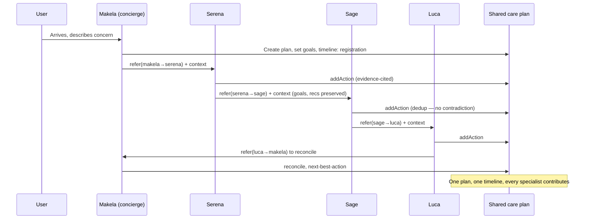
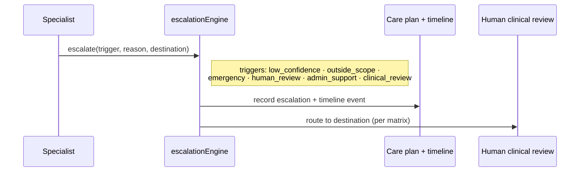

# HERNE Collaboration Layer — Referral Matrix, Shared Care Plan, Timeline & Escalation

The eight HERNE specialists operate as **one wellbeing institute**. They share one
evidence base, one care plan and one timeline, and hand work to each other with
full context so the user never starts over.

## Team awareness, shared context & natural voice (in the system prompt)

So a person experiences one coordinated team — not separate chatbots — every
specialist's runtime prompt (`services/herne/reply.ts → assembleSystemPrompt`) now
includes, from `data/herne/team.ts`:

- **ABOUT THE INSTITUTE** (`HERNE_INSTITUTION_CONTEXT`) — the shared understanding of
  the coordinated model, services and policies (concierge-led, one shared evidence
  base, one shared care plan, general wellbeing support not diagnosis, consent
  respected). Operational facts only; nothing invented.
- **YOUR TEAM** (`teamRosterFor(slug)`) — the whole roster, marking the current
  specialist "(you)" and every colleague with *what they are the right person for*
  (derived from the client-supplied specialist domains). This lets a specialist
  introduce the right colleague **by name** when a question is outside its expertise,
  rather than answering as the wrong expert or vaguely deflecting.
- **HOW YOU COMMUNICATE** (`HERNE_COMMUNICATION_VOICE`) — speak like an experienced
  human professional on the team: conversational, empathetic, remember details, ask
  follow-ups, adapt tone; **never** self-identify as an AI/bot/assistant; hand off
  like *one colleague introducing another* (the context travels — the person never
  repeats themselves); treat the output-format sections as a natural guide, not a
  rigid script.
- **RECENT JOURNEY** — the last few timeline events (referrals, handoffs, plan
  updates) so a receiving specialist already has the context of a handoff.

These complement the structured **REFERRAL BOUNDARIES** (the specialist's own matrix
triggers) and the shared care plan, so cross-specialist awareness is both structured
(rules) and conversational (roster + voice).

## Data model

| Table | Purpose |
|---|---|
| `herne_referral_rules` | The client referral matrix (15 rules), loaded as data. |
| `herne_care_plans` | **One shared, active care plan per user** (goals, concerns, HERNE priorities, assigned specialists, wearable summary, review dates). |
| `herne_care_plan_actions` | Recommendations/actions on the plan, attributed to a contributing specialist, de-duplicated. |
| `herne_referrals` | Referral log — full preserved context per handoff (audit record). |
| `herne_timeline_events` | The user's continuous wellbeing journey. |
| `herne_escalations` | Human/clinical/admin escalations with trigger, reason, specialist, destination. |

A partial unique index enforces exactly one `active` care plan per user.

## Referral architecture

`referralEngine.refer({ userId, fromSpecialist, toSpecialist, trigger, reason, context })`:

1. **Validate** against the matrix (matches `from → to`, honouring `Any`, `Makela`
   and human-escalation catch-alls) — recorded as `matchedRule`.
2. **Get/create** the shared care plan.
3. **Preserve context** — conversation summary, objective, current recommendations,
   evidence used, wearable summary, goals, consent, urgency, reason, referring &
   receiving specialist. Nothing is lost.
4. **Update the shared plan** (assign the receiving specialist) and **timeline**.
5. The `herne_referrals` row **is** the audit record.

## Collaboration flow

Specialists never contradict each other: they read and update the **same** plan,
recommendations are de-duplicated by (specialist, title), and Makela reconciles.
The referral context carries the current recommendations forward, so the receiving
specialist builds on them rather than restarting.

## Escalation flow

On alarm wording (severe/chest pain, fainting, blood, pregnancy, medication,
kidney, etc.), the specialist reply flags human clinical review — the matrix's
`Any → Human clinical review` pathway — and the escalation is recorded with its
full context. Routine coaching stops.

## Journey timeline

Every meaningful event is timestamped and attributed: `registration`,
`assessment`, `recommendation`, `referral`, `wearable_sync`, `goal_update`,
`consultation`, `specialist_review`, `completed_action`, `future_review`. Read by
the user dashboard (`/dashboard/care-plan`).

## Guarantees & tests

- One shared care plan (partial unique index).
- No duplicate recommendations (dedup on `specialist` + `title`).
- Context preserved on every referral (asserted by the collaboration check).
- All 15 referral rules loaded; 6 human-escalation pathways classified (unit tests).
- Human escalation classifier tested against the matrix.

## Prototype limitations / awaiting client

- Contradiction detection is structural (shared plan + dedup + Makela reconciles),
  not semantic conflict analysis.
- Consent is recorded as a field; a full consent-management surface is a follow-up.
- Wearable summaries are placeholders until the wearable layer (next increment).
