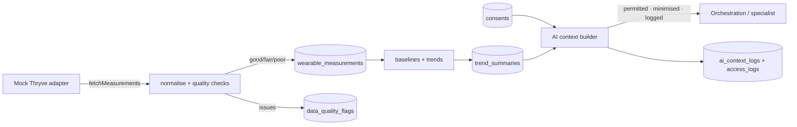
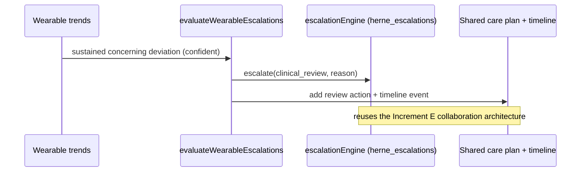

# HERNE Wearable Foundation — Thryve-Ready Architecture

One normalised wearable intelligence layer that can receive data from Thryve later
**without redesigning the platform**. Thryve is **not** connected in this increment;
a mock adapter provides deterministic fixtures.

## Data model (14 tables, all with RLS — users own their rows)

`wearable_providers` · `wearable_metric_catalog` · `user_wearable_connections` ·
`wearable_devices` · `wearable_consents` · `wearable_measurements` ·
`wearable_daily_summaries` · `wearable_trend_summaries` · `wearable_sync_jobs` ·
`wearable_sync_failures` · `wearable_data_quality_flags` · `wearable_access_logs` ·
`wearable_ai_context_logs` · `wearable_escalations`.

## Normalised measurement model

Every measurement carries: user, metric id, canonical name, value + unit, source
provider + device, observed/received timestamps, timezone, personal baseline,
deviation, data quality, confidence, **raw source reference (kept separately)**,
consent status and sensitivity. Vendor scores are never stored as universal
clinical facts; the platform exposes normalised values.

## Specialist visibility (catalogue-driven)

Access is **only** what the client catalogue permits — existence of a metric never
implies access. `canSpecialistAccessMetric` requires: catalogue permission **AND**
consent **AND** in-scope purpose **AND** acceptable data quality. Example: HRV is
Optimus + Atlas only; Luca cannot see it even with consent.

## Data flow

## AI context flow (minimised, per specialist)

The AI context builder returns **only** permitted, consented, good-quality trends —
never raw history — with limitations and a consent confirmation, and varies by
specialist. Poor-quality (low-confidence) trends are excluded. Every preparation is
logged to `wearable_access_logs` + `wearable_ai_context_logs`.

## Consent flow

Specific, versioned, timestamped, revocable, purpose-bound. Grant → connect (mock)
→ sync. Revoke → future AI context is empty. Disconnect stops future sync;
historical data follows retention status rather than silent deletion.

## Data quality

Checks: missing/invalid/future timestamp, impossible value (per-metric ranges),
duplicate, stale, unit mismatch, low confidence, outlier (z-score). Poor-quality
data is flagged and excluded from AI context.

## Baselines & trends

Personal baseline (mean), rolling recent average, deviation, direction
(up/down/stable vs 0.5σ), coverage-based confidence, missing-data notice. The
system prefers trends over isolated readings and never treats one reading as a
diagnosis.

## Care plan + escalation integration

Wearable trends can add care-plan actions (evidence of progress/adherence). A
concerning, confident trend (e.g. sustained resting-HR rise, low oxygen) routes
through the **existing** escalation engine → human clinical review, and is recorded
in `wearable_escalations`. Alerts are never diagnoses.

## Future Thryve connection

`WearableProviderAdapter` defines createConnection / revokeConnection /
refreshConnection / listProviders / fetchMeasurements / receiveWebhook /
verifyWebhook / normaliseMeasurement / retrySync / getConnectionStatus. Only the
**mock** adapter is implemented. Connecting live Thryve = implement the same
interface with real credentials + webhook verification; nothing else changes.

## Prototype limitations / awaiting client

- No live Thryve — mock adapter + deterministic fixtures; connection actions are
  labelled prototype.
- The catalogue's category, sensitivity and trend/baseline suitability are DERIVED
  defaults (flagged in `derivedFields`); the five supplied fields are authoritative.
  Additional per-metric interpretation/prohibited-claim detail is awaiting client input.
- Retention automation, deletion workflows and full admin surfaces are follow-ups.
