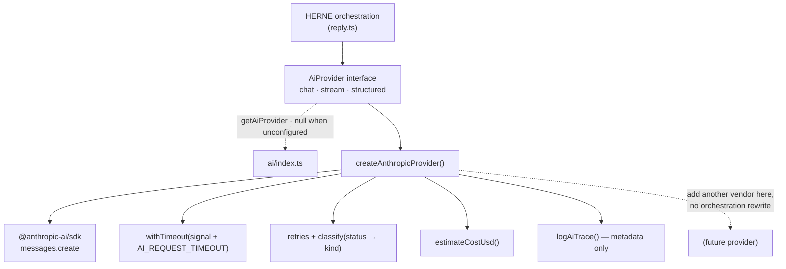
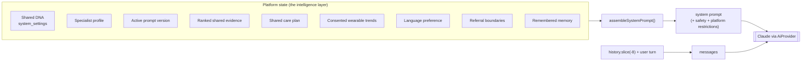
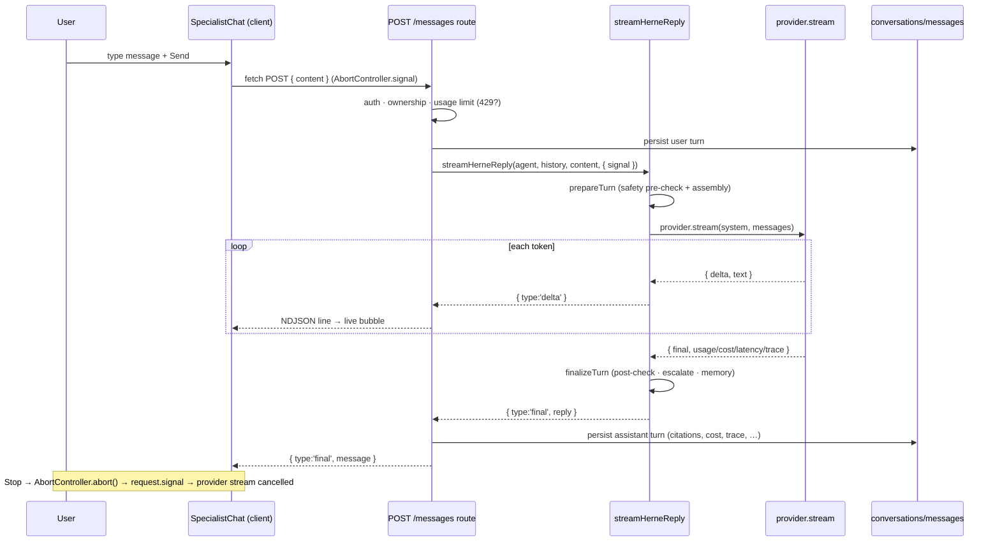
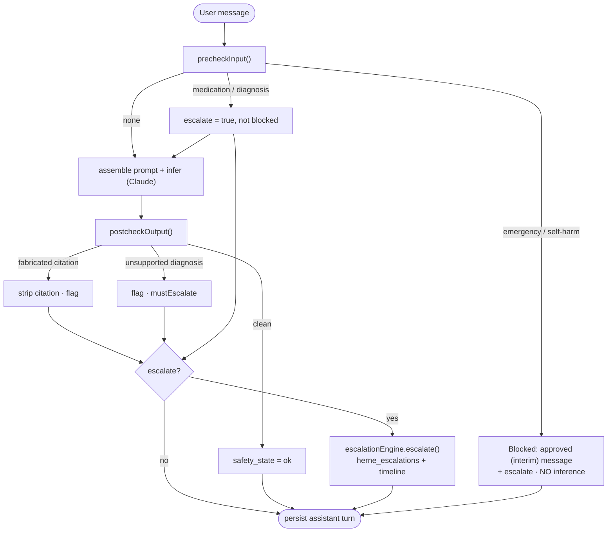

# HERNE Live Claude AI Integration — End-to-End (Increment K)

Wires the HERNE wellbeing concierge to a **real** Claude model behind a
provider-neutral interface, and closes the loop end-to-end: a signed-in person
messages a specialist, the platform assembles a grounded prompt, Claude streams a
reply token-by-token, safety runs before and after inference, and the answer is
persisted with its full metadata (citations, escalation, cost, latency, trace).

The guiding principle: **the platform is the intelligence layer; Claude is the
language / reasoning provider.** Business rules — the shared evidence base, the
specialist roles, the safety boundaries, the referral matrix, the care plan — live
in HERNE orchestration, not in one hardcoded prompt. When no provider is configured
or a call fails, callers get a typed failure and the app shows an honest "unavailable"
state; it never fabricates an answer.

## Anthropic provider architecture

Domain code depends on a **provider-neutral interface** (`src/lib/ai/provider.ts`),
never on the concrete SDK, so another provider can be added later without rewriting
HERNE orchestration.

| File | Responsibility |
|---|---|
| `src/lib/ai/provider.ts` | The interface + types. `AiProvider` exposes `chat`, `stream`, `structured`. `AiChatRequest` carries `system`, `messages`, `model`, `maxTokens`, `temperature`, an `AbortSignal`, and a coarse `op` label for traces. `AiChatResult` returns `text`, `model`, `usage`, `latencyMs`, `costUsd`, `traceId`, `stopReason`. `AiStreamChunk` is `{type:'delta'}` \| `{type:'final'}`. `AiProviderError` carries `kind`/`status`/`retryable`/`traceId`; `AiErrorKind` = `timeout \| rate_limit \| overloaded \| auth \| invalid_request \| server \| aborted \| unknown`. `AiUnavailableError` is thrown when nothing is configured. |
| `src/lib/ai/anthropic.ts` | The Anthropic implementation. Streams via `client.messages.create({ stream: true })`, applies a timeout that combines the caller's signal with `AI_REQUEST_TIMEOUT` (`withTimeout`), does provider-level retries (`maxRetries`) with backoff, `classify()` maps HTTP status → `AiErrorKind`, retries once without `temperature` when a newer model rejects it, and captures token usage, latency, estimated cost and a trace id on every call. On failure it throws `AiProviderError` — it never fabricates content. |
| `src/lib/ai/index.ts` | `getAiProvider()` returns the cached provider, or **null** when no credential is present (`isAiConfigured()`); `requireAiProvider()` throws `AiUnavailableError`. |
| `src/lib/ai/pricing.ts` | `rateForModel()` (longest-prefix match against a published-price table) + `estimateCostUsd()` from token usage. Unknown models fall back to a conservative default so cost is never silently zero. Pure + unit-testable. |
| `src/lib/ai/trace.ts` | `newTraceId()` + `logAiTrace()` — **metadata only** (model, tokens, latency, cost, status, trace id, op). It never logs the prompt, the user message, or the response text, so private/clinical content never reaches logs. |

Because orchestration only knows the interface, swapping or adding a vendor is an
`ai/` concern; `reply.ts` and every route above it are untouched.

## Environment variables

All AI configuration is read server-side in `src/lib/env.ts` (the module throws if
bundled for the browser). `validateAiEnv()` / `assertAiEnv()` return clear, aggregated
errors rather than a vague provider failure. Secrets are **never** exposed to the client.

| Variable | Default | Purpose |
|---|---|---|
| `ANTHROPIC_API_KEY` | *(empty)* | The provider credential. **Server-only.** Absent ⇒ `getAiProvider()` returns null and AI surfaces show an honest unavailable state. |
| `AI_PROVIDER` | `anthropic` | Which provider to use. Only `anthropic` is implemented; any other value is a validation error. |
| `ANTHROPIC_DEFAULT_MODEL` | `claude-sonnet-5` | Default model id. Preferred over the legacy `AI_MODEL`. |
| `AI_MODEL` | *(legacy)* | Back-compat fallback for the default model, honoured when `ANTHROPIC_DEFAULT_MODEL` is unset. |
| `AI_MAX_INPUT_TOKENS` | `14000` | Input budget guardrail for assembled prompts. |
| `AI_MAX_OUTPUT_TOKENS` | `1024` | Default `max_tokens`. `validateAiEnv()` rejects values above the safe ceiling (8192). |
| `AI_REQUEST_TIMEOUT` | `60000` | Per-call timeout. Accepts **milliseconds** (≥1000) or **seconds** (<1000, scaled up). |
| `AI_DAILY_USER_LIMIT` | `50` | Per-user daily message cap (standing usage limit). |
| `AI_MONTHLY_USER_LIMIT` | `500` | Per-user monthly message cap. |

(The former cosmetic `NEXT_PUBLIC_APP_MODE` environment-banner flag has been retired; the model-facing PLATFORM RESTRICTIONS safety block is unconditional and never depended on it.)

## Prompt-assembly flow

`src/services/herne/reply.ts` assembles the full system prompt per turn in
`assembleSystemPrompt()` (invoked from `prepareTurn()`). The blocks are composed **in
order**, each pulled from platform state rather than baked into a single string:

1. **HERNE intro** — "You are part of the HERNE wellbeing concierge — a coordinated team… ONE shared approved evidence base."
2. **Shared DNA** — admin-editable, read from `system_settings` (`key = herne_shared_dna`) via `sharedDna()`, falling back to the bundled `HERNE_SHARED_DNA`.
3. **Specialist role + consultation style** — name, title, principle, philosophy (or an explicit "do not invent one"), tone, allowed / prohibited actions, referral style, from the specialist profile.
4. **Active published prompt version** — the STARTER INSTRUCTIONS block. `src/services/herne/prompt-version.ts` `activePrompt(agentId)` prefers a `published`/`approved` `ai_prompt_versions` row, falls back to `current_version`, and the caller falls back to the bundled `profile.starterPrompt` when nothing is seeded — so live inference always has a system prompt.
5. **User objective** — what this person wants from the conversation (explicit goal, else the care-plan goals).
6. **Shared care plan** — the one plan across the team: goals, concerns, HERNE priorities, contributing specialists, existing recommendations ("do not duplicate").
7. **Shared evidence + citations** — the ranked retrieved records, each as `[RECORD-ID]` with evidence strength, text and source; instruction to answer using ONLY these and cite each used.
8. **Permitted wearable trends** — consent-gated, minimised trends only (never raw history, never a diagnosis); omitted when consent/metrics are absent.
9. **Output format** — the specialist's section structure.
10. **Language directive** — `languageDirective(pref)` (Increment I), keeping safety/citations/format intact in the target language.
11. **Referral boundaries** — the specialist's outgoing rules from the referral matrix.
12. **Safety rules** — do not diagnose, prescribe, or advise changing medication; on alarm symptoms, recommend professional assessment and stop routine coaching.
13. **PLATFORM RESTRICTIONS** — the standing safety block: general wellbeing support, not medical diagnosis or treatment; AI-generated, not reviewed by a healthcare professional; never invent data not supplied (no wearable data unless it appears above); recommend a qualified professional for anything clinical, uncertain or urgent.
14. **Remembered memory** — appended when memory is enabled and any durable facts were recalled.

The platform composes the prompt from live, admin-governed state every turn — the
business rules are HERNE's, and Claude supplies the language and reasoning.

## Streaming flow

The live turn streams end-to-end so the person sees text as it generates.

- **`streamHerneReply()`** (`reply.ts`) is an async generator. It runs `prepareTurn()`
  (safety pre-check + assembly), then iterates `provider.stream(...)`, yielding
  `{type:'delta', text}` for each chunk and finally `{type:'final', reply}` after
  `finalizeTurn()` (post-check, logging, escalation, memory). A blocked pre-check
  yields a single `final` with the approved message and no inference.
- **Route** `src/app/api/conversations/[id]/messages/route.ts` (POST, NDJSON): it
  authenticates, verifies conversation ownership, enforces the usage-limit gate (429),
  persists the user turn, streams the reply as NDJSON lines, and persists the assistant
  turn with its full metadata. `request.signal` is threaded into the generator so a
  client abort cancels the provider stream.
- **Client** `src/components/dashboard/specialist-chat.tsx`: `fetch` with an
  `AbortController`, reads the NDJSON body, appends deltas to a live bubble, renders the
  final persisted message (with citation chips + escalation notice), and offers a
  **Stop** button that aborts the fetch (keeping the partial text marked "stopped").

Non-HERNE agents have no streaming provider path: the route computes the reply and
emits it as a single delta + final.

## Retrieval flow

There is **one shared evidence base** (`herne_evidence_records`). Specialists do not
have separate knowledge bases — `retrieveForSpecialist()`
(`src/services/herne/retrieval.ts`) reads the same org-scoped records and ranks them
with the pure multi-factor scorer `scoreEvidence()` (`scoring.ts`), never semantic
similarity alone. The score combines semantic overlap, the record's per-specialist
priority, HERNE-pillar match, goal overlap, evidence quality and review status, minus
contraindication and scope-mismatch penalties. Differentiation between specialists
comes from each record's `specialist_relevance` (priority + role), and the full
`ScoreBreakdown` is retained so any selection can be explained. The top 3–6 records
(default 4) are fed into the SHARED EVIDENCE block.

## Citation flow

Citations are **record-id** tokens (e.g. `[HERNE-H-001]`) tied to the actually
retrieved evidence. The reply carries structured `citations`
(`{recordId, sourceTitle, sourceUrl}`), which are persisted as a `citations` jsonb
column on `messages` (migration 0024) and rendered as chips in the chat (linking to the
source when a URL exists). The post-check (`postcheckOutput`) strips any bracketed
record-id token the model emitted that was **not** in the retrieved set — the model can
never invent a source.

## Safety flow

`src/services/herne/safety-eval.ts` is a **pure** module wrapping every live call with
two phases:

- **`precheckInput()` — before inference.** Regex detection over the user text:
  - **emergency** / **self-harm** ⇒ `blocked: true` + `escalate: true`. Normal coaching
    stops; the person sees interim, clearly-marked *awaiting-approval* wording
    (`INTERIM_EMERGENCY_MESSAGE` / `INTERIM_SELF_HARM_MESSAGE`) and an escalation is
    written. **No inference happens.**
  - **medication-change** / **diagnosis-request** ⇒ `escalate: true` but **not blocked**:
    the turn proceeds, the boundary applies, and a clinical-review escalation is recorded.
- **`postcheckOutput()` — after inference.** Strips fabricated citations (record ids not
  in the retrieved evidence) and flags an unsupported diagnosis/treatment claim
  (`unsupported_diagnosis` ⇒ `mustEscalate`). Returns the cleaned text + machine issues.

`escalationEngine.escalate()` (`referrals.ts`) writes an `herne_escalations` row (trigger,
reason, specialist, destination, urgency) and adds a timeline event; it is best-effort so
it never blocks the user response.

## Referral & collaboration flow

From Increment E: the **15-rule referral matrix** (`herne_referral_rules`, loaded from
`data/herne/referral-matrix.json`) governs handoffs. The specialist's outgoing rules are
injected into the prompt as REFERRAL BOUNDARIES, and when a turn escalates the reply
surfaces a `referralSuggestion` (`{toRole, reason, urgency}`) rendered as a handoff notice
in chat. Human-escalation pathways (six of the fifteen) route to human clinical review.
Referrals preserve full context — summary, objective, current recommendations, evidence,
wearable summary, goals, consent — so the receiving specialist never asks the person to
start over, and every referral updates the shared care plan and journey timeline.

## Memory flow

Memory is consent-gated and defaults **on** (`user_preferences.preferences.memory_enabled`,
`src/services/memory-prefs.ts`). Before writing any durable fact, the reply path calls
`isMemoryEnabled(userId)`; when disabled, nothing new is stored. Recall pulls a bounded set
of prior facts into the WHAT YOU REMEMBER block. Persistence goes through
`memoryRepo.remember` / `listForUser` / `forget` / `forgetAll`, and the settings
`MemoryCard` lets a person view, delete, clear, or disable their memory.

## Conversation persistence

Threads and turns are real rows in `conversations` + `messages`. Migration **0024** added
the per-turn HERNE signals to `messages`: `citations`, `evidence`, `specialist`,
`language`, `escalated`, `referral`, `safety_state`, `latency_ms`, `cost_micros`,
`trace_id`, `prompt_version_id`. `conversationsRepo.insertAssistantMessage()` writes them
all (cost converted to micro-dollars). Ownership is enforced in app code via the admin
client (the streaming route rejects a conversation whose `userId` ≠ the session user).
Rename and archive (status) actions are supported; the table stays append-only for turns.

## Usage limits

`src/services/ai-usage.ts` enforces standing usage caps:

- **`checkUsageLimit(userId)`** — durable per-user daily/monthly counts from
  `ai_run_logs` (`runLogRepo.userUsage`, non-playground, by `actor_id` and time window).
  Over the cap ⇒ `allowed: false` with a clear message; the streaming route returns **429**.
- **`acquireSlot` / `releaseSlot`** — an in-process concurrency guard (max 3 concurrent
  per user) for best-effort back-pressure.

Both limits are configured via env (`AI_DAILY_USER_LIMIT`, `AI_MONTHLY_USER_LIMIT`).

## Cost tracking

Every provider call estimates USD cost from token usage (`estimateCostUsd`, list-price
table). It is recorded — never billed — as `cost_micros` (usd × 1e6) on `ai_run_logs`
(migration **0023**, which also added `model` + `trace_id` and an
`(organisation_id, actor_id, created_at)` index that supports usage counting) and as
`cost_micros` per turn on `messages` (migration 0024). Unknown models fall back to a
conservative default so cost is always recorded.

## Multilingual flow

The person's language preference (Increment I) influences the live reply through
`languageDirective(pref)`, appended to the system prompt. It preserves all safety,
citations and output format in the target language, and instructs the model to keep the
English clinical term in brackets rather than guess. Translated output is labelled
AI-generated and **not** clinically human-reviewed (English is the reference version).

## Platform restrictions

`STANDING_NOTICES` (`src/config/app.ts`) is the single source of truth for the standing
safety + status wording, consumed by the `/disclaimer` page so it can never drift; the
chat surface carries its own always-visible safety line (AI-generated, not clinically
reviewed, not for emergencies). The assembled prompt independently includes a
**PLATFORM RESTRICTIONS** block (general wellbeing support, not diagnosis/treatment;
AI-generated, not clinician-reviewed; never invent data not supplied). There is no live
Thryve connection and voice is planned.

## Migrations

| Migration | Purpose |
|---|---|
| `0019_herne_evidence.sql` | The ONE shared evidence foundation (`herne_evidence_records` with `specialist_relevance`, tsvector index) + ingestion audit. |
| `0020_herne_agent_config.sql` | `herne_config` jsonb on `ai_agents` — HERNE-specific specialist config (principle, philosophy, allowed/prohibited actions, output format, approval flags). |
| `0021_herne_collaboration.sql` | Collaboration layer: referral rules, one shared care plan per user, referrals, timeline, escalations. |
| `0022_herne_wearable.sql` | Thryve-ready (not connected) wearable layer: providers, connections, consent, measurements, summaries, AI-access logs; RLS per user. |
| `0023_ai_telemetry.sql` | Richer `ai_run_logs` telemetry — `cost_micros`, `model`, `trace_id` + the `(org, actor, created_at)` usage-counting index. |
| `0024_message_metadata.sql` | Per-turn HERNE metadata on `messages` — citations, evidence, specialist, language, escalated, referral, safety_state, latency_ms, cost_micros, trace_id, prompt_version_id. |
| `0025_care_plan_states.sql` | Care-plan action proposal state machine (proposed → user_accepted → active → completed, plus declined/superseded/requires_human_review) + race-safe dedup index. |

## Migration to the client-owned Anthropic account

The platform currently runs on a development Anthropic key. Handover requires **no code
change** — the provider reads the credential from the environment:

1. Set **`ANTHROPIC_API_KEY`** to the client's own key in the Vercel environment (and
   optionally **`ANTHROPIC_DEFAULT_MODEL`** to their preferred model).
2. **Rotate / revoke** the current development key once the client key is live.
3. Optionally raise **`AI_DAILY_USER_LIMIT`** / **`AI_MONTHLY_USER_LIMIT`** for production
   volumes.

Because everything is read through `env` and the provider abstraction, no orchestration or
UI change is needed to point the platform at the client's own account.

## Current limitations / awaiting client

- **Emergency / crisis wording is interim** (`awaiting_client_approval`) and must be
  replaced with client-approved copy before any real clinical use.
- **Live Thryve is not connected** — no device integration syncs wearable data; the
  prompt only ever receives consented, minimised trends (none exist until an
  integration is connected), never raw history or a diagnosis.
- **Voice is planned**, not connected (no live speech-to-text / text-to-speech provider).
- **Language output is AI-generated**, not clinically human-reviewed; English is the
  reference version.
- **The AI is grounded only in the approved evidence base and the person's own
  consented platform data**, and provides general wellbeing support, not medical
  diagnosis or treatment.
